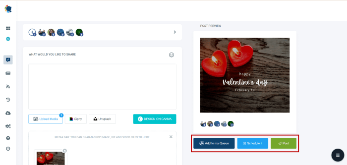
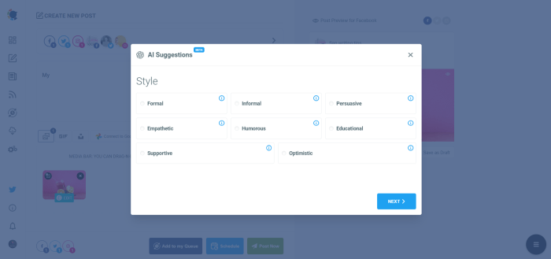
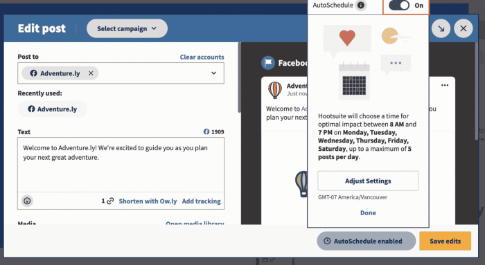

Cara auto like FB Android? Duh, nge-like postingan teman satu per satu emang bikin tangan pegel, ya? Bayangin aja, kalau punya ratusan teman, duh, ribet banget! Untungnya, ada beberapa cara praktis yang bisa dicoba, mulai dari aplikasi pihak ketiga sampai metode manual yang lebih aman.

Tapi, hati-hati, ada resiko yang perlu dipertimbangkan, lho! Simak dulu yuk, penjelasan lengkapnya sebelum kamu tergoda untuk auto like semua postingan.

Artikel ini akan membahas berbagai metode untuk otomatis menyukai postingan Facebook di Android, baik melalui aplikasi pihak ketiga maupun tanpa aplikasi. Kita akan mengulas kelebihan, kekurangan, risiko keamanan, dan implikasi etis dari setiap metode. Selain itu, akan dibahas pula alternatif untuk menunjukkan apresiasi di Facebook tanpa harus menggunakan otomatisasi, agar interaksimu di Facebook tetap bermakna dan nggak dianggap spam.

## Aplikasi Pihak Ketiga untuk Otomatis Menyukai Postingan Facebook di Android: Cara Auto Like Fb Android

Duh, kamu lagi sibuk banget sampai nggak sempat nge-like postingan temen-temen di Facebook? Atau mungkin kamu punya strategi marketing unik yang butuh auto like? Tenang, ada kok aplikasi pihak ketiga yang bisa bantu kamu. Tapi, sebelum kamu buru-buru download, baca dulu artikel ini sampai habis.

Soalnya, pakai aplikasi auto like itu ada resikonya juga, lho!

### Berbagai Aplikasi Auto Like Facebook di Google Play Store

Google Play Store nyediain berbagai aplikasi yang menawarkan fitur auto like Facebook. Tapi, jangan asal pilih ya! Pastiin kamu baca review dan cek reputasinya dulu. Banyak aplikasi yang menjanjikan segala macam fitur, tapi ujung-ujungnya malah bikin akun Facebook kamu bermasalah.

### Perbandingan Aplikasi Auto Like Facebook

Berikut ini perbandingan beberapa aplikasi auto like Facebook yang beredar di Google Play Store. Perlu diingat, data ini bisa berubah sewaktu-waktu, jadi selalu cek langsung di Google Play Store sebelum memutuskan untuk menginstal aplikasi.

| Nama Aplikasi | Fitur Utama | Rating Pengguna (Contoh) | Gratis/Berbayar |
| --- | --- | --- | --- |
| Auto Liker Pro (Contoh) | Auto like postingan, komentar, dan halaman. (Fitur mungkin berbeda di aplikasi lain) | 3.8 bintang | Berbayar (dengan fitur gratis terbatas) |
| Like Booster (Contoh) | Menambah like postingan, mengikuti akun tertentu. (Fitur mungkin berbeda di aplikasi lain) | 4.2 bintang | Berbayar |
| Auto Like Master (Contoh) | Auto like postingan, jadwalkan postingan. (Fitur mungkin berbeda di aplikasi lain) | 3.5 bintang | Gratis (dengan iklan) |
| Smart Like (Contoh) | Auto like postingan teman, analisis postingan. (Fitur mungkin berbeda di aplikasi lain) | 4.0 bintang | Gratis (dengan pembelian dalam aplikasi) |

\-Rating pengguna dan fitur aplikasi merupakan contoh dan dapat berbeda di setiap aplikasi dan waktu. Selalu periksa informasi terbaru di Google Play Store.

### Potensi Risiko Keamanan dan Privasi

Nah, ini dia yang penting banget. Menggunakan aplikasi pihak ketiga untuk auto like Facebook beresiko banget terhadap keamanan dan privasi akun kamu. Aplikasi-aplikasi ini bisa saja meminta akses ke data pribadi kamu yang lebih luas daripada yang dibutuhkan untuk fitur auto like-nya.

Bayangkan kalau data pribadimu disalahgunakan? Bisa-bisa akun Facebook kamu dibajak atau data pribadimu bocor!

### Cara Memilih Aplikasi yang Aman dan Terpercaya, Cara auto like fb android

Sebelum menginstal aplikasi auto like, perhatikan hal-hal berikut:

- Cek rating dan review pengguna di Google Play Store. Perhatikan komentar negatif dan tanggapan pengembang.

- Periksa izin akses yang diminta aplikasi. Jangan izinkan akses yang tidak relevan dengan fitur auto like.

- Pilih aplikasi yang dikembangkan oleh pengembang yang terpercaya dan memiliki reputasi baik.

- Baca kebijakan privasi aplikasi dengan teliti.

### Menghapus atau Menonaktifkan Akses Aplikasi Pihak Ketiga ke Akun Facebook

Kalau kamu sudah nggak mau lagi pakai aplikasi auto like, segera hapus aksesnya dari akun Facebook kamu. Caranya:

1. Buka aplikasi Facebook di Android.

3. Tap menu tiga garis horizontal (biasanya di pojok kanan atas).

5. Pilih "Setelan & Privasi," lalu pilih "Setelan".

7. Cari dan pilih "Aplikasi dan situs web".

9. Cari aplikasi auto like yang ingin kamu hapus aksesnya.

11. Tap aplikasi tersebut dan pilih "Hapus".

Ingat, keamanan akun Facebook kamu adalah tanggung jawabmu sendiri. Berhati-hatilah dalam memilih dan menggunakan aplikasi pihak ketiga!

## Metode Otomatis Menyukai Postingan Facebook Tanpa Aplikasi Pihak Ketiga



Nah, kamu lagi kepengen banget auto like postingan Facebook tanpa aplikasi tambahan? Kelihatannya praktis banget, ya? Tapi, sebelum kamu melompat ke kesimpulan, kita perlu ngobrolin dulu kemungkinan, risiko, dan cara-cara amannya. Soalnya, Facebook punya aturan main sendiri, dan melanggarnya bisa berakibat fatal buat akun kamu.

Secara teknis, otomatisasi like di Facebook tanpa aplikasi pihak ketiga sebenarnya mungkin dilakukan. Tapi, metode ini biasanya melibatkan penggunaan script atau tools yang cukup rumit dan membutuhkan pengetahuan pemrograman. Lebih jauh lagi, risikonya cukup besar, dan perlu dipertimbangkan dengan matang.

Jangan sampai niat auto like malah bikin akun kamu kena banned!

### Keterbatasan dan Potensi Risiko Metode Otomatis

Metode ini punya keterbatasan yang cukup signifikan. Pertama, kemungkinan besar akan membutuhkan akses ke akun Facebook kamu, yang artinya kamu harus berhati-hati memilih script atau tools yang digunakan. Kedua, kecepatannya biasanya terbatas, dan tidak secepat aplikasi pihak ketiga.

Ketiga, dan yang paling penting, risiko terkena banned dari Facebook sangat tinggi. Facebook punya sistem deteksi yang canggih untuk mendeteksi aktivitas mencurigakan, dan auto like termasuk salah satunya. Akun kamu bisa diblokir sementara, bahkan permanen!

Bayangkan, kamu udah susah payah membangun koneksi dan followers di Facebook, tiba-tiba hilang gara-gara auto like. Nggak worth it, kan?

### Contoh Kode Skrip (Ilustrasi)

Sebagai gambaran umum saja, otomatisasi ini biasanya melibatkan penggunaan bahasa pemrograman seperti Python dan library yang berinteraksi dengan API Facebook (yang saat ini sangat terbatas dan sulit diakses). Namun, kami sangat tidak menyarankan untuk mencoba metode ini tanpa pengetahuan pemrograman yang memadai.

Kode di bawah ini hanyalah ilustrasi sederhana dan TIDAK berfungsi secara langsung:

` ``` # Ini hanyalah contoh ilustrasi, dan TIDAK akan berfungsi. # Penggunaan kode ini berisiko dan tidak direkomendasikan.  # ... (kode Python yang kompleks untuk berinteraksi dengan API Facebook, yang saat ini sangat terbatas dan sulit diakses) ...  ``` `

Ingat, contoh kode di atas hanya ilustrasi. Membuat script yang benar-benar berfungsi membutuhkan keahlian pemrograman yang mumpuni dan pemahaman mendalam tentang API Facebook, yang saat ini sangat terbatas dan sulit diakses. Jangan coba-coba bereksperimen tanpa pengetahuan yang cukup!

### Pelanggaran Kebijakan Facebook dan Konsekuensinya

Facebook memiliki kebijakan yang sangat ketat tentang otomatisasi aktivitas pengguna. Menggunakan script atau tools untuk auto like dianggap sebagai pelanggaran kebijakan dan dapat mengakibatkan sanksi, mulai dari pembatasan fitur hingga pemblokiran akun secara permanen. Bayangkan, semua usaha kamu membangun akun Facebook bisa hilang seketika!

### Langkah-Langkah Menghindari Pemblokiran Akun

- Jangan gunakan aplikasi atau script pihak ketiga yang menjanjikan auto like.

- Berinteraksi dengan Facebook secara alami. Sukai postingan yang benar-benar kamu sukai.

- Jangan melakukan aktivitas yang mencurigakan, seperti menyukai postingan dalam jumlah yang sangat banyak dalam waktu singkat.

- Selalu patuhi kebijakan dan pedoman komunitas Facebook.

- Jika kamu ingin meningkatkan interaksi di Facebook, fokuslah pada pembuatan konten yang berkualitas dan berinteraksi dengan pengguna lain secara organik.

## Pertimbangan Etika dan Praktik Terbaik dalam Otomatisasi Suka di Facebook

Duh, zaman sekarang gampang banget ya cari aplikasi auto like Facebook. Tapi, sebelum kamu tergoda instal aplikasi-aplikasi ajaib itu, mikir dulu deh dampaknya. Bukan cuma soal akun kamu aman atau enggak, tapi juga etika dan pengalaman pengguna lain.

Soalnya, auto like ini punya sisi gelap yang perlu kamu pertimbangkan.

### Implikasi Etika Penggunaan Alat Otomatis untuk Menyukai Postingan Facebook

Bayangin deh, ribuan like tiba-tiba membanjiri postingan kamu. Kelihatannya sih keren, tapi apakah like itu genuine? Apakah orang-orang itu benar-benar tertarik dengan kontenmu, atau cuma bot yang diprogram untuk menekan tombol "Suka"? Nah, di sinilah letak dilema etika.

Like palsu bisa menyesatkan, membuat angka engagement terlihat lebih tinggi dari kenyataannya. Ini nggak cuma nggak jujur, tapi juga bisa merugikan orang lain yang kontennya memang berkualitas tapi nggak kebanjiran like palsu.

### Praktik Terbaik untuk Menghindari Penyalahgunaan Fitur Otomatis

Kalau kamu tetep pengen pakai fitur auto like, ada beberapa hal yang perlu diperhatikan. Jangan sampai kebablasan dan malah bikin akun kamu kena banned atau merugikan orang lain.

- Gunakan fitur auto like dengan bijak dan bertanggung jawab. Jangan berlebihan.

- Pilih aplikasi atau tools yang terpercaya dan terbebas dari malware.

- Pantau aktivitas auto like secara berkala dan hentikan jika terlihat mencurigakan.

- Jangan gunakan auto like untuk postingan yang bersifat sensitif atau kontroversial.

- Prioritaskan interaksi organik dan berkualitas daripada jumlah like yang banyak tapi palsu.

### Dampak Negatif Penggunaan Fitur Otomatis terhadap Pengalaman Pengguna Lain

Bayangkan skenario ini: sebuah grup Facebook ramai dengan postingan berisi informasi penting. Tiba-tiba, semua postingan dibanjiri like dari akun-akun mencurigakan. Ini bikin postingan yang benar-benar butuh perhatian malah tenggelam. Pengguna lain jadi kesulitan menemukan informasi penting karena dipenuhi like palsu.

Alhasil, pengalaman berselancar di Facebook jadi kurang nyaman.

### Panduan Penggunaan Fitur "Suka" di Facebook secara Bertanggung Jawab dan Etis

Intinya, gunakan fitur "Suka" secara alami dan otentik. Berikan like hanya pada postingan yang benar-benar kamu sukai dan kamu anggap bermanfaat. Jangan sampai kamu jadi bagian dari masalah yang kamu coba hindari. Berinteraksilah dengan konten secara organik.

Komentarlah, bagikan postingan jika kamu merasa perlu. Jadilah bagian dari komunitas Facebook yang sehat dan bermartabat.

### Contoh Ilustrasi Penggunaan Fitur Suka yang Berlebihan sebagai Spam

Misalnya, sebuah akun tiba-tiba memberikan like pada semua postingan di grup tertentu dalam waktu singkat. Ini bisa diartikan sebagai spam dan mengganggu pengguna lain. Akun tersebut mungkin menggunakan aplikasi auto like dan menyebabkan aktivitas mencurigakan. Bayangkan kalau semua akun melakukan hal serupa, Facebook akan dipenuhi like palsu dan kehilangan esensinya sebagai platform untuk berinteraksi secara autentik.

## Alternatif untuk Menunjukkan Apresiasi di Facebook Tanpa Otomatisasi



Duh, ngaku aja deh, siapa sih yang nggak seneng kalau postingan Facebook-nya dibanjiri likes? Rasanya kayak dapet suntikan semangat, gitu. Tapi, auto like? Hmm, agak gimana gitu ya. Selain beresiko akun kena banned, rasanya kurang personal juga.

Lebih bermakna nggak sih kalau apresiasi yang kita terima itu genuine? Makanya, yuk kita eksplor cara lain untuk menunjukkan apresiasi di Facebook tanpa perlu aplikasi auto like yang bikin ribet.

Menunjukkan apresiasi secara manual, selain lebih aman, juga bisa bikin koneksimu di Facebook jadi lebih bermakna. Bayangkan, kalau kamu cuma dapat likes otomatis, rasanya hambar banget kan? Tapi kalau ada komentar yang insightful dan personal, wah, beda banget rasanya! Lebih terasa bahwa orang lain benar-benar menghargai postinganmu.

### Keuntungan Berinteraksi Secara Manual di Facebook

Interaksi manual punya segudang keuntungan yang nggak bakal kamu dapetin dari auto like. Ini bukan cuma soal jumlah likes, tapi juga soal kualitas koneksi dan engagement yang terbangun.

- **Koneksi yang Lebih Kuat:**Komentar dan reaksi yang tulus membangun hubungan yang lebih autentik dengan teman dan komunitas online.

- **Meningkatkan Engagement:**Interaksi yang bermakna mendorong percakapan dan membuat postinganmu lebih hidup.

- **Membangun Reputasi Positif:**Menunjukkan bahwa kamu menghargai orang lain secara genuine akan meningkatkan citra positifmu di Facebook.

- **Aman dari Risiko Akun Dibanned:**Facebook sangat sensitif terhadap aktivitas yang mencurigakan, termasuk penggunaan auto like. Interaksi manual jauh lebih aman.

### Langkah Meningkatkan Interaksi yang Lebih Bermakna

Nggak perlu ribet kok, meningkatkan interaksi di Facebook secara manual gampang banget. Yang penting, tunjukkan ketulusan dan keaslianmu.

1. **Baca postingan dengan seksama:**Pahami isi postingan sebelum memberikan reaksi atau komentar.

3. **Berikan reaksi yang relevan:**Jangan asal klik like, pilih reaksi yang sesuai dengan isi postingan.

5. **Tulis komentar yang bermakna:**Jangan cuma "keren!", coba tulis komentar yang lebih spesifik dan menunjukkan bahwa kamu benar-benar membaca postingan tersebut.

7. **Ajukan pertanyaan yang relevan:**Membuka percakapan dengan pertanyaan yang cerdas bisa meningkatkan engagement.

9. **Balas komentar orang lain:**Menunjukkan bahwa kamu menghargai interaksi yang terjadi di postinganmu.

### Contoh Komentar yang Informatif dan Bermanfaat

Berikut beberapa contoh komentar yang bisa kamu gunakan untuk menunjukkan apresiasi secara bermakna:

- "Foto liburanmu keren banget! Destinasinya di mana? Aku lagi cari referensi tempat liburan nih."

- "Artikel ini sangat informatif! Aku baru tahu tentang hal ini. Terima kasih sudah berbagi."

- "Ide bisnisnya inovatif! Aku tertarik dengan poin tentang ... Semoga sukses ya!"

> “Authenticity is the new luxury. People crave genuine connection and interaction, not automated responses.”

## Kesimpulan



Jadi, mau pakai aplikasi pihak ketiga atau nggak, penting banget untuk mempertimbangkan risiko dan implikasi etisnya. Otomatisasi menyukai postingan Facebook memang praktis, tapi interaksi yang autentik dan bermakna jauh lebih berharga. Cobalah untuk lebih selektif dalam memberikan like, dan jangan lupa untuk berinteraksi dengan teman-temanmu melalui komentar atau pesan langsung.

Supaya feeds Facebookmu tetap asyik dan hubungan pertemananmu tetap terjaga!

## Informasi Penting & FAQ

**Apakah auto like Facebook melanggar aturan Facebook?**

Ya, penggunaan aplikasi atau metode yang melanggar kebijakan Facebook dapat mengakibatkan pemblokiran akun.

**Bagaimana cara mengetahui aplikasi auto like yang aman?**

Periksa rating dan ulasan pengguna, pastikan aplikasi tersebut memiliki kebijakan privasi yang jelas, dan hindari aplikasi yang meminta akses berlebihan.

**Apakah ada risiko keamanan jika menggunakan aplikasi auto like?**

Ya, ada risiko malware dan pencurian data pribadi jika menggunakan aplikasi yang tidak terpercaya.

**Bagaimana cara menghapus akses aplikasi pihak ketiga ke akun Facebook?**

Buka pengaturan Facebook, pilih Aplikasi dan Situs Web, lalu hapus akses aplikasi yang tidak diinginkan.
