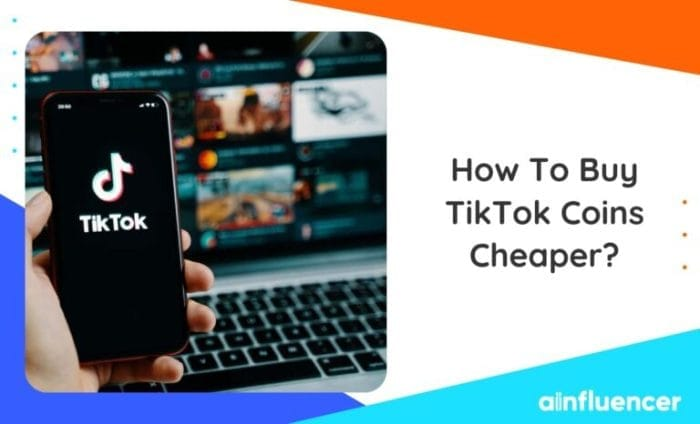

**Cara beli koin tiktok murah** - Ngaku deh, siapa sih yang nggak kepengen punya banyak koin TikTok? Biar bisa ngasih hadiah ke idola, ikutan live, dan nyalain efek kece di video. Tapi, ngeluarin duit banyak buat beli koin? Hmm, mending cari cara yang lebih hemat dong! Tenang, ada kok trik jitu beli koin TikTok murah tanpa nguras dompet.

Simak aja panduan lengkapnya di sini!

Artikel ini bakal ngebahas semua hal yang perlu kamu ketahui tentang cara beli koin TikTok murah, mulai dari platform penjualan, tips hemat, sampai kegunaan koin TikTok. Dijamin, kamu bakal jadi ahli beli koin TikTok dalam waktu singkat!

## Cara Membeli Koin TikTok

Siapa sih yang nggak pengen jadi TikTokers hits? Selain konten yang menarik, kamu juga butuh koin TikTok untuk memberikan hadiah kepada kreator favoritmu. Koin TikTok bisa kamu dapatkan dengan melakukan pembelian melalui aplikasi atau website. Penasaran gimana caranya? Yuk, simak penjelasan lengkapnya di bawah ini!

### Membeli Koin TikTok Melalui Aplikasi, Cara beli koin tiktok murah

Cara membeli koin TikTok melalui aplikasi sangat mudah, lho. Ikuti langkah-langkah berikut:

1. Buka aplikasi TikTok dan masuk ke akunmu.

3. Tap ikon profil di bagian kanan bawah layar.

5. Pilih menu "Saldo" atau "Koin".

7. Pilih jumlah koin yang ingin kamu beli.

9. Pilih metode pembayaran yang kamu inginkan.

11. Konfirmasi pembelian dan selesai!

### Membeli Koin TikTok Melalui Website

Jika kamu lebih nyaman membeli koin TikTok melalui website, kamu bisa mengikuti langkah-langkah berikut:

1. Buka situs web TikTok dan masuk ke akunmu.

3. Klik menu "Saldo" atau "Koin".

5. Pilih jumlah koin yang ingin kamu beli.

7. Pilih metode pembayaran yang kamu inginkan.

9. Konfirmasi pembelian dan selesai!

### Metode Pembayaran untuk Membeli Koin TikTok

TikTok menyediakan berbagai metode pembayaran untuk memudahkan kamu membeli koin, antara lain:

- Kartu kredit/debit

- Dompet digital (GoPay, OVO, Dana, ShopeePay)

- Transfer bank

### Nominal Koin TikTok dan Harga

Berikut tabel yang menunjukkan nominal koin TikTok dan harga yang setara dalam mata uang lokal (contoh):

| Nominal Koin | Harga (IDR) |
| --- | --- |
| 100 Koin | Rp 10.000 |
| 500 Koin | Rp 50.000 |
| 1.000 Koin | Rp 100.000 |
| 5.000 Koin | Rp 500.000 |
| 10.000 Koin | Rp 1.000.000 |

## Platform Penjualan Koin TikTok Murah

Ngaku aja, siapa sih yang gak pengen punya banyak koin TikTok? Koin TikTok ini bisa kamu gunakan untuk berbagai keperluan, mulai dari nge-gift ke idola kamu, beli efek-efek keren di live, hingga mengaktifkan fitur-fitur eksklusif di TikTok. Tapi, beli koin TikTok langsung di aplikasi TikTok, harganya bisa bikin dompet kamu menjerit.

Bingung mau beli koin TikTok murah? Tenang, ada banyak cara! Kamu bisa coba manfaatkan fitur TikTok yang memungkinkan kamu untuk mendapatkan uang dengan menonton video, lho. Kamu bisa coba cari tahu caranya [di sini](https://ajiekusumadhany.com/cara-mendapatkan-uang-dari-tiktok-dengan-menonton-video/). Nah, uang yang kamu dapatkan bisa kamu gunakan untuk membeli koin TikTok dan mendukung konten kreator favoritmu.

Sambil nonton video seru, kamu bisa sekalian nabung buat beli koin TikTok, kan?

Tenang, ada beberapa platform online yang menjual koin TikTok dengan harga lebih murah! Kamu bisa dapetin koin TikTok dengan harga miring, tapi tetap aman dan terpercaya. Penasaran?

### Platform Penjualan Koin TikTok Murah

Platform penjualan koin TikTok murah biasanya menawarkan harga yang lebih rendah daripada di aplikasi TikTok. Hal ini dikarenakan mereka mendapatkan koin TikTok dengan cara bulk dan menjualnya kembali dengan harga yang lebih kompetitif. Beberapa platform ini bahkan menawarkan bonus tambahan seperti cashback atau diskon untuk pembelian tertentu.

Tapi, perlu diingat, ada beberapa hal yang perlu kamu perhatikan sebelum membeli koin TikTok di platform online.

### Keuntungan dan Kekurangan Membeli Koin TikTok di Platform Online

- **Keuntungan**

- Harga lebih murah dibandingkan dengan di aplikasi TikTok.

- Tersedia berbagai metode pembayaran yang mudah dan aman.

- Ada bonus tambahan seperti cashback atau diskon.

- Proses pembelian yang cepat dan mudah.

- **Kekurangan**

- Risiko penipuan, pastikan kamu memilih platform yang terpercaya.

- Terkadang proses verifikasi akun dan pembelian bisa lebih lama.

- Beberapa platform mungkin memiliki batas minimal pembelian.

### Perbandingan Harga Koin TikTok di Berbagai Platform

| Platform | Harga 10.000 Koin | Bonus | Metode Pembayaran |
| --- | --- | --- | --- |
| Tokopedia | Rp 100.000 | Cashback 5% | Transfer bank, GoPay, OVO, ShopeePay |
| Bukalapak | Rp 95.000 | Diskon 10% untuk pembelian pertama | Transfer bank, Dana, OVO, ShopeePay |
| Shopee | Rp 98.000 | Voucher diskon | ShopeePay, transfer bank |

Perlu diingat, harga koin TikTok di platform online bisa berubah sewaktu-waktu. Pastikan kamu selalu mengecek harga terbaru sebelum membeli.

### Cara Membeli Koin TikTok di Platform Online

Proses pembelian koin TikTok di platform online umumnya mudah dan cepat. Berikut langkah-langkahnya:

1. Pilih platform online yang terpercaya dan menawarkan harga yang kompetitif.

3. Buat akun di platform tersebut jika belum memiliki akun.

5. Cari produk "koin TikTok" di platform tersebut.

7. Pilih nominal koin TikTok yang ingin kamu beli.

9. Masukkan informasi akun TikTok kamu, biasanya berupa ID TikTok atau username.

11. Pilih metode pembayaran yang kamu inginkan.

13. Konfirmasi pembelian dan selesaikan pembayaran.

15. Koin TikTok akan otomatis masuk ke akun TikTok kamu dalam waktu beberapa menit hingga beberapa jam.

Sebelum membeli, pastikan kamu membaca dengan teliti syarat dan ketentuan platform tersebut. Pastikan juga platform tersebut memiliki sistem keamanan yang terjamin untuk melindungi data pribadi kamu.

Bingung mau beli koin TikTok murah? Tenang, banyak platform yang jual koin dengan harga bersahabat. Tapi, gimana kalau akun TikTok kamu tiba-tiba hilang? Jangan panik! Kamu bisa coba cara mengembalikan akun TikTok yang hilang [di sini](https://ajiekusumadhany.com/cara-mengembalikan-akun-tiktok-yang-hilang/). Setelah akun kamu kembali, langsung deh beli koin TikTok untuk mendukung konten favoritmu.

## Tips Membeli Koin TikTok Murah

Siapa sih yang nggak mau beli koin TikTok murah? Apalagi buat kamu yang suka nge-gift, nge-boost video, atau mau dapetin fitur keren di TikTok. Nah, buat kamu yang lagi cari cara beli koin TikTok dengan harga lebih miring, simak tips dan triknya berikut ini, ya!

### Manfaatkan Promo dan Diskon

TikTok sering banget ngeluarin promo dan diskon buat pembelian koin, lho. Ini bisa jadi kesempatan emas buat kamu yang mau beli koin dengan harga lebih murah. Biasanya, promo ini diumumkan di akun resmi TikTok atau di platform penjualan koin TikTok.

- Pantau akun resmi TikTok, baik di aplikasi maupun media sosial lainnya, untuk informasi terbaru tentang promo dan diskon. Biasanya, mereka akan ngasih tahu kapan promo berlaku dan apa aja keuntungan yang bisa kamu dapetin.

- Cek platform penjualan koin TikTok, seperti Google Play Store atau App Store, untuk informasi promo dan diskon. Biasanya, mereka juga akan ngasih tahu kamu promo dan diskon yang lagi berlaku di platform mereka.

### Cari Voucher dan Kode Promo

Selain promo dan diskon, kamu juga bisa dapetin koin TikTok murah dengan memanfaatkan voucher dan kode promo. Biasanya, voucher dan kode promo ini bisa kamu dapetin dari:

- **Akun resmi TikTok**: Akun resmi TikTok sering banget bagi-bagi voucher dan kode promo buat para penggunanya. Kamu bisa follow akun resmi TikTok di media sosial atau pantau postingan mereka di aplikasi TikTok.

- **Platform penjualan koin TikTok**: Platform penjualan koin TikTok juga sering ngeluarin voucher dan kode promo buat para penggunanya. Kamu bisa cek di aplikasi Google Play Store atau App Store atau website mereka untuk informasi terbaru tentang voucher dan kode promo.

- **Influencer dan content creator**: Beberapa influencer dan content creator TikTok juga sering bagi-bagi voucher dan kode promo buat para pengikutnya. Kamu bisa follow mereka di TikTok atau di media sosial lainnya untuk informasi terbaru tentang voucher dan kode promo.

### Manfaatkan Program Referral

Program referral TikTok bisa jadi cara yang efektif buat dapetin koin TikTok murah. Dengan program referral, kamu bisa ngundang teman kamu buat bergabung di TikTok dan dapetin koin gratis. Caranya gampang banget, nih:

- **Bagikan kode referral kamu**: Kode referral kamu bisa kamu temukan di pengaturan akun TikTok kamu. Bagikan kode referral kamu ke teman-teman kamu melalui pesan, media sosial, atau email.

- **Dapatkan koin gratis**: Setiap teman kamu yang berhasil mendaftar TikTok menggunakan kode referral kamu, kamu akan dapetin koin gratis. Jumlah koin yang kamu dapetin bisa beda-beda, tergantung program referral yang berlaku.

## Kegunaan Koin TikTok

Siapa sih yang gak kenal TikTok? Aplikasi berbagi video pendek ini udah jadi bagian dari kehidupan sehari-hari banyak orang. Selain buat nge-scroll video lucu dan menghibur, TikTok juga punya fitur menarik yang bisa kamu gunakan buat mendukung kreator favoritmu, yaitu koin TikTok.

Nah, koin TikTok ini bisa kamu beli dengan berbagai metode pembayaran dan punya banyak kegunaan di dalam aplikasi. Penasaran apa aja kegunaan koin TikTok? Yuk, simak penjelasan lengkapnya di bawah ini!

### Mendukung Konten Kreator

Salah satu kegunaan utama koin TikTok adalah untuk mendukung konten kreator yang kamu suka. Koin TikTok bisa kamu gunakan untuk memberikan hadiah virtual berupa "gift" kepada kreator. Setiap gift memiliki nilai koin yang berbeda-beda, dan makin mahal gift-nya, makin besar rasa apresiasimu terhadap konten kreator tersebut.

Mau beli koin TikTok murah? Tenang, banyak cara! Tapi sebelum itu, pernah dengar cara ambil uang di kalkulator TikTok? [Cara mengambil uang di kalkulator TikTok](https://ajiekusumadhany.com/cara-mengambil-uang-di-kalkulator-tiktok/) ini ternyata banyak dicari orang, lho! Tapi, kalau kamu mau beli koin TikTok murah, kamu bisa cari di platform jual beli online atau cek promo yang ada di aplikasi TikTok sendiri.

Biar makin hemat, manfaatkan voucher atau cashback yang ditawarkan, ya!

- Gift virtual ini akan ditampilkan di live streaming kreator, sehingga bisa dilihat oleh semua penonton. Ini jadi bukti nyata bahwa kamu nge-support konten kreator tersebut.

- Kreator bisa menukarkan gift virtual yang mereka terima dengan uang tunai. Semakin banyak gift yang mereka dapatkan, semakin besar penghasilan mereka dari TikTok.

### Membeli Hadiah Virtual

Selain untuk mendukung kreator, koin TikTok juga bisa kamu gunakan untuk membeli hadiah virtual yang bisa kamu kirim ke teman atau orang yang kamu kenal di TikTok. Hadiah virtual ini bisa berupa stiker, animasi, atau efek visual yang bisa kamu gunakan untuk mempercantik video kamu.

- Beberapa hadiah virtual bahkan bisa dipersonalisasi dengan menambahkan pesan atau ucapan khusus.

- Kamu bisa menggunakan hadiah virtual untuk menunjukkan rasa sayang, apresiasi, atau sekedar buat seru-seruan.

### Membuat Live Streaming Lebih Menarik

Koin TikTok juga bisa kamu gunakan untuk membeli efek visual dan fitur menarik lainnya yang bisa kamu gunakan di live streaming. Fitur ini bisa membuat live streaming kamu lebih interaktif dan menarik bagi penonton.

- Kamu bisa menggunakan efek visual untuk menambahkan suasana baru dan menghibur di live streaming.

- Beberapa fitur live streaming juga bisa kamu gunakan untuk berinteraksi dengan penonton, misalnya dengan memberikan hadiah kepada penonton yang aktif.

> "Gue suka banget beli koin TikTok buat ngasih gift ke kreator yang gue suka. Selain bisa nunjukin rasa support, gue juga seneng bisa ngeliat mereka seneng dapet gift dari gue."
> 
> > \[Nama Pengguna TikTok\]

## Pertimbangan Sebelum Membeli Koin TikTok

Membeli koin TikTok memang bisa jadi cara seru untuk mendukung konten kreator favoritmu dan meningkatkan visibilitas akunmu. Tapi, tunggu dulu! Sebelum kamu buru-buru klik tombol “beli”, ada beberapa hal penting yang perlu kamu pertimbangkan. Pilih platform yang tepat, waspadai potensi penipuan, dan kenali risikonya.

Ingat, keamanan dan kepuasanmu adalah prioritas utama!

### Memilih Platform Penjualan Koin TikTok yang Terpercaya

Jangan asal pilih platform untuk membeli koin TikTok! Pilih platform yang terpercaya dan memiliki reputasi baik. Ada banyak platform penjualan koin TikTok di luar sana, tapi nggak semua aman dan terpercaya. Kamu harus jeli memilih platform yang benar-benar aman dan terpercaya.

### Tips Menghindari Penipuan Saat Membeli Koin TikTok

Penipuan di dunia digital semakin canggih. Kamu harus pintar-pintar menghindari jebakannya, terutama saat membeli koin TikTok. Berikut beberapa tips yang bisa kamu ikuti:

- Selalu cek reputasi platform dan penjual. Baca review dari pengguna lain untuk memastikan platform dan penjual tersebut aman dan terpercaya.
- Perhatikan harga koin TikTok yang ditawarkan. Jangan tergiur dengan harga yang terlalu murah, karena bisa jadi itu adalah penipuan. Harga koin TikTok yang terlalu murah bisa jadi indikasi bahwa platform tersebut menjual koin TikTok yang tidak sah atau bahkan hasil curian.
    

- Hindari membeli koin TikTok dari sumber yang tidak jelas. Pilih platform yang resmi dan terpercaya, dan pastikan platform tersebut memiliki sistem keamanan yang baik.
- Selalu periksa detail transaksi dan pastikan kamu memahami semua ketentuan yang berlaku. Jangan asal klik tombol “beli” tanpa membaca detail transaksi dan ketentuan yang berlaku. Hal ini penting untuk menghindari penipuan dan memastikan bahwa kamu membeli koin TikTok dengan aman dan nyaman.
    

### Risiko Membeli Koin TikTok dari Sumber yang Tidak Jelas

Membeli koin TikTok dari sumber yang tidak jelas bisa berujung pada kerugian. Kamu bisa kehilangan uang, akun TikTok kamu bisa diblokir, atau bahkan data pribadi kamu bisa dicuri. Jangan sampai kamu menyesal di kemudian hari karena membeli koin TikTok dari sumber yang tidak jelas.

### Tips Keamanan dalam Membeli Koin TikTok

| No. | Tips Keamanan | Keterangan |
| --- | --- | --- |
| 1. | Pilih platform yang terpercaya | Cari platform yang memiliki reputasi baik dan sistem keamanan yang kuat. |
| 2. | Perhatikan harga koin TikTok yang ditawarkan | Hindari harga yang terlalu murah, karena bisa jadi itu adalah penipuan. |
| 3. | Baca review dari pengguna lain | Review dari pengguna lain bisa memberikan gambaran tentang platform dan penjual tersebut. |
| 4. | Selalu periksa detail transaksi | Pastikan kamu memahami semua ketentuan yang berlaku sebelum melakukan transaksi. |
| 5. | Jangan berikan data pribadi yang tidak diperlukan | Hindari memberikan data pribadi yang tidak diperlukan saat melakukan transaksi. |

<iframe style="position: absolute; top: 0; left: 0; width: 100%; height: 100%;" title="Cara Top Up Koin TikTok Murah Terbaru 2023 || Beli Koin Tiktok Pakai Dana" frameborder="0" allow="accelerometer; autoplay; clipboard-write; encrypted-media; gyroscope; picture-in-picture; web-share" allowfullscreen src="https://www.youtube.com/embed/fu0MvUUy8sY?feature=oembed"></iframe>

## Ringkasan Penutup: Cara Beli Koin Tiktok Murah

Jadi, udah nggak bingung lagi kan cara beli koin TikTok murah? Ingat, belilah koin dari platform terpercaya dan jangan tergiur harga murah yang nggak jelas. Pastikan kamu menikmati pengalaman TikTok yang lebih seru dengan koin yang kamu beli, dan jangan lupa explore berbagai fitur menarik di TikTok, ya!

## Daftar Pertanyaan Populer

**Kenapa harus beli koin TikTok?**

Koin TikTok bisa kamu gunakan untuk mendukung kreator favorit, membeli hadiah virtual, dan membuka fitur menarik di TikTok.

**Apakah ada batas minimal pembelian koin TikTok?**

Ya, biasanya ada batas minimal pembelian koin TikTok, bervariasi tergantung platform penjualnya.

**Bagaimana cara mengembalikan koin TikTok?**

Sayangnya, koin TikTok tidak bisa dikembalikan. Pastikan kamu membeli koin dengan bijak.
