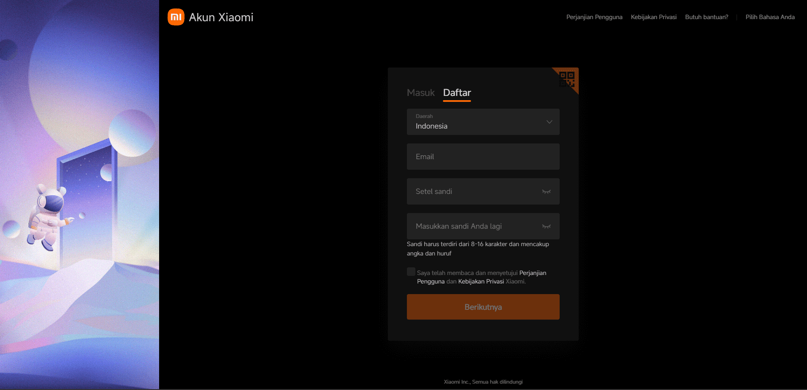
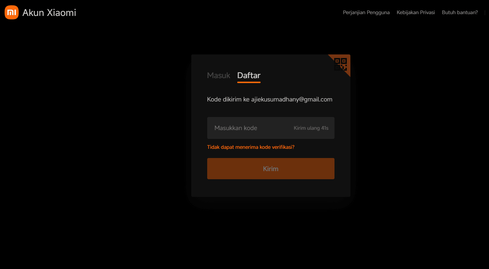
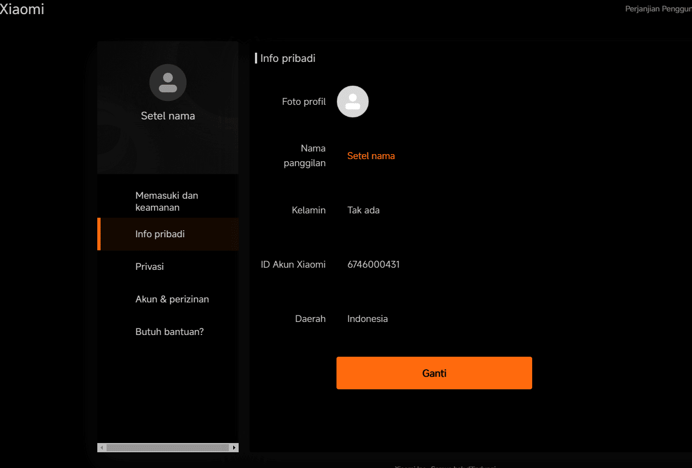

[**Cara Buat Akun Auth Xiaomi**](https://ajiekusumadhany.com/cara-buat-akun-auth-xiaomi/) | Membuat akun Auth Xiaomi merupakan langkah penting untuk mengakses berbagai layanan dan fitur yang disediakan oleh Xiaomi, seperti Mi Cloud, Mi Store, dan layanan MIUI.

Dalam artikel ini, kami akan memberikan panduan lengkap [cara membuat akun Auth Xiaomi](https://ajiekusumadhany.com/cara-buat-akun-auth-xiaomi/) dengan mudah dan cepat.

## Langkah-langkah Cara Membuat Akun Auth Xiaomi

Berikut adalah cara buat akun auth xiaomi yang dapat Anda coba:

### 1\. Kunjungi Situs Resmi Xiaomi

Langkah pertama yang perlu Anda lakukan adalah mengunjungi situs resmi Xiaomi di [account.xiaomi.com](https://account.xiaomi.com/). Pada halaman ini, Anda akan melihat opsi untuk masuk atau mendaftar akun baru. Pilih opsi "Create Account" atau "Buat Akun".

### 2\. Daftar Akun

Pilih daerah, masukkan email yang ingin Anda gunakan dan buat kata sandi (password) Anda.

### 3\. Verifikasi Akun

Setelah memasukkan informasi yang diperlukan, Anda akan diminta untuk memverifikasi akun Anda. periksa kotak masuk email Anda untuk menemukan email verifikasi dari Xiaomi, dan masukkan kode verifikasi yang ada dalam email tersebut.

### 4\. Lengkapi Informasi Profil

Setelah verifikasi berhasil, Anda akan diarahkan ke halaman profil. Lengkapi informasi yang diminta, seperti nama panggilan . Informasi ini penting untuk keamanan akun Anda dan untuk mempersonalisasi pengalaman Anda dengan layanan Xiaomi.

## Manfaat Memiliki Akun Auth Xiaomi

1. **Akses ke Mi Cloud**: Dengan akun Auth Xiaomi, Anda dapat menyimpan data seperti kontak, pesan, foto, dan catatan di Mi Cloud.
2. **Personalisasi MIUI**: Memungkinkan Anda untuk menyesuaikan perangkat Xiaomi Anda dengan berbagai tema, wallpaper, dan pengaturan lainnya.
3. **Keamanan Data**: Mengamankan perangkat Anda dengan fitur Find Device yang membantu melacak perangkat Xiaomi yang hilang.
4. **Akses ke Mi Store**: Mempermudah proses pembelian produk Xiaomi langsung dari Mi Store.

Dengan mengikuti panduan di atas, Anda dapat dengan mudah [membuat akun Auth Xiaomi](https://ajiekusumadhany.com/cara-buat-akun-auth-xiaomi/) dan menikmati berbagai layanan yang disediakan.

Semoga artikel ini bermanfaat dan membantu Anda dalam proses pembuatan akun Auth Xiaomi.

**Baca Juga**: [7 Hp Xiaomi Terbaru Review Lengkap dengan Harga](https://ajiekusumadhany.com/hp-xiaomi-terbaru-lengkap-dan-harganya/)
