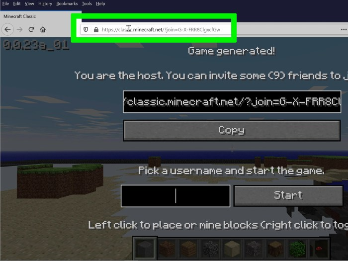
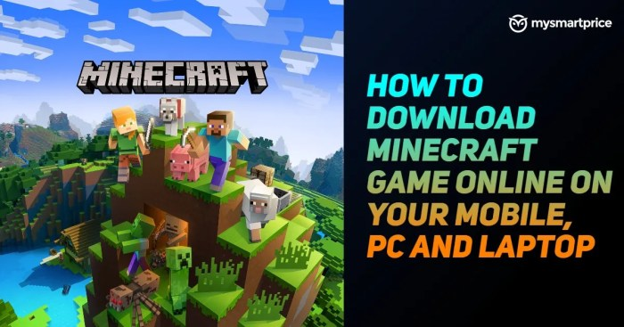

Cara download Minecraft gratis 2021? Mungkin kamu pernah kepikiran, kan? Game sandbox legendaris ini memang bikin nagih, tapi harganya? Nah, di artikel ini, kita akan bongkar berbagai metode download Minecraft gratis yang beredar di tahun 2021, mulai dari yang aman sampai yang… hmm, agak berisiko.

Kita akan bahas tuntas, mulai dari kelebihan dan kekurangan masing-masing metode, sampai risiko keamanan yang mengintai. Siap-siap menyelami dunia Minecraft tanpa harus merogoh kocek terlalu dalam (tapi ingat, ada konsekuensinya lho!)

Artikel ini akan mengulas berbagai cara download Minecraft gratis di tahun 2021, membandingkan metode-metode tersebut dari segi keamanan, kemudahan, dan risiko yang mungkin muncul. Akan dijelaskan secara detail langkah-langkah download yang paling aman, serta alternatif legal jika kamu ingin bermain Minecraft dengan tenang tanpa khawatir virus atau malware.

Selain itu, kita juga akan membahas pentingnya membeli versi resmi Minecraft dan keuntungan jangka panjangnya.

## Metode Download Minecraft Gratis (2021): Cara Download Minecraft Gratis 2021

Hayo ngaku, siapa di antara kamu yang pernah kepincut pesona Minecraft? Game sandbox yang satu ini emang bikin candu, ya. Tapi, harga lisensi resminya cukup menguras dompet, kan? Nah, tahun 2021 lalu, banyak banget metode download Minecraft gratis beredar.

Tapi, hati-hati! Jangan sampai kamu terjebak di jalan yang salah. Artikel ini akan mengupas tuntas berbagai metode tersebut, lengkap dengan kelebihan, kekurangan, dan risikonya. Siap-siap kuasai seluk-beluknya!

### Metode Download Minecraft Gratis Tahun 2021

Pada tahun 2021, beberapa metode beredar untuk mengunduh Minecraft secara gratis. Namun, perlu diingat bahwa sebagian besar metode ini memiliki risiko keamanan yang perlu dipertimbangkan. Berikut perbandingannya:

| Metode | Kelebihan | Kekurangan | Risiko Keamanan |
| --- | --- | --- | --- |
| Website pihak ketiga yang menawarkan versi modifikasi (cracked) | Gratis, akses ke fitur mungkin lebih luas (tergantung versi modifikasi) | Versi tidak terupdate, berpotensi mengandung malware, fitur online mungkin tidak berfungsi, melanggar hak cipta | Sangat tinggi. Berpotensi terinfeksi virus, malware, atau spyware. Data pribadi bisa dicuri. |
| Menggunakan versi trial/demo (jika tersedia) | Aman, legal, mencoba fitur dasar Minecraft | Fitur terbatas, durasi terbatas | Rendah. Hanya terbatas pada fitur yang disediakan dalam versi trial. |
| Mencari giveaway atau promo dari Mojang (pengembang Minecraft) | Gratis, legal, mendapatkan versi resmi | Kesempatan terbatas, harus beruntung | Rendah. Metode ini aman selama kamu mendapatkannya dari sumber resmi. |
| Menggunakan versi pendidikan (jika memenuhi syarat) | Gratis, legal, akses untuk keperluan pendidikan | Hanya untuk keperluan pendidikan, akses fitur mungkin terbatas | Rendah. Metode ini aman dan legal jika digunakan sesuai peruntukannya. |

### Langkah-Langkah Download Minecraft Melalui Versi Trial (Jika Tersedia)

Metode ini adalah yang paling aman karena berasal dari sumber resmi. Sayangnya, versi trial Minecraft jarang tersedia. Namun, jika ada, berikut langkah-langkahnya (sebagai gambaran umum, karena detailnya tergantung platform dan ketersediaan):

1. Kunjungi website resmi Minecraft.

3. Cari opsi "Trial" atau "Demo" (jika tersedia).

5. Ikuti instruksi yang diberikan untuk mengunduh dan menginstal.

7. Setelah instalasi selesai, jalankan game dan nikmati versi trialnya.

### Ilustrasi Proses Download Versi Trial

Bayangkan sebuah jendela browser menampilkan halaman website resmi Minecraft. Di halaman tersebut, terdapat tombol yang bertuliskan "Download Trial". Setelah tombol tersebut diklik, akan muncul jendela baru yang meminta konfirmasi download. Setelah konfirmasi, progress bar akan muncul, menunjukkan persentase download yang sudah terselesaikan.

Setelah download selesai, muncul jendela installer yang akan memandu proses instalasi.

### Potensi Masalah Selama Proses Download

Pada metode download dari website pihak ketiga, potensi masalah yang mungkin terjadi antara lain: download gagal karena link mati, file yang diunduh mengandung malware, proses instalasi mengalami error, dan game tidak berjalan dengan baik atau bahkan crash.

Pada metode versi trial, potensi masalahnya lebih kecil, biasanya hanya berupa error download karena koneksi internet yang bermasalah.

## Risiko dan Pertimbangan Keamanan

Nah, Sobat Hipwee, ngomongin download Minecraft gratis tahun 2021, kita nggak bisa cuma fokus ke dapetin gamenya aja. Ada sisi lain yang penting banget nih, yaitu keamanan perangkat kita. Download dari sumber nggak resmi itu kayak main judi, untung-untungan banget.

Bisa dapet Minecraft gratis, tapi bisa juga perangkatmu kena virus dan berujung masalah besar. Jadi, sebelum klik tombol download, baca dulu poin-poin penting berikut ini!

Download Minecraft dari sumber yang nggak terpercaya memang menggoda, apalagi kalau gratis. Tapi, resiko yang kamu tanggung jauh lebih besar daripada keuntungan yang didapat. Bayangkan deh, semua data pribadi dan file penting di laptop atau HP-mu bisa terancam.

Makanya, penting banget untuk memahami potensi bahaya dan cara menghindarinya.

### Potensi Malware dan Virus

Mengunduh Minecraft dari sumber tidak resmi, seperti situs web yang mencurigakan atau tautan dari forum yang nggak jelas, berpotensi besar menginfeksi perangkatmu dengan berbagai malware dan virus. Ini bukan cuma omong kosong, lho. Banyak kasus yang membuktikannya.

- **Virus:**Jenis malware paling umum. Bisa merusak sistem operasi, mencuri data, atau bahkan membuat perangkatmu nggak bisa digunakan sama sekali.

- **Trojan Horse:**Berkedok sebagai file Minecraft yang aman, padahal isinya malware yang bisa mengontrol perangkatmu dari jarak jauh.

- **Ransomware:**Jenis malware yang mengenkripsi file-file pentingmu dan meminta tebusan untuk mengembalikannya. Bayangkan deh, semua foto kenangan, tugas kuliah, atau dokumen pentingmu tiba-tiba terkunci.

- **Spyware:**Malware yang diam-diam memantau aktivitas online-mu, mencuri informasi pribadi seperti password, detail kartu kredit, dan lain-lain.

- **Adware:**Malware yang menampilkan iklan-iklan yang mengganggu dan seringkali nggak bisa dihilangkan dengan mudah.

### Langkah Pencegahan Keamanan, Cara download minecraft gratis 2021

Untungnya, ada beberapa langkah yang bisa kamu lakukan untuk meminimalisir risiko. Ini bukan jaminan 100%, tapi setidaknya bisa mengurangi kemungkinan perangkatmu terinfeksi.

1. **Pastikan sumber download terpercaya:**Hanya unduh Minecraft dari situs resmi Mojang atau platform distribusi digital yang resmi dan terpercaya, seperti Microsoft Store.

3. **Periksa reputasi situs web:**Sebelum mengunduh, periksa reputasi situs web tersebut. Cari review dan testimoni dari pengguna lain. Waspadai situs web dengan desain yang mencurigakan atau penuh iklan yang mengganggu.

5. **Gunakan antivirus dan anti-malware:**Pastikan perangkatmu terlindungi dengan software antivirus dan anti-malware yang selalu update. Software ini akan membantu mendeteksi dan memblokir malware sebelum menginfeksi sistemmu.

7. **Aktifkan fitur keamanan browser:**Pastikan browsermu memiliki fitur keamanan yang aktif, seperti blokir pop-up dan perlindungan phishing.

9. **Jangan klik tautan yang mencurigakan:**Jangan pernah mengklik tautan yang mencurigakan atau berasal dari sumber yang nggak jelas, terutama yang menjanjikan Minecraft gratis.

11. **Scan file yang diunduh:**Setelah mengunduh file installer Minecraft, scan terlebih dahulu dengan antivirus sebelum menjalankannya.

### Skenario Buruk Akibat Download Tidak Aman

Bayangkan skenario terburuknya: Kamu berhasil download Minecraft dari situs nggak jelas, ternyata isinya ransomware. Semua file pentingmu, foto-foto liburan, dokumen penting untuk kuliah atau pekerjaan, semuanya tiba-tiba terkunci. Kamu diminta membayar tebusan dalam jumlah tertentu untuk mendapatkan kembali akses ke file-file tersebut.

Dan yang lebih parah, mungkin saja tebusan sudah dibayar, tapi file-filemu tetap nggak bisa dibuka. Buang-buang uang dan waktu, kan? Belum lagi, data pribadimu mungkin sudah dicuri dan disalahgunakan.

## Alternatif Legal dan Aman

Nah, udah kepincut sama dunia balap-balapan, crafting, dan petualangan di Minecraft? Tapi jangan sampai tergoda dengan versi bajakan, ya! Meskipun gratis, resikonya gede banget. Dari virus yang bikin komputermu lemot sampai masalah hukum yang bisa bikin dompetmu nangis.

Tenang, ada kok cara aman dan legal untuk menikmati Minecraft di tahun 2021 dan seterusnya. Berikut beberapa alternatifnya.

Beli langsung dari Mojang Studios atau platform digital resmi adalah jalan terbaik. Meskipun butuh sedikit bujet, keuntungannya jauh lebih banyak daripada resiko yang kamu hindari.

### Keuntungan Membeli Minecraft Secara Resmi

> Membeli Minecraft secara resmi bukan cuma soal legalitas, gengs! Kamu dapet akses ke update terbaru, komunitas yang aman, dan pastinya tanpa resiko virus atau malware yang bikin komputermu berantakan. Plus, kamu ikut mendukung developer dan perkembangan game yang kamu cintai! Bayangkan, kamu bisa main tanpa khawatir dan selalu update dengan fitur-fitur keren terbaru. Itu investasi yang worth it banget!

### Perbandingan Versi Resmi dan Tidak Resmi

Perbedaan antara Minecraft versi resmi dan tidak resmi sangat signifikan. Bukan cuma soal legalitas, tapi juga pengalaman bermain dan fitur yang ditawarkan. Versi resmi menawarkan pengalaman bermain yang jauh lebih mulus dan terjamin.

| Fitur | Versi Resmi | Versi Tidak Resmi |
| --- | --- | --- |
| Update | Mendapatkan update terbaru secara otomatis, termasuk fitur dan perbaikan bug. | Tidak mendapatkan update, rentan terhadap bug dan eksploitasi keamanan. |
| Keamanan | Bebas dari virus dan malware. | Berisiko tinggi terinfeksi virus dan malware. |
| Multiplayer | Bisa bermain dengan pemain lain di server resmi dan aman. | Akses ke server multiplayer terbatas dan berisiko. |
| Harga | Harga bervariasi tergantung platform, namun tetap terjamin keasliannya. | Gratis, tetapi berisiko tinggi dan tidak terjamin. |
| Dukungan | Mendapatkan dukungan teknis langsung dari Mojang Studios. | Tidak ada dukungan teknis. |
| Pengalaman Bermain | Pengalaman bermain yang lancar dan stabil. | Pengalaman bermain yang tidak stabil, sering mengalami lag dan crash. |

### Keuntungan Jangka Panjang Membeli Lisensi Minecraft Resmi

Membeli lisensi Minecraft resmi memberikan keuntungan jangka panjang yang tak ternilai. Bukan hanya soal legalitas, tetapi juga investasi untuk pengalaman bermain yang lebih baik dan aman. Bayangkan, kamu bisa terus menikmati update, fitur baru, dan komunitas yang solid tanpa harus khawatir dengan risiko keamanan.

Ini ibarat investasi jangka panjang yang akan terus memberikan kepuasan dan hiburan.

- Akses ke semua update dan fitur terbaru.

- Pengalaman bermain yang lebih stabil dan aman.

- Dukungan teknis dari Mojang Studios.

- Akses ke server multiplayer resmi dan komunitas yang lebih besar.

- Mendukung developer dan perkembangan game.

## Sumber Daya dan Informasi Tambahan

Nah, setelah kamu berhasil (atau mungkin masih berjuang) mendownload Minecraft, penting banget nih buat tahu dari mana sumber yang terpercaya dan bagaimana memastikan kamu nggak salah download. Soalnya, di dunia maya yang luas ini, banyak banget jebakan batman berupa situs palsu yang menawarkan Minecraft gratis tapi ujung-ujungnya malah bikin HP atau komputermu bermasalah.

Makanya, baca poin-poin penting berikut ini biar kamu nggak jadi korban!

Berikut ini beberapa hal penting yang perlu kamu perhatikan agar terhindar dari situs-situs curang dan memastikan kamu mendapatkan Minecraft yang asli.

### Situs Web Resmi dan Terpercaya

Sebelum kamu mulai berpetualang di dunia Minecraft, pastikan kamu tahu di mana tempat yang tepat untuk mengunduh game ini. Jangan sampai keliru, ya! Mengunduh dari sumber yang tidak resmi berisiko tinggi terkena malware atau virus yang bisa merusak perangkatmu.

Berikut beberapa sumber resmi yang bisa kamu andalkan:

- Situs web resmi Mojang Studios: Situs ini adalah sumber utama dan paling terpercaya untuk mengunduh Minecraft. Biasanya, situs ini memiliki desain yang bersih, profesional, dan informasi yang jelas tentang cara mengunduh dan menginstal game.

- Microsoft Store: Sebagai pemilik Minecraft saat ini, Microsoft juga menyediakan Minecraft di platform Microsoft Store. Ini juga merupakan sumber yang resmi dan aman.

### Membedakan Situs Web Resmi dari Situs Web Palsu

Membedakan situs resmi dari situs palsu itu penting banget, lho! Jangan sampai kamu tertipu oleh tampilan yang mirip atau iming-iming harga yang terlalu murah. Perhatikan beberapa hal berikut ini:

- Periksa alamat URL: Situs web resmi biasanya memiliki alamat URL yang jelas dan mudah diingat, seperti minecraft.net atau alamat yang terkait dengan Microsoft Store. Hati-hati dengan situs yang memiliki URL yang aneh, sulit diingat, atau menggunakan nama domain yang mirip dengan situs resmi.
    

- Perhatikan desain dan tata letak: Situs web resmi biasanya memiliki desain yang profesional, bersih, dan mudah dinavigasi. Situs palsu seringkali memiliki desain yang berantakan, penuh iklan yang mengganggu, atau bahkan terlihat amatiran.

- Cari informasi kontak: Situs web resmi biasanya menyediakan informasi kontak yang jelas, seperti alamat email atau nomor telepon. Jika kamu tidak menemukan informasi kontak, sebaiknya waspadalah.

### Contoh Situs Web Mencurigakan

Bayangkan kamu menemukan sebuah situs web yang menawarkan Minecraft gratis dengan berbagai fitur tambahan yang tidak ada di versi resmi. Tampilannya mungkin mirip dengan situs resmi, tapi ada banyak iklan pop-up yang muncul tiba-tiba. Selain itu, situs tersebut meminta kamu untuk mengisi survei atau memberikan informasi pribadi yang tidak perlu sebelum bisa mengunduh game.

Ini adalah contoh situs web yang mencurigakan karena kemungkinan besar mengandung malware atau virus.

### Memverifikasi Keaslian File Installer Minecraft

Setelah kamu mengunduh file installer Minecraft, langkah selanjutnya adalah memverifikasi keasliannya. Hal ini penting untuk memastikan bahwa file tersebut tidak dimodifikasi atau mengandung malware. Biasanya, file installer Minecraft memiliki ukuran file tertentu dan tanda tangan digital dari Mojang Studios atau Microsoft.

Kamu bisa membandingkan ukuran file yang diunduh dengan ukuran file yang tertera di situs web resmi. Periksa juga tanda tangan digital untuk memastikan keasliannya.

### Informasi Kontak untuk Bantuan

Jika kamu mengalami masalah saat mengunduh atau menginstal Minecraft, jangan ragu untuk menghubungi layanan dukungan pelanggan Mojang Studios atau Microsoft. Biasanya, mereka menyediakan berbagai saluran dukungan, seperti email, telepon, atau forum online. Jangan sungkan untuk memanfaatkan sumber daya ini jika kamu membutuhkan bantuan.

## Kesimpulan

Jadi, mau download Minecraft gratis atau beli versi resminya? Keputusan ada di tanganmu. Ingat, mendapatkan game secara gratis memang menggoda, tapi keamanan dan kenyamanan bermain tetap jadi prioritas. Jika kamu ingin pengalaman bermain yang aman dan tanpa gangguan, membeli lisensi resmi adalah pilihan terbaik.

Namun, jika kamu tetap ingin mencoba metode gratis, pahami risikonya dan selalu berhati-hati. Selamat bermain!

## FAQ dan Informasi Bermanfaat

**Apakah download Minecraft gratis dari situs tidak resmi aman?**

Tidak aman. Risiko terkena malware atau virus sangat tinggi.

**Apa yang terjadi jika saya menginstal Minecraft bajakan?**

Perangkat Anda bisa terinfeksi malware, data pribadi bisa dicuri, atau akun game Anda bisa diblokir.

**Bagaimana cara mengetahui situs download Minecraft yang resmi?**

Periksa alamat situs web, sertifikat SSL, dan reputasi situs tersebut. Situs resmi biasanya memiliki desain yang profesional dan informasi yang lengkap.

**Apakah ada cara download Minecraft gratis yang benar-benar aman?**

Tidak ada. Satu-satunya cara aman untuk mendapatkan Minecraft adalah membelinya secara resmi.
