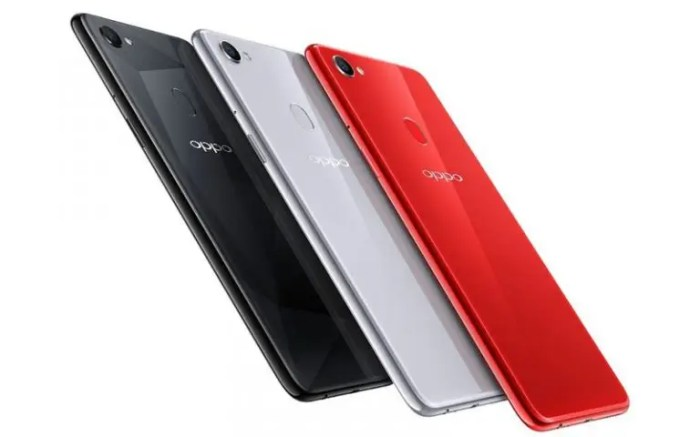

Cara full screen Oppo F7 bikin kamu makin nyaman nonton drakor atau main game? Tenang, gak perlu jadi ahli teknologi kok! Artikel ini bakalan ngajak kamu menjelajah berbagai metode mengaktifkan mode layar penuh di Oppo F7, dari yang paling simpel sampai yang sedikit lebih advance.

Siap-siap merasakan sensasi layar penuh yang maksimal!

Kita akan bahas tuntas cara mengaktifkan mode layar penuh lewat tombol navigasi, pengaturan sistem, bahkan dengan bantuan aplikasi pihak ketiga (kalau ada!). Selain itu, kita juga akan jelasin pengaturan layar lain yang perlu kamu atur agar pengalaman layar penuhmu makin nyaman dan mata tetap sehat.

So, mari kita mulai!

## Mengaktifkan Mode Layar Penuh di Oppo F7: Panduan Anti Ribet

Bosan dengan notifikasi dan tombol navigasi yang memakan ruang layar berharga di Oppo F7 kamu? Tenang, nggak perlu jadi ahli teknologi kok untuk mengaktifkan mode layar penuh. Berikut beberapa cara mudah yang bisa kamu coba, dari yang paling sederhana sampai yang sedikit lebih advance.

Siap-siap nikmati pengalaman menonton video atau bermain game yang lebih immersive!

### Mengaktifkan Mode Layar Penuh via Tombol Navigasi

Cara ini paling gampang, cocok banget buat kamu yang nggak mau ribet. Cukup dengan memanfaatkan tombol navigasi bawaan Oppo F7, kamu bisa menyembunyikannya dan mendapatkan layar penuh. Sayangnya, metode ini hanya menyembunyikan tombol, bukan sepenuhnya menghilangkannya.

Jadi, tombolnya masih aktif dan bisa muncul lagi kalau kamu perlu.

1. Geser dari bawah layar ke atas. Biasanya, ini akan menampilkan tombol navigasi.

3. Tekan lama salah satu tombol navigasi (misalnya, tombol "Home").

5. Pilih opsi "Sembunyikan tombol navigasi" atau sejenisnya. Opsi ini mungkin sedikit berbeda tergantung versi sistem operasi kamu.

### Mengaktifkan Mode Layar Penuh via Pengaturan Sistem

Metode ini menawarkan kontrol yang lebih menyeluruh. Kamu bisa mengatur berbagai aspek terkait tampilan, termasuk mengatur gestur navigasi untuk mengganti tombol navigasi yang disembunyikan.

1. Buka menu "Pengaturan" di Oppo F7 kamu.

3. Cari dan pilih opsi "Layar & Kecerahan" atau yang serupa.

5. Cari pengaturan untuk "Navigasi".

7. Pilih opsi "Gestur navigasi" atau opsi yang memungkinkan kamu untuk menyembunyikan tombol navigasi dan menggunakan gestur.

### Menggunakan Aplikasi Pihak Ketiga (Jika Ada)

Beberapa aplikasi pihak ketiga menawarkan fitur untuk mengoptimalkan tampilan layar, termasuk menyembunyikan elemen sistem seperti tombol navigasi. Namun, hati-hati dalam memilih aplikasi, pastikan aplikasinya terpercaya dan tidak membahayakan perangkat kamu. Perlu diingat bahwa metode ini mungkin membutuhkan izin akses tambahan.

Contoh: Beberapa aplikasi launcher pihak ketiga mungkin memiliki fitur untuk menyembunyikan tombol navigasi dan menggantinya dengan gestur. Namun, efektivitas dan kompatibilitasnya bisa bervariasi tergantung aplikasi dan versi sistem operasi.

### Perbandingan Metode

| Metode | Keunggulan | Kekurangan |
| --- | --- | --- |
| Tombol Navigasi | Mudah dan cepat | Hanya menyembunyikan tombol, bukan menghilangkannya sepenuhnya. |
| Pengaturan Sistem | Kontrol lebih menyeluruh, bisa mengganti dengan gestur | Membutuhkan beberapa langkah |
| Aplikasi Pihak Ketiga | Potensi fitur tambahan untuk kustomisasi tampilan | Membutuhkan instalasi aplikasi tambahan, potensi risiko keamanan. |

### Mengatasi Masalah Mode Layar Penuh yang Tidak Berfungsi, Cara full screen oppo f7

Jika mode layar penuh tidak berfungsi dengan benar, coba beberapa langkah berikut:

- Restart perangkat Oppo F7 kamu.

- Periksa pembaruan sistem operasi. Bug pada sistem operasi terkadang bisa menyebabkan masalah ini.

- Pastikan tidak ada aplikasi yang mengganggu fungsi sistem tampilan.

- Jika menggunakan aplikasi pihak ketiga, coba hapus instalasi dan coba lagi dengan aplikasi lain atau kembali ke pengaturan default.

## Pengaturan Layar Oppo F7 untuk Layar Penuh

Nah, udah dapet mode layar penuh di Oppo F7 kamu? Seru banget kan? Tapi, biar pengalaman nonton film atau main game makin maksimal, kamu perlu atur beberapa settingan di layar. Jangan sampai mata kamu pegel gara-gara pengaturan yang kurang pas, ya! Yuk, kita ulik pengaturan layar Oppo F7 agar mode layar penuhmu makin ciamik.

### Resolusi dan Orientasi Layar

Resolusi layar itu kayak jumlah titik-titik yang membentuk gambar di layar Oppo F7 kamu. Semakin tinggi resolusinya, semakin detail dan tajam gambarnya. Untuk mode layar penuh, pilih resolusi tertinggi yang didukung Oppo F7 kamu agar detail gambarnya maksimal.

Jangan lupa juga atur orientasi layar (portrait atau landscape) sesuai kebutuhan. Biasanya, untuk nonton film atau main game, landscape lebih pas.

### Pengaruh Kecerahan Layar terhadap Pengalaman Layar Penuh

Kecerahan layar berpengaruh banget ke kenyamanan mata, apalagi kalau lagi pakai mode layar penuh dalam waktu lama. Kecerahan yang terlalu tinggi bisa bikin mata cepat lelah dan silau. Sebaliknya, kecerahan yang terlalu rendah bikin gambar kurang jelas. Cari tingkat kecerahan yang pas di mata kamu, jangan sampai terlalu terang atau terlalu redup.

### Pengaturan Font dan Ukuran Teks

Ukuran font dan teks juga penting, lho! Pastikan ukuran font cukup besar dan mudah dibaca, terutama kalau kamu sering baca artikel atau teks di mode layar penuh. Oppo F7 biasanya menyediakan pengaturan untuk mengubah ukuran font secara keseluruhan.

Atur sesuai kenyamanan mata kamu. Jangan sampai mata kamu tegang gara-gara harus memicingkan mata untuk membaca teks yang terlalu kecil.

> Menyesuaikan pengaturan layar sangat penting untuk kenyamanan mata, terutama saat menggunakan mode layar penuh dalam waktu yang lama. Hindari kecerahan yang terlalu tinggi dan ukuran font yang terlalu kecil agar mata tetap sehat dan nyaman.

### Pengaturan Lain yang Berinteraksi dengan Mode Layar Penuh

- **Mode gelap (Dark Mode):**Mengaktifkan mode gelap bisa mengurangi kelelahan mata, terutama saat menggunakan layar dalam kondisi minim cahaya. Cobain deh, siapa tahu cocok!

- **Filter cahaya biru (Blue Light Filter):**Fitur ini mengurangi emisi cahaya biru dari layar, yang bisa mengurangi kelelahan mata dan meningkatkan kualitas tidur. Aktifkan fitur ini, terutama di malam hari.

- **Auto-rotate:**Fitur ini otomatis memutar orientasi layar sesuai dengan posisi ponsel. Matikan fitur ini jika kamu ingin tetap menggunakan orientasi layar tertentu saat mode layar penuh aktif.

## Aplikasi dan Game yang Mendukung Layar Penuh

Nah, setelah berhasil mengaktifkan mode layar penuh di Oppo F7 kamu, saatnya kita bahas aplikasi dan game apa aja sih yang bisa maksimalin fitur keren ini. Soalnya, nggak semua aplikasi dan game otomatis mendukung layar penuh, kan? Ada yang masih menampilkan _black bar_di atas atau bawah, bikin kurang _immersive_.

Yuk, kita cari tahu!

Memastikan aplikasi mendukung layar penuh sebenarnya gampang kok. Coba deh kamu buka aplikasi atau game yang ingin kamu uji. Perhatikan tampilannya, apakah memenuhi seluruh layar atau masih ada area hitam di sekelilingnya? Kalau penuh, berarti aplikasi tersebut sudah mendukung mode layar penuh.

Simpel, kan?

### Aplikasi dan Game dengan Dukungan Layar Penuh Optimal

Beberapa aplikasi dan game populer biasanya sudah dirancang untuk otomatis menampilkan layar penuh di Oppo F 7. Tapi, ada juga yang… kurang maksimal. Berikut beberapa contohnya:

- **Dukungan Layar Penuh Baik:**Netflix, YouTube, Mobile Legends, PUBG Mobile. Aplikasi dan game ini biasanya secara otomatis menyesuaikan tampilan dengan resolusi layar Oppo F7, sehingga memberikan pengalaman menonton dan bermain game yang imersif.

- **Dukungan Layar Penuh Kurang Optimal:**Beberapa game lama atau aplikasi yang kurang ter- _update_mungkin masih menampilkan _black bar_. Ini karena aplikasi tersebut belum dioptimalkan untuk berbagai rasio aspek layar, termasuk yang ada di Oppo F7. Contohnya, beberapa game indie atau aplikasi niche.

### Mengatasi Aplikasi yang Tidak Mendukung Layar Penuh Secara Optimal

Tenang, bukan berarti kamu harus pasrah kalau ada aplikasi yang nggak mendukung layar penuh secara optimal. Ada beberapa solusi yang bisa kamu coba:

- **Perbarui Aplikasi:** _Update_aplikasi ke versi terbaru. Pengembang sering menambahkan dukungan untuk berbagai rasio aspek layar di pembaruan mereka. Fitur ini seringkali memperbaiki masalah tampilan layar penuh.

- **Cari Alternatif Aplikasi:**Jika aplikasi yang kamu gunakan masih tetap menampilkan _black bar_meskipun sudah di- _update_, mungkin saatnya mencari aplikasi alternatif yang sudah teroptimasi dengan baik untuk layar penuh.

- **Gunakan Fitur Zoom/Scale (Jika Tersedia):**Beberapa aplikasi memungkinkan kamu untuk memperbesar atau memperkecil tampilan. Fitur ini bisa membantu menutupi _black bar_, meskipun kualitas gambar mungkin sedikit terpengaruh.
- **Ubah Resolusi Layar (Hati-hati):**Mengubah resolusi layar Oppo F7 bisa berpengaruh pada tampilan beberapa aplikasi. Namun, ini bukan solusi yang ideal karena bisa memengaruhi kualitas grafis dan performa perangkat. Coba hanya sebagai upaya terakhir dan kembalikan ke pengaturan semula jika hasilnya kurang memuaskan.
    

## Mengatasi Masalah Layar Penuh

Duh, lagi asyik main game atau nonton drakor tiba-tiba layar Oppo F7 kamu bermasalah saat di-full screen? Tenang, _it happens_! Mode layar penuh memang bikin pengalaman _smartphone_makin maksimal, tapi terkadang ada aja kendala yang muncul. Dari aplikasi yang tiba-tiba _crash_sampai layar yang kedip-kedip bikin mata sakit.

Yuk, kita bahas beberapa masalah umum dan solusinya biar kamu bisa kembali menikmati layar penuh Oppo F7 tanpa gangguan!

### Aplikasi Crash Saat Layar Penuh

Pernah ngalamin aplikasi tiba-tiba menutup sendiri saat kamu ubah ke mode layar penuh? Ini bisa disebabkan beberapa hal, mulai dari aplikasi yang kurang kompatibel dengan resolusi layar Oppo F7, hingga masalah pada sistem operasi itu sendiri. Bayangkan, kamu lagi seru-serunya main game, eh… tiba-tiba balik ke _home screen_.

_Bummer_banget, kan?

1. **Restart Aplikasi:**Coba tutup aplikasi yang bermasalah lalu buka lagi. Kadang, langkah sederhana ini cukup efektif.

3. **Bersihkan Cache Aplikasi:**Cache yang menumpuk bisa mengganggu kinerja aplikasi. Caranya, masuk ke _Settings_\> _Apps_\> pilih aplikasi yang bermasalah > _Clear Cache_.

5. **Update Aplikasi:**Pastikan aplikasi yang kamu gunakan sudah versi terbaru. _Update_biasanya berisi perbaikan _bug_yang bisa menyebabkan _crash_.

7. **Uninstall dan Install Ulang:**Jika cara di atas masih belum berhasil, coba _uninstall_aplikasi lalu _install_ulang dari Play Store atau App Store. Ini akan menghapus semua data aplikasi, termasuk cache dan data yang corrupt.

9. **Restart HP:**Langkah terakhir, coba _restart_Oppo F7 kamu. Kadang, sistem operasi perlu “bernapas” untuk bekerja optimal.

Ilustrasi: Bayangkan layar game yang tiba-tiba menjadi hitam, lalu muncul logo Oppo. Setelah beberapa detik, kamu kembali ke layar utama. Setelah melakukan _restart_aplikasi, layar game kembali normal dan berjalan lancar.

### Layar Berkedip Saat Layar Penuh

Layar yang berkedip-kedip saat menggunakan mode layar penuh? Ini bisa disebabkan oleh masalah pada pengaturan layar, driver grafis, atau bahkan kerusakan hardware. Rasanya bikin mata pusing dan nggak nyaman, apalagi kalau lagi nonton video.

1. **Cek Pengaturan Layar:**Pastikan pengaturan kecerahan layar Oppo F7 kamu normal dan tidak terlalu rendah atau terlalu tinggi. Coba juga ubah mode layar (misalnya, dari mode hemat daya ke mode normal).

3. **Periksa Koneksi:**Kadang, layar berkedip juga bisa disebabkan oleh masalah koneksi, misalnya konektivitas yang tidak stabil. Coba cek koneksi internet atau kabel data jika sedang digunakan.

5. **Update Driver Grafis:**Driver grafis yang usang bisa menyebabkan masalah pada tampilan layar. Meskipun Oppo F7 tidak memungkinkan _update_driver secara langsung, _update_sistem operasi secara berkala biasanya sudah mencakup _update_driver.

7. **Periksa Hardware:**Jika masalah tetap berlanjut, kemungkinan ada masalah pada hardware Oppo F7 kamu. Sebaiknya bawa ke service center untuk diperiksa.

Ilustrasi: Bayangkan layar yang berkedip-kedip dengan intensitas yang bervariasi, seakan-akan layar berdenyut. Setelah pengaturan kecerahan diubah, kedipan tersebut menghilang dan layar menampilkan gambar dengan stabil.

### Tabel Masalah, Penyebab, dan Solusi

| Masalah | Penyebab | Solusi |
| --- | --- | --- |
| Aplikasi Crash | Aplikasi tidak kompatibel, cache penuh, bug aplikasi, sistem operasi error | Restart aplikasi, bersihkan cache, update aplikasi, uninstall & install ulang, restart HP |
| Layar Berkedip | Pengaturan layar yang salah, masalah driver grafis, hardware error, koneksi tidak stabil | Cek pengaturan layar, periksa koneksi, update sistem operasi, periksa hardware di service center |

### Tips dan Trik Tambahan

Untuk mencegah masalah layar penuh terjadi, pastikan kamu selalu:

- Mengupdate sistem operasi dan aplikasi secara berkala.

- Membersihkan cache aplikasi secara rutin.

- Menjaga suhu HP agar tetap normal.

- Memastikan kapasitas penyimpanan internal HP tidak penuh.

## Penutupan: Cara Full Screen Oppo F7

Nah, setelah membaca panduan lengkap cara full screen Oppo F7 ini, sekarang kamu udah punya bekal untuk menikmati konten multimedia dengan pengalaman layar penuh yang maksimal. Ingat, sesuaikan pengaturan layar dengan kebutuhan dan kenyamanan matamu, ya! Selamat mencoba dan semoga sukses!

## Pertanyaan Populer dan Jawabannya

**Apakah semua aplikasi mendukung mode layar penuh di Oppo F7?**

Tidak semua aplikasi mendukung mode layar penuh. Beberapa aplikasi mungkin memiliki batasan atau dirancang untuk tampilan tertentu.

**Apa yang harus dilakukan jika layar Oppo F7 berkedip saat full screen?**

Coba restart perangkat. Jika masih bermasalah, periksa pengaturan kecerahan dan perbarui aplikasi yang sedang digunakan.

**Bagaimana cara mengatasi aplikasi yang crash saat menggunakan mode layar penuh?**

Pastikan aplikasi tersebut sudah diperbarui ke versi terbaru. Jika masih crash, coba hapus data aplikasi atau instal ulang.

**Apakah menggunakan mode layar penuh akan menguras baterai lebih cepat?**

Ya, penggunaan mode layar penuh cenderung mengonsumsi baterai lebih banyak karena kecerahan layar yang lebih tinggi dan penggunaan daya pemrosesan yang lebih besar.
