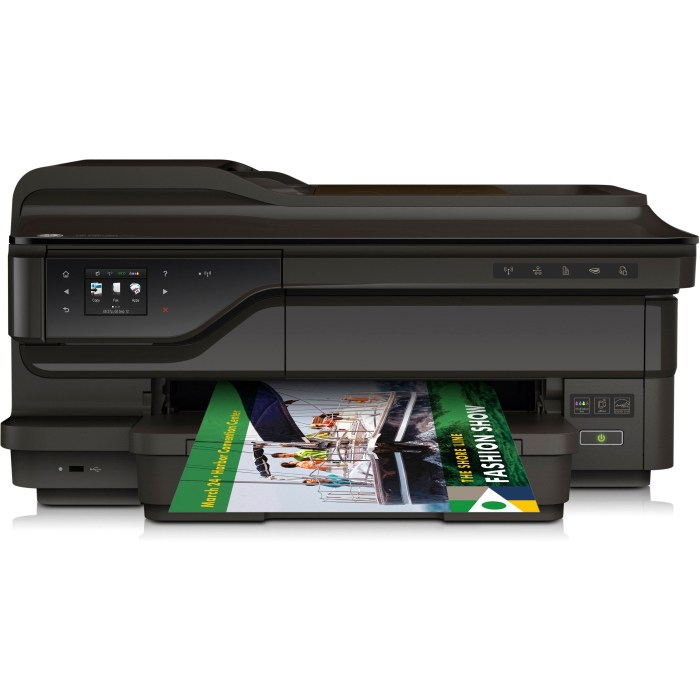

Cara instal printer HP OfficeJet 7612? Bingung? Tenang, gak perlu jadi ahli IT kok! Panduan ini akan memandu kamu, step-by-step, dari persiapan hingga printer siap mencetak dokumen pentingmu. Baik lewat USB atau WiFi, kita taklukan semua kendala instalasi printer ini.

Siap-siap deh, ucapkan selamat tinggal pada tumpukan kertas yang menunggu dicetak!

Artikel ini akan membahas secara detail proses instalasi printer HP OfficeJet 7612, baik melalui koneksi kabel USB maupun nirkabel (WiFi). Kita akan mengupas tuntas persyaratan sistem, langkah-langkah instalasi, pemecahan masalah umum, hingga tips dan trik agar proses instalasi berjalan lancar.

Jadi, siap-siap untuk pengalaman instalasi printer yang mudah dan menyenangkan!

## Persyaratan Instalasi Printer HP OfficeJet 7612

Nggak mau ribet pas instal printer baru? Sebelum colok kabel dan mulai print, cek dulu persyaratan instalasi HP OfficeJet 7612. Langkah ini penting banget biar proses instalasi lancar jaya dan terhindar dari drama error yang bikin kepala pusing.

So, pastikan kamu udah siapkan semua yang dibutuhkan!

### Persyaratan Sistem Minimum

HP OfficeJet 7612 punya persyaratan sistem minimum yang harus dipenuhi, baik itu untuk Windows maupun macOS. Pastikan perangkat kamu memenuhi spesifikasi ini agar proses instalasi berjalan mulus. Kegagalan memenuhi persyaratan ini bisa menyebabkan masalah instalasi dan bahkan printer nggak bisa berfungsi dengan optimal.

| Sistem Operasi | Port USB | Koneksi Internet | Catatan |
| --- | --- | --- | --- |
| Windows 10, Windows 11 (versi terbaru direkomendasikan) | Port USB 2.0 atau lebih tinggi | Diperlukan untuk instalasi driver dan akses fitur online (opsional) | Pastikan driver terbaru sudah diunduh dari situs resmi HP |
| macOS 10.15 Catalina atau lebih tinggi (versi terbaru direkomendasikan) | Port USB 2.0 atau lebih tinggi | Diperlukan untuk instalasi driver dan akses fitur online (opsional) | Pastikan driver terbaru sudah diunduh dari situs resmi HP |

### Langkah Pengecekan Persyaratan Sistem

Sebelum memulai instalasi, ada beberapa hal yang perlu kamu cek untuk memastikan semuanya sudah siap. Ini langkah-langkahnya:

1. **Cek Sistem Operasi:**Buka menu “Settings” atau “System Preferences” di komputermu dan cari informasi versi sistem operasi yang terpasang. Pastikan versi sistem operasi kamu sesuai dengan persyaratan minimum yang sudah disebutkan di atas.

3. **Cek Port USB:**Pastikan komputermu memiliki port USB yang tersedia dan berfungsi dengan baik. Coba colokkan perangkat lain ke port USB tersebut untuk memastikannya.

5. **Cek Koneksi Internet:**Pastikan koneksi internetmu stabil dan lancar. Ini penting untuk mengunduh driver printer dan mengakses fitur online (jika dibutuhkan).

7. **Cek Ruang Penyimpanan:**Pastikan kamu memiliki ruang penyimpanan yang cukup di hard drive komputermu untuk menginstal driver dan software printer.

### Poin Penting Sebelum Instalasi

Selain persyaratan sistem, ada beberapa hal penting lain yang perlu diperhatikan sebelum memulai instalasi untuk menghindari masalah di kemudian hari:

- Pastikan printer HP OfficeJet 7612 dalam kondisi siap pakai dan terhubung ke sumber daya listrik.

- Unduh driver printer terbaru dari situs web resmi HP. Jangan gunakan driver yang versi lama, karena bisa menyebabkan masalah kompatibilitas.

- Matikan sementara perangkat lunak antivirus atau firewall jika terjadi kendala selama proses instalasi. Setelah instalasi selesai, aktifkan kembali.

- Siapkan kabel USB untuk menghubungkan printer ke komputer.

### Potensi Masalah Jika Persyaratan Sistem Tidak Terpenuhi

Jika persyaratan sistem tidak terpenuhi, kamu mungkin akan mengalami beberapa masalah, seperti:

- Printer tidak terdeteksi oleh komputer.

- Proses instalasi gagal atau error.

- Printer tidak dapat mencetak dengan benar atau muncul masalah kualitas cetak.

- Beberapa fitur printer tidak berfungsi.

- Muncul pesan error yang membingungkan selama instalasi atau penggunaan.

## Instalasi Printer HP OfficeJet 7612 via Kabel USB: Panduan Anti Ribet

Ngeprint dokumen penting mendadak? Printer HP OfficeJet 7612 kamu masih belum terpasang? Tenang, instalasi printer ini sebenarnya nggak sesulit yang dibayangkan, kok! Dengan panduan langkah demi langkah ini, kamu bisa pasang printer HP OfficeJet 7612 via USB dengan mudah, bahkan kalau kamu termasuk yang nggak terlalu akrab dengan dunia teknologi.

Kita akan bahas instalasi di Windows dan macOS, jadi siapkan kabel USB dan semangatmu!

### Langkah-langkah Instalasi Printer HP OfficeJet 7612 via USB

Berikut langkah-langkah detail instalasi printer HP OfficeJet 7612 melalui koneksi USB. Ikuti dengan teliti, ya! Setiap langkah dirancang agar proses instalasi berjalan lancar dan kamu bisa langsung mencetak dokumenmu.

1. Pastikan printer HP OfficeJet 7612 dalam keadaan mati dan kabel USB belum terhubung ke komputer.

3. Hubungkan satu ujung kabel USB ke port USB di printer, dan ujung lainnya ke port USB di komputer atau laptop kamu.

5. Nyalakan printer HP OfficeJet 7612. Tunggu hingga printer siap dan lampu indikator menunjukkan status siap pakai.

7. Sistem operasi kamu (Windows atau macOS) biasanya akan secara otomatis mendeteksi printer baru yang terhubung. Jika tidak, lanjutkan ke langkah selanjutnya.

9. Buka menu pengaturan printer di sistem operasi kamu. Di Windows, biasanya melalui Settings > Devices > Printers & scanners. Di macOS, kamu bisa menemukannya di System Preferences > Printers & Scanners.

11. Klik tombol "Add Printer" atau yang serupa. Sistem akan mencari printer yang terhubung. Pilih HP OfficeJet 7612 dari daftar printer yang tersedia.

13. Ikuti petunjuk di layar untuk menyelesaikan proses instalasi. Proses ini mungkin melibatkan pemilihan driver printer yang sesuai.

15. Setelah instalasi selesai, coba cetak halaman uji untuk memastikan printer terhubung dan berfungsi dengan baik.

### Peringatan Penting Selama Instalasi via USB

> Pastikan kamu menggunakan kabel USB yang berkualitas baik dan terhubung dengan benar ke printer dan komputer. Kabel USB yang rusak atau koneksi yang longgar dapat menyebabkan masalah selama instalasi. Selain itu, pastikan driver printer yang terinstal adalah versi terbaru. Kamu bisa mengunduhnya dari situs web resmi HP.

### Mengatasi Error Kode Selama Instalasi USB

Terkadang, proses instalasi bisa mengalami kendala dan menampilkan kode error. Berikut beberapa contoh kode error umum dan cara mengatasinya:

- **Error Kode 0x00000000:**Kode error ini seringkali menandakan masalah koneksi USB. Coba cabut dan pasang kembali kabel USB, pastikan terhubung dengan baik ke printer dan komputer. Jika masalah berlanjut, coba gunakan port USB yang berbeda.

- **Error Kode 0x00000709:**Kode ini mengindikasikan masalah dengan driver printer. Coba hapus instalasi driver printer yang ada, lalu unduh dan instal ulang driver terbaru dari situs web HP.

- **Printer Tidak Terdeteksi:**Pastikan printer menyala dan lampu indikator menunjukkan status siap pakai. Periksa juga apakah kabel USB terhubung dengan benar dan port USB di komputer berfungsi dengan baik.

Jika masalah masih berlanjut setelah mencoba langkah-langkah di atas, sebaiknya kamu menghubungi dukungan teknis HP untuk mendapatkan bantuan lebih lanjut.

### Menambahkan Printer Melalui "Add Printer" di Windows dan macOS

Proses menambahkan printer melalui fitur "Add Printer" pada Windows dan macOS cukup serupa. Perbedaan utama terletak pada tampilan antarmuka sistem operasi. Namun, prinsip dasarnya tetap sama: sistem operasi akan mendeteksi printer yang terhubung dan memungkinkan kamu untuk memilih dan menginstal driver yang tepat.

Pada Windows, kamu akan menemukan pilihan "Add Printer" di Settings > Devices > Printers & scanners. Sedangkan di macOS, kamu bisa menemukannya di System Preferences > Printers & Scanners. Setelah memilih "Add Printer", sistem akan melakukan pencarian otomatis terhadap printer yang terhubung.

Pilih HP OfficeJet 7612 dari daftar yang muncul dan ikuti instruksi selanjutnya untuk menyelesaikan instalasi.

### Memastikan Printer Terdeteksi dengan Benar

Setelah instalasi selesai, langkah terakhir adalah memastikan printer terdeteksi dan berfungsi dengan baik. Cara paling mudah adalah dengan mencetak halaman uji. Di pengaturan printer, biasanya terdapat pilihan untuk mencetak halaman uji atau test page. Jika halaman uji berhasil dicetak, berarti printer telah terinstal dengan benar dan siap digunakan.

Jika tidak, periksa kembali koneksi USB dan driver printer.

## Cara Instalasi Printer HP OfficeJet 7612 via Wireless

Nggak mau ribet pakai kabel? Instalasi printer HP OfficeJet 7612 secara wireless adalah solusinya! Dengan koneksi nirkabel, kamu bisa mencetak dokumen dari mana saja di rumah tanpa perlu repot dengan kabel yang kusut. Ikuti langkah-langkah mudah berikut ini untuk setup printer HP OfficeJet 7612 kamu secara wireless, dan siap-siap deh mencetak dokumen dan foto kesayanganmu dengan praktis.

### Langkah-langkah Instalasi Printer HP OfficeJet 7612 via Wireless

Berikut adalah panduan langkah demi langkah untuk menghubungkan printer HP OfficeJet 7612 ke jaringan Wi-Fi kamu. Pastikan printer dan laptop/komputer kamu sudah terhubung ke jaringan Wi-Fi yang sama.

1. Pastikan printer HP OfficeJet 7612 sudah terhubung ke sumber listrik dan dalam keadaan menyala.

3. Nyalakan Wi-Fi pada perangkat kamu (laptop/komputer/smartphone) dan pastikan terhubung ke jaringan Wi-Fi rumahmu.

5. Unduh dan instal aplikasi HP Smart di smartphone atau komputermu. Aplikasi ini bisa diunduh melalui Google Play Store (Android) atau App Store (iOS), atau dari situs web resmi HP.

7. Buka aplikasi HP Smart dan ikuti petunjuk di layar untuk menambahkan printer baru. Aplikasi ini akan memandu kamu melalui proses pendeteksian dan konfigurasi printer secara wireless.

9. Pilih opsi "Wireless" atau "Nirkabel" saat diminta untuk memilih metode koneksi.

11. Aplikasi HP Smart akan mencari printer HP OfficeJet 7612 yang tersedia di jaringan Wi-Fi. Pilih printermu dari daftar yang muncul.

13. Masukkan password Wi-Fi jaringan rumahmu ketika diminta. Pastikan password yang kamu masukkan benar.

15. Tunggu hingga proses instalasi selesai. Aplikasi akan memberitahumu ketika printer sudah terhubung dan siap digunakan.

17. Setelah terhubung, coba cetak halaman uji untuk memastikan printer sudah terinstal dengan benar.

### Menemukan Nama dan Password Jaringan Wi-Fi Printer

Informasi ini biasanya tertera pada label di bagian belakang printer HP OfficeJet 7612. Cari label yang bertuliskan "Wireless Network Name" (nama jaringan Wi-Fi) dan "Wireless Password" (password Wi-Fi). Jika label tersebut tidak terlihat jelas, kamu bisa mencari informasi ini melalui manual printer atau website resmi HP.

### Tips Mengatasi Masalah Koneksi Wireless

> Jika mengalami masalah koneksi, pastikan router Wi-Fi kamu berfungsi dengan baik dan sinyalnya kuat di area tempat printer berada. Coba dekatkan printer ke router atau gunakan extensor Wi-Fi jika diperlukan. Restart printer dan router juga bisa membantu menyelesaikan masalah koneksi yang sederhana. Jika masalah berlanjut, periksa firewall atau pengaturan jaringan pada perangkat kamu.

### Konfigurasi Pengaturan Jaringan Printer Melalui Aplikasi HP Smart

Aplikasi HP Smart memungkinkan kamu untuk mengkonfigurasi berbagai pengaturan jaringan printer, seperti memilih jaringan Wi-Fi, mengubah nama printer, dan memperbarui firmware. Menu pengaturan biasanya mudah ditemukan di dalam aplikasi. Kamu bisa menyesuaikan pengaturan sesuai dengan kebutuhan dan preferensi jaringanmu.

### Pemecahan Masalah Koneksi Wireless yang Gagal

Jika koneksi wireless gagal, ada beberapa langkah pemecahan masalah yang bisa kamu coba. Pertama, pastikan printer dan perangkat kamu terhubung ke jaringan Wi-Fi yang sama. Kedua, periksa kekuatan sinyal Wi-Fi. Ketiga, restart printer dan router. Keempat, pastikan password Wi-Fi yang kamu masukkan benar.

Kelima, coba hubungkan printer secara langsung ke router menggunakan kabel ethernet untuk sementara waktu, lalu coba kembali koneksi wireless setelahnya. Jika masalah masih berlanjut, hubungi dukungan teknis HP untuk bantuan lebih lanjut.

## Penggunaan Driver dan Software HP OfficeJet 7612

Nah, setelah berhasil instal printer HP OfficeJet 7612, langkah selanjutnya yang nggak kalah penting adalah urusan driver dan software. Bayangin aja, printer secanggih OfficeJet 7612 ini bakalan jadi pajangan cantik kalau nggak diinstal drivernya dengan benar. Driver ini ibarat penerjemah bahasa antara printer dan komputer kamu, jadi pastikan kamu pakai yang tepat agar semua fitur printer bisa kamu manfaatkan secara maksimal, dari cetak dokumen hingga scan foto kesayangan.

Instalasi driver yang tepat memastikan printer HP OfficeJet 7612 kamu berfungsi optimal. Driver yang salah bisa bikin printermu error, nggak bisa ngeprint, atau bahkan merusak sistem komputer. Jadi, fokus banget ya di bagian ini!

### Mengunduh dan Menginstal Driver dari Situs Resmi HP

Cara paling aman dan terjamin untuk mendapatkan driver HP OfficeJet 7612 adalah langsung dari situs web resmi HP. Jangan asal unduh dari situs nggak jelas, ya! Risiko terkena malware atau virus cukup besar. Berikut langkah-langkahnya:

1. Buka situs web HP: www.hp.com (atau cari di Google "HP OfficeJet 7612 Driver Download").

3. Cari menu "Support" atau "Drivers & Software".

5. Masukkan nomor model printer kamu (HP OfficeJet 7612) dan sistem operasi komputermu (Windows, macOS, dll.).

7. Pilih driver yang sesuai dengan sistem operasi dan kebutuhanmu. Biasanya ada beberapa pilihan, seperti driver dasar atau driver lengkap dengan software tambahan.

9. Unduh driver tersebut dan ikuti petunjuk instalasi yang muncul di layar. Prosesnya biasanya cukup mudah dan intuitif, tinggal klik-klik aja.

### Perbandingan Fitur Berbagai Driver HP OfficeJet 7612

Terkadang, HP menyediakan beberapa pilihan driver untuk satu model printer. Perbedaannya biasanya terletak pada fitur-fitur yang disertakan. Berikut perbandingan umum (catatan: fitur spesifik bisa berbeda tergantung versi driver):

| Driver | Fitur Cetak | Fitur Scan | Fitur Tambahan |
| --- | --- | --- | --- |
| Basic Driver | Cetak dasar, pengaturan terbatas | Scan dasar (jika ada) | \- |
| Full Feature Driver | Cetak dengan pengaturan lengkap, kualitas tinggi | Scan dengan pengaturan lengkap, OCR (optical character recognition) | Software HP Smart, manajemen tinta, troubleshooting |
| Driver Khusus (misal, untuk macOS) | Sesuai kebutuhan sistem operasi | Sesuai kebutuhan sistem operasi | Fitur tambahan yang spesifik untuk sistem operasi tersebut |

### Mengelola Pengaturan Driver Setelah Instalasi

Setelah instalasi driver selesai, kamu bisa mengelola pengaturan driver melalui panel kontrol printer di komputermu. Di sini kamu bisa mengatur kualitas cetak, tipe kertas, ukuran kertas, dan berbagai pengaturan lainnya. Biasanya, pengaturan ini bisa diakses melalui menu "Devices and Printers" (Windows) atau "System Preferences" (macOS).

### Potensi Masalah Akibat Driver yang Salah, Cara instal printer hp officejet 7612

Menggunakan driver yang salah bisa menyebabkan berbagai masalah, mulai dari yang sepele hingga yang bikin kamu frustasi. Beberapa masalah yang mungkin terjadi antara lain: printer tidak terdeteksi, kualitas cetak buruk, warna cetak tidak akurat, error saat mencetak atau menscan, dan bahkan kerusakan sistem komputer (walaupun jarang terjadi).

Jadi, pastikan kamu mendownload driver yang tepat dan sesuai dengan sistem operasi kamu!

## Pemecahan Masalah Umum Instalasi

Instalasi printer HP OfficeJet 7612 emang terkesan gampang-gampang susah. Kadang lancar jaya, kadang bikin emosi karena error nggak jelas. Tenang, Hipwee udah siap sedia ngasih solusi buat masalah-masalah umum yang sering muncul. Berikut beberapa kendala dan cara ngatasinya, biar kamu nggak buang-buang waktu berlama-lama berhadapan sama si printer bandel.

### Masalah Koneksi Printer

Koneksi yang bermasalah adalah momok utama saat instalasi printer. Bisa karena kabel USB yang longgar, koneksi WiFi yang lemah, atau bahkan settingan jaringan yang salah. Berikut beberapa langkah troubleshooting yang bisa kamu coba.

1. **Cek Kabel USB:**Pastikan kabel USB terhubung dengan baik ke printer dan komputer. Coba ganti kabel USB jika perlu.

3. **Restart Printer dan Komputer:**Langkah klasik yang seringkali efektif. Matikan dan nyalakan kembali printer dan komputer kamu.

5. **Periksa Koneksi WiFi:**Pastikan printer terhubung ke jaringan WiFi yang sama dengan komputer. Cek kekuatan sinyal WiFi. Dekatkan printer ke router jika sinyal lemah.

7. **Konfigurasi Jaringan:**Pastikan settingan IP address printer dan komputer sudah benar. Kamu bisa cek settingan IP address di menu pengaturan printer.

9. **Hubungi Provider Internet:**Jika masalah masih berlanjut, mungkin ada masalah dengan koneksi internetmu. Hubungi provider internet untuk bantuan lebih lanjut.

### Error Printing

Munculnya pesan error saat mencetak dokumen adalah hal yang menyebalkan. Pesan error ini biasanya memberikan kode kesalahan yang bisa membantu mengidentifikasi masalahnya. Berikut beberapa kemungkinan error dan solusinya.

1. **Coba Cetak Ulang:**Kadang, error hanya terjadi sekali dan bisa diatasi dengan mencoba mencetak ulang dokumen.

3. **Periksa Tinta dan Kertas:**Pastikan tinta dan kertas sudah terpasang dengan benar dan masih tersedia.

5. **Bersihkan Head Printer:**Kotoran pada head printer bisa menyebabkan error printing. Lakukan pembersihan head printer melalui menu pengaturan printer.

7. **Periksa Antrian Cetak:**Pastikan tidak ada dokumen yang terpending di antrian cetak. Hapus dokumen yang tidak perlu.

9. **Instal Ulang Driver:**Jika masalah masih berlanjut, coba instal ulang driver printer.

### Masalah Driver

Driver yang corrupt atau tidak terinstal dengan benar bisa menyebabkan berbagai masalah. Berikut langkah-langkah untuk mengatasi masalah driver.

1. **Uninstall dan Install Ulang Driver:**Hapus driver printer yang lama, lalu instal ulang driver terbaru dari situs resmi HP.

3. **Periksa Kompatibilitas Driver:**Pastikan driver yang kamu instal kompatibel dengan sistem operasi komputermu.

5. **Update Driver:**Pastikan driver printer selalu terupdate ke versi terbaru.

7. **Gunakan Driver Default:**Jika driver custom bermasalah, coba gunakan driver default yang disediakan oleh sistem operasi.

### Cara Memeriksa Status Printer dan Mencari Informasi Kode Error

Mengetahui status printer dan kode error sangat penting untuk troubleshooting. Biasanya, informasi ini bisa ditemukan di panel kontrol printer atau melalui software printer.

- **Panel Kontrol Printer:**Periksa layar LCD pada printer untuk melihat status dan kode error.

- **Software Printer:**Buka software printer di komputer. Biasanya, software ini akan menampilkan status printer dan log error.

### Ilustrasi Pesan Error Umum

Berikut beberapa contoh pesan error yang sering muncul dan artinya (deskripsi, bukan gambar):

| Kode Error | Deskripsi Error | Solusi |
| --- | --- | --- |
| 0xc19a0005 | Kesalahan koneksi jaringan. Printer tidak dapat terhubung ke jaringan WiFi. | Periksa koneksi WiFi, restart printer dan router, cek settingan IP address. |
| 0x6100004a | Kertas macet. | Buka penutup printer dan bersihkan kertas yang macet. |
| "Out of Ink" | Tinta habis. | Isi ulang tinta atau ganti cartridge tinta yang baru. |

## Ringkasan Akhir

Instal printer HP OfficeJet 7612 ternyata gak sesulit yang dibayangkan, kan? Dengan mengikuti panduan langkah demi langkah di atas, sekarang kamu sudah bisa mencetak dokumen, foto, dan apapun yang kamu butuhkan dengan mudah. Selamat mencetak! Semoga panduan ini membantu dan jangan ragu untuk mengeksplorasi fitur-fitur canggih printer HP OfficeJet 7612 untuk meningkatkan produktivitasmu.

## Informasi FAQ: Cara Instal Printer Hp Officejet 7612

**Apa yang harus dilakukan jika printer tidak terdeteksi setelah instalasi?**

Coba restart komputer dan printer. Periksa koneksi kabel USB atau WiFi. Pastikan driver terinstal dengan benar. Jika masalah berlanjut, hubungi support HP.

**Bagaimana cara membersihkan print head printer HP OfficeJet 7612?**

Biasanya terdapat opsi pembersihan print head di menu pengaturan printer melalui software HP Smart atau panel kontrol printer itu sendiri.

**Apakah printer HP OfficeJet 7612 kompatibel dengan Linux?**

Kompatibilitas dengan Linux bervariasi. Periksa situs web HP untuk informasi driver dan kompatibilitas terbaru.

**Bagaimana cara mengatasi pesan error "Out of Paper"?**

Pastikan ada kertas di dalam tray printer dan tray terpasang dengan benar.
