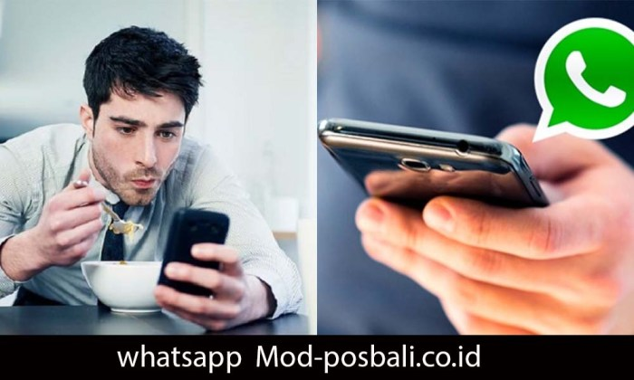

Cara install WhatsApp Mod memang menarik perhatian, janjinya fitur-fitur keren yang bikin WhatsApp resmi terlihat biasa aja. Tapi, tunggu dulu! Sebelum kamu buru-buru unduh aplikasi modifikasi ini, ada beberapa hal penting yang perlu kamu ketahui. Artikel ini akan membahas tuntas cara instalasi, perbandingan fitur, dan yang paling krusial: risiko keamanan dan privasi yang mengintai di balik fitur-fitur 'wah' tersebut.

Siap-siap membuka mata lebar-lebar!

WhatsApp Mod menawarkan fitur-fitur yang tak ada di versi resmi, seperti menyembunyikan status online, mengirim pesan ke nomor yang belum tersimpan, dan lain sebagainya. Namun, di balik daya pikatnya, tersimpan bahaya yang bisa mengancam data pribadi dan keamanan perangkatmu.

Artikel ini akan membimbingmu memahami langkah-langkah instalasi, membandingkan fitur-fitur WhatsApp Mod dan WhatsApp resmi, serta mengungkap risiko yang perlu dipertimbangkan sebelum memutuskan untuk menggunakannya.

## Risiko Penggunaan WhatsApp Mod

Duh, ngomongin WhatsApp Mod nih. Kelihatannya sih menggoda, fitur-fitur keren yang nggak ada di versi resmi. Tapi, tunggu dulu! Sebelum kamu buru-buru instal, ada beberapa risiko yang perlu kamu pertimbangkan. Soalnya, menggunakan aplikasi modifikasi ini bisa berdampak buruk banget, lho, bukan cuma sekadar kehilangan beberapa fitur saja.

Mari kita bahas satu per satu bahayanya.

### Potensi Bahaya Keamanan

WhatsApp Mod, karena sifatnya yang dimodifikasi, seringkali memiliki celah keamanan yang lebih rentan dibandingkan versi resmi. Aplikasi ini nggak melalui proses verifikasi dan pengujian keamanan yang ketat seperti WhatsApp resmi dari Google Play Store atau Apple App Store. Akibatnya, peretas lebih mudah masuk dan mengakses data pribadimu, seperti kontak, pesan, foto, dan bahkan lokasi.

Bayangkan deh, data-data pentingmu bisa jatuh ke tangan yang salah.

### Risiko Privasi yang Mungkin Timbul

Privasi adalah hal yang super penting di era digital ini. Dengan menggunakan WhatsApp Mod, privasi kamu jadi taruhannya. Aplikasi ini mungkin saja mengumpulkan dan mengirimkan data pribadimu ke pihak ketiga tanpa sepengetahuanmu. Ini bisa termasuk data lokasi, riwayat percakapan, dan informasi kontak.

Parahnya lagi, data ini bisa digunakan untuk tujuan yang nggak kamu inginkan, seperti spam, penipuan, atau bahkan kejahatan siber yang lebih serius.

### Perbandingan WhatsApp Resmi dan WhatsApp Mod

| Fitur | WhatsApp Resmi | WhatsApp Mod | Risiko |
| --- | --- | --- | --- |
| Keamanan | Terenkripsi end-to-end, terverifikasi, dan update keamanan rutin | Keamanan rendah, rentan terhadap malware, dan tidak terjamin | Data bocor, diretas, disalahgunakan |
| Privasi | Privasi terjamin, data terlindungi | Privasi tidak terjamin, potensi kebocoran data | Pelacakan data, penyalahgunaan informasi pribadi |
| Fitur Tambahan | Fitur standar, terupdate | Fitur tambahan, tetapi tidak terjamin keamanannya | Malware, virus, dan celah keamanan |
| Sumber Unduh | Google Play Store/Apple App Store | Sumber tidak resmi, website pihak ketiga | Risiko malware dan virus tinggi |

### Potensi Malware atau Virus

Salah satu risiko terbesar menggunakan WhatsApp Mod adalah potensi tertanamnya malware atau virus di dalamnya. Karena dikembangkan oleh pihak ketiga yang tidak terverifikasi, aplikasi ini bisa saja mengandung kode berbahaya yang bisa merusak perangkatmu atau mencuri data pribadimu.

Bayangkan, handphone-mu jadi lemot, data-datamu hilang, atau bahkan handphone-mu jadi alat kejahatan siber.

- Malware dapat mencuri informasi login dan password.

- Virus dapat merusak sistem operasi handphone.

- Aplikasi berbahaya dapat mengakses kontak dan data pribadi lainnya.

- Potensi terjadinya pencurian data finansial.

### Skenario Pembahayakan Data Pengguna

Misalnya, kamu mengunduh WhatsApp Mod dari situs web yang tidak terpercaya. Tanpa kamu sadari, aplikasi tersebut sudah terinfeksi malware yang dapat merekam aktivitasmu, termasuk percakapan dan lokasi. Data ini kemudian dikirim ke peretas yang dapat menggunakannya untuk melakukan penipuan, mengancam, atau bahkan memerasmu.

Atau, malware tersebut bisa mengubah pengaturan handphonemu, memberikan akses penuh ke data-data pribadimu kepada pihak yang tidak bertanggung jawab. Bisa dibayangkan kan betapa beresikonya?

## Prosedur Instalasi WhatsApp Mod (Umum)

Nah, udah siap-siap menjelajahi dunia WhatsApp Mod? Sebelum terjun ke instalasi, penting banget untuk paham resikonya. WhatsApp Mod bukan aplikasi resmi, jadi keamanannya nggak terjamin sepenuhnya. Bisa aja ada malware atau bug yang bikin HP kamu bermasalah.

Tapi, kalo kamu tetep mau coba, ikuti langkah-langkah ini dengan hati-hati ya!

Instalasi WhatsApp Mod umumnya mirip dengan instalasi aplikasi Android lainnya, tapi ada beberapa hal yang perlu diperhatikan ekstra. Berikut panduan lengkapnya, mulai dari download sampai pengaturan awal. Ingat, kehati-hatian adalah kunci utama di sini!

### Verifikasi Sumber Unduhan

Sebelum download, pastikan sumber unduhan aplikasi WhatsApp Mod terpercaya. Jangan asal klik link yang nggak jelas ya, bisa-bisa HP kamu malah kena virus! Cari situs atau forum yang punya reputasi bagus dan banyak review positif dari pengguna lain.

Perhatikan juga detail aplikasi, seperti versi, tanggal update, dan ukuran file. Bandingkan dengan informasi di situs resmi WhatsApp (walaupun ini Mod, ya). Semakin detail informasinya, semakin kecil kemungkinan kamu download aplikasi palsu.

### Pencadangan Data WhatsApp

Sebelum menginstal WhatsApp Mod, backup data WhatsApp kamu dulu. Ini penting banget untuk mencegah kehilangan chat, foto, dan video berharga. Caranya gampang kok. Buka WhatsApp original kamu, masuk ke menu Setting, lalu pilih Chats, dan terakhir pilih Backup.

Pilih Google Drive atau Local Storage sebagai tempat backup. Proses ini penting banget, karena instalasi WhatsApp Mod bisa menyebabkan hilangnya data jika tidak di-backup terlebih dahulu.

> Langkah ini penting banget, jangan sampai lupa! Bayangin aja kalo chat penting kamu hilang gara-gara nggak backup data. Nyesel kan?

### Langkah-Langkah Instalasi WhatsApp Mod

Setelah verifikasi dan backup data selesai, sekarang saatnya instalasi. Ingat, langkah-langkah ini bersifat umum dan bisa sedikit berbeda tergantung jenis WhatsApp Mod yang kamu gunakan.

1. > Unduh file APK WhatsApp Mod dari sumber terpercaya yang sudah kamu verifikasi.
    

3. > Pastikan “Sumber Tidak Dikenal” (Unknown Sources) diaktifkan di pengaturan keamanan HP kamu. Biasanya terletak di menu Settings > Security > Unknown Sources. Ini penting agar HP kamu bisa menginstal aplikasi dari luar Google Play Store.
    

5. > Cari file APK WhatsApp Mod yang sudah kamu download, lalu klik untuk memulai instalasi. Ikuti petunjuk di layar sampai proses instalasi selesai.
    

7. > Setelah instalasi selesai, buka aplikasi WhatsApp Mod. Kamu akan diminta untuk memverifikasi nomor telepon. Masukkan nomor yang sama dengan WhatsApp original kamu (jika ingin memindahkan data).
    

9. > Tunggu hingga proses verifikasi selesai dan data kamu ter-restore (jika kamu melakukan backup sebelumnya).
    

### Mengatasi Masalah Umum

Selama instalasi, mungkin kamu akan menemukan beberapa masalah. Berikut beberapa masalah umum dan solusinya:

- **Aplikasi tidak terinstal:**Pastikan "Sumber Tidak Dikenal" sudah diaktifkan dan ruang penyimpanan HP kamu cukup.

- **Verifikasi nomor gagal:**Pastikan nomor telepon yang kamu masukkan benar dan koneksi internet kamu stabil.

- **Aplikasi crash:**Coba hapus cache dan data aplikasi, lalu restart HP kamu. Jika masih bermasalah, coba instal ulang aplikasi.

- **Aplikasi tidak berfungsi dengan baik:**Pastikan kamu download WhatsApp Mod dari sumber terpercaya dan versi yang kompatibel dengan HP kamu. Beberapa WhatsApp Mod mungkin memiliki bug atau error.

## Perbandingan Fitur WhatsApp Mod dengan WhatsApp Resmi

WhatsApp Mod, aplikasi modifikasi WhatsApp, menawarkan segudang fitur yang bikin kamu mikir, "Kok WhatsApp resmi nggak begini ya?" Tapi, di balik fitur-fitur menarik itu, ada konsekuensi yang perlu kamu pertimbangkan. Artikel ini akan membandingkan WhatsApp Mod dan WhatsApp resmi secara detail, dari fitur hingga implikasinya.

Siap-siap membuka mata!

### Tabel Perbandingan Fitur WhatsApp Mod dan WhatsApp Resmi

Berikut tabel perbandingan fitur WhatsApp Mod dan WhatsApp resmi. Perlu diingat bahwa fitur-fitur WhatsApp Mod bisa bervariasi tergantung jenis Mod yang digunakan. Tabel ini hanya mewakili fitur umum yang sering ditemukan.

| Fitur | WhatsApp Resmi | WhatsApp Mod | Catatan |
| --- | --- | --- | --- |
| Tema/UI Customization | Terbatas | Beragam pilihan tema, warna, dan font | WhatsApp Mod menawarkan kustomisasi yang jauh lebih luas. |
| Privasi | Fitur standar (baca tanda terima, status online, dll.) | Fitur privasi tambahan (sembunyikan status online, centang biru, dll.) | Beberapa fitur privasi ini tidak tersedia di versi resmi. |
| Pengunduhan Status | Tidak langsung | Langsung | Pengunduhan status di WhatsApp Mod lebih mudah. |
| Kirim File | Ukuran file terbatas | Ukuran file lebih besar | WhatsApp Mod memungkinkan pengiriman file dengan ukuran yang lebih besar. |
| Fitur Tambahan | Tidak ada | Beragam (misalnya, fitur penjadwalan pesan, balasan otomatis, dll.) | Fitur-fitur ini merupakan daya tarik utama WhatsApp Mod. |

### Perbedaan Antarmuka Pengguna

Secara umum, antarmuka pengguna WhatsApp Mod mirip dengan WhatsApp resmi. Perbedaan utama terletak pada opsi kustomisasi. WhatsApp Mod biasanya menawarkan pilihan tema yang lebih beragam, mulai dari warna gelap hingga tema yang sangat unik dan jauh dari tampilan standar WhatsApp resmi.

Pengaturan privasi juga biasanya lebih detail dan mudah diakses di WhatsApp Mod.

### Fitur Unggulan WhatsApp Mod

Fitur unggulan WhatsApp Mod yang paling menarik perhatian adalah kemampuan kustomisasi yang tinggi dan fitur privasi tambahan. Pengguna bisa menyesuaikan tampilan aplikasi sesuai selera dan mengontrol siapa yang bisa melihat status online, tanda centang biru, dan informasi lainnya. Fitur penjadwalan pesan dan balasan otomatis juga sangat praktis bagi pengguna yang sibuk.

### Implikasi Penggunaan Fitur Tambahan

Penggunaan fitur tambahan di WhatsApp Mod membawa konsekuensi. Karena bukan aplikasi resmi, keamanan dan privasi data pengguna tidak terjamin sepenuhnya. Ada risiko akun diblokir oleh WhatsApp resmi, dan potensi malware atau virus juga lebih tinggi. Selain itu, beberapa fitur tambahan, seperti pengiriman file berukuran besar, bisa melanggar kebijakan penggunaan WhatsApp.

### Legalitas Penggunaan WhatsApp Mod

Penggunaan WhatsApp Mod secara legal meragukan. WhatsApp secara tegas melarang penggunaan aplikasi modifikasi. Meskipun menawarkan fitur menarik, risiko yang terkait dengan keamanan dan privasi, serta potensi pelanggaran kebijakan penggunaan, perlu dipertimbangkan dengan serius sebelum memutuskan untuk menggunakannya.

## Alternatif Aplikasi Pengirim Pesan Instan: Cara Install Whatsapp Mod

WhatsApp Mod memang menawarkan fitur-fitur menarik yang tak ada di versi resminya, tapi perlu diingat ya, keamanannya jadi pertimbangan utama. Menggunakan aplikasi modifikasi beresiko tinggi, lho! Nah, daripada ambil risiko, ada banyak kok aplikasi pesan instan lain yang aman dan punya fitur keren.

Yuk, kita jelajahi beberapa alternatifnya!

### Aplikasi Pengirim Pesan Instan Alternatif

Beberapa aplikasi pesan instan alternatif yang bisa kamu pertimbangkan sebagai pengganti WhatsApp Mod dan WhatsApp resmi antara lain Telegram, Signal, dan Line. Ketiganya menawarkan pengalaman berbeda, dengan kelebihan dan kekurangan masing-masing. Berikut perbandingannya:

| Fitur | Telegram | Signal | Line |
| --- | --- | --- | --- |
| Enkripsi | End-to-end untuk chat rahasia, cloud storage tidak dienkripsi | End-to-end untuk semua chat | End-to-end untuk chat, namun beberapa fitur lain mungkin tidak |
| Ukuran File | Bisa mengirim file hingga 2GB | Batas ukuran file bervariasi tergantung perangkat dan koneksi | Batas ukuran file lebih kecil dibandingkan Telegram |
| Fitur Tambahan | Bot, channel, grup besar | Fokus pada privasi dan keamanan | Sticker, games, panggilan suara dan video |

### Kelebihan dan Kekurangan Aplikasi Alternatif

Setiap aplikasi punya keunggulan dan kelemahannya. Memahami hal ini akan membantumu memilih aplikasi yang paling sesuai dengan kebutuhanmu.

- **Telegram:**Kelebihannya adalah kemampuan mengirim file berukuran besar dan fitur-fitur komunitas yang lengkap. Kekurangannya adalah enkripsi yang tidak menyeluruh untuk semua data.

- **Signal:**Kelebihan utamanya adalah fokus pada privasi dan keamanan dengan enkripsi end-to-end menyeluruh. Kekurangannya, mungkin kurang kaya fitur dibandingkan Telegram atau Line.

- **Line:**Kelebihannya adalah antarmuka yang user-friendly dan fitur-fitur tambahan seperti sticker dan games. Kekurangannya, keamanan dan privasi mungkin tidak sekuat Signal.

### Instalasi Telegram

Instalasi Telegram sangat mudah. Kamu cukup mengunjungi Google Play Store (untuk Android) atau App Store (untuk iOS), cari "Telegram", lalu klik "Instal". Setelah terinstal, buka aplikasi, masukkan nomor teleponmu, verifikasi kode yang dikirimkan, dan kamu siap menggunakannya!

### Perbandingan Keamanan dan Privasi

Dari segi keamanan dan privasi, Signal unggul karena enkripsi end-to-end yang diterapkan pada semua jenis data. Telegram juga menawarkan enkripsi end-to-end, tetapi hanya untuk chat rahasia. Line memiliki enkripsi end-to-end untuk chat, tetapi tidak untuk semua fitur. Oleh karena itu, Signal menjadi pilihan yang lebih aman bagi pengguna yang sangat memprioritaskan privasi.

## Ilustrasi Risiko Keamanan WhatsApp Mod

Nah, Sobat Hipwee, nggak cuma fitur-fitur keren yang ditawarkan WhatsApp Mod, tapi juga ada risiko keamanan yang perlu kamu pertimbangkan. Bayangkan, kamu lagi asyik chattingan pakai WhatsApp Mod, eh tiba-tiba data pribadimu bocor! Serem, kan?

Yuk, kita bahas lebih detail ancamannya.

### Penyalahgunaan Data Pengguna

WhatsApp Mod yang nggak terpercaya seringkali memiliki celah keamanan yang bisa dieksploitasi oleh pihak-pihak yang nggak bertanggung jawab. Mereka bisa dengan mudah mengakses data pribadimu, seperti kontak, foto, video, bahkan percakapanmu. Data ini kemudian bisa disalahgunakan untuk berbagai hal, mulai dari penipuan online, pencurian identitas, hingga pemerasan.

Bayangkan, foto-foto pribadimu tersebar luas di internet tanpa seizinmu. Ngeri, ya?

### Peretas Memanfaatkan Celah Keamanan

Para peretas lihai bisa memanfaatkan celah keamanan pada WhatsApp Mod untuk mengakses perangkatmu. Mereka bisa menginstal malware, mencuri informasi penting, atau bahkan mengendalikan perangkatmu dari jarak jauh. WhatsApp Mod yang nggak resmi biasanya nggak punya sistem keamanan yang sekuat WhatsApp versi original, sehingga lebih rentan terhadap serangan siber.

### Konsekuensi Kebocoran Data, Cara install whatsapp mod

Konsekuensi kebocoran data akibat penggunaan WhatsApp Mod bisa sangat fatal. Mulai dari kerugian finansial akibat penipuan online, rusaknya reputasi karena informasi pribadimu tersebar, hingga ancaman keamanan fisik jika data lokasi atau informasi pribadi lainnya disalahgunakan. Intinya, risikonya nggak main-main.

### Malware Masuk Melalui WhatsApp Mod

Salah satu ancaman terbesar dari WhatsApp Mod adalah potensi masuknya malware ke perangkatmu. Malware ini bisa berupa virus, spyware, atau ransomware yang bisa merusak sistem operasi, mencuri data, atau bahkan meminta tebusan. Karena WhatsApp Mod seringkali dikembangkan oleh pihak ketiga yang nggak terverifikasi, maka keamanannya nggak terjamin.

### Dampak terhadap Privasi Pengguna

Penggunaan WhatsApp Mod berdampak besar terhadap privasi pengguna. Karena kurangnya keamanan, privasi percakapan, data pribadi, dan aktivitas online-mu jadi sangat rentan. Hal ini bisa mengakibatkan hilangnya kendali atas informasi pribadimu dan membuatmu rentan terhadap berbagai kejahatan siber.

Privasi adalah hal yang sangat berharga, jangan sampai terancam hanya karena menggunakan aplikasi yang nggak aman.

## Penutupan

Kesimpulannya? Memang sih, WhatsApp Mod menawarkan fitur-fitur menggoda. Tapi, risiko keamanan dan privasi yang menyertainya jauh lebih besar daripada keuntungan yang didapat. Lebih baik berhati-hati dan bijak dalam memilih aplikasi. Jangan sampai fitur-fitur tambahan itu justru membahayakan data pribadi dan keamanan perangkatmu.

Pilihlah aplikasi yang terjamin keamanannya dan prioritaskan perlindungan data pribadimu. Lebih aman pakai WhatsApp resmi, deh!

## Tanya Jawab (Q&A)

**Apakah WhatsApp Mod legal?**

Penggunaan WhatsApp Mod melanggar syarat dan ketentuan WhatsApp resmi dan berpotensi terkena banned.

**Bagaimana cara menghapus WhatsApp Mod?**

Hapus aplikasi seperti aplikasi lain, lalu hapus data dan cache-nya di pengaturan perangkat.

**Apa yang terjadi jika akun WhatsApp di-banned karena menggunakan WhatsApp Mod?**

Akun akan diblokir dan kamu tidak dapat lagi menggunakan WhatsApp dengan nomor tersebut.

**Bisakah WhatsApp Mod di-update?**

Update WhatsApp Mod tidak terjamin dan bergantung pada pengembang, berbeda dengan WhatsApp resmi.
