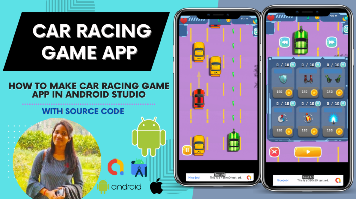

Cara membuat game balapan di Android? Mungkin kedengarannya rumit, kayak bikin pesawat ruang angkasa dari kardus bekas. Tapi tenang, sebenarnya nggak sesulit itu kok! Dari mendesain mobil balap kece sampai bikin alur cerita yang bikin nagih, kita akan bongkar semua rahasianya.

Siap-siap jadi developer game Android handal!

Artikel ini akan memandu kamu langkah demi langkah, mulai dari memilih engine game yang tepat, merancang gameplay yang seru, sampai mempublikasikan game kamu di Google Play Store. Kita akan bahas semua detailnya, dari pemrograman, desain grafis, hingga strategi pemasaran.

Jadi, siap-siap untuk berpetualang di dunia pengembangan game Android!

## Pembuatan Game Balap Android: Dari Nol Hingga Finish Line

Ngiler pengen bikin game balap Android sendiri? Eits, jangan cuma ngiler! Artikel ini bakal ngebantu kamu ngerti prosesnya, dari tahap awal sampai siap di-upload ke Google Play Store. Kita akan bahas tahapan pengembangan, bedanya game 2D dan 3D, engine game populer, dan bahkan contoh game sederhana yang bisa jadi inspirasi kamu.

### Tahapan Umum Pengembangan Game Balap Android

Membuat game, khususnya game balap, bukan cuma sekadar ide cemerlang. Butuh proses yang terstruktur dan rapi. Bayangkan seperti membangun rumah, butuh pondasi yang kuat dulu baru bisa bangun dinding, atap, dan akhirnya jadi rumah yang kokoh. Berikut tahapan umumnya:

1. **Konsep dan Perencanaan:**Tentukan genre balapan (arcade, simulasi, racing), platform (Android), fitur utama (single player, multiplayer, power-up), dan target audiens.

3. **Desain Game:**Buat desain level, karakter, kendaraan, UI/UX, dan mekanisme gameplay. Ini tahap krusial untuk memastikan game fun dan mudah dimainkan.

5. **Pemrograman:**Coding adalah jantung game. Kamu akan menulis kode untuk mengimplementasikan semua desain yang sudah dibuat. Ini bagian yang paling memakan waktu dan tenaga.

7. **Pengujian dan Debugging:**Temukan dan perbaiki bug (error) sebanyak mungkin. Testing menyeluruh sangat penting untuk memastikan game berjalan lancar dan bebas error.

9. **Pengoptimalan:**Buat game se-optimal mungkin agar berjalan lancar di berbagai perangkat Android. Ini termasuk mengoptimalkan grafis, ukuran file, dan performa.

11. **Peluncuran:**Setelah semua tahap selesai, kamu siap meluncurkan game ke Google Play Store!

### Perbedaan Game Balap 2D dan 3D

Perbedaan mendasar antara game balap 2D dan 3D terletak pada visual dan kompleksitasnya. Game 2D lebih sederhana, lebih mudah dikembangkan, dan membutuhkan resource yang lebih sedikit. Sedangkan game 3D menawarkan pengalaman yang lebih imersif dan realistis, tetapi membutuhkan resource yang jauh lebih besar dan kompleksitas pemrograman yang lebih tinggi.

- **Game 2D:**Lebih mudah dikembangkan, membutuhkan resource lebih sedikit, cocok untuk perangkat dengan spesifikasi rendah.

- **Game 3D:**Lebih realistis dan imersif, membutuhkan resource lebih besar, cocok untuk perangkat dengan spesifikasi tinggi.

### Engine Game Populer untuk Android

Engine game adalah software yang memudahkan proses pembuatan game. Banyak engine game yang bisa kamu pilih, masing-masing dengan kelebihan dan kekurangannya. Berikut beberapa yang populer:

| Nama Engine | Fitur Utama | Kelebihan | Kekurangan |
| --- | --- | --- | --- |
| Unity | Cross-platform, visual scripting, asset store yang luas | Mudah dipelajari, komunitas besar, banyak tutorial | File game bisa cukup besar, performa bisa kurang optimal di perangkat low-end |
| Unreal Engine | Grafis realistis, Blueprint visual scripting, performance tinggi | Grafis luar biasa, performa sangat baik | Kurva pembelajaran lebih curam, resource yang dibutuhkan lebih besar |
| GameMaker Studio 2 | Drag-and-drop interface, mudah dipelajari, cocok untuk 2D | Sangat mudah dipelajari, cocok untuk pemula, harga terjangkau | Kurang fleksibel untuk game 3D yang kompleks |

### Contoh Game Balap Sederhana

Bayangkan sebuah game balap 2D sederhana dengan latar belakang jalan raya yang lurus. Kendaraan pemain berupa mobil kotak sederhana dengan warna merah. Elemen gameplay-nya fokus pada akselerasi dan menghindari rintangan seperti mobil lain atau kerucut jalan. Grafisnya minimalis, tanpa detail yang rumit.

Skor didapatkan dari jarak tempuh dan waktu tempuh. Game ini bisa dikembangkan dengan GameMaker Studio 2, menawarkan pengalaman game yang sederhana namun tetap menyenangkan.

## Perancangan Game: Cara Membuat Game Balapan Di Android

Oke, jadi kamu udah mantap mau bikin game balap Android? Keren banget! Tapi sebelum mulai ngoding sana-sini, kita perlu rancang dulu game-nya biar nggak asal-asalan dan hasilnya bener-bener _epic_. Bayangin deh, kalau kamu langsung coding tanpa perencanaan matang, bakal kayak masak tanpa resep: hasilnya bisa jadi kacau balau!

Perancangan game ini penting banget, mirip kayak arsitek yang bikin _blueprint_sebelum bangun gedung. Dengan perencanaan yang detail, proses pembuatan game jadi lebih terarah, efisien, dan hasilnya sesuai harapan. Nggak cuma itu, perencanaan yang matang juga bisa mencegah kamu kehilangan semangat di tengah jalan karena terlalu banyak masalah yang muncul secara tiba-tiba.

### Latar dan Genre Game Balap

Pertama, tentukan dulu tema dan genre game balapmu. Mau bikin game balap jalan raya yang realistis, petualangan off-road yang menegangkan, atau game balap kart yang kocak dan penuh warna? Pilihan genre ini bakal mempengaruhi banyak aspek game, dari grafis sampai _gameplay_\-nya.

Misalnya, game balap jalan raya butuh grafis yang detail dan realistis, sementara game balap kart bisa lebih _cartoony_dan _fun_.

Setelah genre ditentukan, kembangkan alur cerita atau latar game yang menarik. Misalnya, untuk game balap jalan raya, kamu bisa bikin cerita tentang seorang pembalap muda yang berjuang untuk mencapai puncak karirnya. Atau untuk game balap kart, kamu bisa bikin cerita tentang perlombaan kart yang seru dan penuh persaingan di sebuah kerajaan ajaib.

### Fitur Inti Game Balap

Selanjutnya, tentukan fitur-fitur inti yang akan ada di game kamu. Fitur-fitur ini adalah hal-hal yang paling penting dan membedakan game kamu dari game balap lainnya. Jangan terlalu banyak fitur, fokus saja pada fitur-fitur utama yang benar-benar akan meningkatkan pengalaman bermain.

- Sistem peningkatan mobil: biar pemain bisa _upgrade_mobilnya dan jadi lebih kencang.

- Berbagai macam lintasan: supaya pemain nggak bosen.

- Sistem _multiplayer_: agar pemain bisa balapan dengan pemain lain secara _online_.

- Sistem pencapaian ( _achievement_): untuk memberikan motivasi kepada pemain.

### Alur Permainan (Gameplay) dan Mekanisme Kontrol

Ini bagian yang krusial! Kamu harus merancang alur permainan ( _gameplay_) secara detail, termasuk mekanisme kontrolnya. Gimana cara pemain mengendalikan mobilnya? Apakah menggunakan _touchscreen_, _tilt control_, atau kombinasi keduanya? Sistem skor juga perlu dipikirkan matang-matang.

Gimana cara pemain mendapatkan poin? Apa saja reward yang bisa didapatkan?

Contohnya, kamu bisa menggunakan sistem skor berbasis waktu, dimana pemain mendapatkan poin lebih banyak jika menyelesaikan balapan dalam waktu yang singkat. Atau, kamu bisa menambahkan sistem poin berbasis jumlah lawan yang dikalahkan. Jangan lupa juga untuk mempertimbangkan _difficulty level_agar game-mu tetap menantang dan menyenangkan bagi semua pemain.

### Desain Level Contoh

Sebagai contoh, bayangkan sebuah level di game balap off-road. Level ini berlatar di sebuah hutan hujan tropis yang lebat. Lintasannya berkelok-kelok, dengan banyak sekali rintangan seperti batang pohon tumbang, lubang besar, dan sungai yang deras arusnya.

Elemen interaktifnya bisa berupa batu-batu besar yang bisa didorong untuk menghalangi lawan, atau jembatan kayu yang rapuh yang bisa runtuh jika dilalui terlalu cepat.

Lingkungannya dibuat detail, dengan suara-suara alam seperti kicauan burung dan suara serangga yang menambah suasana mencekam. Pemain harus pintar-pintar mengendalikan mobilnya agar bisa melewati semua rintangan dan mencapai garis finish. Tantangannya bukan hanya kecepatan, tapi juga strategi dan kemampuan beradaptasi dengan kondisi lintasan yang sulit.

## Pemrograman Game Balap Android

Nah, setelah desain game balapmu udah cetar membahana, saatnya masuk ke tahap yang lebih menantang: pemrograman! Ini bagian di mana imajinasimu berubah jadi kode-kode ajaib yang bikin game-mu hidup di layar smartphone. Jangan khawatir, meskipun kedengerannya rumit, kita bakal bahas langkah-langkahnya dengan cara yang mudah dipahami, bahkan buat kamu yang masih newbie di dunia coding.

### Langkah-Langkah Pemrograman Game Balap

Pemrograman game balap Android umumnya menggunakan bahasa Kotlin atau Java. Kotlin lebih modern dan ringkas, tapi Java masih banyak digunakan. Pilih salah satu, dan fokus dalami konsep dasarnya. Berikut beberapa langkah kunci yang perlu kamu kuasai:

1. **Setup Environment:**Persiapkan perangkat lunak yang dibutuhkan, seperti Android Studio (IDE), SDK, dan tentu saja, pilih bahasa pemrograman (Kotlin atau Java).

3. **Desain Struktur Game:**Buatlah blueprint game-mu. Tentukan kelas-kelas yang dibutuhkan (misalnya, kelas untuk mobil, jalan, musuh, dan sistem poin). Pikirkan alur logika game-mu secara detail. Ini akan memudahkan proses coding.

5. **Implementasi Game Loop:**Game loop adalah jantung dari game. Ini adalah proses berulang yang terus menerus memperbarui tampilan game dan memproses input pengguna. Kamu akan menggunakan loop ini untuk mengontrol pergerakan mobil, deteksi tabrakan, dan update skor.

7. **Rendering Grafis:**Gunakan library grafis seperti OpenGL ES atau Android's Canvas untuk menampilkan elemen-elemen game di layar, seperti mobil, jalan, dan background. Kamu perlu mengatur posisi dan animasi objek-objek ini.

9. **Testing dan Debugging:**Setelah coding, uji terus menerus game-mu. Identifikasi bug dan perbaiki. Proses testing sangat penting untuk memastikan game berjalan lancar dan bebas dari error.

### Implementasi Mekanisme Kontrol

Agar game balapmu asyik dimainkan, mekanisme kontrol harus responsif dan intuitif. Berikut cara mengimplementasikan kontrol sentuhan dan accelerometer:

- **Kontrol Sentuhan:**Gunakan `MotionEvent`untuk mendeteksi sentuhan pengguna pada layar. Misalnya, sentuhan di sebelah kiri layar bisa untuk membelok ke kiri, dan sentuhan di sebelah kanan untuk membelok ke kanan. Kamu bisa menggunakan `GestureDetector`untuk memudahkan deteksi gesture yang lebih kompleks.
    

- **Accelerometer:**Gunakan sensor accelerometer untuk mendeteksi kemiringan perangkat. Kemiringan perangkat bisa dipetakan ke arah pergerakan mobil. Ini akan memberikan pengalaman bermain yang lebih realistis dan imersif.

### Contoh Kode Pergerakan Mobil

Berikut contoh sederhana kode Kotlin untuk menampilkan mobil yang bergerak di layar (ini contoh sederhana, perlu adaptasi dengan game engine yang kamu gunakan):

`// Contoh sederhana, perlu adaptasi dengan konteks game yang lebih kompleks.val mobil = Bitmap.createScaledBitmap(BitmapFactory.decodeResource(resources, R.drawable.mobil), 100, 100, false)var posisiX = 100override fun onDraw(canvas: Canvas) super.onDraw(canvas) canvas.drawBitmap(mobil, posisiX.toFloat(), 100f, null) posisiX += 5 // Gerakkan mobil ke kanan invalidate() // Panggil ulang onDraw untuk update tampilan`

### Menambahkan Efek Suara dan Musik

Efek suara dan musik bisa meningkatkan pengalaman bermain game balapmu. Gunakan library seperti Android's MediaPlayer atau SoundPool untuk memutar suara dan musik. Kamu bisa menambahkan efek suara untuk tabrakan, akselerasi, dan poin yang didapatkan. Untuk musik latar, pilih musik yang energik dan sesuai dengan tema game-mu.

### Implementasi Sistem Koin atau Reward

Sistem koin atau reward akan membuat game lebih menarik dan menantang. Kamu bisa memberikan koin kepada pemain ketika mereka menyelesaikan level atau mencapai target tertentu. Koin ini bisa digunakan untuk membeli item dalam game, seperti mobil baru atau peningkatan performa mobil.

Kamu bisa menyimpan data koin pemain menggunakan SharedPreferences atau database lokal.

## Pengujian dan Perilisan

Nah, game balapan Android kamu udah jadi? Jangan langsung girang dulu! Masih ada satu tahapan penting yang sering disepelekan, yaitu pengujian dan perilisan. Tahapan ini krusial banget buat memastikan game kamu lancar jaya di tangan para gamer dan nggak bikin mereka frustasi karena bug yang bertebaran.

Bayangin aja, game kamu sekeren apapun, tapi kalau penuh bug, ya bakal ditinggalin. Makanya, mari kita bahas langkah-langkahnya!

### Langkah-Langkah Pengujian Game yang Efektif

Pengujian game itu kayak quality control makanan di restoran bintang lima. Detail banget! Tujuannya cuma satu: mencari dan membasmi bug sedini mungkin. Jangan sampai bug-bug itu baru ketahuan setelah game dirilis dan merusak reputasi game kamu.

Berikut beberapa langkah efektifnya:

1. **Testing Internal:**Libatkan tim developer untuk melakukan pengujian awal. Fokus pada alur game, mekanisme kontrol, dan fitur utama. Ini tahap awal untuk mendeteksi bug besar.

3. **Alpha Testing:**Berikan akses game ke sekelompok kecil tester yang dipilih. Mereka akan memberikan feedback yang lebih objektif dan mendeteksi bug yang mungkin terlewatkan oleh tim developer.

5. **Beta Testing:**Perluas jangkauan pengujian ke kelompok tester yang lebih besar. Ini akan memberikan gambaran yang lebih komprehensif tentang performa game di berbagai perangkat dan jaringan.

7. **Pengujian Performa:**Ukur FPS (Frame Per Second), latensi, dan penggunaan baterai. Pastikan game kamu berjalan lancar di berbagai perangkat Android dengan spesifikasi yang berbeda.

9. **Pengujian Kompatibilitas:**Pastikan game kamu kompatibel dengan berbagai versi Android dan resolusi layar.

### Platform Testing yang Sesuai

Nggak cukup cuma mengandalkan satu perangkat untuk testing. Kamu perlu platform testing yang beragam untuk memastikan game kamu kompatibel dan performanya optimal di berbagai perangkat. Beberapa pilihannya adalah:

- **Perangkat Fisik:**Testing di perangkat fisik penting banget untuk mendapatkan hasil yang akurat. Pilih beberapa perangkat dengan spesifikasi berbeda (low-end, mid-range, dan high-end).

- **Emulator dan Simulator:**Sebagai pelengkap testing di perangkat fisik, emulator dan simulator bisa membantu menguji kompatibilitas di berbagai versi Android dan resolusi layar.

- **Platform Testing Cloud:**Platform ini menawarkan akses ke beragam perangkat virtual untuk pengujian otomatis dan skala besar.

### Checklist Sebelum Merilis Game

Sebelum menekan tombol "publish", pastikan kamu sudah melakukan checklist ini. Ini seperti memastikan semua peralatan panjat tebing terpasang dengan benar sebelum mendaki gunung Everest. Jangan sampai ada yang terlewat!

| Item | Status |
| --- | --- |
| Semua bug kritis telah diperbaiki | √ |
| Game telah diuji di berbagai perangkat | √ |
| Deskripsi game dan screenshot menarik | √ |
| Icon game yang eye-catching | √ |
| Strategi pemasaran telah disiapkan | √ |
| Harga game telah ditentukan | √ |

### Proses Publikasi di Google Play Store

Google Play Store adalah pintu gerbang utama untuk game Android. Proses publikasinya cukup mudah, tapi perlu ketelitian. Kamu perlu menyiapkan beberapa hal, seperti:

1. **Akun Developer:**Buat akun developer di Google Play Console.

3. **APK yang dioptimalkan:**Pastikan APK game kamu sudah dioptimalkan untuk ukuran dan performa.

5. **Informasi Game:**Isi semua informasi game secara lengkap dan akurat, termasuk deskripsi, screenshot, dan video.

7. **Pengujian Internal:**Lakukan pengujian internal di Google Play Console sebelum merilis game.

9. **Review dan Publikasi:**Setelah semua siap, submit game kamu untuk review dan tunggu hingga game kamu dipublikasikan.

### Strategi Pemasaran Game Android

Game kamu udah launching, tapi nggak ada yang main? Sayang banget, kan? Strategi pemasaran penting banget untuk menarik perhatian gamer. Berikut beberapa tipsnya:

- **Social Media Marketing:**Manfaatkan media sosial untuk mempromosikan game kamu. Buat konten menarik dan berinteraksi dengan gamer.

- **Influencer Marketing:**Kerjasama dengan influencer game untuk mempromosikan game kamu.

- **Paid Advertising:**Gunakan iklan berbayar di Google Ads atau platform iklan lainnya.

- **Community Building:**Bangun komunitas gamer di sekitar game kamu.

- **Public Relations:**Hubungi media game untuk meliput game kamu.

## Aspek Grafis dan Desain

Ngomongin bikin game balap di Android, grafis dan desain itu kayak bumbu rahasia yang bikin game-mu nagih dimainkan. Bayangin deh, game balap yang grafisnya jelek, mobilnya kotak-kotak, dan UI-nya ribet? Pasti langsung di-uninstall, kan? Nah, makanya, kita bahas tuntas gimana caranya bikin tampilan game balapmu kece badai!

### Pentingnya Aset Grafis Berkualitas Tinggi dalam Game Balap

Aset grafis berkualitas tinggi adalah kunci utama kesuksesan game balap. Bayangkan kamu lagi main game balap dengan mobil-mobil yang detailnya luar biasa, lintasan yang realistis, dan efek visual yang memukau. Rasanya beda banget, kan, dibanding main game balap dengan grafis yang burik dan sederhana?

Resolusi tinggi, tekstur yang detail, pencahayaan yang natural, dan efek partikel yang halus akan memberikan pengalaman bermain yang lebih imersif dan menyenangkan. Ini akan membuat pemain betah berlama-lama memainkan game-mu.

### Contoh Desain Mobil Balap yang Menarik dan Detail, Cara membuat game balapan di android

Desain mobil balap yang menarik itu perlu diperhatikan detailnya. Jangan cuma asal bikin mobil yang bentuknya kotak-kotak! Contohnya, kamu bisa mendesain mobil balap dengan bodi yang aerodinamis, spoiler yang menawan, dan detail-detail kecil seperti logo sponsor dan nomor balap yang jelas.

Bayangkan sebuah mobil sport klasik dengan cat metalik yang berkilauan, ditambah detail lampu depan yang tajam dan velg yang sporty. Atau mungkin mobil balap futuristik dengan desain yang unik dan warna-warna yang berani. Detail kecil seperti ini akan membuat mobil balapmu terlihat lebih hidup dan menarik.

### Tampilan Antarmuka Pengguna (UI) yang Intuitif dan Mudah Digunakan

UI yang intuitif dan mudah digunakan itu penting banget. Pemain nggak mau ribet, kan? Tampilan menu utama harus sederhana, jelas, dan mudah dipahami. Tombol-tombol kontrol harus responsif dan mudah diakses. Gunakan font yang mudah dibaca dan warna yang kontras agar informasi penting mudah terlihat.

Hindari terlalu banyak elemen visual yang mengganggu. UI yang bersih dan sederhana akan membuat pemain lebih fokus pada gameplay.

### Contoh Tampilan Menu Utama Game yang Informatif dan Menarik

Menu utama bisa menampilkan berbagai informasi penting, seperti profil pemain, pilihan mode permainan, pengaturan game, dan leaderboard. Gunakan gambar latar belakang yang menarik dan relevan dengan tema game. Tata letak menu harus rapi dan terorganisir dengan baik. Contohnya, kamu bisa menampilkan gambar mobil balap unggulan di bagian tengah menu utama, dengan tombol-tombol pilihan mode permainan di sekitarnya.

Informasi penting seperti skor tertinggi dan achievement pemain juga bisa ditampilkan dengan jelas dan mudah diakses.

### Panduan Singkat Pemilihan Palet Warna yang Tepat untuk Game

Pemilihan palet warna itu krusial untuk membangun suasana dan mood game. Warna yang cerah dan berani bisa menciptakan kesan yang energik dan menyenangkan, sementara warna yang gelap dan misterius bisa menciptakan suasana yang lebih serius dan menegangkan. Perhatikan kontras warna agar elemen-elemen penting dalam game mudah terlihat.

Jangan menggunakan terlalu banyak warna yang saling bertabrakan, karena bisa membuat mata pemain cepat lelah. Sebagai contoh, untuk game balap yang bertemakan kecepatan, kamu bisa menggunakan palet warna yang terdiri dari biru, merah, dan putih, yang melambangkan kecepatan, energi, dan kebersihan.

## Ulasan Penutup

Membuat game balapan Android memang butuh usaha ekstra, tapi hasilnya? Puas banget! Bayangkan game buatanmu sendiri diunduh ribuan orang. Dari proses belajar memilih engine yang tepat, merancang gameplay yang unik, sampai merasakan euforia game yang berhasil dirilis, semua itu akan jadi pengalaman tak terlupakan.

Jadi, jangan ragu untuk memulai petualanganmu di dunia pengembangan game!

## Informasi Penting & FAQ

**Apa perbedaan utama antara game balap 2D dan 3D?**

Game 2D lebih sederhana dan mudah dikembangkan, sementara game 3D menawarkan visual yang lebih realistis dan kompleks, namun membutuhkan sumber daya yang lebih besar.

**Bahasa pemrograman apa yang paling cocok untuk pemula?**

Kotlin dan Java adalah pilihan yang baik, Kotlin relatif lebih mudah dipelajari.

**Berapa biaya yang dibutuhkan untuk membuat game balap Android?**

Tergantung kompleksitas game, mulai dari gratis (menggunakan engine gratis) hingga jutaan rupiah (tergantung aset, tim, dan fitur).

**Bagaimana cara mendapatkan aset grafis untuk game?**

Bisa membuat sendiri, membeli dari marketplace aset, atau menggunakan aset gratis yang tersedia online (perhatikan lisensinya).
