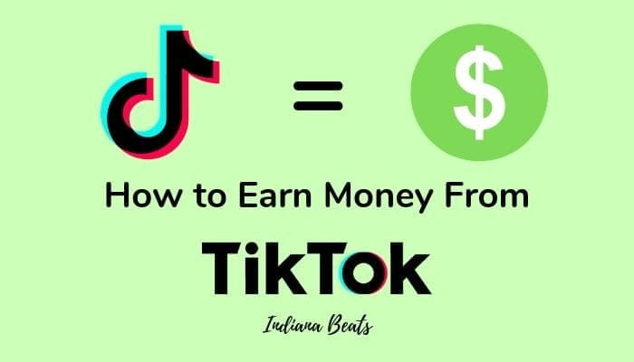

**Cara mendapatkan uang dari tiktok dengan menonton video** - Siapa bilang cuma bisa dapat uang dari TikTok kalau kamu punya banyak follower? Nah, ini dia rahasia yang belum banyak orang tahu: kamu bisa dapat uang dari TikTok hanya dengan menonton video! Nggak percaya?

Simak aja dulu, siapa tahu kamu bisa jadi pemain TikTok yang tajir tanpa perlu repot-repot bikin konten.

Gimana caranya? Tenang, kita akan bahas lengkap dari memahami cara kerja TikTok, membangun audiens yang loyal, meningkatkan jumlah penonton video, mengoperasikan akun TikTok yang optimal, sampai menciptakan strategi monetisasi yang jitu.

Siap-siap raih cuan dari kegemaran menonton video di TikTok, yuk!

## Memahami Cara Kerja TikTok

TikTok adalah platform media sosial yang memungkinkan pengguna untuk membuat dan berbagi video pendek. Platform ini telah menjadi sangat populer di seluruh dunia, dan banyak orang mulai menggunakannya sebagai cara untuk menghasilkan uang. Jika kamu penasaran bagaimana TikTok bisa menghasilkan uang dari video yang ditonton, simak penjelasan berikut!

Siapa sangka, sekarang kamu bisa dapat cuan hanya dengan nonton video di TikTok? Yap, salah satu caranya adalah dengan bergabung di platform yang memberikan reward berupa uang tunai. Biasanya, platform ini akan meminta akses ke Google Drive kamu, yang fungsinya untuk menyimpan data dan progress kamu di platform tersebut.

Nah, kalau kamu masih bingung cara ngasih akses Google Drive, kamu bisa baca panduan lengkapnya di [Cara Mengizinkan Akses Google Drive: Panduan Lengkap untuk Pengguna](https://ajiekusumadhany.com/cara-mengizinkan-akses-google-drive/). Setelah itu, kamu tinggal santai nonton video, selesaikan misi, dan kumpulkan poin yang bisa ditukar dengan uang.

Lumayan kan, sambil nonton TikTok bisa dapat duit!

TikTok menghasilkan uang dari video yang ditonton melalui berbagai cara. Salah satu cara yang paling umum adalah melalui iklan. TikTok menampilkan iklan kepada pengguna yang menonton video, dan mereka mendapatkan uang setiap kali iklan ditonton. Selain itu, TikTok juga memiliki program monetisasi yang memungkinkan kreator untuk menghasilkan uang dari video mereka.

Program ini bekerja dengan memberi kreator bagian dari pendapatan yang dihasilkan dari iklan yang ditayangkan di video mereka.

### Metode Monetisasi TikTok

TikTok menawarkan beberapa metode monetisasi yang dapat digunakan kreator untuk menghasilkan uang dari konten mereka. Berikut perbandingan beberapa metode tersebut:

| Metode Monetisasi | Cara Kerja | Keuntungan | Kekurangan |
| --- | --- | --- | --- |
| Program Creator Fund | TikTok memberikan pembayaran kepada kreator yang memenuhi syarat berdasarkan jumlah tayangan dan keterlibatan di video mereka. | Program ini mudah diakses dan tidak memerlukan sponsor atau hadiah langsung. | Pembayaran relatif kecil dan tidak dijamin, tergantung pada kinerja video. |
| Hadiah Langsung | Pengguna dapat memberikan hadiah virtual kepada kreator selama siaran langsung, yang kemudian dapat ditukar dengan uang tunai. | Potensi pendapatan yang tinggi, interaksi langsung dengan penggemar. | Membutuhkan interaksi langsung dengan penonton dan bergantung pada popularitas kreator. |
| Sponsor | Kreator bekerja sama dengan merek untuk mempromosikan produk atau layanan mereka dalam video mereka. | Potensi pendapatan yang tinggi, kesempatan untuk bekerja sama dengan merek ternama. | Membutuhkan audiens yang besar dan kredibilitas yang kuat, serta kemampuan untuk menghasilkan konten yang menarik dan relevan. |

### Contoh Strategi Monetisasi Populer di TikTok

Beberapa strategi monetisasi populer di TikTok meliputi:

- **Menjalankan siaran langsung dan menerima hadiah langsung**: Kreator dapat melakukan siaran langsung dan menerima hadiah virtual dari penonton. Hadiah ini kemudian dapat ditukar dengan uang tunai. Strategi ini efektif karena memungkinkan interaksi langsung dengan penonton dan potensi pendapatan yang tinggi.
- **Bekerja sama dengan merek untuk sponsor**: Kreator dapat bekerja sama dengan merek untuk mempromosikan produk atau layanan mereka dalam video mereka. Misalnya, seorang kreator yang fokus pada kecantikan dapat bekerja sama dengan merek kosmetik untuk meninjau produk mereka. Strategi ini menguntungkan karena potensi pendapatan yang tinggi dan kesempatan untuk bekerja sama dengan merek ternama.
    

- **Membangun audiens yang besar dan aktif**: Kreator dapat fokus untuk membangun audiens yang besar dan aktif dengan membuat konten yang menarik dan relevan. Semakin banyak penonton yang mereka miliki, semakin banyak potensi pendapatan mereka dari iklan dan sponsor.

## Membangun Audiens yang Loyal

Bayangin deh, kamu punya konten TikTok keren abis, tapi yang nonton cuma segelintir orang. Nggak ada yang komen, nggak ada yang like, bahkan nggak ada yang nge-share. Duh, sedih banget kan? Nah, di sini pentingnya membangun audiens yang loyal. Mereka yang bakal setia ngelihat konten kamu, nge-like, nge-komen, dan nge-share ke temen-temen mereka.

Dengan audiens yang loyal, konten kamu bakal makin viral, dan otomatis, potensi kamu buat dapet cuan juga makin besar!

### Tips Membangun Audiens yang Loyal

Nah, gimana caranya membangun audiens yang loyal? Gampang kok! Berikut beberapa tips yang bisa kamu coba:

- **Buat Konten yang Konsisten:**Kalo kamu pengen orang setia ngelihat konten kamu, kamu harus konsisten nge-upload konten. Mulai dari jadwal upload yang teratur, sampe tema konten yang spesifik dan menarik. Kalo konten kamu nggak konsisten, orang bakal lupa sama kamu dan malah kepo sama konten creator lain.
    
- **Berinteraksi dengan Followers:**Jangan cuma upload konten terus, tapi juga luangin waktu buat ngobrol sama followers kamu. Balas komen mereka, jawab pertanyaan mereka, dan bahkan bikin Q&A session. Dengan interaksi yang aktif, followers kamu bakal merasa dihargai dan makin betah ngikutin konten kamu.
    
- **Gunakan Hashtag yang Relevan:**Hashtag penting banget buat konten kamu diliat banyak orang. Pastiin kamu pake hashtag yang relevan sama konten kamu, dan jangan lupa buat ngeliat hashtag apa yang lagi trend di TikTok. Semakin banyak orang yang ngeliat konten kamu, semakin besar peluang buat dapet followers yang loyal.
    
- **Buat Konten yang Viral:**Ini sih impian semua creator. Kalo konten kamu viral, otomatis followers kamu bakal nambah pesat. Tapi, gimana caranya bikin konten viral? Rahasianya adalah buat konten yang unik, menarik, dan relate sama banyak orang. Kamu bisa coba ngikutin trend yang lagi hits, atau bikin konten yang nge-challenge followers kamu.
    
    Tapi, jangan lupa buat tetap konsisten sama konten kamu, ya!
    

### Jenis Konten TikTok yang Populer, Cara mendapatkan uang dari tiktok dengan menonton video

Nah, buat dapet ide konten yang viral, kamu bisa ngeliat nih jenis konten TikTok yang paling populer:

| Jenis Konten | Tips |
| --- | --- |
| Dance Challenge | Ikut trend dance challenge yang lagi hits, atau ciptain dance challenge kamu sendiri. Jangan lupa buat ajak followers kamu ikutan challenge kamu, ya! |
| Comedy Skit | Buat sketsa komedi yang lucu dan relate sama kehidupan sehari-hari. Kalo kamu punya bakat ngelawak, jangan ragu buat nunjukinnya di TikTok. |
| Educational Content | Buat konten yang edukatif dan bermanfaat. Kamu bisa ngebahas tentang topik apapun, mulai dari tutorial make-up sampe tips investasi. Yang penting, konten kamu bisa ngasih manfaat buat followers kamu. |
| Life Hacks | Bagikan tips dan trik yang berguna buat kehidupan sehari-hari. Contohnya, cara bikin makanan praktis, cara ngebersihin rumah dengan cepat, atau cara ngatur keuangan. |
| Music Content | Buat konten yang bertema musik. Kamu bisa nyanyi, nge-lip sync, atau bikin konten yang nge-highlight lagu-lagu yang lagi hits. |

## Meningkatkan Penonton Video

Nah, setelah kamu sukses mendapatkan penghasilan dari TikTok dengan menonton video, tentu kamu ingin memaksimalkan potensi penghasilanmu, kan? Salah satu caranya adalah dengan meningkatkan jumlah penonton video yang kamu tonton. Semakin banyak video yang kamu tonton, semakin banyak kesempatan kamu mendapatkan penghasilan.

Tenang, meningkatkan jumlah penonton video TikTok nggak sesulit yang kamu bayangkan. Ada beberapa trik jitu yang bisa kamu terapkan, lho. Yuk, simak tips dan triknya!

### Strategi Promosi Konten TikTok

Strategi promosi konten TikTok penting banget untuk menarik perhatian pengguna lain dan meningkatkan jumlah penonton video kamu. Berikut beberapa strategi yang bisa kamu terapkan:

| Strategi | Penjelasan | Contoh |
| --- | --- | --- |
| Hashtag | Gunakan hashtag yang relevan dengan konten video kamu untuk memudahkan pengguna lain menemukan video kamu. | #tiktok #foryou #fyp #comedy #music #dance #travel #food #beauty #fashion |
| Kolaborasi | Kerjasama dengan pengguna TikTok lain untuk mempromosikan video kamu secara silang. | Berkolaborasi dengan influencer atau pengguna TikTok yang memiliki niche yang sama dengan kamu. |
| Tantangan | Ikut serta dalam tantangan TikTok yang sedang viral untuk meningkatkan visibilitas video kamu. | Tantangan #dancechallenge, #cookingchallenge, #makeupchallenge. |

### Memahami Algoritma TikTok

Algoritma TikTok adalah sistem yang menentukan video mana yang akan ditampilkan di halaman "For You" pengguna. Untuk memaksimalkan algoritma TikTok, kamu perlu memahami bagaimana algoritma ini bekerja.

Siapa sangka, cuma nonton video di TikTok bisa menghasilkan uang? Yap, lewat program TikTok Creator Fund, kamu bisa dibayar untuk menonton video, dan bahkan mendapatkan penghasilan tambahan dengan membagikan kontenmu sendiri. Tapi, kalau kamu mau investasi jangka panjang yang lebih serius, coba deh intip [4 Keuntungan Membeli Saham di Luar Negeri Yuk Simak!](https://ajiekusumadhany.com/keuntungan-membeli-saham-di-luar-negeri/).

Siapa tahu, investasi saham bisa jadi ladang cuan yang lebih besar dari TikTok Creator Fund. Lagipula, TikTok Creator Fund punya batasan, sementara saham punya potensi untuk terus bertumbuh seiring berjalannya waktu.

Algoritma TikTok mempertimbangkan beberapa faktor, seperti:

- **Interaksi pengguna:**Semakin banyak pengguna yang menyukai, berkomentar, dan membagikan video kamu, semakin tinggi kemungkinan video kamu akan ditampilkan di halaman "For You".

- **Durasi menonton:**Algoritma TikTok mencatat berapa lama pengguna menonton video kamu. Semakin lama pengguna menonton video kamu, semakin tinggi kemungkinan video kamu akan ditampilkan di halaman "For You".

- **Frekuensi menonton:**Algoritma TikTok mencatat seberapa sering pengguna menonton video kamu. Semakin sering pengguna menonton video kamu, semakin tinggi kemungkinan video kamu akan ditampilkan di halaman "For You".

- **Relevansi konten:**Algoritma TikTok mencocokkan konten video kamu dengan minat pengguna. Semakin relevan konten video kamu dengan minat pengguna, semakin tinggi kemungkinan video kamu akan ditampilkan di halaman "For You".

Dengan memahami bagaimana algoritma TikTok bekerja, kamu bisa meningkatkan peluang video kamu untuk ditampilkan di halaman "For You" dan mendapatkan lebih banyak penonton.

## Mengoptimalkan Akun TikTok: Cara Mendapatkan Uang Dari Tiktok Dengan Menonton Video

Oke, kamu udah siap nonton video TikTok dan dapet duit? Tapi sebelum ngegas, ada satu hal penting yang perlu kamu perhatikan: akun TikTok kamu sendiri. Biar duit ngalir deras, akun TikTok kamu harus keren dan menarik perhatian. Bayangin, kamu punya toko online tapi tokonya kumuh dan gak tertata, siapa yang mau belanja?

Sama halnya dengan akun TikTok, kalau gak menarik, siapa yang mau ngelihatin konten kamu?

### Maksimalkan Profil TikTok

Profil TikTok kamu adalah etalase pertama yang dilihat orang. Jadi, bikin profil yang menarik dan profesional biar orang penasaran dan pengen ngecek konten kamu. Bayangin kamu lagi jalan-jalan di mall, terus ngelihat toko yang etalasenya berantakan dan gelap, kamu bakal tertarik masuk?

Pasti enggak, kan? Sama halnya dengan akun TikTok.

- **Bio yang Menarik:**Gunakan bio yang singkat, jelas, dan menarik. Tulis tentang siapa kamu, apa yang kamu tawarkan, dan apa yang bikin orang pengen ngikutin akun kamu. Jangan lupa sisipkan emoji biar lebih hidup. Misalnya, "Penggemar kuliner dan suka nge-review makanan enak di Jakarta.
    
    Follow aku untuk rekomendasi kuliner terbaik!"
    

- **Gambar Profil yang Profesional:**Pilih foto profil yang jelas, berkualitas, dan mewakili diri kamu. Jangan asal pilih foto, ya! Foto kamu harus bikin orang penasaran dan pengen tahu lebih banyak tentang kamu.

### Manfaatkan Fitur TikTok

TikTok punya banyak fitur yang bisa kamu manfaatkan buat nambahin visibilitas dan engagement akun kamu. Jangan sampai kamu gak ngerti fitur-fiturnya, kan sayang banget!

| Fitur | Kegunaan |
| --- | --- |
| **Hashtags** | Gunakan hashtags yang relevan dengan konten kamu dan trending. Hashtags membantu orang menemukan konten kamu dengan mudah. Misalnya, kalau kamu nge-review makanan, gunakan hashtags #makanenak, #kulinerjakarta, #foodlover, dan lain sebagainya. |
| **Duet** | Fitur ini memungkinkan kamu untuk membuat video bersama orang lain. Duet bisa jadi cara yang seru buat kolaborasi dan menjangkau audiens baru. |
| **Stitch** | Mirip dengan Duet, Stitch memungkinkan kamu untuk menggunakan bagian dari video orang lain untuk membuat video baru. |
| **Live** | Fitur Live memungkinkan kamu untuk berinteraksi langsung dengan followers. Manfaatkan fitur ini untuk ngobrol, tanya jawab, dan ngasih update terbaru. |

## Membangun Strategi Monetisasi

Nah, sekarang kita udah ngerti cara dapet duit dari TikTok dengan nonton video. Tapi, gimana sih caranya biar makin cuan? Nah, ini dia kunci utamanya: strategi monetisasi. Pikirkan TikTok sebagai ladang bisnis yang luas, dan strategi monetisasi ini kayak peta yang bakal ngebantu lo ngejalanin bisnis di sana.

### Mengenal Berbagai Strategi Monetisasi di TikTok

TikTok punya beberapa strategi monetisasi yang bisa lo manfaatkan, mulai dari yang simpel sampe yang agak kompleks. Semuanya punya potensi buat ngehasilin cuan, tinggal lo pilih mana yang paling cocok sama konten dan gaya lo.

- **TikTok Creator Fund:**Ini adalah program monetisasi yang paling umum di TikTok. Lo bisa dapet duit dari jumlah views, likes, dan engagement konten lo. Semakin banyak orang yang nonton, like, dan interaksi sama video lo, makin banyak juga duit yang lo dapet.
    
    Siapa sangka, sekarang kamu bisa dapat cuan cuma dengan nonton video di TikTok? Yup, platform ini udah berkembang banget, bahkan jadi bagian dari [Revolusi Digital: 5 Teknologi yang Mengubah Cara Kita Hidup](https://ajiekusumadhany.com/revolusi-digital-teknologi-mengubah-cara-hidup/) yang mengubah cara kita berinteraksi dan menghasilkan uang.
    
    Salah satu caranya adalah dengan memanfaatkan program TikTok Creator Fund. Jadi, kamu bisa dibayar berdasarkan jumlah penonton dan interaksi yang kamu hasilkan di video yang kamu tonton. Seru kan?
    

- **TikTok Creator Marketplace:**Program ini ngebantu lo buat ngehubungin diri sama brand dan agency buat kolaborasi konten. Lo bisa dapet duit dari pembuatan konten yang di-sponsor, nge-review produk, atau ngiklanin produk tertentu.

- **Live Shopping:**Fitur ini ngebantu lo jual produk langsung di TikTok. Lo bisa nge-host live streaming dan nunjukin produk yang lo jual, sambil ngejawab pertanyaan dari penonton. Fitur ini cocok buat lo yang punya bisnis online atau mau ngejual produk sendiri.
- **Affiliate Marketing:**Lo bisa dapet komisi dari penjualan produk yang lo promosikan di video lo. Caranya, lo tinggal gabung sama program affiliate marketing dan dapet link khusus untuk produk yang lo promosikan. Setiap kali ada orang yang beli produk lewat link lo, lo bakal dapet komisi.
    

- **Monetisasi Lewat Fan Club:**Fitur ini ngebantu lo ngehubungin diri sama fans dan nge-build komunitas yang kuat. Lo bisa nge-charge biaya berlangganan bulanan buat fans yang mau akses konten eksklusif, live streaming, dan fitur-fitur khusus lainnya.

### Contoh Strategi Monetisasi yang Sukses

Gak percaya? Nih, contoh nyata dari pengguna TikTok yang sukses nge-monetisasi akun mereka:

- **@charlidamelio:**Charlie D'Amelio, salah satu TikToker paling populer di dunia, sukses nge-monetisasi akunnya lewat Creator Fund, TikTok Creator Marketplace, dan kolaborasi brand. Dia juga punya Fan Club yang ngasih akses eksklusif buat fans.

- **@khaby.lame:**Khaby Lame, TikToker asal Senegal yang terkenal dengan video-video lucu dan sederhana, sukses nge-monetisasi akunnya lewat Creator Fund, TikTok Creator Marketplace, dan kolaborasi brand. Dia juga punya Fan Club yang ngasih akses eksklusif buat fans.

### Memahami Persyaratan dan Keuntungan Setiap Metode Monetisasi

Nah, biar lo makin paham, nih tabel yang ngebahas persyaratan dan keuntungan dari setiap metode monetisasi TikTok:

| Metode Monetisasi | Persyaratan | Keuntungan |
| --- | --- | --- |
| TikTok Creator Fund | Memiliki akun TikTok dengan jumlah follower minimal 10.000 dan memiliki konten yang memenuhi syarat | Dapat menghasilkan pendapatan dari views, likes, dan engagement konten |
| TikTok Creator Marketplace | Memiliki akun TikTok dengan jumlah follower minimal 1.000 dan memiliki konten yang relevan dengan brand | Dapat berkolaborasi dengan brand dan agency untuk membuat konten sponsor |
| Live Shopping | Memiliki akun TikTok dengan jumlah follower minimal 1.000 dan memiliki produk yang ingin dijual | Dapat menjual produk langsung di TikTok dan mendapatkan keuntungan dari penjualan |
| Affiliate Marketing | Memiliki akun TikTok dengan jumlah follower minimal 1.000 dan memiliki konten yang relevan dengan produk yang dipromosikan | Dapat mendapatkan komisi dari penjualan produk yang dipromosikan |
| Monetisasi Lewat Fan Club | Memiliki akun TikTok dengan jumlah follower minimal 10.000 dan memiliki konten yang menarik bagi fans | Dapat membangun komunitas yang kuat dan mendapatkan pendapatan dari biaya berlangganan bulanan |

<iframe style="position: absolute; top: 0; left: 0; width: 100%; height: 100%;" title="UPLOAD VIDEO TIKTOK DIBAYAR PER VIEWS, BANYAK EVENT MENARIK, CARA DAPAT UANG DARI TIKTOK" frameborder="0" allow="accelerometer; autoplay; clipboard-write; encrypted-media; gyroscope; picture-in-picture; web-share" allowfullscreen src="https://www.youtube.com/embed/a9rzOgqHTiA?feature=oembed"></iframe>

## Ringkasan Akhir

Nah, sudah tahu kan rahasia mendapatkan uang dari TikTok hanya dengan menonton video? Nggak usah pusing lagi mau buat konten apa, yang penting fokus bangun audiens yang loyal, tingkatkan penonton video kamu, dan pilih strategi monetisasi yang tepat.

Yuk, maksimalkan pengalaman menonton video di TikTok dan raih cuan yang menjanjikan!

## Pertanyaan Umum (FAQ)

**Apakah saya harus memiliki banyak follower untuk mendapatkan uang dari TikTok?**

Tidak harus, ada beberapa cara monetisasi TikTok yang tidak mensyaratkan banyak follower.

**Bagaimana cara mendapatkan hadiah langsung di TikTok?**

Anda dapat mendapatkan hadiah langsung melalui fitur Live dan melalui interaksi dengan penggemar.

**Apakah ada biaya untuk bergabung dengan program Creator Fund?**

Tidak, bergabung dengan program Creator Fund gratis, tetapi memiliki syarat dan ketentuan yang harus dipenuhi.
