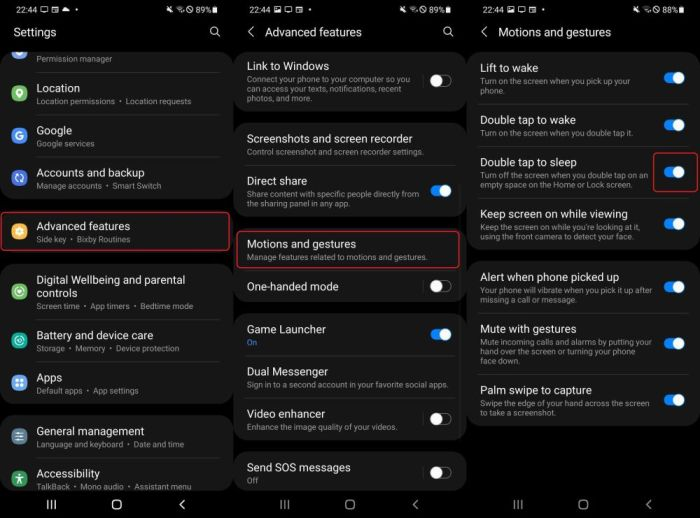
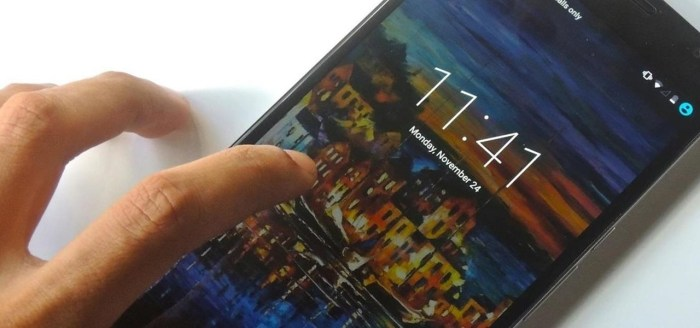

Cara mengaktifkan ketuk layar 2 kali di Samsung J4 Plus? Bosan harus menekan tombol power setiap kali mau lihat notifikasi? Fitur ini bikin hidupmu lebih praktis, lho! Bayangkan, cukup ketuk dua kali layar, HP langsung nyala. Gak perlu ribet lagi, deh.

Yuk, kita ulik cara mengaktifkan fitur canggih ini di Samsung J4 Plus-mu!

Artikel ini akan memandu kamu langkah demi langkah, dari menemukan menu pengaturan hingga mengatasi masalah yang mungkin muncul. Kita akan bahas detailnya, lengkap dengan gambar dan penjelasan yang mudah dipahami. Siap-siap merasakan kemudahan baru dalam mengakses Samsung J4 Plus!

## Pengaktifan Ketuk Layar Dua Kali di Samsung J4 Plus

Bosan harus menekan tombol power setiap kali mau ngecek notifikasi? Fitur ketuk dua kali untuk membangunkan layar di Samsung J4 Plus bisa jadi solusi praktisnya. Bayangin aja, cukup ketuk layar dua kali, HP langsung nyala! Gak perlu ribet lagi, deh.

Yuk, kita bahas cara mengaktifkannya.

Fitur ini sebenarnya cukup simpel, tapi beberapa pengguna Samsung J4 Plus mungkin masih bingung caranya. Tenang, tutorial ini akan memandu kamu langkah demi langkah, lengkap dengan ilustrasi agar kamu nggak nyasar.

### Langkah-Langkah Mengaktifkan Ketuk Layar Dua Kali

Berikut langkah-langkah mengaktifkan fitur ketuk dua kali untuk membangunkan layar di Samsung J4 Plus. Pastikan kamu mengikuti setiap langkah dengan teliti ya!

| Langkah | Ilustrasi | Keterangan Tambahan | Kemungkinan Masalah |
| --- | --- | --- | --- |
| 1\. Buka menu Pengaturan | Gambar: Tampilan layar utama dengan ikon aplikasi Pengaturan, biasanya berbentuk roda gigi. Ikon terletak di halaman utama atau di dalam laci aplikasi. Warna ikon umumnya abu-abu atau biru. | Cari ikon aplikasi Pengaturan di layar utama atau di dalam laci aplikasi. | Tidak menemukan aplikasi Pengaturan. Coba cari dengan menggunakan fitur pencarian di layar utama atau laci aplikasi. |
| 2\. Pilih "Fitur Lanjutan" atau "Fitur Tambahan" | Gambar: Tampilan menu Pengaturan dengan berbagai pilihan, salah satunya adalah "Fitur Lanjutan" atau "Fitur Tambahan". Biasanya terletak di bagian bawah daftar menu. | Nama menu bisa sedikit berbeda tergantung versi sistem operasi. Cari menu yang berisi pengaturan fitur tambahan. | Tidak menemukan menu "Fitur Lanjutan" atau "Fitur Tambahan". Pastikan sistem operasi HP kamu sudah update ke versi terbaru. |
| 3\. Pilih "Gerakan dan Gestur" | Gambar: Tampilan menu "Fitur Lanjutan" atau "Fitur Tambahan" dengan berbagai pilihan gerakan dan gestur. Salah satu pilihannya adalah "Gerakan dan Gestur". | Menu ini berisi pengaturan untuk berbagai gerakan dan gestur di HP kamu. | Tidak menemukan menu "Gerakan dan Gestur". Kemungkinan besar ada perbedaan nama menu di versi sistem operasi yang berbeda. Cobalah mencari opsi yang mirip, seperti "Gerakan", "Gestur", atau "Smart Gestures". |
| 4\. Aktifkan "Ketuk Dua Kali untuk Bangunkan" | Gambar: Tampilan menu "Gerakan dan Gestur" dengan daftar pilihan gerakan, salah satunya adalah "Ketuk Dua Kali untuk Bangunkan" atau yang serupa. Terdapat tombol toggle (ON/OFF) di samping pilihan tersebut. | Geser tombol toggle ke posisi ON untuk mengaktifkan fitur ini. | Tombol toggle tidak berfungsi. Coba restart HP kamu dan ulangi langkah-langkah di atas. Jika masalah berlanjut, kemungkinan ada bug pada sistem operasi. |

### Persyaratan Sistem dan Batasan

Fitur ketuk dua kali untuk membangunkan layar ini umumnya tersedia di sebagian besar perangkat Samsung J4 Plus dengan sistem operasi Android yang sudah terupdate. Namun, kinerja fitur ini bisa dipengaruhi oleh beberapa faktor, seperti tingkat kecerahan layar, kondisi baterai, dan sensitivitas layar sentuh.

Jika fitur ini tidak berfungsi dengan baik, pastikan layar HP kamu bersih dan bebas dari goresan yang dapat mengganggu sensitivitasnya.

### Perbedaan dengan Fitur Serupa

Fitur ketuk dua kali untuk membangunkan layar berbeda dengan fitur "Always On Display" yang menampilkan informasi dasar di layar meskipun HP dalam keadaan terkunci. Ketuk dua kali hanya membangunkan layar sepenuhnya ketika HP dalam keadaan mati, sementara "Always On Display" hanya menampilkan informasi terbatas dan tetap dalam keadaan terkunci.

## Lokasi Menu Pengaturan Ketuk Layar Dua Kali

Oke, Sobat Hipwee! Fitur ketuk layar dua kali di Samsung J4 Plus itu keren banget, kan? Bayangin aja, cuma perlu ketuk dua kali layar, langsung nyala deh. Praktis abis! Tapi, kalau kamu belum tahu cara mengaktifkannya, tenang aja.

Artikel ini bakal ngasih tahu kamu persis di mana letak menu pengaturan si fitur ajaib ini.

Mencari menu pengaturan ini sebenarnya gampang-gampang susah. Tergantung versi Android yang kamu pakai, tampilannya bisa sedikit berbeda. Tapi, tenang, kita akan bahas semua kemungkinan agar kamu nggak kebingungan.

### Navigasi Menu Pengaturan Ketuk Layar Dua Kali

Perjalanan menuju fitur ini dimulai dari layar utama HP kamu. Bayangkan kamu lagi santai-santai scroll sosmed, tiba-tiba kepikiran pengen aktifin fitur ini. Langkah-langkahnya begini:

1. Pertama, cari ikon "Settings" atau "Pengaturan". Biasanya ikonnya berupa roda gigi. Klik ikon tersebut.

3. Setelah masuk ke menu pengaturan, cari menu "Advanced features" atau "Fitur Lanjutan". Posisinya bisa agak beda-beda, ya, tergantung versi Android-nya. Kadang juga disebut "Fitur Tambahan" atau sejenisnya.

5. Nah, di dalam menu "Advanced features" atau sejenisnya, kamu bakal menemukan beberapa pilihan fitur. Carilah menu "Motion and gestures" atau "Gerakan dan Isyarat". Di sinilah harta karun kita berada!

7. Akhirnya sampai juga! Di dalam menu "Motion and gestures", kamu akan menemukan opsi "Tap to wake" atau "Ketuk untuk Bangun". Nah, itu dia si fitur yang kita cari!

> Lokasi menu: Pengaturan > Fitur Lanjutan/Fitur Tambahan > Gerakan dan Isyarat > Ketuk untuk Bangun. Gampang, kan?

### Perbedaan Tampilan Menu Berdasarkan Versi Sistem Operasi

Seperti yang udah disinggung sebelumnya, tampilan menu pengaturan bisa sedikit berbeda tergantung versi Android yang terpasang di Samsung J4 Plus kamu. Misalnya, di Android versi lama, menu "Advanced features" mungkin nggak ada, dan fitur "Tap to wake" bisa langsung berada di menu "Display" atau "Layar".

Atau, di beberapa versi, namanya mungkin sedikit berbeda, seperti "Double tap to wake". Intinya, tetap teliti aja saat mencari menu tersebut.

Jika kamu menggunakan Android Pie (9.0) misalnya, menu "Motion and gestures" mungkin berada di bagian pengaturan yang berbeda dibandingkan dengan Android Oreo (8.0) atau Android 10. Yang penting, tetaplah jeli dan jangan ragu untuk mengeksplorasi setiap menu pengaturan.

### Langkah Pencarian Menu Jika Kesulitan

Mungkin kamu masih kesulitan menemukan menu tersebut? Jangan panik! Cobalah beberapa trik ini:

- Gunakan fitur pencarian di menu pengaturan. Biasanya ada kolom pencarian di bagian atas menu pengaturan. Ketikkan kata kunci seperti "ketuk", "bangun", "gerakan", atau "isyarat".

- Cek pengaturan "Accessibility" atau "Aksesibilitas". Kadang fitur ini juga terkait dengan gerakan dan isyarat.

- Periksa update sistem operasi. Pastikan sistem operasi HP kamu sudah update ke versi terbaru. Update sistem operasi terkadang juga memperbaiki bug dan meningkatkan performa fitur-fitur tertentu, termasuk fitur ketuk layar dua kali.

- Jika masih belum ditemukan, coba cari tutorial video di YouTube atau situs web resmi Samsung. Banyak tutorial visual yang bisa membantu.

## Mengatasi Masalah Ketuk Layar Dua Kali

Fitur ketuk layar dua kali di Samsung J4 Plus memang praktis banget, ya? Bayangin aja, gak perlu repot-repot memencet tombol power cuma buat ngehidupin layar. Tapi, kadang fitur kece ini suka bermasalah. Tenang, kita bahas beberapa masalah umum dan solusinya biar kamu bisa balik lagi menikmati kemudahannya!

Masalah dengan fitur ketuk dua kali ini biasanya muncul karena beberapa hal, mulai dari settingan yang salah, masalah software, hingga bahkan kerusakan hardware. Untungnya, banyak solusi yang bisa dicoba sebelum kamu panik dan langsung ke service center.

### Penyebab Fitur Tidak Berfungsi dan Cara Mengatasinya

Sebelum mulai ngecek satu per satu, ada baiknya kita coba langkah-langkah berikut secara sistematis. Gak perlu langsung loncat-loncat, ya! Ikuti urutannya biar lebih efektif.

1. **Restart HP:**Langkah paling klasik dan seringkali efektif. Kadang, sistem operasi cuma butuh sedikit 'refreshing' untuk kembali berfungsi normal. Matikan HP kamu, tunggu beberapa detik, lalu nyalakan lagi. Coba ketuk layar dua kali setelahnya.

3. **Periksa Settingan Ketuk Dua Kali:**Pastikan fitur ini memang sudah diaktifkan di pengaturan HP kamu. Biasanya ada di menu 'Display' atau 'Advanced features'. Cek juga apakah ada settingan sensitivitas ketuk yang perlu disesuaikan.

5. **Bersihkan Layar:**Layar yang kotor atau terdapat lapisan pelindung yang terlalu tebal bisa mengganggu sensor sentuh. Bersihkan layar dengan kain microfiber yang lembut dan pastikan tidak ada debu atau kotoran yang menghalangi sensor.

7. **Update Software:**Bug software bisa jadi penyebabnya. Pastikan sistem operasi HP kamu sudah terupdate ke versi terbaru. Update biasanya berisi perbaikan bug dan peningkatan performa, termasuk untuk fitur ketuk dua kali.

9. **Cek Kerusakan Layar:**Jika langkah-langkah di atas belum berhasil, mungkin ada kerusakan pada layar sentuh. Coba perhatikan apakah ada retakan, goresan, atau kerusakan fisik lainnya di layar. Jika ada, kamu perlu membawa HP ke service center untuk diperbaiki.

### Masalah Sensitivitas Ketuk Layar, Cara mengaktifkan ketuk layar 2 kali di samsung j4 plus

Kadang, fitur ketuk dua kali gak responsif meskipun sudah diaktifkan dan layar bersih. Ini bisa disebabkan oleh sensitivitas ketuk yang terlalu rendah. Berikut solusinya:

- Buka pengaturan 'Display' atau 'Advanced features'.

- Cari opsi 'Ketuk dua kali untuk bangun' atau yang serupa.

- Biasanya ada pengaturan sensitivitas. Cobalah tingkatkan sensitivitasnya sedikit demi sedikit hingga menemukan tingkat sensitivitas yang tepat.

### Masalah Konflik Aplikasi

Beberapa aplikasi pihak ketiga mungkin berkonflik dengan fitur ketuk dua kali. Cobalah untuk menonaktifkan aplikasi yang baru diinstal atau yang mencurigakan, lalu coba lagi fitur ketuk dua kali.

Sebagai contoh, aplikasi yang mengubah perilaku layar sentuh atau aplikasi yang berjalan di latar belakang dengan izin akses yang luas, berpotensi mengganggu fungsi ketuk dua kali. Jika masalah teratasi setelah menonaktifkan aplikasi tertentu, maka aplikasi tersebut kemungkinan penyebabnya.

### Masalah Setelah Mengganti Layar

Jika kamu baru saja mengganti layar HP, pastikan layar pengganti kompatibel dengan Samsung J4 Plus dan terpasang dengan benar. Layar yang tidak kompatibel atau pemasangan yang salah dapat menyebabkan masalah dengan fitur ketuk dua kali dan fitur sentuh lainnya.

Jika masalah tetap ada setelah mencoba semua solusi di atas, sebaiknya bawa HP kamu ke service center resmi Samsung. Mungkin ada masalah hardware yang perlu diperbaiki oleh teknisi profesional.

## Perbandingan dengan Fitur Mirip

Fitur ketuk dua kali untuk menyalakan layar emang udah jadi standar di banyak HP Android, termasuk Samsung J4 Plus. Tapi, tau nggak sih kalau implementasinya bisa beda-beda? Ada yang super responsif, ada juga yang agak lemot. Yuk, kita bedah perbedaan fitur ini di beberapa perangkat Android!

Berikut perbandingan fitur ketuk dua kali untuk menyalakan layar di beberapa perangkat Android. Kita akan melihat dari segi cara aktivasi, responsivitas, dan juga beberapa kekurangannya. Semoga bisa bantu kamu pilih HP yang paling sesuai dengan kebutuhan!

### Tabel Perbandingan Fitur Ketuk Dua Kali

| Nama Fitur | Perangkat | Cara Pengaktifan | Kelebihan/Kekurangan |
| --- | --- | --- | --- |
| Double Tap to Wake | Samsung J4 Plus, dan beberapa seri Samsung lainnya | Biasanya terdapat di menu pengaturan tampilan atau gerakan. Langkah-langkahnya bisa sedikit berbeda tergantung versi Android. | Kelebihan: Sederhana dan mudah digunakan. Kekurangan: Kadang kurang responsif, terutama jika layar kotor atau ada notifikasi yang muncul. |
| Lift to Wake | Beberapa perangkat Xiaomi, Google Pixel | Biasanya juga terdapat di menu pengaturan tampilan. | Kelebihan: Lebih responsif karena sensornya mendeteksi gerakan mengangkat HP. Kekurangan: Fitur ini mungkin tidak ada di semua perangkat. |
| Double Tap to Sleep | Beberapa perangkat OPPO, Vivo | Terletak di pengaturan tampilan atau gerakan, seringkali digabung dengan fitur double tap to wake. | Kelebihan: Memudahkan mematikan layar dengan cepat. Kekurangan: Bisa teraktivasi secara tidak sengaja jika HP berada di saku atau tas. |
| Ambient Display (dengan ketukan ganda opsional) | Beberapa perangkat Android, termasuk Google Pixel dan OnePlus | Pengaturan Ambient Display biasanya terpisah, dengan opsi ketukan ganda untuk melihat notifikasi. | Kelebihan: Menampilkan informasi notifikasi tanpa harus menyalakan layar sepenuhnya. Ketukan ganda menambahkan fungsi tambahan. Kekurangan: Membutuhkan pengaturan yang lebih kompleks. |

### Perbedaan Fungsionalitas dan Pengaturan

Perbedaan utama terletak pada responsivitas dan integrasi dengan fitur lain. Misalnya, di Samsung J4 Plus, fitur ketuk dua kali hanya untuk menyalakan layar. Sementara di beberapa perangkat lain, fitur ini terintegrasi dengan fitur lain seperti Ambient Display, sehingga memberikan pengalaman yang lebih terintegrasi.

Beberapa perangkat juga memiliki fitur 'angkat untuk bangun' yang lebih responsif daripada ketuk dua kali.

### Contoh Skenario Penggunaan

Bayangkan kamu lagi buru-buru mau lihat jam. Dengan Samsung J4 Plus, kamu cukup ketuk dua kali layar untuk melihatnya. Namun, jika HP-mu punya fitur 'angkat untuk bangun', kamu bahkan nggak perlu repot-repot ketuk layar. HP akan otomatis menyala begitu kamu mengangkatnya.

Sedangkan, jika kamu punya fitur double tap to sleep, kamu bisa mematikan layar dengan cepat hanya dengan ketukan dua kali, yang sangat berguna jika kamu ingin menghemat baterai.

### Poin-Poin Penting Perbandingan Fitur

- Responsivitas fitur bervariasi antar perangkat dan merek.

- Integrasi dengan fitur lain seperti Ambient Display mempengaruhi pengalaman pengguna.

- Beberapa perangkat menawarkan fitur tambahan seperti 'angkat untuk bangun' yang lebih praktis.

- Pengaturan dan letak menu fitur juga berbeda-beda.

## Ringkasan Terakhir: Cara Mengaktifkan Ketuk Layar 2 Kali Di Samsung J4 Plus

Jadi, mengaktifkan fitur ketuk dua kali di Samsung J4 Plus ternyata gampang banget, kan? Dengan mengikuti langkah-langkah di atas, kamu bisa menikmati kemudahan akses ke ponselmu. Selamat mencoba dan rasakan perbedaannya! Semoga tips ini membantu aktivitasmu sehari-hari menjadi lebih efisien dan menyenangkan.

Jangan ragu untuk mengeksplorasi fitur-fitur keren lainnya di Samsung J4 Plus-mu!

## Informasi FAQ

**Apa yang harus dilakukan jika fitur ketuk dua kali tidak berfungsi setelah diaktifkan?**

Coba restart ponsel. Jika masih bermasalah, periksa sensitivitas layar sentuh di pengaturan. Kemungkinan juga ada masalah pada sensor layar.

**Apakah fitur ini menguras baterai lebih banyak?**

Pengaruhnya terhadap baterai sangat minimal dan biasanya tidak signifikan.

**Bisakah fitur ini dinonaktifkan kembali?**

Ya, ikuti langkah yang sama seperti mengaktifkannya, hanya saja hilangkan centang pada opsi "Ketuk dua kali untuk membangunkan".

**Apakah semua versi Samsung J4 Plus mendukung fitur ini?**

Sebagian besar versi mendukung, namun ada kemungkinan perbedaan sedikit pada tampilan menu pengaturan tergantung versi sistem operasi Android.
