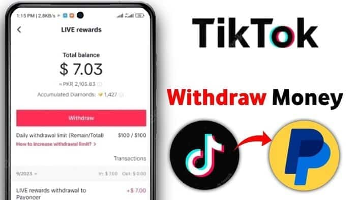

**Cara mengambil uang di kalkulator tiktok** - Siapa yang nggak mau cuan dari TikTok? Platform yang satu ini emang jadi lahan subur buat para kreator, bahkan bisa jadi sumber penghasilan utama. Tapi, gimana sih cara tau performa konten kita di TikTok? Nah, kalkulator TikTok jadi jawabannya! Di sini, kamu bisa ngeliat detail banget tentang kontenmu, mulai dari jumlah views, like, komen, sampai share.

Kalkulator TikTok bisa jadi senjata rahasia kamu buat nge-boost konten dan bikin TikTok makin nguntungin. Penasaran? Yuk, simak panduan lengkapnya!

Kalkulator TikTok bukan sekedar alat hitung biasa, lho. Fitur ini punya segudang manfaat buat para kreator, mulai dari menganalisis performa konten, ngeliat target audience, sampai ngebantu kamu bikin konten yang makin ngehits dan ngundang cuan. Tapi, gimana cara pake kalkulator TikTok ini?

Tenang, artikel ini bakal ngebantu kamu memahaminya dengan mudah dan praktis.

## Cara Menggunakan Kalkulator TikTok

TikTok bukan cuma platform untuk video pendek yang menghibur. Ada banyak fitur tersembunyi yang bisa kamu manfaatkan, salah satunya adalah kalkulator. Kalkulator TikTok bisa kamu gunakan untuk menghitung berbagai macam hal, mulai dari hitungan sederhana sampai rumus yang lebih kompleks.

Keren kan? Tapi, gimana cara mengaksesnya? Yuk, simak langkah-langkahnya berikut ini!

### Cara Mengakses Kalkulator TikTok

Kalkulator TikTok tersembunyi di dalam kolom komentar. Untuk mengaksesnya, kamu perlu membuka video TikTok yang memiliki kolom komentar. Kemudian, cari ikon kalkulator di sebelah kanan kolom komentar. Ikon kalkulator ini berbentuk seperti kalkulator sederhana dengan tombol-tombol angka.

- Buka aplikasi TikTok dan cari video yang memiliki kolom komentar.

- Ketuk kolom komentar untuk membuka kolom komentar.

- Cari ikon kalkulator di sebelah kanan kolom komentar.

- Ketuk ikon kalkulator untuk membuka kalkulator TikTok.

Setelah kamu mengklik ikon kalkulator, akan muncul tampilan kalkulator sederhana yang bisa kamu gunakan untuk menghitung berbagai macam hal.

### Cara Menggunakan Kalkulator TikTok

Penggunaan kalkulator TikTok sebenarnya mirip dengan kalkulator pada umumnya. Kamu bisa memasukkan angka dan operator matematika seperti penjumlahan (+), pengurangan (-), perkalian (\*), dan pembagian (/). Untuk menghitung hasil dari operasi matematika, kamu bisa menekan tombol sama dengan (=).

- Masukkan angka dan operator matematika yang ingin kamu hitung.

- Tekan tombol sama dengan (=) untuk mendapatkan hasil perhitungan.

Sebagai contoh, jika kamu ingin menghitung 2 + 2, kamu bisa memasukkan angka 2, kemudian operator penjumlahan (+), dan angka 2 lagi. Setelah itu, tekan tombol sama dengan (=) untuk mendapatkan hasil 4.

### Tips dan Trik Menggunakan Kalkulator TikTok

Berikut ini beberapa tips dan trik untuk mengoptimalkan penggunaan kalkulator TikTok:

- Kamu bisa menggunakan kalkulator TikTok untuk menghitung berbagai macam hal, mulai dari hitungan sederhana sampai rumus yang lebih kompleks.

- Jika kamu ingin menghitung rumus yang lebih kompleks, kamu bisa menggunakan tanda kurung untuk mengatur urutan operasi matematika.

- Kamu bisa menggunakan kalkulator TikTok untuk menghitung berbagai macam satuan, seperti kilometer, meter, gram, dan liter.

- Kamu bisa menggunakan kalkulator TikTok untuk menghitung berbagai macam nilai, seperti persentase, akar kuadrat, dan pangkat.

Dengan mengetahui cara menggunakan kalkulator TikTok, kamu bisa memanfaatkannya untuk berbagai keperluan, mulai dari menghitung belanjaan sampai menyelesaikan tugas sekolah. Selamat mencoba!

## Fitur dan Fungsi Kalkulator TikTok: Cara Mengambil Uang Di Kalkulator Tiktok

Sebagai platform media sosial yang berfokus pada video pendek, TikTok memberikan berbagai fitur dan alat untuk membantu pengguna meningkatkan performa konten mereka. Salah satu fitur yang cukup berguna adalah Kalkulator TikTok. Kalkulator ini menawarkan berbagai metrik dan analisis yang dapat membantu kamu memahami performa konten dan mengoptimalkan strategi TikTok kamu.

### Fitur dan Fungsi Kalkulator TikTok

Kalkulator TikTok memberikan berbagai metrik dan analisis yang dapat membantu kamu memahami performa konten dan mengoptimalkan strategi TikTok kamu. Berikut adalah beberapa fitur dan fungsi utama Kalkulator TikTok:

| Fitur | Deskripsi | Contoh Penggunaan |
| --- | --- | --- |
| Perkiraan Tayangan | Menampilkan perkiraan jumlah tayangan yang dapat dicapai konten kamu berdasarkan berbagai faktor, seperti jumlah pengikut, tingkat interaksi, dan tren terkini. | Kamu dapat menggunakan fitur ini untuk memprediksi potensi tayangan video baru kamu dan menentukan strategi yang tepat untuk mencapai target yang diinginkan. |
| Perkiraan Suka | Menampilkan perkiraan jumlah suka yang dapat dicapai konten kamu berdasarkan berbagai faktor, seperti jumlah pengikut, tingkat interaksi, dan tren terkini. | Kamu dapat menggunakan fitur ini untuk memprediksi potensi jumlah suka video baru kamu dan menentukan strategi yang tepat untuk mencapai target yang diinginkan. |
| Perkiraan Komentar | Menampilkan perkiraan jumlah komentar yang dapat dicapai konten kamu berdasarkan berbagai faktor, seperti jumlah pengikut, tingkat interaksi, dan tren terkini. | Kamu dapat menggunakan fitur ini untuk memprediksi potensi jumlah komentar video baru kamu dan menentukan strategi yang tepat untuk mencapai target yang diinginkan. |
| Analisis Performa Konten | Menampilkan data performa konten kamu, seperti jumlah tayangan, suka, komentar, dan berbagi, serta metrik lainnya yang dapat membantu kamu memahami bagaimana konten kamu diterima oleh audiens. | Kamu dapat menggunakan fitur ini untuk melihat konten mana yang paling berhasil, mengidentifikasi tren yang sedang berkembang, dan mengoptimalkan strategi konten kamu. |
| Analisis Audiens | Menampilkan data tentang audiens kamu, seperti demografi, minat, dan perilaku, yang dapat membantu kamu memahami siapa yang menonton konten kamu dan bagaimana kamu dapat menjangkau mereka dengan lebih baik. | Kamu dapat menggunakan fitur ini untuk menargetkan konten kamu dengan lebih baik dan meningkatkan keterlibatan audiens. |

### Cara Kalkulator TikTok Membantu Pengguna Menganalisis Performa Konten

Kalkulator TikTok dapat membantu pengguna dalam menganalisis performa konten mereka dengan memberikan data yang akurat dan terperinci tentang kinerja konten. Dengan menggunakan kalkulator ini, pengguna dapat:

- Membandingkan performa konten mereka dengan konten lainnya di platform TikTok.

- Mengidentifikasi tren yang sedang berkembang dan mengoptimalkan strategi konten mereka.

- Memahami audiens mereka dan menargetkan konten mereka dengan lebih baik.

- Memprediksi potensi performa konten baru mereka dan merencanakan strategi yang tepat untuk mencapai target yang diinginkan.

## Menganalisis Data dari Kalkulator TikTok

Setelah kamu berhasil mengumpulkan data dari Kalkulator TikTok, saatnya untuk menganalisisnya. Data ini bisa menjadi harta karun untuk meningkatkan strategi konten TikTok kamu. Tapi, bagaimana cara mengolahnya? Tenang, kita akan membahas langkah demi langkah untuk menyingkap rahasia data ini!

Ngomongin soal ngambil duit di kalkulator TikTok, emang sih, zaman sekarang serba digital. Gak cuma buat hiburan, aplikasi kayak TikTok juga jadi pintu gerbang buat menghasilkan cuan. Dan semua ini gak lepas dari [Revolusi Digital: 5 Teknologi yang Mengubah Cara Kita Hidup](https://ajiekusumadhany.com/revolusi-digital-teknologi-mengubah-cara-hidup/) , yang ngebikin hidup kita jadi makin praktis dan efisien.

Nah, balik lagi ke kalkulator TikTok, cara ngambil duitnya sendiri juga gampang banget, tinggal ikutin tutorial di aplikasi, trus tunggu saldo masuk ke akun digital kamu. Siap-siap jadi sultan digital, gengs!

### Panduan Langkah Demi Langkah Menganalisis Data

Data yang kamu dapatkan dari Kalkulator TikTok bisa diibaratkan seperti peta harta karun. Kamu harus membaca petunjuknya dengan benar untuk menemukan harta yang tersembunyi di dalamnya. Berikut panduannya:

1. **Identifikasi Metrik Utama:**Pertama, fokus pada metrik yang paling penting untuk tujuanmu. Misalnya, jika kamu ingin meningkatkan jumlah pengikut, perhatikan metrik seperti jumlah tayangan, like, komentar, dan share.
2. **Bandingkan Data:**Setelah mengidentifikasi metrik utama, bandingkan data yang kamu dapatkan dengan data konten sebelumnya. Misalnya, bandingkan jumlah tayangan video baru dengan video lama.
    
    Apakah ada perubahan signifikan? Apa penyebabnya?
    
3. **Telusuri Pola:**Coba temukan pola dalam data yang kamu kumpulkan. Misalnya, apakah konten dengan musik tertentu lebih banyak ditonton? Apakah video yang diposting di jam tertentu mendapatkan lebih banyak like?
    
4. **Tarik Kesimpulan:**Setelah menemukan pola, tarik kesimpulan yang dapat diimplementasikan dalam strategi kontenmu. Misalnya, jika konten dengan musik tertentu selalu banyak ditonton, coba gunakan musik tersebut di video berikutnya.
5. **Uji dan Perbaiki:**Jangan langsung berpuas diri dengan kesimpulan yang kamu dapatkan. Uji strategi baru yang kamu buat dan amati hasilnya.
    
    Jika hasilnya kurang memuaskan, perbaiki strategi tersebut.
    

### Data yang Dapat Diakses dari Kalkulator TikTok

Kalkulator TikTok menawarkan berbagai macam data yang bisa kamu gunakan untuk menganalisis strategi kontenmu. Berikut beberapa contoh data yang dapat diakses:

| Data | Interpretasi |
| --- | --- |
| Jumlah Tayangan | Jumlah kali video kamu dilihat oleh pengguna TikTok. |
| Jumlah Like | Jumlah pengguna yang menyukai video kamu. |
| Jumlah Komentar | Jumlah pengguna yang meninggalkan komentar di video kamu. |
| Jumlah Share | Jumlah pengguna yang membagikan video kamu ke platform lain. |
| Jumlah Pengikut | Jumlah pengguna yang mengikuti akun TikTok kamu. |
| Rata-rata Durasi Tontonan | Rata-rata waktu pengguna menonton video kamu. |
| Tingkat Penyelesaian | Persentase pengguna yang menonton video kamu sampai selesai. |
| Rasio Like terhadap Tayangan | Persentase pengguna yang menyukai video kamu dibandingkan dengan jumlah total tayangan. |
| Rasio Komentar terhadap Tayangan | Persentase pengguna yang meninggalkan komentar di video kamu dibandingkan dengan jumlah total tayangan. |

### Contoh Penggunaan Data untuk Mengoptimalkan Strategi Konten, Cara mengambil uang di kalkulator tiktok

Bayangkan kamu ingin meningkatkan jumlah pengikut di TikTok. Setelah menganalisis data dari Kalkulator TikTok, kamu menemukan bahwa video dengan musik tertentu memiliki rasio like terhadap tayangan yang lebih tinggi. Kamu juga melihat bahwa video yang diposting pada jam tertentu memiliki jumlah tayangan yang lebih banyak.

Dari data ini, kamu bisa menyimpulkan bahwa konten dengan musik tersebut dan diposting pada jam tertentu lebih menarik bagi audiens.

Selanjutnya, kamu bisa menggunakan data ini untuk mengoptimalkan strategi konten. Kamu bisa menggunakan musik tersebut di video berikutnya dan menjadwalkan postingan pada jam yang lebih efektif. Dengan melakukan ini, kamu bisa meningkatkan peluang video kamu untuk mendapatkan lebih banyak like, komentar, dan share.

Bingung gimana cara ambil uang di kalkulator TikTok? Tenang, kamu nggak sendirian! Banyak yang masih penasaran soal ini. Tapi, sebenarnya, kalkulator TikTok itu bukan tempat kamu menyimpan uang. Cara mendapatkan uang di TikTok, bisa kamu lakukan dengan menonton video, misalnya dengan mengikuti program TikTok Creator Fund.

Untuk tahu lebih lanjut tentang cara mendapatkan uang dari TikTok dengan menonton video, kamu bisa baca di [sini](https://ajiekusumadhany.com/cara-mendapatkan-uang-dari-tiktok-dengan-menonton-video/). Nah, setelah kamu berhasil mendapatkan uang dari TikTok, kamu bisa menariknya melalui metode pembayaran yang tersedia di akunmu.

Akibatnya, jumlah pengikut kamu bisa meningkat!

## Membuat Keputusan Berdasarkan Data

Kalkulator TikTok, dengan segudang datanya, bukan sekadar alat bantu untuk ngecek performa kontenmu. Data-data ini bisa jadi senjata rahasia buat ngebangun strategi konten TikTok yang jitu. Kayak jagoan game yang selalu liat map dan statistik, kamu juga perlu melek data buat nge-level up konten TikTokmu.

### Mengenali Target Audiens

Data kalkulator TikTok bisa bantu kamu ngelacak siapa aja yang ngeliat kontenmu, dari segi usia, gender, lokasi, dan minat. Dengan informasi ini, kamu bisa nge-target kontenmu ke kelompok tertentu yang lebih mungkin tertarik. Misal, kalau kamu nemuin banyak anak muda yang suka ngeliat konten tentang makeup, kamu bisa fokus bikin konten yang lebih banyak tentang makeup.

Pengen tahu cara ngambil duit di kalkulator TikTok? Hmm, kayaknya itu bukan cara yang tepat deh. Tapi, kalau kamu lagi butuh akses ke Google Drive untuk keperluan bisnis atau lainnya, pastikan kamu udah ngizinin aksesnya dengan benar. Kalo masih bingung, langsung aja cek panduan lengkapnya di [Cara Mengizinkan Akses Google Drive: Panduan Lengkap untuk Pengguna](https://ajiekusumadhany.com/cara-mengizinkan-akses-google-drive/).

Setelah itu, kamu bisa kembali fokus ke cara ngambil duit di TikTok yang bener, yaitu dengan memanfaatkan fitur monetisasi yang tersedia di platform ini.

Tapi, kalau ternyata banyak yang tertarik sama konten travel, ya kamu bisa ubah strategi kontenmu.

### Menentukan Waktu Posting Terbaik

Kalkulator TikTok bisa ngasih tau kapan kontenmu paling banyak diliat. Ini penting banget buat ngemaksimalin engagement dan reach. Misalnya, kalau kamu nemuin banyak orang yang ngeliat kontenmu di sore hari, berarti kamu bisa fokus posting konten di jam-jam tersebut.

### Memilih Format Konten yang Tepat

Kalkulator TikTok bisa ngasih tau format konten apa yang paling banyak diliat dan di-engage sama audiensmu. Misalnya, kamu bisa liat video berdurasi pendek dengan efek visual yang menarik lebih banyak penonton. Nah, kamu bisa fokus bikin konten dengan format yang paling efektif.

### Mengukur Keberhasilan Strategi Konten

Kalkulator TikTok bisa bantu kamu nge-track performa kontenmu, dari segi jumlah views, likes, comments, dan shares. Data ini penting buat nge-evaluasi strategi kontenmu. Misalnya, kalau kamu nemuin kontenmu yang tentang makeup banyak diliat, kamu bisa fokus bikin konten serupa.

Tapi, kalau konten tentang travel kurang diliat, kamu bisa coba ubah strategi kontennya.

<iframe style="position: absolute; top: 0; left: 0; width: 100%; height: 100%;" title="Cara Mengambil Uang Di Tiktok" frameborder="0" allow="accelerometer; autoplay; clipboard-write; encrypted-media; gyroscope; picture-in-picture; web-share" allowfullscreen src="https://www.youtube.com/embed/pXWelV2emeg?feature=oembed"></iframe>

## Kesimpulan Akhir

Nah, sekarang kamu udah tau kan gimana cara ngambil cuan dari kalkulator TikTok? Jangan lupa untuk selalu manfaatin fitur ini dengan maksimal ya! Dengan memahami data yang disajikan, kamu bisa nge-boost konten dan ngejar cuan dari TikTok. Ingat, sukses di TikTok bukan cuma soal konten yang keren, tapi juga strategi yang tepat.

Yuk, raih mimpi jadi TikTokers sukses dan dapatkan cuan yang melimpah!

## Ringkasan FAQ

**Apakah semua akun TikTok punya kalkulator TikTok?**

Tidak semua akun TikTok memiliki akses ke kalkulator TikTok. Fitur ini biasanya tersedia untuk akun bisnis atau akun yang sudah memenuhi syarat tertentu.

**Bagaimana cara mengaktifkan kalkulator TikTok?**

Kamu bisa mengaktifkan kalkulator TikTok dengan mengupgrade akun ke akun bisnis atau memenuhi persyaratan tertentu yang ditetapkan oleh TikTok.

**Apakah kalkulator TikTok hanya untuk konten video?**

Kalkulator TikTok bisa digunakan untuk menganalisis performa konten video dan konten lainnya seperti live streaming dan postingan teks.
