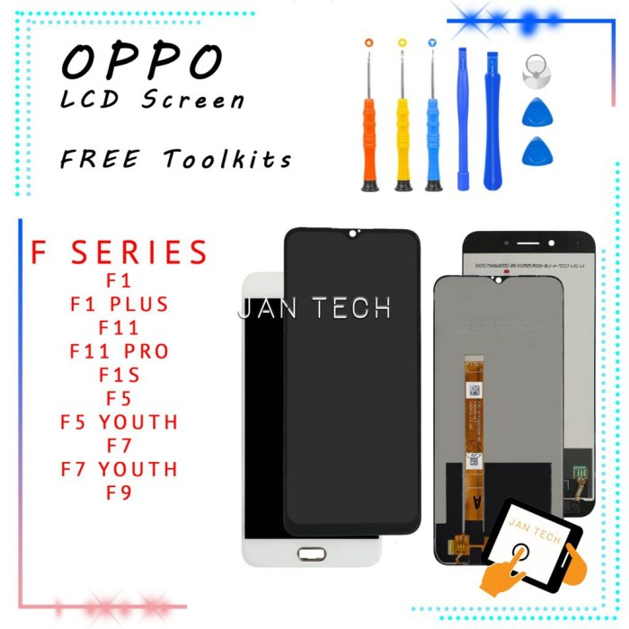
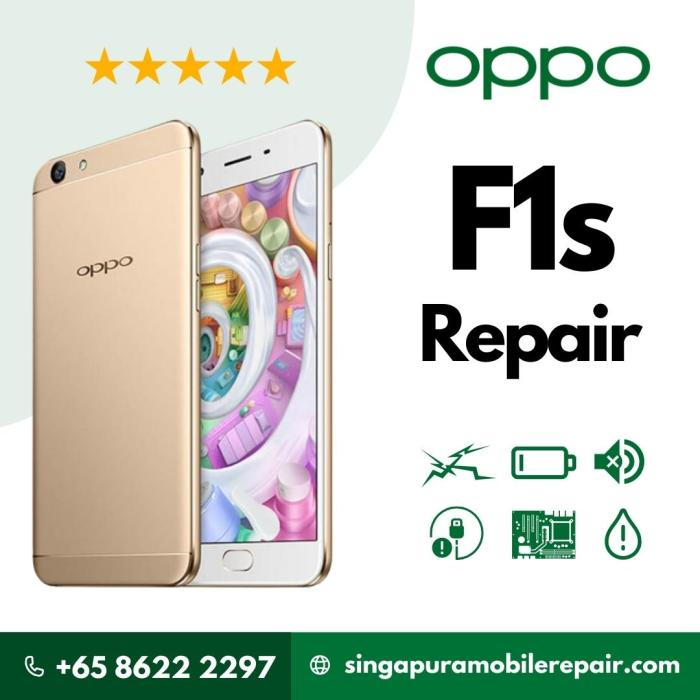
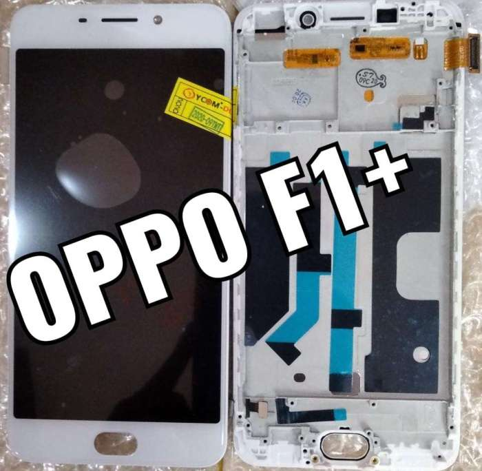

Cara mengecilkan layar Oppo F1, masalah sepele yang bikin kepala pusing? Tenang, masalah ini ternyata gampang banget diatasi kok! Layar Oppo F1 kamu terlalu besar dan bikin mata lelah? Atau mungkin kamu butuh tampilan yang lebih ringkas? Artikel ini akan membantumu menemukan solusi praktis, mulai dari pengaturan sistem hingga memanfaatkan fitur zoom bawaan.

Siap-siap nikmati pengalaman melihat layar Oppo F1 yang lebih nyaman!

Ada beberapa metode yang bisa kamu coba untuk mengecilkan tampilan layar Oppo F1, mulai dari pengaturan bawaan sistem hingga menggunakan aplikasi pihak ketiga. Setiap metode memiliki kelebihan dan kekurangan masing-masing, jadi kamu bisa memilih yang paling sesuai dengan kebutuhan dan kenyamananmu.

Ikuti langkah-langkahnya dengan teliti, dan selamat mencoba!

## Mengatur Ukuran Layar Oppo F1

Layar Oppo F1 kamu terlalu besar? Rasanya kurang nyaman digenggam dan sulit dijangkau beberapa bagian layarnya? Tenang, kamu nggak sendirian! Banyak pengguna yang merasakan hal serupa. Untungnya, Oppo F1 menyediakan beberapa pengaturan untuk menyesuaikan ukuran tampilan layar sesuai kebutuhan.

Berikut ini beberapa metode yang bisa kamu coba untuk memperkecil tampilan layar Oppo F1.

### Mengubah Ukuran Tampilan Layar Melalui Pengaturan Sistem

Cara termudah untuk memperkecil tampilan layar Oppo F1 adalah melalui pengaturan sistem. Dengan beberapa langkah sederhana, kamu bisa mengubah ukuran tampilan layar agar lebih nyaman di mata dan mudah dijangkau. Ini akan mempengaruhi ukuran ikon, teks, dan elemen antarmuka lainnya.

| Metode | Langkah | Ilustrasi | Catatan |
| --- | --- | --- | --- |
| Pengaturan Ukuran Layar |   - Buka Pengaturan.  - Pilih "Tampilan & Kecerahan".  - Cari dan pilih opsi "Ukuran Layar" atau yang serupa (nama opsi mungkin sedikit berbeda tergantung versi sistem operasi).  - Pilih ukuran layar yang diinginkan dari beberapa opsi yang tersedia, biasanya berupa persentase atau pilihan ukuran (misalnya: Kecil, Sedang, Besar).   | Bayangkan sebuah menu pengaturan dengan beberapa sub-menu. Menu "Tampilan & Kecerahan" ditandai dengan ikon matahari atau pengaturan kecerahan. Di dalamnya, terdapat opsi "Ukuran Layar" dengan slider atau pilihan ukuran yang bisa dipilih. Setelah memilih ukuran, tampilan layar akan langsung berubah, ikon dan teks akan terlihat lebih kecil atau lebih besar. | Eksperimen dengan beberapa pengaturan untuk menemukan ukuran yang paling nyaman bagi mata. Perubahan akan langsung terlihat. |

### Menggunakan Fitur Zoom Layar

Selain mengubah ukuran tampilan secara keseluruhan, Oppo F1 juga mungkin menyediakan fitur zoom layar yang memungkinkan kamu memperbesar atau memperkecil tampilan sebagian layar. Fitur ini berguna jika kamu ingin memperbesar teks atau gambar tertentu tanpa mengubah ukuran keseluruhan antarmuka.

1. Buka aplikasi yang ingin diperbesar tampilannya.

3. Gunakan gerakan "pinch-to-zoom" (mencubit layar dengan dua jari untuk memperbesar atau memperkecil). Ini merupakan gestur standar pada sebagian besar perangkat Android.

5. Jika gerakan pinch-to-zoom tidak berfungsi, periksa pengaturan aksesibilitas perangkat untuk memastikan fitur zoom layar aktif dan berfungsi dengan baik. Opsi ini biasanya ditemukan di menu "Pengaturan"
    
    - \> "Aksesibilitas"
    
    - \> "Zoom".
    

Beberapa aplikasi mungkin memiliki pengaturan zoom tersendiri di dalam aplikasi tersebut. Cek menu pengaturan aplikasi untuk memastikannya.

## Penggunaan Fitur Zoom Layar Oppo F1

Layar Oppo F1 kamu terlalu besar? Atau mungkin kamu butuh memperbesar tampilan aplikasi tertentu? Fitur zoom layar bisa jadi solusinya! Meskipun Oppo F1 tergolong ponsel jadul, fitur ini bisa cukup membantu dalam beberapa situasi. Berikut panduan singkat dan tips ampuh untuk memaksimalkan fitur zoom layar di Oppo F1 kesayanganmu.

### Menggunakan Fitur Zoom Layar Oppo F1

Oppo F1 mungkin tidak memiliki fitur zoom layar bawaan yang canggih seperti ponsel modern. Namun, kamu bisa mengakalinya dengan beberapa cara. Salah satu caranya adalah dengan memanfaatkan fitur "zoom" yang tersedia di sebagian besar aplikasi, terutama browser dan pembaca ebook.

Biasanya, fitur ini bisa diakses melalui pengaturan aplikasi atau dengan menggunakan gesture seperti mencubit layar (pinch to zoom).

- Buka aplikasi yang ingin kamu perkecil tampilannya.

- Cari ikon pengaturan aplikasi (biasanya berupa tiga titik vertikal atau ikon roda gigi).

- Cari opsi "Zoom" atau "Perbesar/Perkecil".

- Atur tingkat perbesaran sesuai kebutuhan. Beberapa aplikasi juga menyediakan opsi untuk memperbesar teks secara spesifik.

Alternatif lain, jika aplikasinya memungkinkan, adalah dengan menggunakan fitur aksesibilitas seperti "Magnification Gesture" (jika tersedia di sistem operasi Oppo F1-mu). Fitur ini biasanya memungkinkan kamu memperbesar sebagian layar dengan tiga jari.

### Tips Mengoptimalkan Fitur Zoom Layar

Agar pengalaman menggunakan fitur zoom layar lebih nyaman, perhatikan beberapa tips berikut:

- **Atur tingkat zoom secara bertahap:**Jangan langsung memperkecil layar secara drastis. Atur secara perlahan agar mata tetap nyaman.

- **Manfaatkan fitur teks besar:**Jika memungkinkan, perbesar ukuran teks di pengaturan sistem atau aplikasi untuk meningkatkan visibilitas.

- **Sesuaikan kecerahan layar:**Pastikan kecerahan layar tidak terlalu rendah atau tinggi. Kecerahan yang tepat akan mengurangi ketegangan mata.

### Potensi Masalah dan Solusi

Meskipun terbilang sederhana, penggunaan fitur zoom layar juga bisa menimbulkan beberapa masalah. Berikut beberapa masalah yang mungkin terjadi dan solusinya:

- **Zoom tidak berfungsi:**Pastikan aplikasi yang kamu gunakan mendukung fitur zoom. Coba restart aplikasi atau ponsel.

- **Zoom terlalu buram:**Cobalah menurunkan tingkat zoom. Beberapa aplikasi mungkin menghasilkan tampilan buram jika diperkecil terlalu banyak.

- **Zoom tidak responsif:**Coba bersihkan layar ponsel dan pastikan tidak ada kotoran yang menghalangi sentuhan.

> Peringatan! Penggunaan fitur zoom layar secara berlebihan dapat menyebabkan kelelahan mata, bahkan sakit kepala. Istirahatkan mata secara berkala dan hindari penggunaan zoom layar dalam waktu lama.

### Keuntungan dan Kerugian Menggunakan Fitur Zoom Layar

Seperti halnya fitur lainnya, penggunaan fitur zoom layar memiliki keuntungan dan kerugiannya sendiri.

| Keuntungan | Kerugian |
| --- | --- |
| Memudahkan membaca teks kecil | Dapat menyebabkan tampilan buram atau kurang tajam |
| Memudahkan melihat detail gambar | Membutuhkan pengaturan yang tepat agar nyaman digunakan |
| Membantu pengguna dengan gangguan penglihatan | Membutuhkan usaha ekstra untuk menyesuaikan zoom di setiap aplikasi |

## Pengaruh Resolusi Layar terhadap Ukuran Tampilan

Layar Oppo F1 kamu, sekecil apapun, punya potensi tampilan yang bisa diutak-atik. Salah satu kunci utamanya? Resolusi layar! Pengaturan ini nggak cuma soal ketajaman gambar, tapi juga berpengaruh besar pada seberapa besar ikon, teks, dan elemen antarmuka lainnya terlihat di layar.

Bayangkan kamu lagi main game, resolusi rendah bisa bikin semuanya terlihat buram dan kecil, sedangkan resolusi tinggi membuat detailnya lebih jelas dan nyaman dilihat. Yuk, kita bahas lebih dalam!

Mengubah resolusi layar Oppo F1 secara langsung akan mengubah ukuran tampilan keseluruhan. Resolusi yang lebih rendah akan membuat semuanya tampak lebih kecil dan lebih rapat, sementara resolusi yang lebih tinggi akan membuat semuanya tampak lebih besar dan lebih terpisahkan.

Ini karena jumlah piksel yang digunakan untuk menampilkan gambar berubah. Piksel lebih banyak berarti detail lebih banyak, dan akibatnya, tampilan secara keseluruhan jadi lebih besar.

### Pengaruh Resolusi terhadap Ukuran Ikon dan Teks

Perubahan resolusi layar punya dampak signifikan pada ukuran ikon dan teks. Resolusi rendah akan menampilkan ikon dan teks yang lebih kecil, yang mungkin sulit dibaca atau diklik, terutama bagi pengguna dengan penglihatan kurang baik. Sebaliknya, resolusi tinggi membuat ikon dan teks tampak lebih besar dan lebih mudah dibaca, memberikan pengalaman yang lebih nyaman dan user-friendly.

Bayangkan perbedaannya: membaca email dengan teks super kecil versus membaca email dengan teks yang jelas dan mudah dibaca – jelas beda banget kan?

### Tabel Perbandingan Resolusi Layar dan Dampaknya

| Resolusi Layar | Ukuran Tampilan | Dampak pada Ikon dan Teks | Contoh Pengalaman Pengguna |
| --- | --- | --- | --- |
| Rendah (misal: 800x480) | Lebih kecil, lebih rapat | Ikon dan teks kecil, sulit dibaca | Sulit mengklik ikon, teks buram, kurang nyaman digunakan untuk membaca |
| Sedang (misal: 1280x720) | Sedang, cukup nyaman | Ikon dan teks berukuran standar, mudah dibaca | Penggunaan nyaman, ikon mudah diklik, teks jelas |
| Tinggi (misal: 1920x1080) | Lebih besar, lebih terpisahkan | Ikon dan teks besar, sangat mudah dibaca | Penggunaan sangat nyaman, ikon besar dan mudah diklik, teks sangat jelas, detail gambar tajam |

### Ilustrasi Perbedaan Resolusi pada Antarmuka Pengguna

Bayangkan kamu sedang melihat halaman utama aplikasi media sosial. Pada resolusi rendah, feed berita akan menampilkan lebih sedikit postingan per halaman, dan setiap postingan akan terlihat lebih kecil, dengan gambar yang kurang detail. Teks pada postingan juga akan lebih kecil dan mungkin sulit dibaca.

Sebaliknya, pada resolusi tinggi, kamu akan melihat lebih banyak postingan per halaman, dan setiap postingan akan terlihat lebih besar dan lebih detail, dengan gambar yang lebih tajam dan teks yang lebih mudah dibaca. Perbedaannya signifikan, bukan?

### Langkah Mengubah Resolusi Layar Oppo F1

Sayangnya, Oppo F1 mungkin tidak menawarkan opsi untuk mengubah resolusi layar secara langsung di pengaturan sistem. Kebanyakan ponsel pintar menetapkan resolusi layar secara default dan tidak menyediakan pengaturan untuk mengubahnya. Opsi penyesuaian biasanya lebih difokuskan pada pengaturan kecerahan, ukuran font, dan pengaturan tampilan lainnya.

Jika kamu ingin mendapatkan tampilan yang lebih besar atau lebih kecil, kamu bisa mencoba menyesuaikan ukuran font dan ikon di pengaturan aksesibilitas.

## Aplikasi Pihak Ketiga untuk Mengatur Ukuran Layar

Nah, kalau kamu udah coba semua cara bawaan Oppo F1 tapi layarnya masih aja terasa terlalu besar atau kecil, saatnya melirik aplikasi pihak ketiga. Aplikasi-aplikasi ini menawarkan fitur pengaturan tampilan yang lebih fleksibel, bahkan mungkin punya trik-trik yang nggak kamu temukan di pengaturan bawaan ponsel.

Tapi, ingat ya, pakai aplikasi pihak ketiga itu ada resikonya. Jangan sampai malah bikin HP-mu bermasalah!

### Daftar Aplikasi Pihak Ketiga Pengatur Ukuran Layar

Sayangnya, nggak ada satu aplikasi ajaib yang bisa dijamin cocok untuk semua tipe Oppo F1 dan versi Android. Keberhasilannya juga bergantung pada versi Android dan hak akses yang diberikan ke aplikasi. Berikut beberapa contoh aplikasi yang -mungkin\* bisa kamu coba (ingat, selalu cek reputasi dan review aplikasi sebelum menginstal):

- **Aplikasi A:**Aplikasi ini biasanya menawarkan fitur zoom layar, mengubah resolusi, dan mungkin juga beberapa fitur tambahan seperti pengaturan DPI (dots per inch). Keunggulannya, biasanya interface-nya simpel dan mudah dipahami. Kelemahannya, mungkin nggak semua fitur berfungsi sempurna di semua perangkat.
    
- **Aplikasi B:**Aplikasi ini mungkin menawarkan fitur yang lebih canggih, seperti pengaturan aspect ratio dan penyesuaian ukuran font secara terpisah. Namun, interface-nya mungkin lebih kompleks dan butuh sedikit waktu untuk dipelajari. Risikonya, aplikasi ini mungkin membutuhkan lebih banyak izin akses ke sistem.
    

- **Aplikasi C (Contoh Aplikasi Pengatur Resolusi):**Aplikasi ini fokus pada pengaturan resolusi layar. Dengan mengubah resolusi, kamu bisa secara tidak langsung mengubah ukuran tampilan. Namun, mengubah resolusi terlalu rendah bisa membuat tampilan menjadi buram.

### Risiko Penggunaan Aplikasi Pihak Ketiga, Cara mengecilkan layar oppo f1

Menggunakan aplikasi pihak ketiga memang menawarkan fleksibilitas lebih, tapi ada harga yang harus dibayar. Salah pilih aplikasi, bisa-bisa HP-mu malah jadi lemot, boros baterai, atau yang lebih parah, data pribadimu terancam.

> Peringatan! Selalu unduh aplikasi dari sumber terpercaya seperti Google Play Store. Perhatikan izin akses yang diminta aplikasi. Jika aplikasi meminta izin yang nggak relevan dengan fungsinya, lebih baik hindari. Jangan mudah tergiur aplikasi yang menjanjikan fitur ajaib tanpa konsekuensi.

### Kelebihan dan Kekurangan Aplikasi Pihak Ketiga

Seperti halnya koin yang punya dua sisi, penggunaan aplikasi pihak ketiga untuk mengatur ukuran layar juga punya kelebihan dan kekurangan. Kelebihannya, kamu mendapatkan opsi penyesuaian yang lebih luas dibanding pengaturan bawaan. Kekurangannya, tentu saja risiko keamanan dan potensi masalah kompatibilitas.

| Kelebihan | Kekurangan |
| --- | --- |
| Opsi penyesuaian yang lebih fleksibel | Risiko keamanan dan privasi |
| Bisa mengatasi keterbatasan pengaturan bawaan | Potensi konflik dengan sistem operasi |
| Fitur tambahan yang mungkin berguna | Perlu kehati-hatian dalam memilih aplikasi |

## Mengatasi Masalah Ukuran Layar Oppo F1: Cara Mengecilkan Layar Oppo F1

Layar Oppo F1 kamu tiba-tiba aja keliatan aneh? Terlalu besar atau malah terlalu kecil? Tenang, _guys_! Bukan berarti HP kamu kena _glitch_di dunia digital. Ada beberapa hal yang bisa jadi penyebabnya, dan untungnya, kebanyakan masalah ini bisa kamu atasi sendiri.

Berikut ini beberapa langkah praktis yang bisa kamu coba.

### Masalah Umum Ukuran Layar Oppo F1

Ukuran layar yang nggak sesuai harapan di Oppo F1 bisa disebabkan beberapa hal, mulai dari pengaturan resolusi yang salah sampai masalah pada sistem operasi. Dengan memahami penyebabnya, kamu bisa lebih mudah menemukan solusi yang tepat. Berikut beberapa masalah umum dan cara mengatasinya.

| Masalah | Penyebab | Solusi |
| --- | --- | --- |
| Layar Terlalu Besar/Kecil | Pengaturan resolusi layar yang tidak optimal; aplikasi yang tidak kompatibel; masalah pada sistem operasi. | Coba ubah pengaturan resolusi layar di menu pengaturan. Pastikan aplikasi yang kamu gunakan kompatibel dengan Oppo F1. Jika masalah berlanjut, coba restart HP atau lakukan _factory reset_ (sebagai langkah terakhir). |
| Layar Terlihat Buram/Pecah | Resolusi layar terlalu rendah; kerusakan pada layar; masalah pada driver grafis. | Naikkan resolusi layar. Jika masalah masih ada, kemungkinan besar ada kerusakan fisik pada layar yang perlu diperbaiki di service center. |
| Layar Berkedip-kedip | Masalah pada hardware; konflik software; pengaturan refresh rate yang tidak tepat. | Coba restart HP. Jika masih berkedip, segera bawa ke service center karena kemungkinan ada masalah pada hardware. |
| Layar Tidak Responsif | Masalah pada touchscreen; sistem operasi yang error; aplikasi yang bermasalah. | Coba restart HP. Jika masih tidak responsif, coba bersihkan layar dari kotoran. Jika masih bermasalah, coba uninstall aplikasi yang baru diinstall. Sebagai langkah terakhir, lakukan factory reset. |

### Langkah-langkah Mereset Pengaturan Layar ke Pengaturan Pabrik

Mereset pengaturan layar ke pengaturan pabrik adalah langkah terakhir jika solusi di atas tidak berhasil. Ingat, ini akan mengembalikan semua pengaturan layar ke default, jadi pastikan kamu sudah mencoba langkah-langkah sebelumnya. Prosesnya cukup mudah, namun pastikan kamu sudah melakukan backup data penting sebelum melakukannya.

1. Buka menu **Pengaturan**di HP Oppo F1 kamu.

3. Cari dan pilih menu **Pengaturan Tambahan**atau menu serupa (nama menu bisa sedikit berbeda tergantung versi sistem operasi).

5. Temukan opsi **Cadangkan & Setel Ulang**.

7. Pilih **Setel Ulang Pengaturan**(bukan Setel Ulang Data Pabrik/Factory Reset). Opsi ini biasanya hanya akan mengembalikan pengaturan ke default tanpa menghapus data.

9. Konfirmasi pilihan kamu dan tunggu hingga proses selesai.

Setelah proses selesai, coba periksa apakah ukuran layar Oppo F1 kamu sudah kembali normal. Jika masih ada masalah, konsultasikan dengan teknisi resmi Oppo.

## Terakhir

Jadi, mengecilkan layar Oppo F1 ternyata nggak sesulit yang dibayangkan, kan? Pilih metode yang paling nyaman buat kamu, baik itu lewat pengaturan bawaan, fitur zoom, atau aplikasi tambahan. Ingat, kesehatan mata tetap yang utama, jadi jangan terlalu sering menggunakan zoom dengan tingkat perbesaran yang ekstrem.

Selamat menikmati tampilan layar Oppo F1 yang lebih nyaman dan sesuai keinginan!

## Pertanyaan Umum (FAQ)

**Apakah mengecilkan layar Oppo F1 akan mengurangi resolusi?**

Tidak selalu. Mengecilkan layar dengan fitur zoom hanya memperbesar tampilan, bukan mengubah resolusi. Mengubah resolusi dapat mempengaruhi ukuran tampilan.

**Apa yang harus dilakukan jika pengaturan zoom tidak berfungsi?**

Coba restart ponsel. Jika masih bermasalah, periksa pembaruan sistem operasi.

**Apakah ada risiko menggunakan aplikasi pihak ketiga untuk mengatur ukuran layar?**

Ya, ada risiko keamanan dan privasi. Pastikan aplikasi yang digunakan terpercaya dan memiliki rating yang baik.

**Bagaimana cara mengembalikan pengaturan layar ke pengaturan pabrik?**

Cari menu "Pengaturan", lalu "Cadangkan & setel ulang", dan pilih "Setel ulang pengaturan". Perhatikan bahwa ini akan menghapus semua pengaturan layar.
