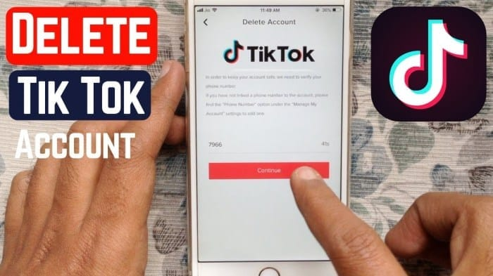

**Cara mengembalikan akun tiktok yang hilang** - Aduh, akun TikTok kamu hilang? Tenang, jangan panik dulu! Kehilangan akun TikTok memang bikin bete, apalagi kalau akunnya udah dipenuhi video-video keren dan followers setia. Tapi jangan khawatir, karena kamu bisa kok mengembalikannya!

Akun TikTok bisa hilang karena berbagai alasan, mulai dari lupa kata sandi, akun diblokir, sampai dihapus. Nah, di sini kita akan membahas semua penyebabnya dan cara mengembalikan akun TikTok yang hilang, lengkap dengan tips mencegah akunmu hilang lagi di masa depan.

Siap-siap, ya!

## Memahami Penyebab Akun TikTok Hilang

Nggak ada yang lebih bikin panik daripada tiba-tiba nggak bisa login ke akun TikTok kamu. Rasanya kayak kehilangan akses ke seluruh dunia hiburan, koneksi dengan teman-teman, dan bahkan mungkin kehilangan jejak digital yang kamu bangun selama ini. Nah, sebelum panik, penting banget buat kamu memahami penyebab akun TikTok kamu hilang.

Ada beberapa kemungkinan, mulai dari yang sepele sampai yang serius.

### Lupa Kata Sandi

Ini mungkin penyebab paling umum akun TikTok hilang. Lupa kata sandi memang menyebalkan, tapi masih bisa diatasi. Coba ingat-ingat kata sandi yang kamu gunakan, atau cek email yang terhubung dengan akun TikTok kamu. Kalau kamu benar-benar lupa, kamu bisa menggunakan fitur "Lupa Kata Sandi" di TikTok dan ikuti langkah-langkahnya untuk reset kata sandi.

### Akun Diblokir

TikTok punya aturan main yang ketat, lho. Akun kamu bisa diblokir kalau kamu melanggar aturan, contohnya:

- Mengunggah konten yang melanggar pedoman komunitas TikTok, seperti konten yang mengandung kekerasan, ujaran kebencian, atau pornografi.

- Menggunakan akun untuk melakukan spam atau aktivitas ilegal lainnya.

- Menggunakan akun untuk mengelabui orang lain, seperti dengan membuat akun palsu atau menggunakan nama orang lain.

Misalnya, akun TikTok kamu bisa diblokir karena kamu mengunggah video yang berisi ujaran kebencian atau konten yang tidak pantas untuk ditonton oleh anak-anak. Akun TikTok kamu akan diblokir sementara atau permanen, tergantung tingkat pelanggaran yang kamu lakukan.

### Akun Dihapus

Akun TikTok bisa dihapus secara sengaja atau tidak sengaja. Berikut beberapa kemungkinan penyebab akun TikTok kamu dihapus:

- Kamu sendiri yang menghapus akun TikTok kamu.

- Kamu secara tidak sengaja menghapus akun TikTok kamu saat mengganti pengaturan atau menghapus aplikasi.

- Akun TikTok kamu dihapus oleh TikTok karena melanggar pedoman komunitas TikTok, seperti mengunggah konten yang mengandung kekerasan, ujaran kebencian, atau pornografi.

Misalnya, kamu mungkin secara tidak sengaja menghapus akun TikTok kamu saat ingin menghapus aplikasi. Akun TikTok kamu akan hilang selamanya, dan kamu tidak bisa memulihkannya lagi.

## Cara Mengembalikan Akun TikTok yang Lupa Kata Sandi

Nggak sengaja lupa kata sandi akun TikTok? Tenang, kamu nggak sendirian! Lupa kata sandi akun TikTok adalah hal yang sering terjadi, tapi jangan panik dulu. Ada beberapa cara mudah yang bisa kamu coba untuk mengembalikan akun TikTok kamu.

### Cara Mengembalikan Akun TikTok yang Lupa Kata Sandi

TikTok menyediakan beberapa opsi untuk membantu kamu memulihkan akun yang lupa kata sandinya. Kamu bisa memilih opsi yang paling sesuai dengan informasi yang kamu miliki.

Kehilangan akun TikTok memang menyebalkan, tapi tenang, ada banyak cara untuk mengembalikannya! Dari verifikasi email sampai menghubungi tim TikTok, semua bisa kamu coba. Setelah akunmu kembali, kamu bisa langsung [cara mendapatkan uang dari tiktok dengan menonton video](https://ajiekusumadhany.com/cara-mendapatkan-uang-dari-tiktok-dengan-menonton-video/) , lho! Bayangkan, sambil nonton video lucu, kamu juga bisa dapat cuan.

Jadi, jangan putus asa, ya! Yuk, segera kembalikan akun TikTokmu dan mulai cari cuan!

| Langkah | Detail |
| --- | --- |
| 1\. Buka Aplikasi TikTok | Buka aplikasi TikTok di perangkat kamu, baik itu smartphone atau komputer. |
| 2\. Masuk ke Akun | Klik tombol "Masuk" atau "Login" yang biasanya berada di bagian kanan atas layar. |
| 3\. Pilih "Lupa Kata Sandi" | Setelah halaman login muncul, cari opsi "Lupa Kata Sandi" atau "Forgot Password" dan klik. |
| 4\. Masukkan Username atau Email/Nomor Telepon | Masukkan username, email, atau nomor telepon yang terhubung dengan akun TikTok kamu. |
| 5\. Verifikasi Akun | TikTok akan mengirimkan kode verifikasi ke email atau nomor telepon yang kamu masukkan. |
| 6\. Masukkan Kode Verifikasi | Masukkan kode verifikasi yang diterima ke dalam kolom yang disediakan. |
| 7\. Buat Kata Sandi Baru | Buat kata sandi baru yang kuat dan mudah diingat. Pastikan kata sandi kamu tidak mudah ditebak oleh orang lain. |
| 8\. Konfirmasi Kata Sandi Baru | Konfirmasi kata sandi baru yang kamu buat dengan memasukkannya kembali ke dalam kolom yang disediakan. |
| 9\. Masuk ke Akun | Setelah berhasil mengubah kata sandi, kamu bisa langsung masuk ke akun TikTok kamu dengan kata sandi baru. |

Sebagai contoh, ketika kamu memilih opsi verifikasi melalui email, TikTok akan mengirimkan email berisi kode verifikasi ke alamat email yang terhubung dengan akun kamu. Email ini biasanya akan berisi judul "Reset Password" atau "Lupa Kata Sandi" dan berisi kode verifikasi yang harus kamu masukkan ke dalam kolom yang disediakan.

Jika kamu mengalami kesulitan dalam memulihkan akun, kamu bisa menghubungi tim dukungan TikTok. Mereka akan membantu kamu menyelesaikan masalah dan memulihkan akun kamu. Kamu bisa menghubungi tim dukungan melalui:

- **Pusat Bantuan TikTok:**Kunjungi website resmi TikTok dan cari menu "Pusat Bantuan". Di sana kamu bisa menemukan berbagai informasi dan panduan, termasuk cara memulihkan akun.

- **Formulir Kontak:**TikTok juga menyediakan formulir kontak yang bisa kamu gunakan untuk mengirimkan pertanyaan atau laporan masalah.

- **Akun Media Sosial TikTok:**Kamu juga bisa menghubungi tim dukungan TikTok melalui akun media sosial mereka, seperti Twitter atau Instagram.

## Cara Mengembalikan Akun TikTok yang Diblokir

Kehilangan akses ke akun TikTok bisa jadi pengalaman yang menyebalkan, apalagi kalau kamu aktif banget di sana. Nggak cuma buat nge-scroll FYP, akun TikTok juga bisa jadi wadah buat kamu berkreasi, ngejar mimpi, dan ngebangun komunitas. Nah, kalau tiba-tiba akun TikTok kamu diblokir, jangan panik dulu! Ada beberapa langkah yang bisa kamu coba buat nge-unlock akun TikTok kamu.

### Cara Mengecek Status Akun TikTok dan Alasan Pemblokiran

Sebelum kamu mulai ngelakuin langkah-langkah buat nge-unlock akun, penting banget buat kamu ngecek dulu status akun TikTok kamu. Ada dua kemungkinan: akun kamu diblokir sementara atau permanen. Kenapa akun kamu diblokir? Biasanya, akun TikTok diblokir karena melanggar Pedoman Komunitas TikTok.

Nggak sengaja hapus akun TikTok? Tenang, masih ada cara buat balik lagi! Tapi, sebelum kamu sibuk mengembalikan akun, mungkin kamu tertarik buat ngecek saldo di Kalkulator TikTok dulu? [Cara mengambil uang di Kalkulator TikTok](https://ajiekusumadhany.com/cara-mengambil-uang-di-kalkulator-tiktok/) gampang kok, dan bisa jadi motivasi buat kamu buat aktif lagi di TikTok, setelah akun kamu balik.

Nah, kalau udah beres urusan duit, fokus lagi deh ke akun TikTok yang hilang. Yuk, segera cari solusi buat balik ke dunia TikTok!

- **Akun Diblokir Sementara**: Biasanya ini terjadi karena akun kamu ngelakuin aktivitas yang melanggar Pedoman Komunitas TikTok, tapi nggak terlalu serius. Contohnya, kamu nge-posting konten yang nggak sesuai, atau kamu nge-spam komentar di akun orang lain. Biasanya, akun kamu bakal diblokir sementara selama beberapa jam atau beberapa hari.
    

- **Akun Diblokir Permanen**: Kalau akun kamu diblokir permanen, biasanya ini terjadi karena kamu ngelakuin pelanggaran yang lebih serius, contohnya nge-upload konten yang bersifat eksplisit, nge-spam, atau nge-hack akun orang lain.

Untuk ngecek status akun kamu, kamu bisa buka aplikasi TikTok dan login. Kalau akun kamu diblokir, kamu bakal ngeliat pesan pemblokiran. Pesan ini biasanya berisi informasi tentang alasan pemblokiran dan durasi pemblokiran.

### Prosedur Mengajukan Banding Jika Akun TikTok Diblokir karena Kesalahan

Kalau kamu merasa akun kamu diblokir secara nggak adil, kamu bisa mengajukan banding. Proses banding ini bertujuan buat nge-review kembali alasan pemblokiran dan nge-cek apakah ada kesalahan.

Kehilangan akun TikTok memang menyebalkan, tapi tenang, kamu bisa mengembalikannya! Cek dulu email dan nomor telepon yang terhubung dengan akun. Kalau lupa, coba ingat username atau nama akun yang kamu pakai. Nah, kalau kamu udah punya penghasilan dari TikTok, jangan lupa cek [cara mengambil uang di TikTok money calculator](https://ajiekusumadhany.com/cara-mengambil-uang-di-tiktok-money-calculator/) biar duitnya bisa masuk ke kantong.

Setelah akun kamu kembali, kamu bisa langsung melanjutkan konten-konten keren yang udah kamu rencanakan!

1. **Cari Pesan Pemblokiran**: Pertama, cari pesan pemblokiran yang muncul di akun TikTok kamu. Biasanya, pesan ini berisi informasi tentang alasan pemblokiran dan cara mengajukan banding.

3. **Klik Tombol Banding**: Biasanya, di pesan pemblokiran, ada tombol “Banding” atau “Ajukan Banding”. Klik tombol ini buat nge-mulai proses banding.
4. **Isi Formulir Banding**: Setelah kamu ngeklik tombol banding, kamu bakal diarahkan ke formulir banding. Di formulir ini, kamu diminta buat nge-isi informasi tentang akun kamu dan alasan kamu ngerasa diblokir secara nggak adil. Pastikan kamu nge-isi formulir ini dengan lengkap dan jujur.
    

6. **Kirim Formulir Banding**: Setelah kamu nge-isi formulir banding, kamu bisa ngeklik tombol “Kirim” atau “Submit”. Tim TikTok bakal nge-review banding kamu dan nge-berikan keputusan dalam beberapa hari.

Pastikan kamu nge-isi formulir banding dengan jujur dan lengkap, karena ini bakal ngebantu tim TikTok buat nge-review banding kamu dengan lebih baik.

### Contoh Ilustrasi Pesan Pemblokiran Akun TikTok karena Melanggar Pedoman Komunitas

> “Akun kamu telah diblokir karena melanggar Pedoman Komunitas TikTok. Kami telah mendeteksi bahwa kamu mengunggah konten yang mengandung kekerasan. Mohon perhatikan Pedoman Komunitas TikTok agar kamu bisa menggunakan TikTok dengan aman dan nyaman.”

Contoh pesan di atas adalah contoh ilustrasi pesan pemblokiran akun TikTok karena melanggar Pedoman Komunitas. Pesan ini menunjukkan bahwa akun diblokir karena mengunggah konten yang mengandung kekerasan.

## Cara Mengembalikan Akun TikTok yang Dihapus

Kehilangan akun TikTok bisa jadi mimpi buruk buat kamu yang hobi nge-scroll FYP dan bikin konten seru. Tapi tenang, ada beberapa cara buat ngebalikin akun TikTok yang hilang. Yang penting, kamu harus tau dulu kenapa akun kamu ilang. Apakah dihapus sendiri atau dihapus sama TikTok?

### Cara Mengembalikan Akun TikTok yang Dihapus Sementara

Akun TikTok yang dihapus sementara bisa dibalikin, lho! Ini biasanya terjadi karena kamu salah pencet tombol hapus atau akun kamu diblokir sementara karena melanggar aturan TikTok.

- **Masuk ke akun TikTok kamu.**Pastikan kamu inget username dan password-nya. Kalau lupa, kamu bisa reset password dengan klik "Lupa Password" di halaman login.

- **Periksa pesan di inbox.**Biasanya TikTok akan ngirim pesan ke email atau nomor telepon yang terdaftar di akun kamu. Pesan ini berisi informasi tentang kenapa akun kamu diblokir dan cara ngebalikinnya.

- **Ikuti instruksi yang diberikan.**Biasanya kamu diminta buat nge-verifikasi akun dengan ngeklik link di email atau ngetik kode yang dikirim ke nomor telepon kamu.

- **Tunggu beberapa saat.**Proses pemulihan akun TikTok biasanya nggak instan. Kamu harus sabar ngenteni beberapa saat sampai akun kamu aktif lagi.

## 5 Tips Mencegah Akun TikTok Hilang

Keamanan akun TikTok kamu penting banget, apalagi kalau akun TikTok kamu udah jadi tempat berbagi konten seru dan membangun komunitas. Kehilangan akun TikTok bisa bikin kamu sedih dan kehilangan akses ke semua konten yang udah kamu kumpulin. Makanya, yuk, simak tips berikut untuk mengamankan akun TikTok kamu agar tetap aman dan terhindar dari kehilangan akses.

### Gunakan Kata Sandi yang Kuat, Cara mengembalikan akun tiktok yang hilang

Kata sandi yang kuat adalah kunci utama untuk melindungi akun TikTok kamu. Jangan gunakan kata sandi yang mudah ditebak, seperti tanggal lahir atau nama hewan peliharaan. Gunakan kombinasi huruf besar, huruf kecil, angka, dan simbol. Semakin kompleks kata sandi kamu, semakin sulit dibobol oleh orang lain.

### Aktifkan Verifikasi Dua Faktor

Verifikasi dua faktor (2FA) adalah lapisan keamanan tambahan yang akan membuat akun TikTok kamu lebih aman. Saat mengaktifkan 2FA, kamu akan diminta untuk memasukkan kode verifikasi yang dikirimkan ke nomor telepon atau email kamu setiap kali kamu masuk ke akun TikTok.

Ini akan membuat akun kamu lebih aman karena bahkan jika seseorang mendapatkan kata sandi kamu, mereka tetap tidak bisa masuk ke akun tanpa kode verifikasi.

- Buka aplikasi TikTok dan masuk ke akun kamu.

- Ketuk ikon profil di bagian bawah kanan layar.

- Ketuk ikon menu tiga titik di pojok kanan atas layar.

- Pilih "Pengaturan dan Privasi".

- Ketuk "Privasi".

- Ketuk "Verifikasi Dua Faktor".

- Pilih metode verifikasi yang kamu inginkan, seperti SMS atau email.

- Ikuti instruksi di layar untuk menyelesaikan pengaturan.

### Pahami dan Patuhi Pedoman Komunitas TikTok

Pedoman Komunitas TikTok berisi aturan dan kebijakan yang harus kamu patuhi saat menggunakan platform ini. Baca dan pahami dengan baik setiap aturan agar kamu tidak melakukan kesalahan yang bisa mengakibatkan akun kamu diblokir atau dihapus. Salah satu contohnya adalah dilarang menyebarkan konten yang mengandung kekerasan, ujaran kebencian, atau konten yang melanggar privasi orang lain.

### Berhati-hati dalam Berbagi Informasi Pribadi

Hindari membagikan informasi pribadi kamu, seperti alamat rumah, nomor telepon, atau informasi keuangan, di profil TikTok kamu atau dalam komentar. Informasi pribadi yang dibagikan secara terbuka dapat disalahgunakan oleh orang yang tidak bertanggung jawab. Tetaplah berhati-hati dalam membagikan informasi pribadi di internet.

### Perbarui Aplikasi TikTok Secara Berkala

TikTok secara berkala merilis pembaruan aplikasi untuk meningkatkan keamanan dan memperbaiki bug. Pastikan kamu selalu memperbarui aplikasi TikTok ke versi terbaru agar akun kamu tetap aman dan terlindungi dari ancaman keamanan terbaru.

<iframe style="position: absolute; top: 0; left: 0; width: 100%; height: 100%;" title="CARA MUDAH MENGEMBALIKAN AKUN TIKTOK YANG HILANG ATAU TERHAPUS" frameborder="0" allow="accelerometer; autoplay; clipboard-write; encrypted-media; gyroscope; picture-in-picture; web-share" allowfullscreen src="https://www.youtube.com/embed/KQ8HCryjKeg?feature=oembed"></iframe>

## Penutupan

Kehilangan akun TikTok memang bikin sedih, tapi jangan sampai bikin kamu menyerah. Dengan mengikuti langkah-langkah yang tepat dan memahami penyebabnya, kamu bisa kok mendapatkan akun TikTok kamu kembali. Ingat, selalu jaga keamanan akunmu dengan kata sandi yang kuat dan aktifkan verifikasi dua faktor.

Selamat ber-TikTok ria!

## Ringkasan FAQ: Cara Mengembalikan Akun Tiktok Yang Hilang

**Apakah akun TikTok yang dihapus bisa dikembalikan?**

Tergantung. Jika akun dihapus secara permanen, maka akun tidak dapat dikembalikan. Namun, jika dihapus secara sementara, kamu masih bisa mengembalikannya.

**Berapa lama akun TikTok diblokir?**

Durasi pemblokiran akun TikTok bervariasi, tergantung pada pelanggaran yang dilakukan. Beberapa akun mungkin diblokir sementara, sementara yang lain mungkin diblokir secara permanen.

**Bagaimana cara menghubungi tim dukungan TikTok?**

Kamu bisa menghubungi tim dukungan TikTok melalui situs web resmi TikTok atau aplikasi TikTok.
