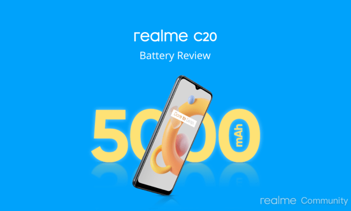

Cara menghemat baterai HP Realme C2, siapa sih yang gak butuh? Baterai boros bikin hari-hari jadi kurang asyik, apalagi kalau lagi asyik main game atau nonton drakor. Tenang, masalah baterai Realme C2 kamu yang cepet lowbat bisa diatasi kok! Artikel ini bakal kasih kamu trik-trik jitu dan praktis biar baterai HP kamu awet seharian.

Dari pengaturan sistem, mengelola aplikasi, sampai tips-tips tambahan yang mungkin belum kamu ketahui, semuanya akan dibahas tuntas di sini. Siap-siap ucapkan selamat tinggal pada lowbat dan sambut hari-hari yang lebih produktif dan menyenangkan dengan baterai Realme C2 yang awet!

## Pengaturan Sistem Realme C2 Hemat Baterai

Realme C2, meskipun bukan ponsel kelas atas, tetap bisa diajak berpetualang seharian asalkan kamu pintar-pintar mengelola daya baterainya. Baterai yang boros bisa bikin hari-harimu jadi kurang asyik. Makanya, kuasai pengaturan sistemnya agar baterai Realme C2-mu awet dan tahan lama!

Berikut beberapa pengaturan penting yang bisa kamu optimalkan untuk menghemat daya baterai Realme C2. Dengan sedikit pengaturan, kamu bisa merasakan perbedaan signifikan dalam durasi pemakaian.

### Pengaturan Hemat Daya dan Dampaknya

Realme C2 menyediakan fitur mode hemat daya yang cukup ampuh. Mode ini membatasi beberapa fungsi perangkat untuk mengurangi konsumsi daya. Aktifkan mode ini ketika baterai sudah menipis atau ketika kamu membutuhkan daya tahan ekstra. Pengaktifannya biasanya bisa ditemukan di menu pengaturan baterai.

| Pengaturan | Deskripsi Pengaturan | Dampak terhadap Baterai | Saran Pengaturan |
| --- | --- | --- | --- |
| Kecerahan Layar | Menentukan tingkat kecerahan layar. Layar yang lebih terang mengonsumsi lebih banyak daya. | Kecerahan tinggi = boros baterai; Kecerahan rendah = hemat baterai. | Atur kecerahan secara otomatis atau sesuaikan dengan kebutuhan, hindari kecerahan maksimal kecuali benar-benar diperlukan. |
| Waktu Tidur Layar | Menentukan berapa lama layar akan mati secara otomatis jika tidak ada aktivitas. | Waktu tidur lebih pendek = boros baterai; Waktu tidur lebih lama = hemat baterai. | Atur waktu tidur layar menjadi 15-30 detik untuk keseimbangan antara kenyamanan dan penghematan baterai. |
| Data Seluler | Mengaktifkan atau menonaktifkan koneksi data seluler. Data seluler aktif terus-menerus mengonsumsi daya. | Data Seluler aktif = boros baterai; Data Seluler nonaktif = hemat baterai. | Nonaktifkan data seluler saat tidak dibutuhkan, gunakan Wi-Fi sebisa mungkin. |
| Wi-Fi | Mengaktifkan atau menonaktifkan koneksi Wi-Fi. Mencari jaringan Wi-Fi juga mengonsumsi daya. | Wi-Fi aktif dan mencari jaringan = boros baterai; Wi-Fi aktif dan terhubung = lebih hemat daripada data seluler; Wi-Fi nonaktif = hemat baterai. | Aktifkan Wi-Fi hanya di area dengan sinyal kuat dan nonaktifkan saat tidak dibutuhkan. |
| Lokasi | Mengaktifkan atau menonaktifkan layanan lokasi. GPS dan layanan lokasi lainnya mengonsumsi daya baterai yang cukup signifikan. | Lokasi aktif = boros baterai; Lokasi nonaktif = hemat baterai. | Nonaktifkan layanan lokasi jika tidak diperlukan, misalnya saat tidak menggunakan aplikasi navigasi atau aplikasi berbasis lokasi. |
| Mode Hemat Daya | Membatasi beberapa fungsi perangkat untuk menghemat daya baterai. | Mengurangi konsumsi daya secara signifikan, namun dapat mengurangi performa perangkat. | Aktifkan mode hemat daya ketika baterai sudah rendah atau saat Anda membutuhkan daya tahan ekstra. |
| Sinkronisasi Otomatis | Menentukan apakah aplikasi akan melakukan sinkronisasi data secara otomatis. | Sinkronisasi aktif = boros baterai; Sinkronisasi nonaktif = hemat baterai. | Nonaktifkan sinkronisasi otomatis untuk aplikasi yang tidak membutuhkan sinkronisasi real-time. |
| Getaran | Mengaktifkan atau menonaktifkan getaran pada perangkat. | Getaran aktif = sedikit boros baterai; Getaran nonaktif = hemat baterai. | Kurangi penggunaan getaran, terutama untuk notifikasi yang tidak penting. |

### Contoh Skenario Penggunaan dan Dampaknya

Bayangkan kamu sedang bepergian seharian dan hanya memiliki 30% baterai. Dengan mengaktifkan mode hemat daya, mematikan data seluler saat tidak dibutuhkan, dan menurunkan kecerahan layar, kamu bisa memperpanjang masa pakai baterai hingga beberapa jam lagi. Sebaliknya, jika kamu terus menggunakan kecerahan layar maksimal, streaming video, dan bermain game berat, baterai akan terkuras jauh lebih cepat.

### Pengaturan Paling Efektif untuk Hemat Baterai

Secara umum, menggabungkan pengaturan kecerahan layar rendah, waktu tidur layar singkat, dan mematikan data seluler/Wi-Fi saat tidak digunakan adalah kombinasi paling efektif. Mode hemat daya juga sangat membantu dalam situasi darurat. Ingat, kunci utamanya adalah keseimbangan antara kenyamanan dan efisiensi daya.

## Mengelola Aplikasi dan Notifikasi

Baterai Realme C2 kamu boros? Jangan panik dulu! Salah satu biang keroknya mungkin aplikasi dan notifikasi yang nggak terkelola dengan baik. Aplikasi yang berjalan di latar belakang dan notifikasi yang bertebaran bisa jadi vampir penguras daya. Yuk, kita atur agar baterai Realme C2-mu awet seharian!

### Menonaktifkan Aplikasi Latar Belakang

Aplikasi yang berjalan di latar belakang, meskipun kamu nggak aktif menggunakannya, tetap mengonsumsi daya baterai. Berikut langkah-langkah menonaktifkannya:

1. Buka menu **Setelan**(Settings).

3. Pilih **Aplikasi**(Apps).

5. Cari aplikasi yang ingin kamu nonaktifkan dari latar belakang.

7. Klik aplikasi tersebut, lalu cari opsi **Paksa berhenti**(Force Stop) atau **Kelola aplikasi**(Manage apps).

9. Pada beberapa Realme C2, mungkin ada pilihan untuk membatasi penggunaan data latar belakang aplikasi tersebut. Manfaatkan fitur ini untuk menghemat baterai.

### Mengelola Notifikasi

Notifikasi yang terus-menerus muncul, selain mengganggu, juga menyedot daya baterai. Atur agar notifikasi hanya muncul untuk hal-hal penting.

1. Buka menu **Setelan**(Settings).

3. Pilih **Notifikasi dan Pusat Kontrol**(Notifications & Control Center) atau menu serupa.

5. Pilih aplikasi yang notifikasinya ingin kamu atur.

7. Pilih jenis notifikasi yang ingin diaktifkan atau dinonaktifkan (misalnya, hanya notifikasi penting saja).

9. Beberapa aplikasi memungkinkan kamu untuk mengatur frekuensi notifikasi. Manfaatkan fitur ini untuk meminimalisir konsumsi daya.

### Aplikasi Boros Baterai dan Cara Mengoptimalkannya

Beberapa aplikasi, seperti game online, media sosial, dan aplikasi navigasi, dikenal sebagai pemakan baterai. Berikut contohnya dan cara mengatasinya:

| Aplikasi | Cara Mengoptimalkan |
| --- | --- |
| Game Online | Kurangi kualitas grafis, batasi durasi bermain, tutup aplikasi setelah selesai bermain. |
| Media Sosial | Kurangi frekuensi pembaruan, batasi notifikasi, nonaktifkan fitur pemutar video otomatis. |
| Aplikasi Navigasi | Gunakan navigasi offline jika memungkinkan, tutup aplikasi setelah sampai tujuan. |

### Membatasi Akses Data Seluler dan Wi-Fi

Memberikan akses penuh data seluler dan Wi-Fi kepada semua aplikasi bukanlah ide yang bagus. Batasi akses ini untuk aplikasi yang memang membutuhkannya.

1. Buka menu **Setelan**(Settings).

3. Pilih **Penggunaan Data**(Data Usage) atau menu serupa.

5. Pilih aplikasi yang ingin kamu batasi akses datanya.

7. Atur akses data seluler dan Wi-Fi sesuai kebutuhan. Kamu bisa memilih untuk membatasi akses hanya saat aplikasi aktif digunakan.

### Dampak Pembersihan RAM Berkala terhadap Kinerja Baterai

> Pembersihan RAM secara berkala memang bisa membantu meningkatkan kinerja ponsel secara umum, namun dampaknya terhadap penghematan baterai sebenarnya minimal. Lebih efektif untuk fokus pada manajemen aplikasi dan notifikasi seperti yang telah dijelaskan di atas. Pembersihan RAM yang berlebihan bahkan bisa berdampak negatif karena sistem harus bekerja lebih keras untuk memuat ulang aplikasi yang telah ditutup.

## Pengaturan Layar dan Kecerahan

Baterai Realme C2 kamu boros? Jangan panik! Salah satu biang keladi konsumsi daya yang cukup signifikan adalah pengaturan layar. Kecerahan, resolusi, dan waktu tidur layar punya peran penting dalam menentukan seberapa lama HP kamu bertahan. Yuk, kita bahas satu per satu!

### Pengaruh Kecerahan Layar terhadap Konsumsi Daya, Cara menghemat baterai hp realme c2

Layar yang lebih terang otomatis membutuhkan lebih banyak daya. Bayangkan lampu di kamarmu; semakin terang, semakin banyak listrik yang terpakai. Begitu pula dengan layar HP. Semakin tinggi kecerahan, semakin banyak energi yang dibutuhkan untuk menerangi pixel-pixelnya. Jadi, usahakan untuk menurunkan kecerahan layar secukupnya, terutama di kondisi pencahayaan yang cukup.

### Pengaturan Kecerahan Layar Otomatis dan Manual

Realme C2 menawarkan dua opsi pengaturan kecerahan: otomatis dan manual. Pengaturan otomatis akan menyesuaikan kecerahan layar berdasarkan kondisi cahaya sekitar. Ini praktis, tapi terkadang kurang akurat. Pengaturan manual memberikan kontrol penuh atas kecerahan, memungkinkanmu untuk menyesuaikannya sesuai kebutuhan.

Pilihlah metode yang paling nyaman dan efektif bagimu, sesuaikan kecerahan layar agar tetap nyaman dilihat tanpa harus terlalu terang.

### Keuntungan dan Kerugian Mode Gelap (Dark Mode)

Mode gelap, atau dark mode, menjadi tren karena klaimnya yang hemat baterai. Pada dasarnya, dark mode mengurangi emisi cahaya biru dari layar, yang memang bisa sedikit menghemat daya, terutama pada layar AMOLED. Namun, penghematan baterainya tidak selalu signifikan, bahkan pada beberapa perangkat dan kondisi tertentu, perbedaannya hampir tidak terasa.

Keuntungan utamanya lebih ke kenyamanan mata, terutama di kondisi minim cahaya. Kerugiannya? Beberapa aplikasi mungkin terlihat kurang optimal di mode gelap.

### Pengaruh Waktu Tidur Layar terhadap Hemat Baterai

Waktu tidur layar menentukan berapa lama layar akan mati setelah tidak ada aktivitas. Semakin singkat waktu tidur layar, semakin cepat layar mati dan semakin hemat baterai. Mari kita bandingkan:

- **15 detik:**Layar mati sangat cepat, sangat hemat baterai, tapi mungkin sedikit mengganggu jika kamu sering bolak-balik melihat notifikasi.

- **30 detik:**Kompromi yang baik antara kecepatan mati layar dan kenyamanan. Cukup cepat untuk menghemat baterai, tapi masih memberikan waktu yang cukup untuk melihat notifikasi.

- **1 menit:**Layar tetap aktif lebih lama, kurang hemat baterai dibandingkan pengaturan 15 atau 30 detik, tapi memberikan kenyamanan lebih bagi pengguna yang sering melihat notifikasi.

Pilihlah waktu tidur layar yang sesuai dengan kebiasaan penggunaanmu. Jika kamu jarang melihat notifikasi, 15 detik adalah pilihan yang tepat. Jika kamu sering berinteraksi dengan HP, 30 detik atau 1 menit mungkin lebih nyaman.

### Perbandingan Konsumsi Daya Berbagai Resolusi Layar pada Realme C2

Realme C2 biasanya hanya memiliki satu resolusi layar. Namun, untuk ilustrasi, mari kita bayangkan skenario jika Realme C2 memiliki beberapa pilihan resolusi. Semakin tinggi resolusi layar (misalnya, HD+ dibandingkan dengan resolusi lebih rendah), semakin banyak piksel yang perlu diterangi, sehingga konsumsi daya akan lebih tinggi.

| Resolusi Layar | Konsumsi Daya (Perkiraan) |
| --- | --- |
| HD+ (720 x 1520) | Sedang |
| HD (720 x 1280) | Rendah |
| Lebih rendah dari HD | Rendah sekali |

Perlu diingat bahwa ini hanyalah perkiraan. Konsumsi daya aktual dapat bervariasi tergantung pada berbagai faktor, termasuk kecerahan layar, penggunaan aplikasi, dan kondisi perangkat keras lainnya.

## Konektivitas dan Fitur Tambahan

Realme C2, meskipun tergolong HP _entry-level_, tetap punya potensi boros baterai kalau kamu nggak bijak dalam mengelola konektivitas dan fitur tambahannya. Fitur-fitur canggih yang terkesan "sepele" ini, bisa jadi "vampir" baterai yang diam-diam menguras daya HP kamu. Makanya, penting banget nih kita bahas bagaimana caranya supaya baterai Realme C2 kamu awet dan tahan lama.

Penggunaan data seluler, WiFi, Bluetooth, GPS, dan fitur-fitur lainnya seperti NFC dan lokasi, secara signifikan mempengaruhi daya tahan baterai. Kita akan bongkar satu per satu bagaimana cara mengoptimalkannya agar Realme C2 kamu tetap _stay strong_sepanjang hari.

### Dampak Konektivitas terhadap Baterai

Bayangkan ini: kamu lagi asyik _scrolling_Instagram sambil nyalain GPS dan Bluetooth. Tiga-tiganya butuh daya baterai yang cukup besar, kan? Data seluler yang selalu aktif untuk _update_aplikasi di _background_juga bisa bikin baterai Realme C2 kamu kian menipis. WiFi, meskipun lebih hemat daripada data seluler, tetap butuh daya untuk terhubung dan mengirim data.

Intinya, semakin banyak fitur konektivitas yang aktif, semakin cepat baterai kamu terkuras.

### Menonaktifkan Fitur yang Tidak Digunakan

Langkah sederhana namun ampuh: matikan fitur yang nggak kamu pakai! NFC misalnya, kalau kamu nggak pernah pakai untuk pembayaran digital, lebih baik dimatikan saja. Begitu juga dengan lokasi, kalau nggak lagi butuh navigasi atau _check-in_lokasi, matikan saja. Fitur-fitur ini mungkin terlihat sepele, tapi kalau dibiarkan aktif terus-menerus, bisa jadi biang keladi baterai Realme C2 kamu cepat habis.

- Matikan NFC jika tidak digunakan.

- Nonaktifkan Bluetooth jika tidak terhubung ke perangkat lain.

- Atur lokasi ke "Hanya saat aplikasi digunakan" atau matikan jika tidak dibutuhkan.

### Mengoptimalkan Pengaturan Lokasi

Fitur lokasi memang penting, tapi nggak perlu selalu aktif 24/7. Realme C2 menawarkan beberapa pilihan pengaturan lokasi, mulai dari "Selalu aktif" hingga "Hanya saat aplikasi digunakan". Pilih opsi "Hanya saat aplikasi digunakan" untuk menghemat baterai. Dengan begitu, aplikasi hanya akan mengakses lokasi kamu saat benar-benar dibutuhkan, bukannya terus-menerus memantau posisi kamu di _background_.

### Tips Menghemat Baterai saat Menggunakan Kamera dan Pemutar Musik

> Jangan biarkan aplikasi kamera dan pemutar musik berjalan di latar belakang. Tutup aplikasi setelah selesai digunakan. Gunakan headset untuk mendengarkan musik agar layar tetap mati. Kurangi penggunaan fitur filter dan efek di aplikasi kamera.

### Mengelola Penggunaan Data Seluler Setiap Aplikasi

Aplikasi tertentu bisa menjadi "pemakan" data seluler yang rakus. Untuk mengontrolnya, kamu perlu memeriksa dan mengelola penggunaan data seluler setiap aplikasi di pengaturan Realme C2. Identifikasi aplikasi yang boros data, lalu batasi penggunaan datanya atau nonaktifkan akses data selulernya jika tidak terlalu penting.

1. Buka menu Pengaturan.

3. Cari menu "Penggunaan Data" atau yang serupa.

5. Lihat daftar aplikasi dan penggunaan data masing-masing.

7. Batasi atau nonaktifkan akses data seluler aplikasi yang boros.

## Tips Tambahan untuk Menghemat Baterai: Cara Menghemat Baterai Hp Realme C2

Realme C2, si handphone tangguh dengan harga ramah di kantong, memang punya daya tahan baterai yang lumayan. Tapi, nggak ada salahnya dong kalau kita belajar memperpanjang umur baterai agar tetap awet dan tahan lama. Berikut beberapa tips tambahan yang bisa kamu coba, dijamin bikin HP kamu makin betah nemenin aktivitasmu seharian!

### Pengaruh Suhu Perangkat terhadap Daya Tahan Baterai

Pernah ngerasain baterai HP langsung drop drastis pas lagi main game di bawah terik matahari? Itu karena suhu berpengaruh besar terhadap kinerja baterai. Suhu yang terlalu panas atau terlalu dingin bisa bikin baterai Realme C2 kamu bekerja lebih keras dan cepat habis.

Idealnya, jaga suhu HP kamu tetap di suhu ruangan (sekitar 20-25 derajat Celcius). Hindari memakai HP di bawah sinar matahari langsung atau di tempat yang sangat dingin.

### Penggunaan Charger yang Tepat dan Dampaknya terhadap Baterai Jangka Panjang

Charger bukan cuma alat untuk mengisi daya, tapi juga investasi jangka panjang untuk kesehatan baterai HP kamu. Pakai charger original Realme C2 atau charger yang memiliki spesifikasi daya dan voltase yang sesuai. Menggunakan charger yang tidak sesuai spesifikasi bisa mengakibatkan overcharging atau bahkan kerusakan baterai.

Selain itu, hindari kebiasaan mengisi daya hingga 100% terus-menerus. Cukup isi daya hingga 80-90% untuk menjaga kesehatan baterai dalam jangka panjang. Bayangkan, seperti kamu nggak mau makan terlalu kenyang terus kan? Baterai HP juga butuh istirahat!

### Aplikasi Pihak Ketiga untuk Mengoptimalkan Penggunaan Baterai

Di Google Play Store, banyak aplikasi pihak ketiga yang bisa membantu mengoptimalkan penggunaan baterai. Aplikasi-aplikasi ini biasanya menawarkan fitur-fitur seperti mengelola aplikasi yang boros baterai, menutup aplikasi yang berjalan di latar belakang, dan mengatur kecerahan layar secara otomatis.

Namun, pilihlah aplikasi yang terpercaya dan memiliki rating yang baik untuk menghindari risiko malware atau aplikasi yang malah bikin baterai lebih boros. Beberapa contoh aplikasi yang bisa dicoba (namun perlu diingat, selalu periksa reputasi dan ulasan sebelum menginstal): AccuBattery, Greenify, atau DU Battery Saver.

Ingat ya, setiap aplikasi punya kelebihan dan kekurangannya masing-masing.

### Kalibrasi Baterai Realme C2

Kalibrasi baterai bisa membantu memperbaiki akurasi indikator baterai di HP kamu. Cara melakukannya cukup mudah. Langkah pertama, kosongkan baterai HP kamu hingga benar-benar mati. Setelah itu, cas HP kamu hingga penuh (100%) tanpa mematikan HP.

Biarkan HP tercas selama minimal 2 jam setelah mencapai 100%. Setelah itu, cabut charger dan hidupkan HP. Dengan melakukan kalibrasi ini, sistem operasi akan mempelajari kembali pola penggunaan baterai dan memberikan informasi persentase baterai yang lebih akurat.

Ingat, kalibrasi ini bukan solusi ajaib untuk memperpanjang umur baterai, tapi membantu memperbaiki akurasi indikatornya.

### Tips Tambahan Lainnya untuk Menghemat Baterai

- Kurangi kecerahan layar. Semakin terang layar, semakin banyak daya baterai yang terpakai.

- Matikan fitur yang tidak terpakai, seperti Bluetooth, GPS, dan Wi-Fi jika tidak sedang digunakan.

- Batasi penggunaan aplikasi yang boros baterai, seperti game online atau aplikasi streaming video.

- Gunakan mode hemat daya (power saving mode) jika baterai sudah menipis.

- Perbarui sistem operasi HP kamu secara berkala. Update sistem operasi seringkali menyertakan perbaikan bug dan optimasi penggunaan baterai.

## Ringkasan Terakhir

Menghemat baterai Realme C2 ternyata gak serumit yang dibayangkan. Dengan sedikit pengaturan dan kebiasaan baru, kamu bisa menikmati HP kesayanganmu seharian penuh tanpa khawatir kehabisan daya. Jadi, tuliskan tips-tips di atas dan terapkan mulai sekarang. Selamat tinggal lowbat, halo produktivitas!

## Detail FAQ

**Apakah sering restart HP mempengaruhi daya tahan baterai?**

Terlalu sering restart HP bisa sedikit mempengaruhi daya tahan baterai jangka panjang karena proses booting membutuhkan daya. Namun, dampaknya tidak signifikan jika tidak dilakukan secara berlebihan.

**Apakah menggunakan charger fast charging selalu buruk untuk baterai?**

Penggunaan charger fast charging yang terlalu sering memang bisa memperpendek umur baterai dalam jangka panjang. Sebaiknya batasi penggunaan dan biarkan baterai terisi penuh sesekali.

**Bagaimana cara mengetahui aplikasi mana yang paling boros baterai?**

Di pengaturan Realme C2, biasanya terdapat menu "Penggunaan Baterai" yang menunjukkan persentase penggunaan baterai per aplikasi. Ini akan membantu mengidentifikasi aplikasi yang paling boros.
