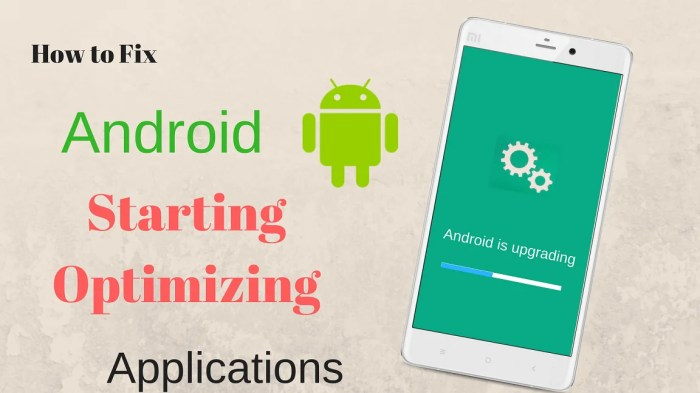
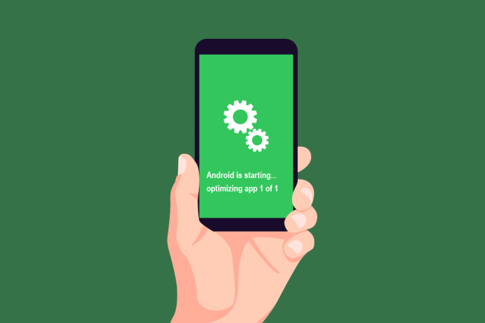
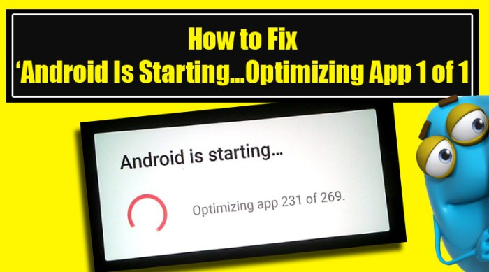

**Cara menghilangkan memulai android mengoptimalkan aplikasi samsung** - Cara Menghilangkan Masalah & Optimalkan Aplikasi Samsung: HP Samsung baru? Rasanya kayak punya mobil sport mewah tapi nggak tahu cara ngebutnya, kan? Biar nggak mubazir, kita bongkar rahasia memaksimalkan performa si handphone. Dari pengaturan awal yang tepat sampai membasmi aplikasi-aplikasi bandel yang bikin lemot, semuanya akan dibahas tuntas di sini.

Siap-siap deh, rasakan sensasi Samsungmu terbang!

Artikel ini akan memandu kamu langkah demi langkah dalam mengoptimalkan perangkat Samsung. Mulai dari pengaturan awal yang tepat hingga mengatasi masalah performa dan mengelola aplikasi agar kinerja tetap maksimal dan baterai awet. Kita akan bahas cara membersihkan cache, mengelola izin aplikasi, dan bahkan cara mendeteksi aplikasi yang menjadi sumber masalah.

Dengan panduan ini, Samsungmu akan kembali lincah dan siap diajak berpetualang digital!

## Memulai Android dengan Optimal

Hayo ngaku, siapa yang langsung _nge-scroll_sosmed begitu HP Samsung barunya nyala? Eits, tunggu dulu! Sebelum asyik berselancar di dunia maya, ada beberapa langkah penting yang bisa bikin pengalaman Androidmu jauh lebih _smooth_dan baterai awet. _Setting_awal yang tepat itu kunci utama, lho! Ibarat bangun rumah, pondasinya harus kuat dulu biar nggak ambruk di tengah jalan.

Yuk, kita urai satu per satu.

### Langkah Awal Setelah Menyalakan Smartphone Samsung Baru

Setelah proses _unboxing_yang mengasyikkan, jangan langsung loncat ke aplikasi favoritmu. Ada beberapa hal krusial yang perlu dilakukan: koneksikan ke WiFi, _login_akun Google, dan _setup_keamanan seperti PIN atau sidik jari. Pastikan juga kamu sudah _update_sistem operasi ke versi terbaru agar mendapatkan fitur dan _patch_keamanan terkini.

Langkah-langkah ini mungkin terlihat sepele, tapi sangat berpengaruh pada performa dan keamanan HP-mu.

### Pengaturan Dasar untuk Performa Maksimal

Setelah proses instalasi awal, saatnya mengoptimalkan pengaturan dasar. Prioritaskan pengaturan yang berhubungan dengan performa dan hemat baterai. Matikan fitur yang tidak terlalu dibutuhkan, seperti animasi yang berlebihan atau sinkronisasi otomatis di latar belakang. Pastikan juga kamu sudah mengaktifkan fitur _auto-update_aplikasi agar selalu mendapatkan versi terbaru dengan perbaikan _bug_dan peningkatan performa.

### Perbandingan Pengaturan Hemat Daya

Samsung menyediakan beberapa mode hemat daya yang bisa kamu sesuaikan dengan kebutuhan. Berikut perbandingannya:

| Nama Mode | Deskripsi | Pengaruh pada Performa | Pengaruh pada Baterai |
| --- | --- | --- | --- |
| Mode Hemat Daya | Membatasi penggunaan CPU dan mengurangi kecerahan layar. | Performa sedikit menurun, aplikasi mungkin lebih lambat. | Baterai lebih awet, bisa bertahan lebih lama. |
| Mode Hemat Daya Ekstrim | Membatasi hampir semua fungsi latar belakang, hanya aplikasi penting yang berjalan. | Performa sangat menurun, hanya fungsi dasar yang berjalan optimal. | Baterai sangat awet, bisa bertahan sangat lama. |
| Mode Hemat Daya Adaptif | Secara otomatis menyesuaikan penggunaan daya berdasarkan kebiasaan pengguna. | Performa relatif stabil, menyesuaikan dengan kebutuhan. | Penghematan baterai yang optimal, menyesuaikan dengan penggunaan. |
| Tidak Ada Mode Hemat Daya | Semua fungsi berjalan normal. | Performa optimal, aplikasi berjalan lancar. | Baterai boros, tergantung pemakaian. |

### Aplikasi Bawaan Samsung yang Dapat Dihapus atau Dinonaktifkan

Beberapa aplikasi bawaan Samsung mungkin jarang digunakan. Kamu bisa menonaktifkan atau menghapusnya (jika memungkinkan) untuk menghemat ruang penyimpanan dan meningkatkan performa. Namun, hati-hati, jangan sembarangan menghapus aplikasi sistem yang krusial. Sebelum menghapus, pastikan kamu memahami fungsi aplikasi tersebut.

Contoh aplikasi yang mungkin bisa dinonaktifkan: aplikasi bawaan yang memiliki fungsi serupa dengan aplikasi lain yang sudah terpasang.

### Mengelola Notifikasi untuk Meminimalisir Gangguan

Notifikasi yang berlebih bisa mengganggu konsentrasi dan menguras baterai. Atur pengaturan notifikasi untuk setiap aplikasi agar hanya menerima notifikasi penting. Kamu bisa mengatur jenis notifikasi yang ingin diterima (bunyi, getar, lampu indikator), atau bahkan mematikan notifikasi sepenuhnya untuk aplikasi tertentu.

Dengan pengaturan yang tepat, HP-mu akan lebih tenang dan fokus.

## Mengoptimalkan Aplikasi Samsung

HP Samsung lemot? Aplikasi bermasalah? Tenang, bukan cuma kamu yang ngalamin. Kadang, HP canggih sekalipun butuh perawatan ekstra biar performa tetap ngebut. Salah satu kunci utamanya?

Optimasi aplikasi! Di artikel ini, kita bakal bahas tuntas cara ngebersihin sampah digital dan bikin aplikasi Samsung kamu kembali lincah.

### Membersihkan Cache dan Data Aplikasi

Cache dan data aplikasi itu kayak sampah digital yang menumpuk dan bikin HP kamu makin berat. Bayangin aja, setiap kali kamu pakai aplikasi, dia ninggalin jejak digital. Lama-lama, jejak itu jadi gunung sampah yang bikin aplikasi lemot.

Nah, membersihkannya gampang banget. Caranya, masuk ke menu **Pengaturan > Aplikasi > \[Nama Aplikasi\] > Penyimpanan > Bersihkan Cache**dan **Bersihkan Data**. Ingat, membersihkan data akan menghapus semua pengaturan aplikasi, jadi pastikan kamu udah backup data penting sebelumnya!

### Memperbarui Aplikasi Samsung

Aplikasi yang usang itu kayak baju bolong-bolong. Selain nggak enak dilihat, juga bisa bikin HP kamu rentan terhadap bug dan masalah performa. Pastikan semua aplikasi Samsung kamu selalu update ke versi terbaru. Caranya mudah banget: buka **Galaxy Store**, lalu cek bagian **Pembaruan**.

Klik tombol **Perbarui**di samping aplikasi yang perlu di-update. Jangan lupa untuk mengaktifkan pembaruan otomatis agar kamu nggak ketinggalan update penting.

### Mengelola Izin Aplikasi

Aplikasi butuh izin akses untuk berfungsi dengan baik, tapi jangan sampai izin yang diberikan malah membahayakan privasi kamu. Misalnya, apakah aplikasi kalkulator perlu akses ke kontak kamu? Tentu saja tidak! Rajin-rajinlah cek dan batasi izin aplikasi yang nggak perlu.

Caranya, masuk ke **Pengaturan > Aplikasi > \[Nama Aplikasi\] > Izin**. Di sini kamu bisa mengatur izin akses aplikasi secara detail.

### Menonaktifkan Aplikasi yang Jarang Digunakan

Aplikasi yang jarang dipakai cuma ngabisin ruang penyimpanan dan sumber daya HP kamu. Lebih baik nonaktifkan saja! Caranya, buka **Pengaturan > Aplikasi > \[Nama Aplikasi\] > Nonaktifkan**. Aplikasi yang dinonaktifkan tidak akan berjalan di latar belakang dan tidak akan memakan ruang penyimpanan. Tapi ingat, kamu masih bisa mengaktifkannya lagi kapan saja.

> Terlalu banyak aplikasi yang berjalan di latar belakang bisa bikin baterai boros, HP lemot, dan data internet habis tanpa kamu sadari. Ini karena aplikasi-aplikasi tersebut terus-menerus bekerja dan memproses data, meskipun kamu nggak sedang menggunakannya. Jadi, bersihkan aplikasi yang nggak perlu dan batasi aplikasi yang berjalan di latar belakang.

## Mengatasi Masalah Performa

HP Samsung kamu lemot? Baterai boros banget? Jangan panik dulu, Sob! Masalah performa di Android, khususnya Samsung, seringkali bisa diatasi dengan beberapa langkah sederhana. Artikel ini akan ngebahas beberapa solusi jitu untuk mengembalikan performa HP Samsung kamu ke masa kejayaannya.

Kita akan bahas dari aplikasi yang lemot sampai masalah baterai yang bikin kamu geregetan.

### Aplikasi Berjalan Lambat atau Macet

Aplikasi yang tiba-tiba lemot atau macet bisa bikin hari kamu jadi kurang menyenangkan. Ada beberapa hal yang bisa kamu coba untuk mengatasinya. Berikut beberapa langkah praktis yang bisa kamu ikuti:

1. **Paksa berhenti aplikasi:**Buka menu pengaturan, cari aplikasi yang bermasalah, lalu paksa hentikannya. Ini akan menutup paksa aplikasi dan menghapus proses yang mungkin menyebabkan masalah.

3. **Bersihkan cache aplikasi:**Cache aplikasi bisa menumpuk dan memperlambat kinerja. Di pengaturan aplikasi yang sama, cari opsi "Penyimpanan" atau "Storage", lalu bersihkan cache-nya.

5. **Perbarui aplikasi:**Aplikasi yang usang seringkali memiliki bug yang menyebabkan masalah performa. Pastikan semua aplikasi kamu selalu terupdate melalui Google Play Store.

7. **Restart HP:**Langkah klasik yang seringkali efektif. Restart HP akan menutup semua aplikasi yang berjalan di latar belakang dan membersihkan RAM.

### Masalah Baterai Boros Akibat Aplikasi Tertentu

Baterai HP Samsung kamu terkuras dengan cepat? Ada kemungkinan salah satu aplikasi kamu menjadi penyebabnya. Berikut cara mengidentifikasi dan mengatasinya:

1. **Cek penggunaan baterai:**Di pengaturan HP, cari menu "Penggunaan Baterai" atau "Battery Usage". Lihat aplikasi mana yang paling banyak mengonsumsi daya. Aplikasi dengan penggunaan baterai yang tidak wajar mungkin perlu diperiksa lebih lanjut.

3. **Batasi penggunaan data latar belakang:**Beberapa aplikasi terus berjalan di latar belakang dan mengonsumsi daya baterai. Kamu bisa membatasi penggunaan data latar belakang aplikasi tertentu di pengaturan aplikasi.

5. **Uninstall aplikasi yang jarang digunakan:**Aplikasi yang jarang digunakan tetapi masih terpasang bisa tetap mengonsumsi daya baterai di latar belakang. Hapus aplikasi yang sudah tidak kamu butuhkan lagi.

### Memindai dan Menghapus Malware atau Virus

Meskipun jarang terjadi, HP Samsung juga bisa terinfeksi malware atau virus. Berikut langkah-langkah untuk memindai dan menghapusnya:

1. **Instal aplikasi antivirus terpercaya:**Pastikan kamu menggunakan aplikasi antivirus dari sumber terpercaya seperti Google Play Store. Lakukan pemindaian secara menyeluruh.

3. **Hapus aplikasi mencurigakan:**Jika aplikasi antivirus mendeteksi malware, ikuti petunjuk untuk menghapusnya. Jangan ragu untuk menghapus aplikasi yang mencurigakan, meskipun kamu tidak yakin apakah itu malware atau tidak.

5. **Restart HP dalam safe mode:**Safe mode akan menonaktifkan semua aplikasi pihak ketiga. Jika HP kamu berjalan normal dalam safe mode, berarti salah satu aplikasi pihak ketiga yang menyebabkan masalah.

### Penyebab Umum Penurunan Performa pada Perangkat Samsung

Beberapa faktor umum bisa menyebabkan penurunan performa HP Samsung. Mulai dari penyimpanan yang penuh hingga sistem operasi yang usang.

- **Penyimpanan penuh:**Saat penyimpanan internal hampir penuh, kinerja HP akan melambat. Hapus file yang tidak terpakai, pindahkan foto dan video ke cloud storage, atau gunakan kartu microSD.

- **Sistem operasi usang:**Sistem operasi yang usang seringkali memiliki bug dan kekurangan optimasi. Pastikan sistem operasi HP Samsung kamu selalu terupdate ke versi terbaru.

- **Terlalu banyak aplikasi berjalan di latar belakang:**Banyak aplikasi yang berjalan di latar belakang akan menghabiskan sumber daya sistem, sehingga menyebabkan penurunan performa. Tutup aplikasi yang tidak digunakan.

- **RAM penuh:**RAM yang penuh akan membuat HP menjadi lambat. Tutup aplikasi yang tidak digunakan untuk mengosongkan RAM.

> Restart HP atau reset pabrik bisa menjadi solusi terakhir jika masalah performa masih berlanjut. Namun, pastikan kamu telah melakukan backup data penting sebelum melakukan reset pabrik.

## Pemantauan Kinerja Perangkat

Hayo ngaku, siapa di sini yang HP-nya suka lemot tiba-tiba? Atau baterai langsung _drop_padahal baru dipake bentar? Tenang, bukan kamu doang yang ngalamin. Kadang, masalah performa Android itu bikin sebel banget, rasanya pengen lempar aja hapenya.

Tapi sebelum kamu melakukan hal ekstrim tersebut, yuk kita intip dulu cara memantau kinerja perangkat Samsung kamu. Dengan begitu, kamu bisa mendiagnosis penyebabnya dan mencari solusi yang tepat. So, mari kita mulai!

Memahami kinerja perangkatmu itu penting banget, layaknya kamu memperhatikan kondisi kesehatan tubuhmu sendiri. Dengan memantau penggunaan baterai, penyimpanan, RAM, CPU, dan data seluler, kamu bisa mencegah masalah yang lebih besar di kemudian hari. Bayangkan kalau tiba-tiba hape kamu _hang_pas lagi meeting penting?

Duh, malu banget kan?

### Penggunaan Baterai dan Penyimpanan

Mengecek penggunaan baterai dan penyimpanan di HP Samsung gampang banget, kok. Biasanya, informasi ini bisa kamu akses langsung di menu _Settings_. Cari menu "Baterai" atau "Penyimpanan". Di sana, kamu akan menemukan rincian penggunaan baterai per aplikasi, serta jumlah penyimpanan yang terpakai dan tersisa.

Dengan informasi ini, kamu bisa mengidentifikasi aplikasi boros baterai atau aplikasi yang menghabiskan banyak ruang penyimpanan.

### Identifikasi Aplikasi Boros Daya

Visualisasi data penggunaan baterai itu penting agar lebih mudah dipahami. Bayangkan sebuah grafik batang. Sumbu X mewakili nama aplikasi, sementara sumbu Y menunjukkan persentase penggunaan baterai. Batang yang paling tinggi menunjukkan aplikasi yang paling banyak mengonsumsi daya.

Misalnya, aplikasi game online mungkin memiliki batang yang paling tinggi karena grafis dan proses yang berat. Sedangkan aplikasi sederhana seperti kalkulator, batangnya akan jauh lebih pendek. Warna batang bisa disesuaikan, misalnya warna merah untuk aplikasi boros daya dan hijau untuk aplikasi yang hemat daya.

Dengan visualisasi ini, kamu langsung tahu mana aplikasi yang perlu diperhatikan.

### Penggunaan RAM, CPU, dan Data Seluler, Cara menghilangkan memulai android mengoptimalkan aplikasi samsung

| Nama Aplikasi | Penggunaan RAM (MB) | Penggunaan CPU (%) | Penggunaan Data Seluler (MB) |
| --- | --- | --- | --- |
| Instagram | 150 | 15 | 50 |
| Mobile Legends | 300 | 30 | 100 |
| YouTube | 200 | 20 | 75 |
| WhatsApp | 80 | 5 | 20 |

Tabel di atas merupakan contoh penggunaan RAM, CPU, dan data seluler. Data aktual akan berbeda-beda tergantung pada aplikasi dan aktivitas pengguna. Aplikasi dengan penggunaan RAM, CPU, dan data seluler yang tinggi perlu diperhatikan lebih lanjut. Mungkin perlu dipertimbangkan untuk membatasi penggunaan aplikasi tersebut atau menghapus aplikasi yang jarang digunakan.

### Tips Mengelola Penggunaan Data Seluler

Nah, buat kamu yang kuota internetnya terbatas, ini nih tips hemat kuota: gunakan Wi-Fi sebisa mungkin, matikan sinkronisasi data latar belakang untuk aplikasi yang tidak penting, batasi penggunaan aplikasi streaming video dengan kualitas rendah, dan perhatikan pengaturan penggunaan data di setiap aplikasi.

Jangan lupa untuk rajin mengecek penggunaan data bulananmu agar tidak kehabisan kuota secara tiba-tiba.

### Pentingnya Pembaruan Sistem Operasi

Pembaruan sistem operasi (OS) itu penting banget, lho! Update OS biasanya berisi perbaikan bug, peningkatan keamanan, dan optimasi kinerja. Jadi, jangan malas untuk melakukan update OS secara berkala. Cara ini bisa membantu meningkatkan performa dan stabilitas perangkatmu, serta melindungi hape kamu dari ancaman malware.

## Ringkasan Akhir

Nah, setelah membaca panduan ini, Samsungmu seharusnya sudah lebih responsif dan bebas dari aplikasi-aplikasi pengganggu. Ingat, perawatan rutin itu kunci! Rajin membersihkan cache, perbarui aplikasi secara berkala, dan pantau penggunaan baterai dan penyimpanan.

Dengan begitu, handphone kesayanganmu akan tetap awet dan menemanimu berselancar di dunia digital dengan lancar jaya. Selamat mencoba!

## Detail FAQ: Cara Menghilangkan Memulai Android Mengoptimalkan Aplikasi Samsung

**Apakah menghapus aplikasi bawaan Samsung aman?**

Tidak semua aplikasi bawaan aman dihapus. Hapus hanya aplikasi yang benar-benar tidak terpakai dan pastikan tidak mengganggu fungsi utama sistem.

**Bagaimana cara mengetahui aplikasi mana yang paling boros baterai?**

Periksa menu pengaturan baterai di HP Samsung. Biasanya ada grafik atau daftar aplikasi yang menunjukkan persentase penggunaan baterai.

**Apa yang harus dilakukan jika HP Samsung tiba-tiba sangat lambat?**

Coba restart HP, bersihkan cache aplikasi, atau jika masih lambat, lakukan factory reset sebagai langkah terakhir.

**Apakah sering melakukan factory reset akan merusak HP?**

Tidak, asalkan dilakukan dengan benar. Namun, sebaiknya factory reset dilakukan sebagai langkah terakhir jika cara lain tidak berhasil.
