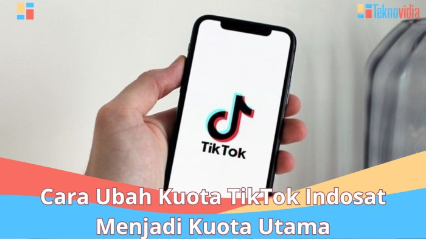

Cara ubah kuota TikTok Indosat jadi kuota khusus TikTok? Duh, nggak usah pusing tujuh keliling! Bayangin, lagi asyik-asyik scroll FYP eh tiba-tiba kuota internet utama udah habis. Drama banget, kan? Tenang, kali ini kita bongkar semua trik dan tipsnya biar kamu bisa tetap eksis di TikTok tanpa takut kehabisan kuota.

Dari cek kuota, pilih paket internet, sampai atasi masalah kuota yang bikin emosi, semua ada di sini. Siap-siap jadi TikTokers sejati!

Artikel ini akan membahas tuntas bagaimana mengubah kuota internet Indosat menjadi kuota khusus TikTok (jika tersedia), cara mengecek kuota internet dan kuota TikTok, rekomendasi paket internet Indosat yang hemat untuk TikTok, serta solusi mengatasi masalah kuota TikTok Indosat. Lengkap banget, deh! Jadi, simak baik-baik ya!

## Cara Mengubah Kuota Internet Indosat Menjadi Kuota TikTok

Duh, lagi asyik-asyik scroll FYP TikTok eh kuota internet udah menipis? Jangan panik dulu, Sobat Hipwee! Meskipun Indosat belum secara resmi menyediakan fitur tukar kuota internet reguler menjadi kuota khusus TikTok, ada beberapa trik yang bisa kamu coba.

Meskipun nggak 100% garansi berhasil, setidaknya ini beberapa opsi yang bisa kamu eksplorasi untuk tetap bisa menikmati konten TikTok tanpa khawatir kuota mepet.

### Metode Perubahan Kuota Internet Indosat Menjadi Kuota TikTok

Sayangnya, Indosat belum menyediakan fitur khusus untuk mengubah kuota internet reguler menjadi kuota TikTok. Jadi, nggak ada kode dial ajaib atau aplikasi khusus yang bisa langsung mengubah jenis kuotanya. Tapi tenang, ada beberapa alternatif yang bisa dicoba.

### Alternatif Mengoptimalkan Kuota untuk TikTok

Karena nggak ada fitur resmi, solusinya adalah mengoptimalkan kuota internet yang sudah kamu miliki agar bisa digunakan untuk TikTok. Berikut beberapa cara yang bisa kamu coba:

- **Menggunakan Paket Kuota Khusus Aplikasi:**Periksa aplikasi MyIM3 atau website Indosat. Mungkin ada paket data khusus yang memberikan akses lebih banyak ke TikTok atau aplikasi media sosial lainnya dengan harga yang lebih terjangkau.

- **Menggunakan WiFi:**Cara paling efektif dan hemat adalah dengan memanfaatkan jaringan WiFi gratis yang tersedia di sekitarmu. Koneksi WiFi akan menghemat kuota internetmu untuk aktivitas lain.

- **Mengatur Pengaturan Aplikasi TikTok:**Pastikan kamu sudah mengaktifkan fitur penghemat data di pengaturan aplikasi TikTok. Fitur ini akan mengurangi penggunaan data saat streaming video.

- **Mengurangi Resolusi Video:**Menonton video TikTok dengan resolusi rendah akan menghemat penggunaan data. Atur kualitas video di pengaturan aplikasi TikTok ke kualitas terendah.

### Perbandingan Metode Penghematan Kuota untuk TikTok

Berikut perbandingan beberapa metode penghematan kuota internet untuk TikTok. Perlu diingat bahwa biaya dan keuntungan bisa bervariasi tergantung paket data yang kamu gunakan.

| Metode | Biaya | Keuntungan | Keterbatasan |
| --- | --- | --- | --- |
| Paket Kuota Khusus Aplikasi | Bergantung pada paket yang dipilih | Akses TikTok lebih banyak dengan harga terjangkau | Terbatas pada paket yang tersedia |
| Menggunakan WiFi | Gratis (jika tersedia WiFi gratis) | Hemat kuota internet | Ketersediaan WiFi yang terbatas |
| Mengatur Pengaturan Aplikasi TikTok | Gratis | Mengurangi penggunaan data | Kualitas video mungkin berkurang |
| Mengurangi Resolusi Video | Gratis | Menghemat penggunaan data | Kualitas video mungkin berkurang |

### Contoh Ilustrasi Perubahan Kuota (Menggunakan Paket Kuota Khusus Aplikasi)

Misalnya, kamu menemukan paket “Kuota TikTok Hemat” di aplikasi MyIM3 seharga Rp 10.000. Paket ini memberikan kuota 2 GB khusus untuk aplikasi TikTok selama 7 hari. Setelah membeli paket ini melalui aplikasi MyIM3, kamu akan menerima SMS konfirmasi pembelian dan pemberitahuan bahwa kuota TikTok telah ditambahkan ke akunmu.

Antarmuka aplikasi MyIM3 akan menunjukkan jumlah kuota TikTok yang tersisa.

Nah, meskipun nggak bisa langsung ubah kuota internet biasa jadi kuota TikTok, setidaknya kamu bisa tetap menikmati TikTok dengan beberapa trik di atas. Selamat mencoba!

## Mengecek Kuota Internet dan Kuota TikTok Indosat

Duh, lagi asyik-asyik scroll FYP TikTok eh tiba-tiba videonya berhenti. Kuota internet habis? Jangan panik dulu, Sob! Sebelum kamu langsung isi ulang pulsa, cek dulu deh kuota internet dan kuota TikTok Indosat kamu. Nggak mau kan, uang kamu kebuang sia-sia gara-gara nggak tahu sisa kuota internetnya berapa?

Mengecek kuota Indosat sekarang gampang banget kok, bisa lewat SMS, aplikasi MyIndosat, atau website resminya. Tapi, yang lebih penting lagi adalah mengetahui cara mengecek kuota TikTok khusus, kalau ada. Soalnya, Indosat kadang punya paket khusus TikTok kan, jadi kuotanya terpisah dari kuota internet utama.

Yuk, kita bahas satu-satu!

### Cara Mengecek Kuota Internet Indosat

Nggak ribet kok, cek kuota internet Indosat bisa dilakukan dengan beberapa cara mudah. Pilih aja yang paling nyaman buat kamu.

- **Via SMS:**Ketik SMS dengan format tertentu, biasanya -123\*7\*1# atau format lainnya (sesuaikan dengan yang berlaku saat ini, ya!), lalu kirim ke nomor 123. Nanti kamu akan menerima balasan SMS yang berisi informasi detail kuota internet kamu, termasuk masa aktifnya.
    
    Contoh tampilan SMS: "Sisa kuota internet Anda: 2 GB. Masa aktif: 20 Oktober 2024."
    
- **Via Aplikasi MyIndosat:**Download dan instal aplikasi MyIndosat di smartphone kamu. Setelah login, biasanya informasi kuota internet akan langsung terlihat di dashboard utama. Desain antarmuka aplikasi ini user-friendly banget, jadi gampang dipahami. Contoh tampilan aplikasi: Terdapat kartu besar yang menampilkan total kuota internet (misalnya 5GB) dan di bawahnya terdapat rincian pemakaian kuota per hari dan progress bar yang menunjukkan persentase kuota yang tersisa.
    
- **Via Website Resmi Indosat:**Kunjungi website resmi Indosat dan login ke akun kamu. Biasanya, informasi detail kuota internet, termasuk masa aktif, akan ditampilkan di halaman utama akun kamu. Mirip dengan tampilan di aplikasi, biasanya akan ada visualisasi grafik yang memperlihatkan pemakaian kuota internet.
    

### Cara Mengecek Kuota TikTok Indosat

Nah, ini dia yang paling penting! Karena nggak semua paket data Indosat memberikan informasi kuota TikTok terpisah. Tapi, jika paket data kamu memang termasuk kuota khusus TikTok, kamu bisa mengeceknya melalui beberapa cara berikut.

- Periksa SMS notifikasi dari Indosat setelah pembelian paket data. Biasanya, SMS tersebut akan mencantumkan informasi detail kuota, termasuk kuota khusus TikTok jika ada. Contoh: "Selamat! Paket TikTok Anda telah aktif. Kuota TikTok: 1 GB."

- Cek melalui aplikasi MyIndosat. Jika ada kuota TikTok terpisah, biasanya akan ditampilkan secara terpisah di bagian detail penggunaan data. Misalnya, akan ada bar yang menunjukkan kuota internet umum dan bar lain yang menunjukkan kuota TikTok.

- Jika kamu nggak menemukan informasi kuota TikTok terpisah di SMS atau aplikasi MyIndosat, kemungkinan besar paket data kamu tidak menyediakan kuota khusus TikTok.

### Contoh Screenshot Informasi Kuota di MyIndosat

Bayangkan tampilan aplikasi MyIndosat. Di bagian atas, terdapat kartu besar yang menampilkan "Total Kuota: 10 GB". Di bawahnya, terdapat dua bar progress yang terpisah. Bar pertama berwarna biru, menunjukkan "Kuota Internet: 7 GB (70%)", sedangkan bar kedua berwarna merah muda, menunjukkan "Kuota TikTok: 3 GB (30%)".

Di bawah bar progress, terdapat rincian pemakaian data per hari dan masa aktif paket.

## Paket Internet Indosat yang Menguntungkan untuk TikTok

Hayo ngaku, siapa di sini yang nggak bisa lepas dari TikTok? Scroll terus menerus, sampai baterai HP minta ampun. Nah, buat kamu para TikTokers sejati yang pakai Indosat, pasti mikir keras dong gimana caranya biar kuota internet nggak cepat habis.

Tenang, Hipwee udah siapkan panduan lengkapnya! Kita bakal bahas paket-paket Indosat yang paling cuan buat kamu yang doyan banget nonton video pendek.

Pilih paket internet yang tepat itu penting banget, soalnya bisa bikin dompet kamu tetap aman dan pengalaman TikTok-an kamu tetap lancar jaya. Nggak mau kan, lagi asyik-asyik nonton video receh eh tiba-tiba kuota habis? Mendingan kita cari tahu dulu paket-paket Indosat yang cocok dan hemat, yuk!

### Rekomendasi Paket Internet Indosat untuk TikTok

Indosat menawarkan berbagai macam paket internet dengan harga dan kuota yang beragam. Untuk kamu para pengguna TikTok yang aktif, memilih paket yang tepat akan sangat berpengaruh. Berikut beberapa rekomendasi paket yang bisa kamu pertimbangkan, dengan catatan harga dan kuota bisa berubah sewaktu-waktu, jadi selalu cek aplikasi MyIndosat ya!

| Nama Paket | Harga | Kuota | Keunggulan |
| --- | --- | --- | --- |
| Contoh Paket A | Rp 20.000 | 10 GB (termasuk kuota khusus TikTok 5 GB) | Kuota TikTok besar, harga terjangkau. |
| Contoh Paket B | Rp 30.000 | 15 GB (termasuk kuota khusus TikTok 7 GB) | Kuota lebih besar, cocok untuk penggunaan intensif. |
| Contoh Paket C | Rp 50.000 | 30 GB (termasuk kuota khusus TikTok 15 GB) | Kuota sangat besar, cocok untuk pengguna berat TikTok dan aplikasi lain. |

Tabel di atas hanya contoh, ya. Sebaiknya kamu cek langsung di aplikasi MyIndosat atau website resmi Indosat untuk informasi terbaru dan paket yang sesuai dengan kebutuhanmu.

### Strategi Penghematan Kuota Internet saat Menggunakan TikTok

Selain memilih paket yang tepat, ada beberapa tips yang bisa kamu lakukan untuk menghemat kuota internet saat menggunakan TikTok:

- Gunakan koneksi WiFi sebisa mungkin.

- Atur kualitas video menjadi rendah (hemat data).

- Hindari menonton video dengan resolusi tinggi.

- Jangan lupa untuk mematikan data seluler saat tidak digunakan.

- Bersihkan cache aplikasi TikTok secara berkala.

Dengan menerapkan tips di atas, kamu bisa memaksimalkan kuota internetmu dan tetap menikmati konten-konten seru di TikTok tanpa khawatir kuota cepat habis.

### Memilih Paket Internet yang Sesuai Kebutuhan

Memilih paket internet yang tepat bergantung pada seberapa sering kamu menggunakan TikTok. Jika kamu hanya menonton video sesekali, paket dengan kuota kecil sudah cukup. Namun, jika kamu pengguna TikTok aktif yang sering scroll dan menonton video dalam waktu lama, paket dengan kuota besar akan lebih menguntungkan.

Perhatikan juga keunggulan paket, seperti adanya kuota khusus untuk TikTok atau bonus kuota lainnya.

Jangan lupa selalu cek update paket internet Indosat secara berkala, karena mereka sering menawarkan promo dan paket baru yang lebih menarik. Jadi, tetap update ya!

## Mengatasi Masalah Kuota TikTok Indosat

Duh, lagi asyik-asyik scroll FYP TikTok eh kuota Indosat mendadak habis? Atau malah koneksi lemot nggak karuan? Tenang, _guys_! Nggak perlu panik. Hipwee bakal kasih solusi jitu biar kamu bisa kembali berselancar di lautan video TikTok tanpa hambatan.

Kita bahas beberapa masalah umum dan cara mengatasinya, biar kamu nggak sampai _galau_lagi.

### Masalah Kuota TikTok Indosat Habis Cepat

Kuota internet, terutama untuk aplikasi boros kuota seperti TikTok, seringkali jadi momok yang bikin dompet menjerit. Ada beberapa faktor yang bisa menyebabkan kuota TikTok Indosat kamu habis dengan cepat. Mulai dari kualitas koneksi yang kurang stabil, hingga pengaturan aplikasi yang kurang tepat.

- **Kualitas Jaringan:**Sinyal Indosat yang lemah atau tidak stabil di lokasi kamu bisa membuat aplikasi TikTok terus-menerus _buffering_dan akhirnya menghabiskan kuota lebih banyak.

- **Resolusi Video:**Menggunakan resolusi video yang tinggi (misalnya, 1080p atau lebih) akan menghabiskan kuota lebih banyak dibandingkan resolusi rendah (misalnya, 360p).

- **Background Process:**Pastikan TikTok tidak berjalan di _background_terus-menerus. Tutup aplikasi setelah selesai digunakan.

- **Update Aplikasi:**Aplikasi TikTok yang belum diperbarui bisa jadi kurang efisien dalam penggunaan data.

### Masalah Gagal Terhubung ke TikTok

Nggak cuma kuota yang cepat habis, masalah gagal terhubung ke TikTok juga sering bikin bete. Ada beberapa hal yang bisa menyebabkan masalah ini, dan untungnya, kebanyakan bisa kamu atasi sendiri.

- **Mode Pesawat:**Pastikan mode pesawat di HP kamu sudah dimatikan.

- **Pengaturan Data Seluler:**Pastikan data seluler di HP kamu sudah diaktifkan dan TikTok memiliki izin akses data.

- **Restart HP:**Kadang, _restart_HP bisa mengatasi masalah koneksi yang tiba-tiba terputus.

- **Periksa Koneksi Internet:**Pastikan koneksi internet kamu berfungsi dengan baik. Coba buka aplikasi lain yang membutuhkan koneksi internet untuk memastikannya.

### Langkah-Langkah Troubleshooting Kuota TikTok Indosat, Cara ubah kuota tiktok indosat

Jika masalah masih berlanjut setelah mencoba beberapa solusi di atas, berikut langkah-langkah _troubleshooting_tambahan yang bisa kamu coba:

1. **Hapus Cache dan Data TikTok:**Buka pengaturan HP, cari aplikasi TikTok, lalu hapus cache dan data aplikasi. Ini akan menghapus data sementara yang mungkin mengganggu kinerja aplikasi.

3. **Instal Ulang Aplikasi TikTok:**Jika menghapus cache dan data tidak berhasil, coba instal ulang aplikasi TikTok.

5. **Hubungi Customer Service Indosat:**Jika masalah masih belum teratasi, segera hubungi customer service Indosat untuk mendapatkan bantuan lebih lanjut.

> Tips hemat kuota TikTok: Gunakan mode hemat data, batasi durasi menonton video, dan hindari menonton video beresolusi tinggi. Download video hanya jika benar-benar diperlukan.

### Cara Menghubungi Customer Service Indosat

Jika semua upaya di atas masih belum membuahkan hasil, menghubungi customer service Indosat adalah langkah terakhir. Kamu bisa menghubungi mereka melalui berbagai saluran, seperti telepon, email, atau media sosial. Pastikan kamu memiliki informasi yang lengkap, seperti nomor telepon, nomor Indosat, dan detail masalah yang kamu alami.

## Ringkasan Penutup: Cara Ubah Kuota Tiktok Indosat

Jadi, nggak perlu khawatir lagi kehabisan kuota saat asyik main TikTok. Dengan memahami cara cek kuota, memilih paket yang tepat, dan tahu langkah-langkah mengatasi masalah kuota, aktivitasmu di TikTok akan tetap lancar jaya. Selamat berkreasi dan tetap eksis di dunia TikTok!

## Tanya Jawab Umum

**Apa yang harus dilakukan jika kuota TikTok Indosat saya tiba-tiba hilang?**

Segera hubungi customer service Indosat untuk melaporkan masalah tersebut dan meminta pengecekan.

**Apakah ada batasan penggunaan kuota TikTok khusus?**

Tergantung paket yang dipilih. Cek syarat dan ketentuan paket yang Anda beli.

**Bisakah kuota utama saya dikonversi menjadi kuota TikTok tanpa biaya tambahan?**

Kemungkinan besar tidak. Biasanya ada biaya atau perlu membeli paket khusus.

**Bagaimana cara mengetahui apakah Indosat menawarkan kuota khusus TikTok saat ini?**

Cek aplikasi MyIndosat, website resmi Indosat, atau hubungi customer service.
