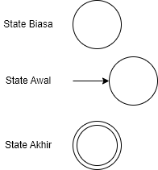
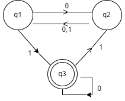

## Definisi Otomata

Jenis mesin sederhana yang dapat menerima inputan, dapat melakukan pemyimpanan sementara, serta dapat mengambil keputusan atau kesimpulan dari input yang diberikan.

## Simbol State

## Table

|  | 0 | 1 |
| --- | --- | --- |
| q1 | q2 | q3 |
| q2 | q1 | q1 |
| q3 | q3 | q2 |

## Cara Baca Table

- q1 diberi inputan 0 menuju ke q2
- q1 diberi inputan 1 menuju ke q3
- q2 diberi inputan 0 menuju ke q1
- q2 diberi inputan 1 menuju ke q1
- q3 diberi inputan 0 menuju ke q3
- q3 diberi inputan 1 menuju ke q2

**Baca juga**: [Pengertian, Jenis, dan Contoh Soal Finite State Automata](https://ajiekusumadhany.com/pengertian-jenis-finite-state-automata/)

## Contoh

**1.Misal diberi input 11001** maka: q1->q3->q2->q1->q2->q1 Hasilnya: inputan 11001 -> tidak diterima (ditolak) karena berhenti tidak di state terakhir.

**2.Misal diberi input 110001** maka: q1->q3->q2->q1->q2->q1->q3 Hasilnya: inputan 110001 -> diterima karena berhenti di state terakhir.
