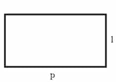

Persegi panjang adalah sebuah bangun datar dua dimensi yang memiliki empat sisi, persegi panjang memiliki dua sisi bersebrangan dengan panjang yang sama, serta memiliki 4 sudut dengan besar yang sama yaitu: 90 derajat.



## Contoh Persegi Panjang

Contoh beberapa objek yang memiliki bentuk persegi panjang adalah buku, papan tulis, kertas, penggaris dan lain-lain.

## Rumus Luas Persegi Panjang

Untuk menghitung luas dari persegi panjang dapat menggunakan rumus panjang (P) dikali lebar(L).

| Rumus Persegi Panjang |
| --- |
| Luas = P x L |

## Program Java: Menghitung Luas Persegi Panjang

Berikut ini adalah contoh program java untuk menghitung luas persegi panjang:

```
import java.util.Scanner; 
public class HitungLuas { 
public static void main(String[] args) 
{ 
Scanner input = new Scanner(System.in);
System.out.print("Masukkan panjang: "); 
double panjang = input.nextDouble(); 
System.out.print("Masukkan lebar: "); 
double lebar = input.nextDouble(); 
double luas = panjang * lebar; 
System.out.println("Luas persegi panjang adalah: " + luas); 
} 
}
```

**Baca Juga:** [Program Java Menghitung Luas Lingkaran](https://ajiekusumadhany.com/program-java-menghitung-luas-lingkaran/)

```
import java.util.Scanner;
```

Berfungsi untuk mengimport library scanner dari java, agar user bisa memasukkan inputan panjang dan lebar.

```
Scanner input = new Scanner(System.in);
```

Kemudian saya membuat objek Scanner dengan nama input.

```
System.out.print("Masukkan panjang: ");
```

Untuk menampilkan tulisan "Masukkan panjang: "

```
double panjang = input.nextDouble();
```

**double** adalah tipe data untuk bilangan desimal, agar angka yang dibelakang koma tetap ditampilkan. **panjang** adalah nama variable, digunakan untuk menyimpan data. kemudian **input.nextDouble();** agar pengguna bisa memberikan inputan.

Jadi nantinya angka yang di input oleh pengguna akan disimpan kedalam variable panjang dengan tipe data double.

```
System.out.print("Masukkan lebar: ");
```

Untuk menampilkan tulisan "Masukkan lebar: "

```
double lebar = input.nextDouble();

```

Pengguna memberi inputan kemudian disimpan kedalam variable lebar dengan tipe data double.

```
double luas = panjang * lebar;
```

Hasil perkalian dari angka inputan yang tersimpan dalam variable panjang dan lebar, disimpan kedalam variable luas dengan tipe data double.

```
System.out.println("Luas persegi panjang adalah: " + luas);

```

Untuk menampilkan atau mencetak tulisan "Luas persegi panjang adalah:" dan juga mencetak angka hasil perkalian panjang dan lebar yang tersimpan dalam variable luas.

Jadi itulah contoh program java untuk menghitung luas persegi panjang yang saya pelajari.
