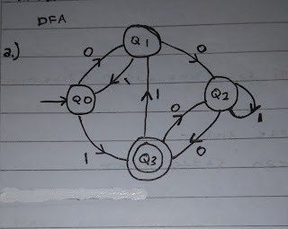
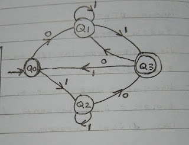
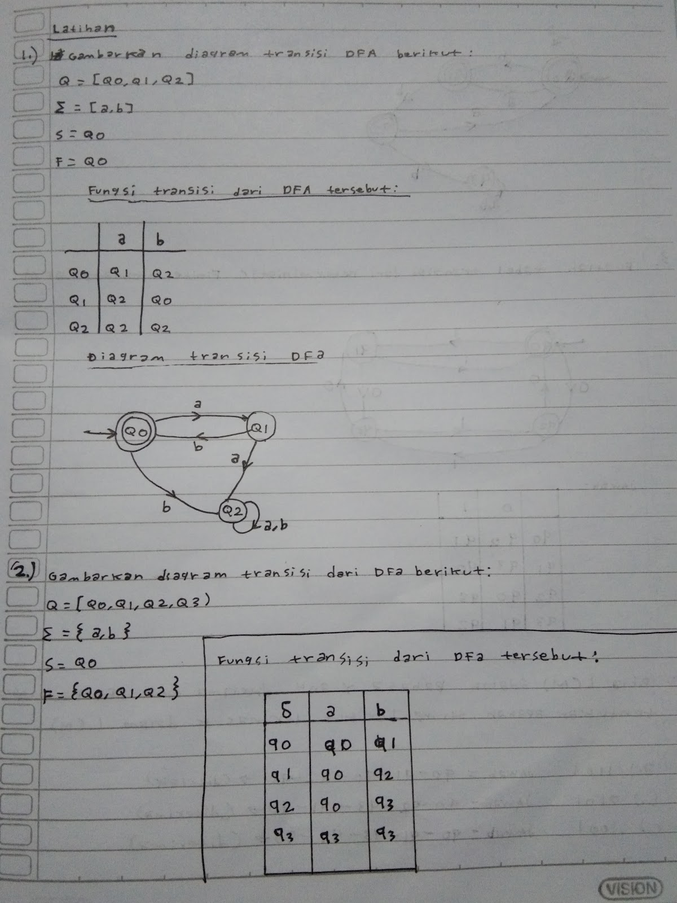
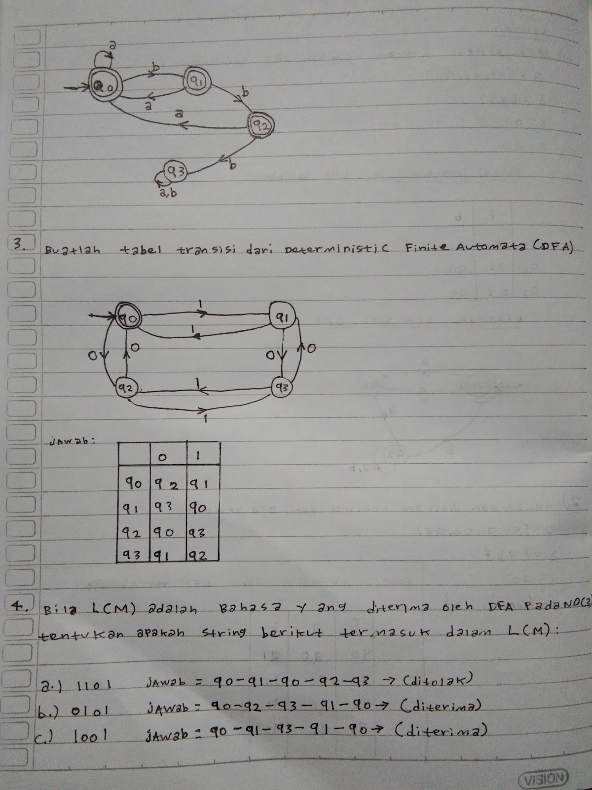

## Apa itu Finite State Automata?

Finite state automata (FSA), atau dalam bahasa Indonesia disebut juga mesin automata berhingga, adalah model matematis yang digunakan untuk merepresentasikan sebuah sistem yang memiliki keterbatasan input yang dapat diterima.

Finite state automata (FSA) dibagi menjadi 2 macam yaitu:

1. Deterministic Finite Automata (DFA) : Mesin automata yang sudah teratur
2. Non Deterministic Finite Automata (NDFA) : Mesin automata yang belum teratur

Untuk merancang sebuah mesin automata terdiri dari 5 komponen:

M = (Q , Σ , δ , S , F )

- Q = himpunan state
- Σ = himpunan simbol input
- δ = fungsi transisi δ : Q × Σ
- S = state awal / initial state , S ∈ Q
- F = state akhir, F ⊆ Q

## Perbedaan DFA dan NDFA

Berikut adalah perbedaan antara Deterministic Finite Automata (DFA) dengan Non Deterministic Finite Automata (NDFA).

### Deterministic Finite Automata (DFA)

- Sudah teratur
- Jika diberikan inputan hanya mempunyai satu keputusan yaitu: diterima atau ditolak
    - Diterima: jika berhenti pada state terakhir
    - Ditolak: jika berhenti tidak pada state terakhir
- Laku dijual di pasar

### Non Deterministic Finite Automata (NDFA)

- Belum teratur
- Jika diberi inputan mempunyai beberapa kemungkinan, yaitu:
    - Diterima: jika berhenti di state akhir
    - Ditolak: jika berhenti bukan di state akhir
    - Macet: jika inputan belum habis tapi jalur sudah tidak ada
- Belum laku / tidak laku dijual

**Baca juga**: [Definisi Otomata dan Teori Bahasa](https://ajiekusumadhany.com/definisi-otomata-dan-teori-bahasa/)

## Contoh Soal

**A**. Gambarkan FSA jika diketahui Fungsi Transisi Berikut:

| δ | 0 | 1 |
| --- | --- | --- |
| Q0 | Q1 | Q3 |
| Q1 | Q2 | Q0 |
| Q2 | Q3 | Q2 |
| Q3 | Q2 | Q1 |

Jawab:

Misal diberi inputan 1100101 maka: q0-q3-q1-q2-q3-q1-q2-q2 -(Ditolak)

Misal diberi inputan 1010111 maka: q0-q3-q2-q2-q3-q1-q0-q3 -(Diterima)

**B**. Gambarkan FSA jika diketahui Fungsi Transisi Berikut:

| δ | 0 | 1 |
| --- | --- | --- |
| Q0 | Q1 | Q2 |
| Q1 | \- | Q1,Q3 |
| Q2 | Q3 | Q2 |
| Q3 | Q1 | Q0 |

Jawab:

Misal diberi inputan 1100011 maka: q0-q2-q2-q2-q3-q1-q1 -(Ditolak) q0-q3-q2-q2-q3-q1-q0-q3 -(Diterima)

## Latihan Soal

 
