## **Apa itu Literasi Informasi?**

**Menurut Bundy**: Literasi informasi adalah seperangkat kemampuan dan pengetahuan  yang dimiliki seseorang untuk mengetahui kapan informasi dibutuhkan, kemampuan untuk menempatkan, mengevaluasi dan menggunakan secara efektif kebutuhan informasinya.

**Menurut Bruce**: Literasi informasi merupakan sebuah kemampuan dalam mengakses, mengevaluasi, mengorganisir dan menggunakan informasi dalam proses belajar, pemecahan masalah, membuat suatu keputusan formal dan informal dalam konteks belajar, pekerjaan, rumah maupun dalam pendidikan.

"Untuk melek informasi, seseorang harus dapat mengenali kapan informasi dibutuhkan dan memiliki kemampuan untuk menemukan, mengevaluasi, dan menggunakan secara efektif informasi yang dibutuhkan". (Komite Presiden tentang Literasi Informasi. 1989, hal. 1).

Seseorang dikatakan melek informasi berarti literat terhadap informasi

## **Kerangka** **Literasi Informasi** **Digital**

- Secara umum yang dimaksud dengan literasi informasi digital adalah kemampuan menggunakan teknologi informasi dan komunikasi (TIK), untuk menemukan, mengevaluasi, memanfaatkan, membuat dan mengkomunikasikan konten/informasi, dengan kecakapan kognitif maupun teknikal.
- Kemampuan dasar teknis untuk menjalankan perangkat komputer dan internet.
- Memahami dan mampu berpikir kritis serta melakukan evaluasi media digital serta mampu merancang konten komunikasi.

## **Mengapa perlu belajar Literasi Informasi?**

Semua orang dihadapkan dengan berbagai jenis sumber informasi yang berkembang sangat pesat, namun belum tentu semua informasi yang ada dan diciptakan tersebut dapat dipercaya dan sesuai dengan kebutuhan informasi para pencari informasi.

Dengan memiliki literasi informasi maka mahasiswa mampu berpikir secara kritis dan logis serta tidak mudah percaya terhadap informasi yang diperoleh sehingga perlu mengevaluasi terlebih dahulu informasi yang diperoleh sebelum menggunakannya.

## **Manfaat Literasi Informasi?**

- Membantu mengambil keputusan
- Menjadi manusia pembelajar
- Menciptakan pengetahuan baru

Mahasiswa yang literat akan berusaha belajar mengenai berbagai sumber daya informasi dan cara penggunaan sumber-sumber informasi

## **Kriteria Literasi Informasi**

Menurut Shapiro, terdapat 7 (tujuh) keterampilan yang dibutuhkan dalam era digital yaitu:

—**Tool** **literacy**: kemampuan memahami dan menggunakan teknologi informasi secara konseptual dan praktikal

—**Resources** **literacy**: kemampuan memahami bentuk, format, lokasi, dan cara mendapatkan sumber daya informasi terutama jaringan informasi yang terus berkembang.

—**Social** **structural literacy**: pemahaman tentang bagaimana informasi dihasilkan oleh berbagai pihak di dalam sebuah masyarakat.

—**Research** **literacy**: yaitu kemampuan menggunakan peralatan berbasis teknologi informasi sebagai alat riset.

—**Publishing** **literacy**: kemampuan untuk menyusun dan menerbitkan publikasi dan ide ilmiah ke kalangan masyarakat dengan memanfaatkan komputer dan internet.

—**Emerging** **technology literacy**: kemampuan yang memungkinkan seseorang untuk terus menerus menyesuaikan diri dan mengikuti perkembangan tekhnologi

—**Critical** **literacy**: kemampuan melakukan evaluasi secara kritis  terhadap untung rugi menggunakan teknologi telematika dalam kegiatan ilmiah.

## **karakteristik  individu yang telah terliterasi informasi:**

- Memahami bahwa informasi yang akurat dan tepat adalah dasar dari pengambilan keputusan.
- Memahami kebutuhan akan informasi
- Dapat mencari informasi yang diinginkan
- Dapat menyusun pertanyaan berdasarkan informasi yang diinginkan
- Dapat mengidentifikasi potensi sumber-sumber informasi
- Dapat membangun strategi pencarian informasi yang sukses
- Dapat mengakses sumber informasi termasuk teknologi berbasis komputer dan teknologi lainnya
- Dapat mengevaluasi informasi darimanapun sumbernya
- Dapat mengorganisasikan informasi untuk kebutuhan praktis
- Dapat mengintegrasikan informasi yang diperoleh kedalam pengetahuan yang telah dimiliki
- Dapat menggunakan informasi untuk berpikir kritis dan memecahkan masalah
- Dapat menggunakan informasi secara etis dan legal

## MELACAK KARAKTER MASYARAKAT DAN KEPEMIMPINAN DIGITAL

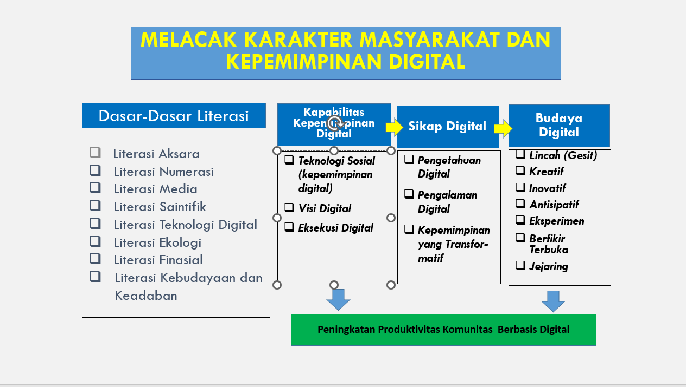

* * *

## Manfaat Literasi Informasi

- Membantu dalam merumuskan masalah serta memecahkannya, pola pikir ini yang dinamakan analisis-sintesis
- Membantu menghasilkan pengetahuan baru yang berkualitas. bagi diri-sendiri ,pada bidang (ilmu) pengetahuan ybs
- Meningkatkan kemampuan pustakawan untuk menjadi mitra pengguna.
- Berguna memenangkan kompetisi

## Menjadi Manusia Literasi

- Kemampuan dalam merumuskan masalah
- Memecahkan masalah
- Mampu mengkomunikasikan ide dengan baik.
- Memiliki argumen yang benar dan nalar yang baik.
- Jika ada informasi yang baru maka tidak raguragu mempelajarinya, ditelaah secara kritis dan akan menolak jika ada penyimpangan nalar.
- Jadi secara ringkas jika anda memiliki pandangan kritis maka anda sebagai manusia yang mempunyai kemampuan literasi informasi

## Pendorong Perlunya Kebutuhan Informasi Mahasiswa

- Tugas Dosen
- Materi Kuliah
- Peminatan, Pengamatan dan Pengalaman
- Pengembangan Kepribadian
- Pengetahuan umum yang ingin diketahui
- Peristiwa yang menarik perhatian

## Tahapan Literasi Informasi

1. Analisis Situasi
2. Rumusan Masalah
3. Tujuan

### Analisis Situasi:

- Pengumpulan Informasi
- Brainstorming
- Mengajukan Pertanyaan
- Memvisualisaikan Pemikiran

## Pengumpulan Informasi

Mencari informasi dan melihat apa yang dikatakan/diketahui oleh orang lain tentang suatu topic

Informasi berasal dari

- Membaca buku, ensiklopedia, situs, mendengar radio, menonton TV
- Diskusi dengan dosen, guru, asisten dosen, atasan atau rekan
- Bergabung dengan e-forum, milis, grup social media yang berhubungan dengan topic

## Brainstorming

Adalah teknik yang digunakan untuk menggali, mempertajam, dan mengembangkan gagasan, hubungan antar gagasan, atau pemecahan masalah

**Mengajukan pertanyaan:**

- Apa yang akan ditulis
- Mengapa
- Pertanyaan Komplek dan mendasar

**Memvisualisasikan Pikiran**:

- Lineargram
- Sekuens
- Spidergram
- Siklus
- Tabel Perbandingan

## Lineargram

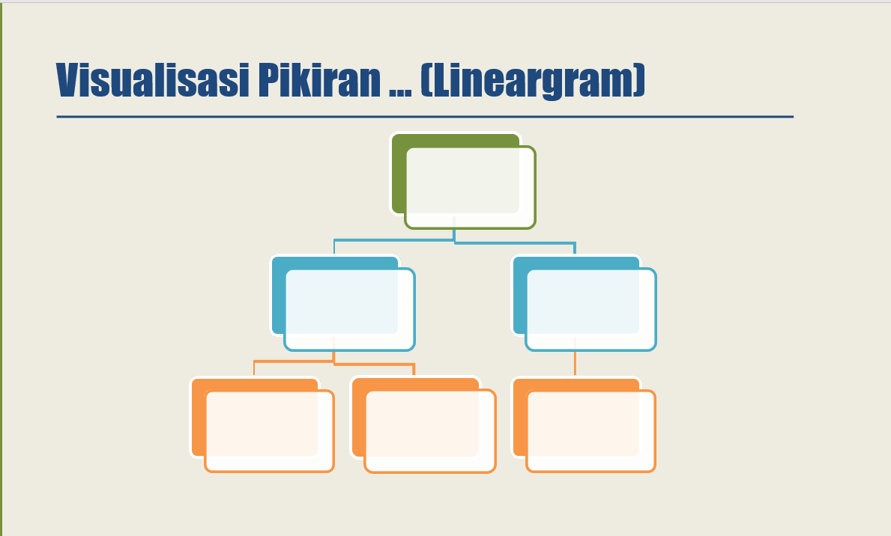

## Sekuen

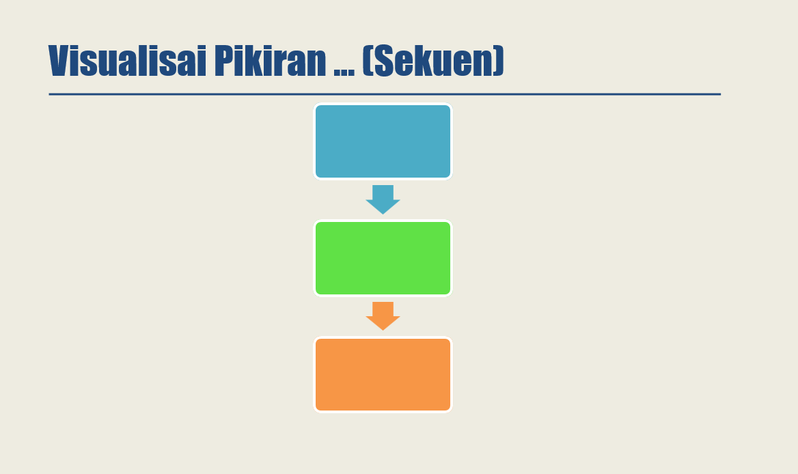

## Spidergram

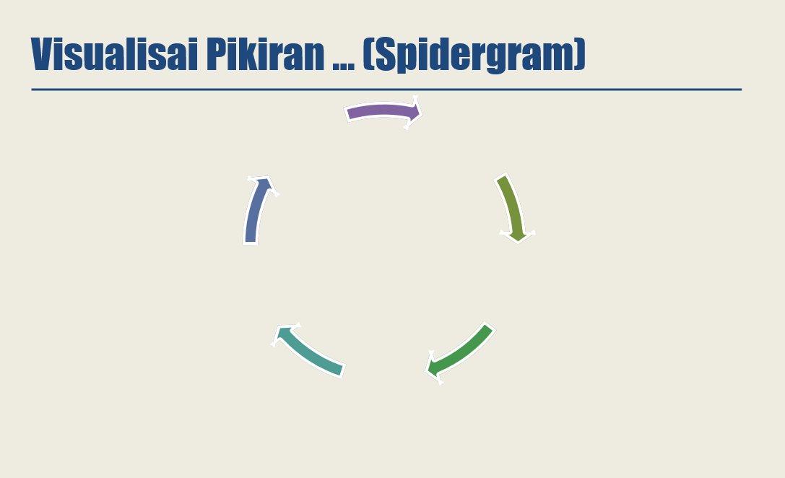

## Visualisai Pikiran ... (Tabel)

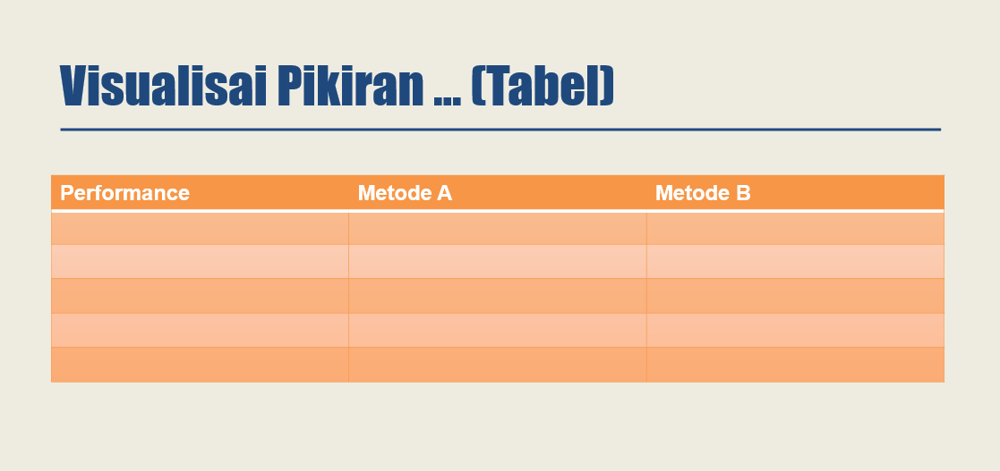

 

## Visualisasi Pikiran Lainnya

- Kerangka Interaksi
- Kerangka Pemecahan Masalah
- Webbing
- Concept Mapping
- Idea Mapping

## Conciseness (Kepadatan isi)

Menghilangkan kata-kata pembuka yg berlebihan (pretentious) seperti:

- Dengan memperhatikan....
- Setelah menimbang, mendengar...
- Tak perlu dikatakan lagi bahwa...
- Sudah bukan rahasia lagi bila...

Mengatasi paragraf pendek dengan menggabungkan gagasan ke dalam satu kalimat topik yang lebih luas dan dijadikan kalimat topik paragraf tunggal

Serangkaian paragraph pendek dapat mengurangi kepadatan isi dan itu berarti memecahkan satu gagasan kedalam beberapa paragraf.

* * *

## Mencari Lokasi Informasi

- Tujuannya adalah mampu menentukan sumber informasi yang sesuai dengan kebutuhan, menelusur dan mengumpulkan informasi dalam bentuk bentuk literatur dengan tepat
- Sumber Lokasi dapat diakses langsung maupun melalui internet

## Sumber Informasi

- Dokumen
- Manusia
- Lembaga
- Benda
- Situasi

### Dokumen

- Textbook
- Ensiklopedi
- Kamus
- Majalah
- Jurnal
- Skripsi
- Laporan Penelitian
- Film dll

### Manusia sebagai Sumber Informasi

- Aktor
- Penulis
- Dosen
- Peneliti
- Pemimpin
- Informan dll

### Lembaga, Benda dan Situasi

- Lembaga baik Pemerintah maupun swasta
- Benda dan Situasi: Pakaian yang dikenakan seseorang merupakan informasi bagi Desainer

## Karakteristik Sumber Informasi

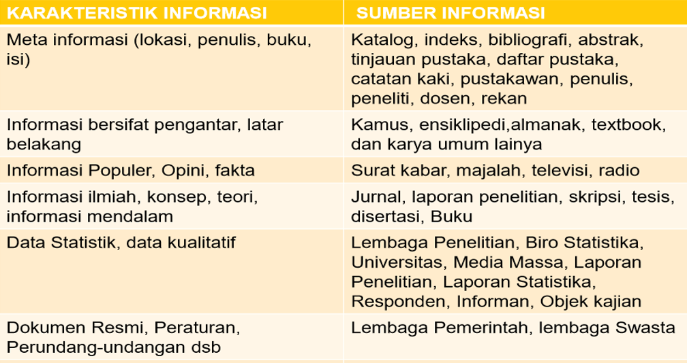

## Tahapan Searching

- Mengetahui Kebutuhan Informasi
- Mengidentifikasi Alat Penelusuran yang Tepat
- Menyusun Strategi Penelusuran

## Identifikasi informasi yang dibutuhkan

1. Apa tugas kuliah yang membuat Anda menggunakan search engine untuk mencari sumber informasi di Internet?
2. Bagaimana membentuk kata kunci untuk pencarian dan bahasa apa yang cenderung digunakan?
3. Atribut (judul, URL dan deskripsi) apa yang diperhatikan ketika mengamati hasil pencarian yang disajikan oleh mesin pencari dan mengapa atribut itu yang diperhatikan?
4. Ketika mengamati daftar hasil pencarian, apakah posisi hasil di halaman pertama penting?
5. Apabila tidak menemukan sumber informasi yang dianggap layak untuk dievaluasi pada halaman pertama hasil pencarian, apa yang dilakukan?
6. Apa dasar kepercayaan pada sumber informasi

## Mengetahui Kebutuhan Informasi

- Ada Kaitanya Dengan Rumusan Masalah
- Pengetahuan yang dimiliki
- Misal rumusan masalahnya adalah Pengaruh Video on Demand terhadap industrialisasi film, maka dari daftar pustaka yang dimiliki ada jurnal yang pernah ditulis oleh “x” di Negara “Y”

## Tool untuk Searching

- Daftar buku di Perpustakaan
- Search Engine (yahoo.com, bing.com, yahoo.com, etc)

## Teknik Searching

- Kata Kunci bisa judul, pengarang, topik, penerbit dll
- Boolean Operators ( AND, OR, NOT)
- Tanda kutip (“)
- Pemotongan kata atau penggunaan akar kata

### Or

- Ingin mencari sumber informasi yang mengandung salah satu dari istilah-istilah yang dicari
- Biasanya digunakan untuk Sinonim, kata-kata yang berhubungan atau istilah yang lebih luas
- Misal remaja OR anak muda
- Friendship OR pertemanan OR persahabatan

### Not

- Untuk menemukan sumber informasi yang mengandung suatu kata tetapi tidak mengandung kata lain
- Biasanya untuk membatasi cakupan suatu istilah atau menghindari tercampurnya istilah yang sama
- Misal : Asia NOT India
- Stres NOT psychology

### Tanda (“ ...”)

- Mencari sumber informasi yang mengandung frasa yang dicari
- Memilih kata-kata yang bersebelahan
- Misal : “kasiat jahe merah”

* * *

## Evaluasi Informasi

- Proses melakukan evaluasi terhadap suatu informasi serta sumbernya, meliputi analisis mulai dari sumber sampai isi informasinya, serta dampaknya terhadap penerima informasi.
- Hal yang harus diperhatikan pada waktu melakukan evaluasi awal: penilaian dari segi relevansi, kredibilitas, dan kemutakhiran suatu informasi.

## Relevansi

- Kesesuaian antara kebutuhan informasi dengan masalah yang akan dibahas.
- Identifikasi dapat dilakukan dengan melihat: judul, daftar isi, abstrak, dan pendahuluan/ tujuan suatu sumber (cetak, digital, situs)
- Contoh: Trust istilah yang biasa digunakan dalam bidang psikologi dan ekonomi
    - Trust psikologi: kepercayaan
    - Trust ekonomi: penggabungan usaha yg memiliki kepentingan sama

## Pengecekan Relevansi Informasi

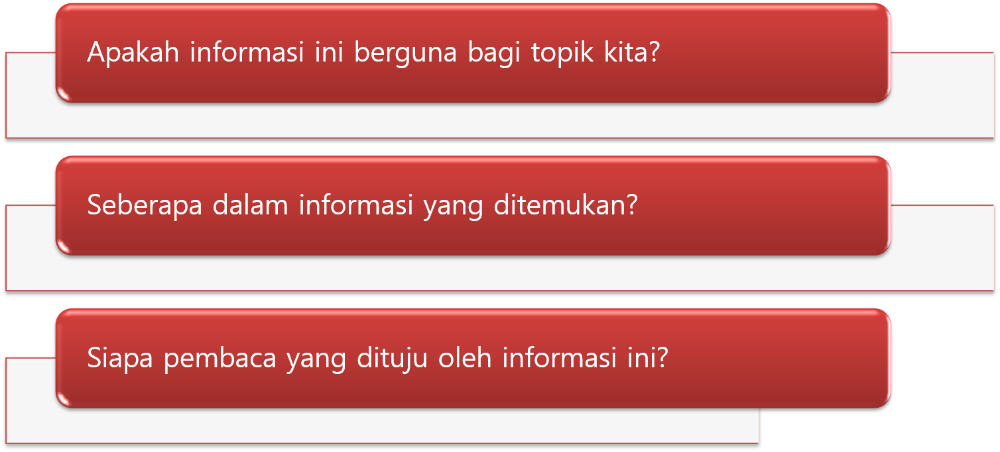

## Kredibilitas

- Menentukan sejauhmana informasi dapat dipercaya kualitas dan kebenarannya. Hal ini dapat dilihat dari penanggungjawabnya. **Contoh**: dalam bidang marketing, informasi terkait produk baru akan lebih dipercaya bila yang menyampainya adalah _market_ _leader_

- Apabila suatu informasi semakin banyak tahap yang harus dilalui (ada penulis, editor, mitra bestari, pembimbing) maka semakin dapat dipertanggungjawabkan publikasi tersebut. **Contoh**: Bagaimana kualitas tulisan di blog yang tidak ada lembaga penerbitnya, tidak ada editornya, apalagi peer reviewnya atau tinjauan oleh pakar?

- Dari sisi pemanfaatannya/ keterpakaian: berapa banyak diacu/ citation index/ impact factor yang menunjukkan rata-rata kutipan terhadap artikel terbaru yang dipublikasi dalam jurnal tersebut

## Penanggung Jawab

- Sejauh mana orang/lembaga yang menciptakan karya, menerbitkan, dan mensponsori karya itu memiliki hak dan kemampuan untuk memproduksi informasi tersebut.
- Motivasi bisnis, politik, atau motivasi lain dibalik proses penciptaan karya dapat mengurangi kredibilitas suatu sumber informasi
- Kredibilitas seorang pencipta karya dapat dinilai melalui biografinya, terutama latar belakang pendidikan, kariernya, karyanya, dan penghargaan yang pernah diterima.
- Latar belakang dan kualifikasi penulis dapat dilihat dalam Directory of Published Writers ([http://www.writers.net](http://www.writers.net/)) dan situs organisasi tempat penulis tersebut (Universitas, lembaga riset)

## Kredibilitas Lembaga

- Kepemilikan: Pemerintah vs swasta
- Bidang Pekerjaan: Komersial vs non komersial
- Lembaga pendidikan, lembaga profesi, lembaga pemerintahan. Lembaga non komersial, baru kemudian lembaga lainnya

Tanyakan tujuan organisasi tersebut? Cari tahu apakah mereka berusaha menjual sesuatu?Untuk kepentingan siapa karya tersebut?

## Domain URL

Bidang ilmu/ profesi umumnya memiliki asosiasi

- FDGI (Federasi Dokter Gigi Indonesia)

Jenis lembaga dapat dilihat dari dama domain pada URL-nya

- .edu atau .ac - lembaga pendidikan
- .gov - lembaga pemerintahan
- .com – lembaga komersial
- .net – internet service provider
- .org – organisasi (non komersial)

Cek informasi yang menjelaskan tentang situs melalui:

- about us, background

Jika URL memiliki tanda

- meskipun .edu atau .com maka situs tersebut bersifat personal dan isinya bukan merupakan tanggung jawab lembaga

## Proses Pembuatan

- Kredibilitas jurnal ilmiah dapat dilhat dari proses penelaahan (review) oleh pakar yang sesuai bidang ilmu (mitra bestari atau _peer_). Jurnal yang melalui proses tersebut hampir dapat dipastikan bermutu.

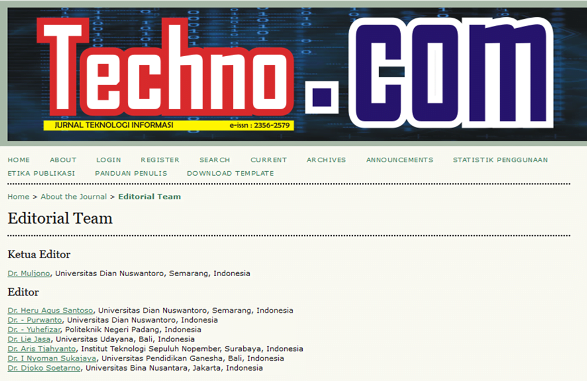

- Komentar para ahli/ resensinya biasanya ada di bagian belakang buku/ media online (Google books, Amazon.com)

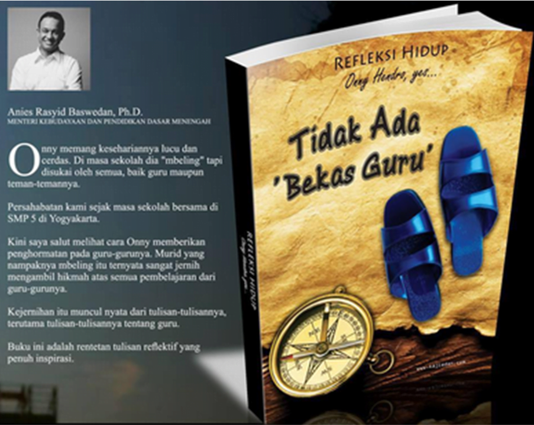

## Pemanfaatan/ Citation Index

- Kredibilitas publikasi berkala ilmiah, dapat dilihat dari _impact factor,_ untuk mengukur berapa sering artikel dikutip dalam suatu kurun waktu

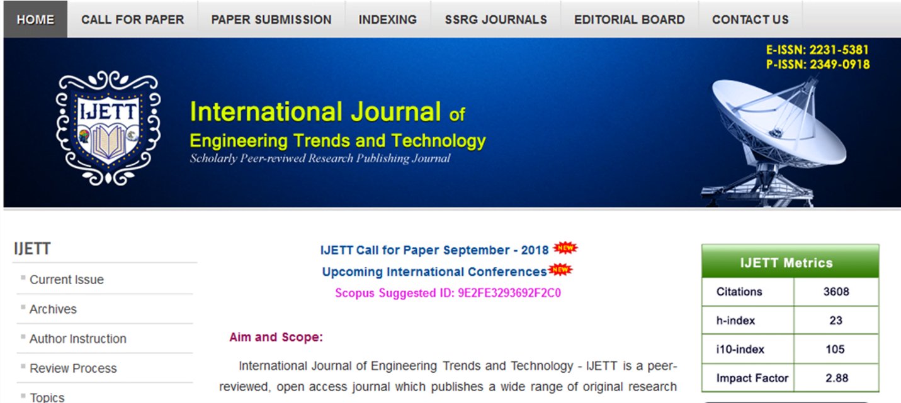

## Kemutakhiran

- Buku dengan judul yang sama/ teori yang sama namun sudah memiliki edisi terbaru, maka kutip dari sumber yang paling baru
- Halaman Judul
- Halaman Daftar Pustaka
- Kapan sumber informasi pertama kali diterbitkan?
- Kapan terakhir direvisi?

## Hal yang Perlu Diperhatikan Saat Menggunakan Informasi

1. Sejauh mana informasi yang disajikan relevan?
2. Sejauh mana informasi yg disajikan akurat?
3. Sejauh mana karya tersebut objektif?
4. Sejauh mana kemutakhiran informasi tersebut?
5. Sejauh mana kelengkapan/ kedalaman suatu informasi?
6. Sejauh mana keberdampakan informasi tersebut?
7. Sejauh mana metodologi penelitian dari informasi tersebut?

* * *

## Penggunaan Informasi

### TUJUAN

- Mahasiswa mampu “membaca” dengan kritis informasi yang diperoleh, dan membuat “catatan” yang tepat untuk mengingat informasi dan sumber informasi yang di “baca”.

### Pencatatan yang Efisien

- Kemampuan otak manusia untuk menyimpan informasi terbatas.
- Setelah menemukan informasi untuk tulisan and memutuskan akan memanfaatkannya maka sebaiknya dibuat catatan yang dirasa penting dan kemungkinan besar akan dikutip.
- 2 macam catatan yang bisa digunakan yaitu: Bibliografi, dan Isinya
- Tujuannya: pada saat menulis, tidak disibukkan dengan mencari-cari kembali informasi yang ingin digunakan di antara ratusan halaman buku, kertas dan dokumen-dokumen yang pernah dibaca.

### Catatan Bibliografi & Cacatan Isi

- Catatan Bibliografi: berguna untuk membantu menemukan kembali sumber informasi yang sudah dibaca di kemudian hari. _Meliputi: Lokasi (jika ada), Pengarang, Judul, Penerbit, Kota Terbit, Tahun Terbit, Halaman, dan sebagainya._

- Cacatan Isi: berguna untuk membantu membaca dengan kritis sumber informasi, dan menemukan kembali dengan mudah informasi tersebut pada waktu diperlukan. _Meliputi__: Kutipan, Frasa, Ringkasan, dan Komentar tentang isi)_

- _Catatan-catatan bisa dibuat_ _di komputer_ _(Ms. Word atau Mendeley),_ _Kartu-kartu indeks_ _berukuran 10 x 15 cm._
- _Catatan isi disusun berdasarkan_ _topik_ _dan cacatan bibliografi disusun menurut_ _abjad pengarang atau judul_ _(bila tidak ada pengarang)_

### Contoh Kutipan dan Bibliografi

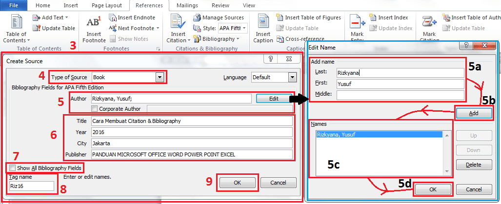

### Bentuk Pencatatan Isi

**Mengutip** **Langsung**: Menulis persis sesuai tulisan aslinya, ditulis diantara tanda petik “aku cinta kamu.” (penulis dan halaman dikutip juga)

**Mengutip Tidak Langsung** (Paraphrasing): Menuliskan kembali informasi yang didapat dengan menggunakan kata-kata sendiri (penulis dan halaman dikutip juga)baby.

**Membuat** **Ringkasan**: Menulis pengertian kita tentang gagasan-gagasan utama suatu tulisan yang menjadi sumber informasi (paragraf, artikel, buku, dsb). Ringkasan harus mewakili seluruh ide yang ingin disampaikan oleh penulis. Ringkasan lebih panjang dari parafrasa.

### Membuat Ringkasan

**Meringkas sebuah paragraf**

- Sebelum meringkas, harus membaca paragraf tersebut dengan cermat dan mencoba mengerti ide apa yang ingin disampaikan dalam paragraf tersebut. Kemudian identifikasi kalimat yang mengandung ide utama.
- Jika paragraf tidak memiliki kalimat topik, maka dapat dengan cara menggabungkan frasa-frasa penting.
- Jika tidak mendapatkan frasa-frasa kunci, maka harus membuat kalimat topik yang baru.

**Meringkas artikel Surat Kabar yang kurang** **terstruktur**

- Artikel koran, kurang terstruktur dengan baik dan paragraf-paragrafnya sangat pendek sehingga sulit diringkas.
- Ada langkah-langkahnya:
    - Bacalah artikelnya lebih dari sekali
    - Identifikasi kalimat-kalimat kunci
    - Pikirkanlah mengapa artikel tersebut ditulis dan diterbitkan
    - Lihatlah variasi dan pengulangan pada ide yang sama.

### Pedoman Membuat Catatan Isi dan Bibliografi

Pedoman apa pun dapat digunakan untuk membuat catatan isi dan bibliografi

Unsur yang harus ada dalam catatan bibliografi adalah nama keluarga/akhir pengarang, tahun terbit, judul artikel, nama berkala ilmiah, volume, dan halaman artikel.

Beberapa pedoman dalam membuat catatan isi dan bibliografi seperti:

- American Psychological Association (APA)
- Modern Language Association (MLA)
- Council of Science Editors (CSE)

### Pedoman APA

Pedoman APA umumnya dipakai dalam ilmu-ilmu sosial seperti sosiologi, psikologi, antropologi, bisnis, pendidikan dlsb.

**Contoh:**

Di dalam paragraf pendahulunya ia mengutip pernyataan dari sebuah buku berjudul “Mengajarkan emotional....” yang ditulis oleh Lawrence E. Shapiro, Ph.D pada tahun 1997 dan diterbitkan di Jakarta oleh.....

Kutipan langsung dalam teks

Menurut Shapiro (1997, hlm. 6), “Penelitian-penelitian telah menunjukkan........”

 

Jenis sumber acuan secara garis besar dibedakan menjadi 3 jenis yaitu: buku, artikel dalam buku, artikel berkala ilmiah

BUKU: nama pengarang (nama keluarga/akhir, inisial nama depan dan nama tengah), tahun terbit, judul buku, nama kota terbit, dan nama penerbit.

Contoh: Gunawan, A. W. (2000). Usaha Pembibitan Jamur. Jakarta: Penebar Swadaya

Penulisan dalam teks: “Bibit yang digunakan pada awal budi daya jamur.....” (Gunawan, 2000, hlm.16).

Lebih dari satu orang pengarang:

Dua orang: Gunawan, A. W. & Agustina, T. W. (2009). Usaha Pembibitan Jamur. Jakarta: Penebar Swadaya.

Lebih dari dua orang

Diao, A. L., et al. (2010). Literasi Informasi: 7 Langkah Knowledge Management. Jakarta: Penerbit Universitas Atmajaya.

### Pedoman MLA

Prinsipnya sama dengan APA, perbedaan dengan MLA terletak pada penulisan sumber pada teks tidak perlu menyebutkan tahun, tetapi dapat menyebutkan nama keluarga/akhir dan halaman yang dikutip dengan ditandai angka berurut dari nomor 1 pada pemunculan sumber acuan yang pertama.

Sumber acuan berikutnya diberi tanda nomer 2 dan seterusnya.

Daftar pustaka menggunakan urutan nomer dan tidak disusun berdasarkan pada urutan abjad.

Contoh: Di dalam paragraf pendahulunya ia mengutip pernyataan dari sebuah buku berjudul “Mengajarkan emotional....” yang ditulis oleh Lawrence E. Shapiro, Ph.D pada tahun 1997 dan diterbitkan di Jakarta oleh.....

Kutipan langsung dalam teks

Menurut Shapiro, “Penelitian-penelitian telah menunjukkan........ (6)”

Kutipan Tidak Langsung (Parafrasa) dalam Teks

Secara jelas Saphiro mengatakan bahwa pengaruh ketrampilan EQ seorang anak dalam kehidupannya bukan hanya......(6).

Daftar Pustaka

Saphiro, Lawrence E. Mengerjakan Emotional Intelligent pada Anak. Jakarta: Gramedia Pustaka Utama. 1997

Sebagai ganti garis bawah menggunakan huruf miring untuk semua judul.

Mencatumkan format sumbernya, seperti Tercetak, Web, CD, Televisi dlsb.

Saphiro, Lawrence E. _Mengerjakan Emotional Intelligent pada Anak_. Jakarta: Gramedia Pustaka Utama. 1997. Tercetak

Kutipan artikel jurnal harus pakai volume dan nomer juga nomer halaman.

Christianto B, Yogiata. “Screening of Quorum Quenching Activity”. _Microbiol Indones 5.1_ (2011):46-49. Tercetak

URL hanya perlu terutama bila diminta oleh editor atau kalau dokumen hampir tidak dapat ditemukan tanpa URL

### Pedoman CSE

Pedoman yang disusun dengan tujuan mengutamakan kesederhanaan dalam penulisan sumber acuan dan daftar pustaka.

Penggunaan tanda baca sangat minimum, hanya digunakan untuk hal yang penting saja.

Tanda baca untuk nama singkatan, nama penganrang, dan nama berkala ilmiah tidak ada, penggunaan huruf kapital seperlunya saja.

Contoh: ketika mengetik judul artikel, dengan sendirinya huruf pertama judul tersebut telah muncul dengan huruf kapital.

Menghemat biaya pengetikan, tinta printer kertas, dan total biaya satuan karya tulis.

Daftar pustaka yang mengikuti pedoman CSE tampak sederhana, lebih bersih dan nyaman untuk dibaca.

Topik “tiga alasan mengapa emotional intelligence perlu diajarkan pada anak sejak usia dini”, akan mengutip pernyataan dari buku “Mengajarkan emotional inteligence pada anak” oleh Lawrence E. Saphiro, Ph.D tahun 1997, Jakarta, Gramedia Pustaka Utama

Apakah menggunakan sistem nomor “vancouver”, nama-tahun “Harvard”. Disesuaikan dengan pedoman penerbit yang dituju

Contoh Sistem Vancouver (Nomor):

Kutipan langsung dalam Teks

Saphiro1 mengatakan bahwa “penelitian menunjukan bahwa keterampilam EQ.......”

Kutipan  tidak langsung (parafrasa) dalam teks

Secara jelas Saphiro1 mengatakan bahwa pengaruh keterampilan EQ...

Daftar Pustaka

Saphiro LE. Mengajarkan emotional Inteligence pada anak. Jakarta (ID): Gramedia Pustaka Utama. 1997.

Sistem Harvard (Nama-Tahun)

Kutipan Langsung dalam teks

Saphiro (1997) mengatakan “penelitian telah menunjukkan bahwa.....”

Kutipan tidak langsung (parafrasa) dalam teks

Secara jelas Saphiro (1997) mengatakan bahwa pengaruh keterampilan EQ......

Daftar Pustaka

Saphiro LE. 1997. Mengajarkan emotional intelligence pada anak. Jakarta (ID): Gramedia Pustaka Utama.

* * *

## **PENGGUNAAN APLIKASI MANAJEMEN INFORMASI**

### Microsoft Word

1. Pilih menu reference
2. Memilih style penlisan yang diinginkan
3. Insert Citation dan Pilih New Source
4. Type of Source sesuai dengan kebutuhan
5. Jika Source sudah ditambahkan, pilih Manage Sources mengelola source yang sudah ditambahkan.
6. Kemudian sisipkan source pada tulisan yang diinginkan (Sitasi Sumber Acuan), dengan memilih Insert Citation pada posisi yang diinginkan.
7. Membuat Daftar Pustaka. Pilih **Bibliography** untuk menuliskan sitasi sumber acuan yang telah digunakan dalam naskah untuk mendapatkan **Daftar Pustaka**.

### Mendeley

**1\. Proses Instalasi**

Instalasi software mendeley dapat di download melalui laman [https://www.mendeley.com/download-desktop/Windows/](https://www.mendeley.com/download-desktop/Windows/) Untuk proses instalasi cukup mudah tinggal diikuti petunjuknya dan next saja.

**2\. Membangun** **Library** **dengan** **Mendeley**

Sebelum menggunakan Mendeley, perlu diketahui dua model penyimpanan yang dimiliki oleh Mendeley.

**Default.**

Mendeley akan membaca lokasi dokumen sesuai letak aslinya. Misalnya dokumen yang dikelola terletak di Dekstop, maka Mendeley akan membaca ke Desktop. Jika file di Desktop dihapus, maka Mendeley akan kehilangan jejak.

**Custom**.

Pengguna dapat menentukan letak penyimpanan file yang dikelola. Misal semua file yang dikelola akan diletakkan pada drive D:/MENDELEY, maka ketika menambahkan dokumen yang dikelola (misal dokumen ada di Dekstop), maka Mendeley akan menyalin dokumen tersebut di D:/MENDELEY. Ada dua dokumen dalam satu komputer.

Saran kami, untuk meminimalisir duplikasi dan kebingungan, susun dahulu file dokumen yang akan dikelola pada satu DRIVE dalam komputer utama. Kemudian dilanjutkan dengan pengelolaan menggunakan Mendeley.

**3\. Menambah Dokumen**

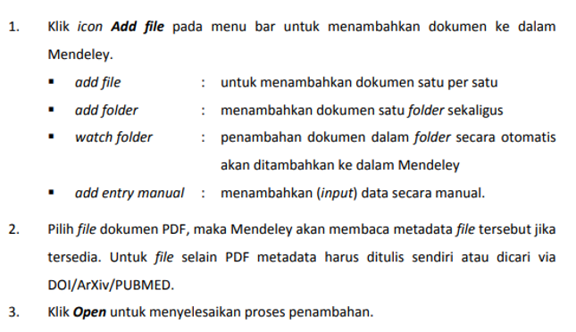

**4\. Install Ms. Word Plugin****.** **Klik** **“Tools” ->** **klik** **“install** **ms** **word plugin”**

**5\. M****embuat sitasi dalam tulisan**

- Aktifkan tab References di MS Word.
- Klik Insert citation dari toolbar MS Word.
- Klik Go to Mendeley, untuk mengaktifkan/membuka Mendeley.
- Pilih judul referensi yang disitir
- Cite

**5\. M****embuat Daftar Pustaka**

- Klik Insert Bibliography pada baris menu
- Mendeley secara otomatis akan membuat daftar pustaka dari seluruh referensi yang disitir di dalam dokumen.

### Zotero

Untuk tutorial zotero dapat diakses disini: [Tutorial Zotero](https://drive.google.com/file/d/15NU0WiXsdSCN8ywSh9AJZsPRlBQnN3UZ/view?usp=sharing)

* * *

## **PENCIPTAAN KARYA**

### COCTUC

- **Clarity (****Kejelasan****)**
- **Organization (****O****rganisasi****)**
- **Coherence (****H****ubungan****/** **pertalian****)**
- **Transition (****T****ransisi****)**
- **Unity (****K****esatuan****)**
- **Conciseness (****K****epadatan** **isi****)**

### Clarity/ Kejelasan

- Karya dibuat sesuai dengan langkah penulisan
- To the point, tidak berbelit, tepat sasaran
- Menggunakan kata, gambar, suara yang tepat, tidak ambigu, jelas intensitasnya
- Disusun secara logis
- Menggunakan sudut pandang yang konsisten
- Transisi antar kalimat dan antar paragraph berlangsung lancar dan mudah diikuti

### Organization/ Organisasi

- Organisasi dalam tulisan ditentukan oleh kerangka/ daftar isinya
- Organisasi yang baik dibuat berdasarkan kalimat topik (tesis/ tujuan) yang telah dirumuskan dengan baik pula
- Gagasan yang akan dibahas (controlling ideas) disusun teratur, dari yang penting hingga kurang penting, umum ke khusus, urutan sebab-akibat, kronologi, perbandingan

### Kerangka Umum Tulisan Ilmiah

#### 1\. Pendahuluan

- Alasan yang mendasari perumusan masalah (kalimat topik/ tesis/ tujuan)
- Perumusan masalah yang mengandung variable/ controlling ideas

#### 2\. Isi: penjelasan tentang

- Controlling Idea 1
- Controling idea 2 dst.

#### 3\. Penutup

- Kesimpulan, rangkuman

#### 4\. Daftar Pustaka/ Bibliografi

### Kerangka Laporan Penelitian

**Pendahuluan**

- Alasan yang mendasari perumusan masalah/ tujuan
- Perumusan masalah/ tujuan penelitian

**Isi**

- Kerangka berpikir
- Metode penelitian (bahan dan metode)
- Hasil dan pembahasan penelitian

**Penutup**

**Daftar** **pustaka****/** **bibliografi**

### Coherence (Koherensi/ Pertalian)

- Menggambarkan kejelasan dan kelogisan hubungan di antara gagasan-gagasan yang ingin diuraikan dalam suatu tulisan atau paragraf
- Kerangka dibuat dengan jelas dan logis
- Transisi yang rapi dan urut dapat meningatkan koherensi suatu tulisan

### Transition (transisi)

- Transisi dibutuhkan agar karya tulis nyaman dibaca dan mudah dipahami, transisi dalam tulisan harus jelas dan lancar
- Transisi dari kalimat ke kalimat, paragraph ke paragraf, ide ke ide
- Transisi adalah indikator dua arah mengenai apa yang telah dikatakan dan apa yang akan dikatakan
- Tanpa transisi, penulis dan pembca dapat tersesat

### Contoh Transisi

- Karena itu, sebagai hasilnya, akibatnya, secara terperinci, sebagai ilustrasi
- Transisi juga dapat menggunakan kata ganti
- Transisi antarparagraf dapat dilakukan dengan mengawali paragraf dengan kalimat yg meringkas paragraf sebelumnya
- Mengakhiri paragraf dengan pertanyaan dan membuka paragraf dengan jawaban terhadap pertayaan tersebut.
- Dalam karya lain, semisal musik, transisi penting untuk membuat musik tsb enak didengar.

### Unity (Kesatuan)

- Kesatuan dalam suatu karya tujuannya agar jelas maksud karya tersebut, mudah dipahami, nyaman dibaca
- Kesatuan terjadi bila ide pendukung mempunyai kaitan dengan ide utama
- Tulisan memiliki kesatuan bila tidak membahas hal-hal yang tidak relevan
- Serangkaian paragraf pendek dapat mengurangi kesatuan jika memecahkan suatu gagasan ke dalam beberapa paragraf

### Conciseness (Kepadatan isi)

- Kepadatan tulisan dicapai dengan menghindari penggunaan kata-kata, frasa, kalimat, dan paragraph yang berlebihan Contoh: Bandingkan a dan b
    1. Jurnal tersebut disusun secara sistematis. Jurnal tersebut terdiri dari 12 halaman. bandingkan dengan:
    2. Jurnal yang terdiri dari 12 halaman tersebut disusun secara sistematis

- Menggunakan kata-kata dan frasa yg sederhana
- Menghilangkan pengulangan (repetisi) yang tidak perlu
- Menggunakan kalimat positif
- Mengubah kalimat pasif menjadi aktif/ kalimat berita menjadi kalimat perintah
- Menghindari kata-kata yang bersifat membesar-besarkan/ meremehkan, seperti “paling”, “yang ter”, “sangat”
- Menghilangkan penggunaan kata-kata pembuka yang berlebihan (pretentious) seperti:
    - Dengan memperhatikan....
    - Setelah menimbang, mendengar...
    - Tak perlu dikatakan lagi bahwa...
    - bukan rahasia lagi bila...
- Mengatasi paragraf pendek dengan menggabungkan gagasan ke dalam satu kalimat topik yang lebih luas dan dijadikan kalimat topik paragraf tunggal
- Serangkaian paragraph pendek dapat mengurangi kepadatan isi dan itu berarti memecahkan satu gagasan kedalam beberapa paragraf

### Hubungan COCTUC dalam Paragraf

 

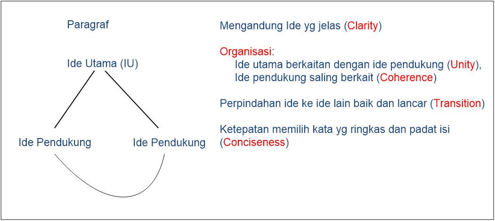

* * *
