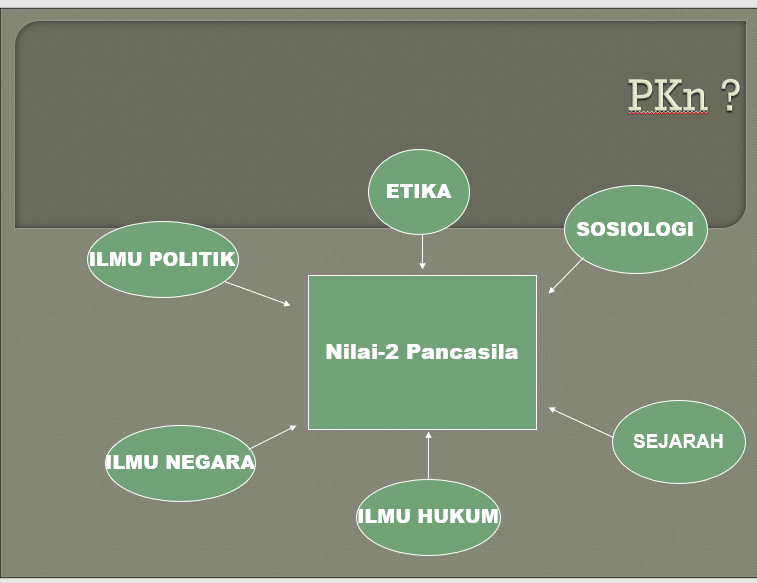
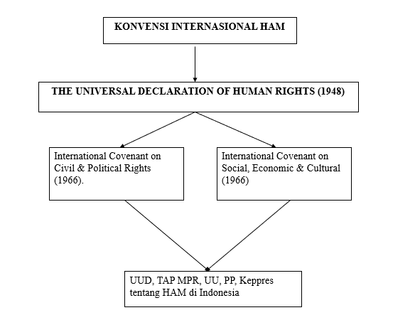
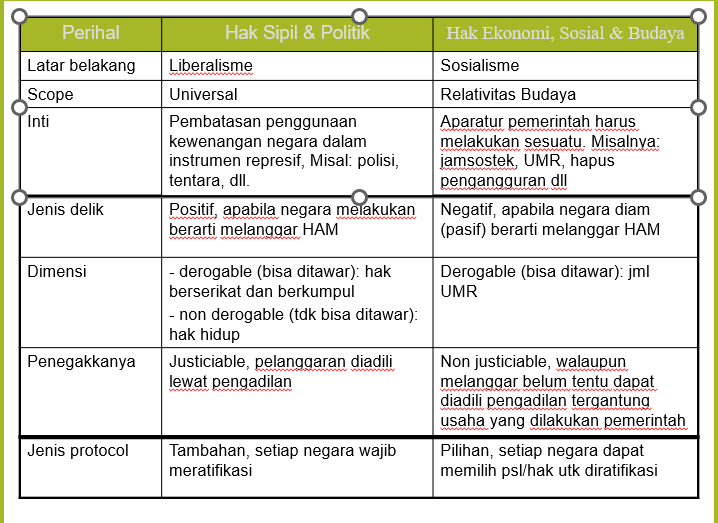

## **Tujuan Pembelajaran PKN**

a.Dapat memahami dan mampu melaksanakan hak dan kewajiban. serta santun jujur dan demokratis, serta ikhlas sebagai warga negara

b.Menguasai dan pemahaman tentang beragam masalah dasar kehidupan berbangsa, dan bernegara yang berlandaskan Pancasila

c.Memupuk sikap dan perilaku yang sesuai dengan nilai perjuangan serta Patriotisme yang cinta tanah air, rela berkorban bagi nusa dan bangsa.

## **Kompetensi yang Diharapkan Dari Pendidikan Kewarganegaraan**

### **1\. Hakikat Pendidikan**

Pendidikan Kewarganegaraan dimaksudkan agar kita memiliki wawasan kesadaran bernegara untuk bela negara dan memiliki pola piker, pola sikap dan prilaku sebagai pola tindak cinta tanah air berdasarkan pancasila. Semua itu diperlukan demi tetap utuhnya dan tegaknya NKRI.

### **2\. Kemampuan Warga Negara**

Untuk hidup berguna dan bermakna dan mampu mengantisipasi perkembangan perubahan masa depan suatu Negara sangat mememerlukan perbekalan ilmu pengetahuan, teknologi dan seni(iptek) yang berlandaskan Pancasila

## **Menumbuhkan Wawasan Warga Negara**

Pedidikan kewarganegaraan untuk menumbuhkan wawasan warga Negara dalam hal persahabatan, pengertian antar bangsa, perdamaiain dunia, kesadaran bela Negara dan sikap serta perilaku bersendikan nilai-nilai budaya bangsa, Wanus, Tannas

## **Visi dan Misi Pendidikan Kewarganegaraan**

1. **Visi pendidikan kewarganegaraan.**

visi mata kuliah Pendidikan Kewarganegaraan adalah mampu untuk membawa mahasiswa melihat inti dari suatu persoalan secara lebih mendalam dengan penglihatan maupun pengamatan. Dengan melakukan hal itu secara baik, akan menjadikan kepribadian mahasiswa lebih baik. Dengan visi demikian, Pendidikan Kewarganegaraan diharapkan berperan penting dalam memantapkan kepribadian manusia (dalam hal ini mahasiswa) seutuhnya, dalam arti memiliki keutuhan dan keterpaduan antara kemantapan unsur rohani dan unsur jasmaninya, sejahtera lahir dan bathin.

2. **Misi Pendidikan Kewarganegaraan**

Misi Pendidikan Kewarganegaraan di Perguruan Tinggi adalah membantu mahasiswa selaku warga negara agar mampu mewujudkan nilai- nilai dasar perjuangan bangsa Indonesia. serta kesadaran berbangsa bernegara dalam menerapkan ilmunya secara bertanggung jawab terhadap kemanusiaan.

* * *

## **Nilai Nilai Pancasila**

## **Sejarah Perkembangan PKN**

**LATAR BELAKANG**

1. Sebelum & selama perjuangan dg penjajahan
2. Era perebutan & mempertahankan Kemerdekaan RI
3. Era pengisian kemerdekaan

Menimbulkan kondisi dan tuntutan yg berbeda sesuai dg zamannya **\->** **kesamaan nilai perjuangan bangsa** yg dilandasi jiwa, tekad & semangat kebangsaan **\->** terwujudnya **NKRI**

## **GLOBALISASI**

žPengaruh, semangat perjuangan mengalami penurunan

žPesatnya IPTEK àinformasi/komunikasi/transportasi àDUNIA MENJADI TRANSPARAN (kampung tanpa mengenal batas negara)

žUntuk mengisi kemerdekaan à Perjuangan NON FISIK sesuai dg profesi masing-masing : à**BELA NEGARA**     àdemi tegaknya **NKRI**

## **SEBELUM DEKRIT PRESIDEN 5 JULI 1959**

žTATA NEGARA :

\- Negara diam

\- Negara bergerak

žTATA HUKUM :

\- Hukum Tertulis

\- Hukum Adat

žILMU KEWARGANEGARAAN:

\- Penduduk

\- Pemerintah

## **SESUDAH DEKRIT PRESIDEN**

1.Tahun 1962 **\->** Civics tampil dlm bentuk INDOKTRINASI POLITIK

2.Tahun 1968 **\->** Civics sebagai unsur dari pendidikan kewargaan negara yg bernuansa IPS

3.Tahun 1969 **\->** PKn dalam bentuk pengajaran konstitusi dan ketetapan MPRS

4.Tahun 1973 **\->** PKn diidentikan dengan pengajaran IPS

5.Tahun 1975 – 1984 **\->** PMP menggantikan PKn dengan pembahasan P4 dan PPKn

6.Tahun 1984 **\->** PPKn sebagai penggabungan bahan kajian Pendd. Pancasila dan Kewarganegaraan yg tampil dlm bentuk pengajaran konsep nilai yg disaripatikan dari P4 & Ps

## **DASAR HUKUM**

1. UU NOMOR 2 TAHUN 1989 Psl 39:2 **\->** KURIKULUM PENDIDIKAN WAJIB AL:

1. M.K. AGAMA,
2. PANCASILA
3. PKn

2.UU NOMOR 20 TAHUN 2003 Psl 10:1 **\->** KELOMPOK MKPK PD KURIKULUM INTI YG WAJIB DIBERIKAN SETIPA PROGRAM STUDI PT AL:

1. M.K. AGAMA,
2. PANCASILA
3. PKn

3.KEPUTUSAN DIRJEN DIKTI NOMOR 267/DIKTI/KEP/ 2000 **\->** PKn MENGGANTIKAN M.K. KEWIRAAN

## **HAKEKAT PKn**

1.Menjamin kelangsungan hidup generasi penerus, secara berguna dan bermakna

2.Memiliki wawasan kesadaran bernegara, untuk bela negara, dan memiliki pola pikir, pola sikap & perilaku sebagai pola tindak yang cinta tanah air berdasarkan Pancasila

## **TUJUAN PKn**

Untuk menumbuhkan wawasan kesadaran bernegara, sikap serta perilaku yang cinta tanah air dan bersendikan kebudayaan bangsa, wawasan nusantara, serta Ketahanan nasional dlm diri generasi penerus untuk menguasai IPTEK dan SENI

## **DASAR PEMIKIRAN PKn**

1. Jiwa patriotik,
2. Rasa cinta tanah air,
3. Semangat kebangsaan,
4. Kesetiakawanan sosial,
5. Kesadaran pada sejarah bangsa,
6. Sikap menghargai jasa pahlawan

## **KOMPETENSI YG DIHARAPKAN**

Sikap mental yang cerdas penuh rasa tanggung jawab :

\- Iman dan taqwa kepada TYME

\- Berbudi luhur & disiplin bermasyarakat

\- Rasional & dinamis

\- Profesional

* * *

## Hak dan Kewajiban Warga Negara

### Pasal 26 dan 27 UUD 1945

- Pasal 26 ayat (1) : Warga negara adalah orang-orang Bangsa Indonesia asli dan orang-orang bangsa lain yang disahkan oleh UU sebagai warga negara
- Pasal 26 ayat (2) : syarat-syarat yang mengenai kewarganegaraan ditetapkan dengan UU.
- Pasal 27 ayat (1) : segala warga negara bersamaan kedudukannya di dalam hukum dan pemerintahan, dan wajib menjunjung hukum dan pemerintahan itu dengan tidak ada kecualinya.
- Pasal 27 ayat (2) : tiap-tiap warga negara berhak atas pekerjaan dan penghidupan yang layak bagi

### Pasal 27, 28 UUD 1945

- Pasal 27 ayat (3) : setiap warga negara berhak dan wajib ikut serta dalam upaya pembelaan negara.
- Pasal 28 : Kemerdekaan berserikat dan berkumpul, mengeluarkan pikiran dengan lisan dan tulisan dan sebagainya ditetapkan dengan UU.
- Pasal 28A : Setiap orang berhak untuk hidup serta berhak mempertahankan hidup dan kehidupannya.
- Pasal 28E ayat (1): setiap orang bebas memeluk agama dan beribadat menurut agamanya, memilih pendidikan dan pengajaran, memilih pekerjaan, memilih kewarganegaraan, memilih tempat tinggal di wilayah negara dan meninggalkan nya, serta berhak kembali.

### 28, dan 30 UUD 1945

- Pasal 28E ayat (2): setiap orang berhak atas kebebasan meyakini dengan kepercayaan, menyatakan pikiran dan sikap sesuai dengan hati nuraninya
- Pasal 28E ayat (3): setiap orang berhak atas kebebasan berserikat, berkumpul, dan mengeluarkan pendapat.
- Pasal 30 ayat (1) : setiap warga negara berhak dan wajib ikutserta dalam usaha pertahanan dan keamanan negara.

## AZAS KEWARGANEGARAAN - 1

### SISI KELAHIRAN

1. **IUS SOLI** = tempat kelahiran (IUS = hukum, dalil, pedoman; soli, solum = negeri) **adalah** pedoman kewarganegaraan yang berdasarkan tempat atau daerah kelahiran.
2. **IUS SANGUINIS** = keturunan,da rah (SANGUINIS = darah) **adalah** pedoman kewarganegaraan berdasarkan daerah atau keturunan

### SISI PERKAWINAN

**1\. Asas Kesatuan hukum**

Didasarkan pada paradigma suami istri ataupun ikatan keluarga merupakan inti masyarakat yang meniscayakan suasana sejahtera, sehat dan tidak terpecah.    Dalam menyelenggarakan kehidupan bermasyarakatnya ikatan keluarga yang  baik perlu mencerminkan adanya suatu kesatuan yg bulat.

**2\. Asas Persamaan Derajat**

Suatu perkawainan tidak menyebabkan perubahan status kewarganegaraan masing-masing pihak. Baik suami ataupun istri tetap kewarganegaraan asalnya

### UNSUR DARAH KETURUNAN (IUS SANGUNIS)

Kewarganegaraan dari orang tua yg menentukan kewarganegaraan seseorang. Artinya kalau orang dilahirkandari ortu yg berWN Indonesia, maka dg sendirinya si anak WN Indonesia

### UNSUR DAERAH TEMPAT KELAHIRAN (IUS SOLI)

Daerah tempat seseorang dilahirkan yg menentukan kewarganegaraannya.  Artinya, kalau dilahirkan di dalam daerah hukum Indonesia, maka dengan sendirinya menjadi WN Indonesia, kecuali anggota korps diplomatik dan anggota tentara asing yg masih dalam ikatan dinas.

### UNSUR PEWARGANEGARAAN (NATURALISASI)

- Syarat dan prosedur pewarganegaraan ini di berbagai negara dapat berbeda, menurut kebutuhan yang dipengaruhi oleh kondisi dan situasi  negara masing- masing.
- Pewarganegaraan ini ada yang aktif dan ada yang pasif.
- Pewarganegaraan ini ada yang aktif – seseorang dapat menggunakan hak OPSI untuk memilih atau mengajukan kehendak menjadi WN dari suatu negara.
- Pewarganegaraan ini ada yang pasif – seseorang yang tidak mau diwarganegarakan oleh suatu negara atau tidak mau diberi atau dijadikan WN suatu negara, maka yang bersangkutan dapat menggunakan hak REPUDIASI (hak untuk menolak pemberian kewarganegaraan)
    

## UNSUR-UNSUR PENENTU KEWARGANEGARAAN -3

### PROBLEM STATUS KEWARGANEGARAAN

• Penduduk yg bukan berstatus WN di suatu negara dikenal dg **APATRIDE**, **BIPATRIDE**, **MULTIPATRIDE**.

• **APATRIDE**: istilah untuk seseorang yang tidak mempunyai status kewarganegaraan

• **BIPATRIDE:** istilah untuk seseorang yang mempunyai status kewarganegaraan rangkap-Dwi Kewarganegaraan

• **MULTIPATRIDE**: istilah untuk seseorang yang mempunyai dua atau lebih status kewarganegaraan

* * *

## PENGERTIAN BANGSA & NEGARA

- BANGSA adalah sekelompok manusia yg mempunyai kepentingan yg sama dan menyatakan dirinya sbg satu bangsa serta berproses didalam satu wilayah
- NEGARA adalah 2 unsur: suatu organisasi dan perserikatan -> bersifat KONSTITUTIF & DEKLARATIF (de facto dan de jure)

### BANGSA

1.Menurut Moh Hatta ditentukan oleh keinsyafan, sbg suatu persekutuan yg tersusun menjadi satu, yaitu terbit karena percaya atas persamaan nasib dan tujuan

2.**BANGSA** adalah sekelompok manusia yg mempunyai kepentingan yg sama dan menyatakan dirinya sbg satu bangsa serta  berproses didalam satu wilayah

### NEGARA

**1\.** Adalah alat dari suatu masy yg mempunyai kekuasaan utk mengatur hubungan-hubungan manusia dlm masy disamping menertibkan gejala-gejala kekuasaan yg karena hubungan-hubungan tersebut dlm masy

**2\. NEGARA** adalah :

- Organisasi dari sekelompok manusia yg bersama-sama mendiami satu wil ttt dan mengakui adanya satu pemerintahan yg mengurus  tata tertib serta keselamatan kelompok manusia tersebut
- Perserikatan yg melaksanakan satu pemerintahan melalui hukum yg mengikat masy dg kekuasaan bersifat memaksa untuk ketertiban sosial
- Negara adl organisasi masy yg menempati wilayah tertentu dan mengakui adanya pemerintahan yg berdaulat
- Negara sbg organisasi dalam masy  mempunyai sifat-sifat **_memaksa_**_,_ **_monopoli_** dan **_mencakup semua_**
- **_Negara_** mempunyai tugas yaitu :
    1. Mengendalikan dan mengatur gejala-gejala yg timbul dlm masy yg bertentangan satu dg yg lain
    2. Mengorganisasi dan mengintegrasikan aktivitas individu dan golongan agar dpt dicapai tujuan yg dicita-citakan

- **_Memaksa_**,negara dapat memaksakan segala aturan yang ditetapkan untuk ditaati oleh semua orang ada di negara itu Misal : begitu _aturan_ dibuat, setiap org hrs tunduk
- **_Monopoli,_** negara sbg penyelenggara kepentingan umum memiliki hak monopoli dlm pengelolaan urusan-urusan tertentu Misal :neg _berhak_ melarang berkembangnya faham yg dianggap mengganggu tujuan  neg
- **_Mencakup semua,_** kekuasaan negara berlaku bagi setiap orang yg ada di wilayah negara itu tanpa kecuali Misal : tdk ada seorgpun di wil neg yg dpt _mengecualikan_ diri dr jangkauan kekuasaan neg

## Unsur-unsur esensial negara

1.**_Rakyat atau_** **_Penduduk_**, suatu kelompok manusia yg mrp suatu kehidupan bersama yg menetap disuatu tempat tertentu

2.**_Wilayah_****_,_** apabila penduduk mrp isi atau subyek dari suatu neg, maka wilayah adl landasan materiil atau landasan fisik neg

3.**_Pemerintah_** **_yang berdaulat,_** adalah pemerintahan yg memiliki kekuasaan tertinggi, yg berarti tidak berada di bawah kekuasaan yang lain

## Kerangka Dasar Kehidupan Berbagsa & Bernegara

1\. **_Pancasila_** sebagai Falsafah, Ideologi dan Dasar Negara RI

2\. **_UUD 1945_** sebagai Landasan Konstitusional

3\. **_Wawasan Nusantara_** sebagai Wawasan Nasional

4\. **_Ketahanan Nasional_** sebagai pendekatan konsepsional

## **TEORI TERBENTUKNYA NEGARA**

1\. HK ALAM :

- Kondisi alam -> tumbuhnya manusia -> negara
- ( Plato + Aristoteles)

2\. TEORI KETUHANAN

- Segala sesuatu adl ciptaan Tuhan
- (Islam + kristen)

3\. TEORI PERJANJIAN (Thomas Hobbes)

- Manusia menghadapi kondisi alam dan timbul kekerasan sehingga harus mengatasi tantangan tsb untuk kelangsungan hidup bersama

4\. PROSES TERBENTUKNY NEG JMN MODERN

1. Penaklukan
2. Peleburan (fusi)
3. Pemisahan diri
4. Pendudukan atas wil yg blm ada pemerintahan sebelumnya

## **Unsur Negara**

1.Bersifat Konstitutif ; artinya dlm neg meliputi

- Wil -> meliputi darat, udara dan perairan
- Rakyat atau masyarakat
- Pemerintahan yg berdaulat

2.Bersifat Deklaratif; -> ditunjukan adanya

- Tujuan Neg
- UUD
- Pengakuan dr neg lain -> de jure / de facto
- Msknya neg dlm perhimpunan bgs2 (PBB)

## **Neg** **dan W.N.** **Dlm** **sistem Kenegaraan**

- Kewajiban negara terhadap warganya pada dasarnya adl memberikan kesejahteraan hidup dan keamanan lahir batin sesuai dengan sistem demokrasi yg dianutnya
- Neg wajib melindungi hak asasi warganya sebagai manusia secara individu (HAM) berdasarkan hk internasional, yg dibatasi oleh ketentuan agama, etika moral, budaya dan sistem kenegaraan yg berlaku

* * *

## HAM?

- Hak
- Asasi
- Manusia

## BERBAGAI  ISTILAH

- Natural rights
- Rights of man
- Human rights (Elanor Roosevelt)

## MUNCULNYA ISTILAH HAM

- Hak yang tidak dapat diganggu gugat
- Hak sipil dan hak politik
- Hak sosial ekonomi dan budaya
- Anti diskriminasi
- Bias gender

## UU No.39/1999

HAM adalah seperangkat hak yang melekat pada hakikat dan keberadaan manusia sebagai makhluk Tuhan Yang Maha Esa dan merupakan anugerah-Nya yang wajib dihormati, dijunjung tinggi dan dilindungi oleh negara, hukum dan Pemerintah, dan setiap orang demi kehormatan serta perlindungan harkat dan martabat manusia (Pasal 1).

## UNSUR HAM

- HAM tidak perlu diberikan, dibeli ataupun diwarisi. HAM adalah bagian dari manusia secara otomatis;
- HAM berlaku untuk semua orang tanpa memandang jenis kelamin, ras, agama, etnis, pandangan politik atau asal usul sosial dan bangsa;
- HAM tidak bisa dilanggar. Tidak seorangpun mempunyai hak untuk membatasi atau melanggar hak orang lain. Orang tetap mempunyai HAM walaupun sebuah negara membuat hukum yang tidak melindungi atau melanggar HAM (Mansour Fakih, 2003).

## INTI OBYEK HAM

- Hukum tersendiri dan lembaga yg ada (Misal UU 39/1999 ttg HAM, 26/2000/ ttg Pengadilan HAM, Komnas HAM dst)
- Hubungan antara negara dan WN
- HAM memasuki wilayah publik karena mengatur hubungan negara dan warga negara.

## HUBUNGAN NEGARA & WN

**Keterangan**

\-Rakyat memberi kekuasaan pada negara lewat pemilu untuk mengatur negara agar rakyat sejahtera dan makmur

\-Dalam mengatur negara dapat menggunakan kekuasaannya secara penuh sehingga posisi rakyat dan negara tidak seimbang.

## KEKUASAAN DAN HAM

- Adanya ketimpangan kekuasaan dan posisi rakyat yang lemah maka rakyat harus dilindungi dengan **Hukum dan HAM**
- Ada batas-batas dimana negara tidak boleh menyuruh rakyat atau ada yang tidak boleh dilanggar oleh negara yaitu HAM.
- Jadi HAM sebagai pelindung agar hak-hak tertentu rakyat tidak dilanggar oleh negara.

## PERKEMBANGAN HAM

- Dimulai di Eropa - _Magna Charta_ 1215.
- Di Timur Tengah terdapat Piagam Madinah.
- Berkembang pesat pasca revolusi Amerika (1776) dan Perancis (1789) dengan implementasi Trias Politika.

## GENERASI SATU

- HAM lahir dari semangat revolusi Amerika dan Perancis.
- Dasarnya liberalisme
- Melindungi hak sipil dan politik
- Individualistik
- Pemilu dapat direkayasa kaum borjuis
- Melahirkan kesenjangan ekonomi

## GENERASI KEDUA

- HAM tidak hanya individual tetapi juga sosial atau komunal.
- Negara atas nama rakyat dapat menekan hak individu
- Melahirkan pemerintahan otoriter
- Misalnya Uni Soviet

## GENERASI KETIGA

- Didorong oleh kerusakan lingkungan akibat ulah manusia seperti menipisnya ozon, pemanasan global, kerusakan hutan dll
- Yang perlu dilindungi tidak hanya manusia melainkan juga lingkungan karena akan mempengaruhi kehidupan manusia

## SEJARAH HAM

1._Magna Charta_ (1215)

2._Petition of Rights_ (1628)

3._Habeas Corpus Act_ (1679)

4._Bill of Rights_ (1689)

5.Deklarasi Kemerdekaan Amerika (1776)

6._Declaration des droits de_ _l’homme_ _et du_ _citoyen_ (1789)

7._The Four Freedom_ (1941)

8._The Universal Declaration of Human Rights_ (1948) - UDHR

## _Magna Charta_ (1215)

- Piagam Agung ini ditanda tangani oleh John Lackland (Inggris) yang berisi maklumat bahwa penarikan pajak harus dengan seijin _Great Council_ yang anggotanya terdiri dari kepala-kepala daerah, orang bebas (_free man_) tidak di tahan, dipenjarakan, dibuang atau dihukum mati tanpa perlindungan atau pertimbangan hukum tertulis.
- **Magna Carta** ([Latin](http://id.wikipedia.org/wiki/Latin) untuk "Piagam Besar") adalah [piagam](http://id.wikipedia.org/w/index.php?title=Piagam&action=edit) [Inggris](http://id.wikipedia.org/wiki/Inggris) tahun [1215](http://id.wikipedia.org/wiki/1215) yang membatasi kekuasaan Monarki Inggris, terutama [Raja John](http://id.wikipedia.org/wiki/John_dari_Inggris), dari kekuasaan absolut.
- Magna Carta adalah hasil dari ketidaksetujuan antara [Paus](http://id.wikipedia.org/wiki/Paus_%28Katholik_Roma%29) dan [Raja John](http://id.wikipedia.org/wiki/John_dari_Inggris) dan [baronnya](http://id.wikipedia.org/w/index.php?title=Baron&action=edit) atas hak raja: Magna Carta mengharuskan raja untuk membatalkan beberapa hak dan menghargai beberapa prosedur legal, dan untuk menerima bahwa keinginan raja dapat dibatasi oleh hukum. Magna Carta adalah langkah pertama dalam proses sejarah yang panjang yang menuju ke pembuatan [hukum](http://id.wikipedia.org/w/index.php?title=Hukum_konstitusional&action=edit) [konstitusional](http://id.wikipedia.org/w/index.php?title=Hukum_konstitusional&action=edit).
- Diperoleh dari "[http://id.wikipedia.org/wiki/](http://id.wikipedia.org/wiki/Magna_Carta)[Magna\_Carta](http://id.wikipedia.org/wiki/Magna_Carta)"

## _Petition of Rights_ (1628)

Petition ini diajukan oleh parlemen Inggris yang sebenarnya ditentang oleh Raja Charles. Namun akhirnya dimenangkan oleh Parlemen. Isinya antara lain:

- pajak dan pungutan istimewa harus dengan persetujuan parlemen
- seseorang tidak boleh ditahan tanpa tuduhan sah dan beralasan; tentara tidak diperbolehkan menggunakan hukum perang dalam keadaan damai

## _Habeas Corpus Act_ (1679)

Undang-undang ini ditandatangani oleh Raja Charles II dari Inggris yang berisi tentang pengembangan HAM lebih lanjut antara lain :

- alasan penahanan seseorang harus lengkap dan sah menurut hukum;
- pemeriksaan orang yang ditangkap harus dilakukan dalam dua hari setelah penangkapan.

## _Bill of Rights_ (1689)

Undang-undang ini ditetapkan di Inggris ditujukan kepada Raja Charles II yang berisi antara lain :

- pemilihan anggota parlemen harus dilakukan dengan bebas dan rahasia
- diakuinya kebebasan berbicara dan mengeluarkan pendapat
- warga negara Inggris mempunyai hak untuk memeluk agamanya dan beribadat menurut kepercayaannya itu.

## Deklarasi Kemerdekaan Amerika (1776)

- Deklarasi ini dikeluarkan oleh koloni-koloni amerika yang berbunyi antara lain :
- “ kami percaya bahwa semua kebenaran ini adalah bukti nyata, bahwa **semua orang diciptakan sama, bahwa mereka dikaruniai oleh pencipta mereka** hak-hak tertentu tidak dapat diganggu gugat, diantaranya adalah **hidup, kebebasan dan pengejaran kebahagiaan**. Bahwa untuk menjamin hak-hak ini dibentuk pemerintah di antara orang-orang yang memperolah kekuasaan mereka yang adil dengan ijin pemerintah”.

## **_Declaration of Rights of Man and of the Citizens_** **(1789)**

- Deklarasi ini merupakan hasil dari revolusi Perancis yang berisi pernyataan HAM dan warga negara. Revolusi Perancis melahirkan tiga semboyan yang terkenal yaitu _liberte_ (kebebasan), _egalite_ (kesamaan), _fraternite_ (kesetiakawanan).

## _The Four Freedom_ (1941)

Kemerdekaan ini diperkenalkan oleh Franklin D. Roosevelt (presiden Amerika) setelah Perang Dunia I tepatnya pada bulan Januari 1941. Menurutnya ada empat macam kemerdekaan suci sehingga harus dihormati dan dilindungi, yaitu :

- Kemerdekaan berbicara dan menyampaikan pendapat (_freedom of speech_)
- Kemerdekaan bagi tiap orang untuk mengabdi kepada Tuhannya menurut kepercayaan masing-masing (_freedom of religion_)
- Kebebasan dari kemiskinan (_freedom from want_)
- Kebebasan dari ketakutan (_freedom from fear_)

## _The Universal Declaration of Human Rights_ (UDHR-1948)

Deklarasi ini dikeluarkan oleh Majelis Umum Perserikatan Bangsa-Bangsa (PBB) tanggal 10 Desember 1948 sebagai akibat berlangsungnya kekejaman yang mengawali Perang Dunia II. Piagam PBB ini terdiri dari 30 Pasal yang diantaranya meliputi :

- setiap orang berhak akan hidup, kemerdekaan dan keamanan bagi dirinya
- tak seorangpun boleh dikenakan hukuman, tahanan atau pembuangan yang sewenang-wenang.

## UDHR

## UDHR, 1948

- Hak Hidup (Ps.3)
- Bebas dari Perbudakan (Ps.4)
- Bebas dari penyiksaan & kekejaman (Ps.5)
- Persamaan dan bantuan hukum (Ps.7-8)
- Pengadilan yg adil (Ps.9-11)
- Perlindungan urusan pribadi & keluarga (Ps.12)
- Memasuki dan meninggalkan suatu negara (Ps.13)
- Mendapatkan suaka (Ps.14)
- Hak kewarganegaraan (Ps.15)
- Membentuk keluarga (Ps.16)
- Memiliki harta benda (Ps.17)
- Kebebasan beragama (Ps.18)
- Berpendapat, berserikat dan berkumpul (Ps.19-20)
- Turut serta dalam pemerintahan (Ps.21)
- Jaminan sosial, pekerjaan, upah layak dan kesejahteraan (Ps.22-25)
- Pedidikan “gratis” dan kebudayaan (Ps.26-27)

## Internasional Covenant on Civil & Political Rights, 1966 – UU 12/2005

- Hak hidup & pembatasan hukuman mati (Ps.6)
- Bebas dari penyiksaan dan kekejaman (Ps.7)
- Perbudakan dan kerja paksa (Ps.8)
- Kebebasan dan keamanan pribadi serta proses hukum yang fair (Ps.9-11)
- Bertempat tinggal dan “bebas” keluar masuk suatu negara (Ps.12-13)
- Asas praduga tidak bersalah di pengadilan (Ps.14-15)
- Berperan menjadi pribadi di depan hukum (Ps.16)
- Perlindungan pribadi dan keluarga (Ps.17)
- Beragama dan berkeyakinan (Ps.18)
- Berpendapat (Ps.19)
- Anti hasutan perang dan kebencian (Ps.20)
- Berkumpul dan berserikat (Ps.21-22)
- Berkeluarga (Ps.23)
- Perlindungan anak (Ps.24)
- Turut serta dalam pemerintahan, hak memilih dan dipilih dalam pemilu, dan akses informasi pemerintahan (Ps.25)
- Anti diskriminasi untuk kaum minoritas (Ps.26)

## International Covenant on Social Economic & Cultural,1966 – UU 11/2005

- Hak pekerjaan dan upah layak (Ps.6-7)
- Membentuk serikat pekerja & pemogokan (Ps.8)
- Jaminan dan asuransi sosial (Ps.9)
- Perlindungan keluarga, ibu hamil, anak & remaja dari eksploitasi ekonomi & sosial (Ps.10)
- Bebas kelaparan, sandang & papan yang layak (Ps.11)
- Pelayanan kesehatan fisik & mental (Ps.12)
- Pendidikan dasar “gratis” & pengembangan kebudayaan (Ps.13-15)

## HUKUM HAM INDONESIA

- UUD 1945
- UU No.39/1999 ttg HAM
- UU No.26/2000 ttg Pengadilan HAM

## UU HAM NO.39/1999

- Produk hukum pasca reformasi
- Jawaban atas tuntutan reformasi untuk menjamin HAM dan membatasi kekuasaan yang otoriter

## DASAR FILOSOFIS

- Manusia sbg makhluk Tuhan dianugrahi HAM utk menjamin harkat dan martabatnya
- HAM= hak dasar yg secara kodrati melekat pd manusia, universal dan langgeng, oleh karena itu hrs dilindungi, dihormati, dipertahankan, dan tidak boleh diabaikan, dikurangi, atau dirampas oleh siapapun;
- Manusia juga punya kewajiban antar sesama
- Sebagai anggota PBB perlu menegakkan UDHR

## ASAS-ASAS DASAR

- Negara mengakui dan menjunjung tinggi HAM dan kebebasan dasar manusia yg secara kodrati melekat tdk terpisahkan dari manusia, yg harus dilindungi, dihormati, dan ditegakkan (Ps 2).
- Setiap orang dilahirkan bebas dan berhak mendapat perlindungan tanpa diskriminasi (Ps.3)
- Hak hidup, tidak disiksa, kebebasan pribadi, pikiran dan hati nurani, beragama, tidak diperbudak, diakui sebagai pribadi dan persamaan hukum, dan tidak dituntut atas dasar hukum yang berlaku surut adalah hak hak manusia yang tidak dapat dikurangi dalam keadaan keadaan apapun dan oleh siapapun (Ps 4).
- Kelompok rentan berhak memperoleh perlakuan dan perlindungan lebih berkenaan dengan kekhususannya (Ps 5)
- Hak masyarakat adat harus dilindungi
- Setiap orang berhak menggunakan upaya hukum nasional/ internasional
- Perlindungan, pemajuan, penegakan, dan pemenuhan HAM terutama menjadi tanggung jawab Pemerintah (Pasal 8) .

## HAK HIDUP (Ps 9)

- Setiap orang berhak untuk hidup, mempertahankan hidup dan meningkatkan taraf kehidupannya.
- Setiap orang berhak hidup tenteram, aman, damai, bahagia, sejahtera lahir dan batin.
- Setiap orang berhak atas lingkungan hidup yang baik dan sehat.

## BERKELUARGA & BERKETURUNAN (PS 10)

- Setiap orang berhak membentuk suatu keluarga dan melanjutkan keturunan melalui perkawinan yang sah.
- Perkawinan yang sah hanya dapat berlangsung atas kehendak bebas calon suami dan calon istri yang bersangkutan, sesuai dengan ketentuan peraturan perundang-undangan
- Perkawinan sejenis?

## MENGEMBANGKAN KEBUTUHAN DASAR (Ps.11-16)

- Hak untuk pemenuhan diri
- Hak Pengembangan diri
- Hak atas manfaat IPTEK
- Hak atas komunikasi dan informasi

## MEMPEROLEH KEADILAN (Ps.17-19)

- Hak perlindungan hukum
- Hak atas keadilan dalam proses hukum
- Hak atas hukuman yang adil

## BEBAS PERBUDAKAN (Ps.20-27)

- Hak untuk bebas dari perbudakan pribadi
- Hak atas keutuhan pribadi
- Kebebasan memeluk agama dan keyakinan politik
- Kebebasan untuk berserikat dan berkumpul
- Kebebasan untuk menyampaikan pendapat
- Status kewarganegaraan
- Kebebasan untuk bergerak

## RASA AMAN (Ps.28-35)

- Hak untuk mencari suaka
- Perlindungan diri pribadi

## KESEJAHTERAAN (Ps.36-42)

- Hak milik
- Hak atas pekerjaan
- Hak untuk bertempat tinggal secara layak
- Jaminan sosial
- Perlindungan bagi kelompok rentan

## TURUT SERTA PEMERINTAHAN (Ps.43-44)

- Hak pilih dalam pemilu
- Hak untuk berpendapat

## HAK WANITA (Ps.45-51)

- Hak pengembangan pribadi dan persamaan dalam hukum
- Hak perlindungan reproduksi

## HAK ANAK (Ps.52-66)

- Hak hidup anak
- Status warga negara
- Hak anak yang rentan
- Hak pengembangan pribadi dan perlindungan hukum
- Hak jaminan sosial
- Cq. konvensi hak anak dan UU perlindungan anak

## KEWAJIBAN DASAR MANUSIA

- Patuh pd per-UU-an (tertulis/tak tertulis, nasional/internasional) ttg HAM
- Membela negara sesuai per-UU-an.
- Menghormati HAM orang lain, moral, etika, dan tata tertib kehidupan bermasyarakat, berbangsa, dan bernegara.
- Tunduk kepada pembatasan yang ditetapkan oleh “Undang-Undang”

## KEWAJIBAN & TANGGUNG JAWAB PEMERINTAH

- Pemerintah wajib dan bertanggung jawab menghormati, melindungi, menegakkan, dan memajukan HAM dalam UU ini, peraturan perundang-undangan lain, dan hukum internasional tentang hak asasi manusia yang diterima oleh negara Republik Indonesia (Pasal 71)

## PEMBATASAN DAN LARANGAN

- Hak dan kebebasan hanya dapat dibatasi oleh dan berdasarkan “UU”.
- Pembatasan utk menjamin pengakuan dan penghormatan HAM dan kebebasan orang lain, kesusilaan, ketertiban umum, dan kepentingan bangsa.
- Pemerintah, partai, golongan atau pihak manapun tidak dibenarkan mengurangi, merusak, atau menghapuskan hak asasi manusia atau kebebasan dasar manusia

## KOMNAS HAM

- Mengembangkan kondisi yang kondusif bagi pelaksanaan hak asasi manusia sesuai dengan Pancasila, Undang-Undang Dasar 1945, dan Piagam Perserikatan Bangsa-Bangsa, serta Deklarasi Universal Hak Asasi Manusia; dan
- Meningkatkan perlindungan dan penegakan hak asasi manusia guna berkembangnya pribadi manusia Indonesia seutuhnya dan kemampuannya berpartisipasi dalam berbagai bidang kehidupan.

## PARTISIPASI MASYARAKAT

Setiap orang, kelompok, organisasi politik, organisasi masyarakat, lembaga swadaya masyarakat, atau lembaga kemasyarakatan lainnya, berhak berpartisipasi dalam perlindungan, penegakan, dan pemajuan HAM, berupa:

- Pelaporan pelanggaran
- Usulan perumusan kebijakan HAM
- Penelitian, pendidikan, dan penyebarluasan informasi mengenai HAM.

* * *

## Demokrasi

1.Adalah sebuah bentuk kekuasaan (_kratein_) dari, oleh dan untuk rakyat (_demos_), artinya negara yang diselenggarakan berdasarkan kehendak dan kemauan rakyat

2.Meskipun rakyat berkuasa (government of role by the people) tetapi prakteknya (_UNESCO_ _menyimpulkan_ _AMBIGUOUS/_ _Ambiquity_) ketidaktentuan tentang lembaga-lembaga, artinya demos bukanlah rakyat keseluruhan tetapi hanya populus tertentu yaitu mereka yg berdasarkan tradisi mengontrol akses kesumber kekuasaan atas hak prerogatif dalam pengambilan keputusan  yg berkaitan dg pemerintahan

### Awal Demokrasi di Yunani

1.Pemilihan langsung (Direct Democracy) 300.000 dalam 1 negara dan hanya warga yang resmi yang berhak pemilihan, budak belia, pedagang asing, perempuan dan anak2, tidak berlaku

2.Dalam perkembangan zaman modern, tidak semua w.n. dpt lgs terlibat dlm perwakilan, hanya mereka yg mempunyai kemampuan membangun pengaruh dan menguasai suara politik yg terpilih sbg wakil

### MAGNA CHARTA (1215)RAJA JOHN LACKLAND

Peristiwa ini tidak saja sbg suatu kemenangan parlemen atas raja melainkan juga kemenangan rakyat dlm pergolakan _Bill_ _of_ _Rights_ di Inggris bahwa Raja menyetujui dan menjamin hak dan previleges sebagai imbalan untuk penyerahan dana bagi keperluan perang

REFORMASI (EROPA BARAT)

Revolusi agama = semula baik-baik, lama kelamaan pecah perang antara kerajaan & agama

### Ranaissance (Italia)

Masa ketika org mematahkan semua ikatan yang ada dan menggantikan dengan kebebasan bertindak yang seluas-luasnya sepanjang sesuai dengan yang dipikirkan, bertindak sebebas-bebasnya tanpa boleh ada orang lain yang menguasai dengan ikatan-ikatan :

ØDampak (+) :

kehidupan modern & IPTEK berkembang pesat

ØDampak (-) :

Sifat – sifat buruk manusia merajalela

### **SISTEM PEMERINTAHAN NEGARA**

1.Diktator : (Dikatator borjuis & Proletar)

2.Parlementer : Pemerintah dipimpin Perdana Menteri & Presiden/Raja simbol kedaulatan & persatuan sebagai kepala negara

3.Presidensial : Presiden sebagai kepala negara juga sebagai kepala pemerintahan

4.Referendum :  Pemerintah sebagai badan pekerja dari parlemen

5.Campuran : Presidensial & Parlementer (spt di Prancis)

### BENTUK DEMOKRASI

**1\. Pemerintahan Monarki:**

Dunia dikuasai hkm yg timbul dari alam

1. Monarki absolut,
2. Monarki konstitusional
3. Monarki Parlemen.

**Contoh**: Jepang, Inggris & India

**2\. Pemerintahan Republik/ Presidensial**

Pemerintahan yg dijalankan oleh rakyat

**Contohnya**: Indonesia & USA

### KEKUASAAN DLM PEMERINTAHAN

**1\. John Locke (1632-1704)** = LIVE, LIBERAL & PROPERTY, bahwa pemrintah terbagi menjadi 3 bagian :

1. Kekuasaan Legislatif,
2. Kekuasaan Eksekutif /kek Yudikatif,
3. Kekauasaan Federatif

**2\. Montesquieu (1689 -1955) “TRIAS POLITIKA”** :

1.  Kekuasaan Legislatif
2.  Kekuasaan Eksekutif
3.  Kekauasaan Yudikatif

### DEMOKRASI DI INDONESIA

**1\. Dlm sistem kepartaian ada 3 sistem :**

1. Polyparty system
2. Biparty system
3. Monoparty system

**2\. Sistem Pemerintahan neg ada 4 sistem:**

1. Pemerintahan diktator (Borjuis & Proletar)
2. Sistem pemerintahan Parlemen
3. Pemerintahan Presidentil
4. Pemerintah Campuran

### **1\. DEMOKRASI PARLEMEN (1945-1959)**

 **Ciri-ciri :**

Didominasi oleh PARPOL & DPR, akibatnya persatuan utk melawan musuh mjd kendor sesudah kemerdekaan

### **2\. DEMOKRASI TERPIMPIN (1959-1965)**

  **Ciri-ciri :**

1. Dominasi Presiden
2. Peran parpol terbatas
3. Peran ABRI sbg unsur SOSPOL
4. Menyimpang Konstitusional
5. Menampilkan aspek demokrasi rakyat

### 3\. DEMOKRASI PANCASILA (1966-1998) ORDE BARU

  **Ciri-ciri :**

1. Sistem Presidentil
2. Landasan formal PS, UUD & KETETAPAN MPR
3. Peran Presiden semakin dominan thd lembaga2 neg lain
4. Pancasila hanya sbg legitimasi politik saja

### 4\. DEMOKRASI PANCASILA (1999- Sekarang) ORDE REFORMASI

   **Ciri-ciri:**

1. Multi partai pol menonjol
2. Trias politika hanya berlaku pd saat pemilu sj, setelah itu lbh kearah pembagian kekuasaan antara PRESIDEN & DPR
3. Berusaha mengembalikan perimbangan antar kekuatan antar lembaga neg

* * *

## Nilai Nilai Pancasila

- Etika
- Ilmu Politik
- Ilmu Negara
- Ilmu Hukum
- Sejarah
- Sosiologi

### **PENGERTIAN BANGSA & NEGARA**

- BANGSA adalah sekelompok manusia yg mempunyai kepentingan yg sama dan menyatakan dirinya sbg satu bangsa serta berproses didalam satu wilayah
- NEGARA adalah
    - organisasi dari sekelompok manusia yg bersama-sama mendiami satu wil ttt dan mengakui adanya satu pemerintahan yg mengurus tata tertib serta keselamatan kelompok manusia ntersebut
    - Perserikatan yg melaksanakan satu pemerintahan melului hukum yg mengikat masy dg kekuasaan bersifat memaksa untuk ketertiban sosial

### **TEORI TERBENTUKNYA NEGARA**

1. **HUKUM ALAM**

- Kondisi alam -> tumbuhnya manusia -> berkembangnya negara
- Pemikiran ada masa ( Plato + Aristoteles)

2. **TEORI KETUHANAN**

- Segala sesuatu adl ciptaan Tuhan
- (Islam + kristen)

3. **TEORI PERJANJIAN (Thimas Hobbes)**

- Manusia menghadapi kondisi alam dan timbul kekerasan sehingga harus mengatasi tantangan tsb untuk kelangsungan hidup bersama

4. **PROSES TERBENTUKNY NEG JMN MODERN**

- Penaklukan, -> penjajah
- Peleburan(fusi), -> Irian Barat, Tim-Tim
- Pemisahan diri -> kel neg pakta warsawa
- Pendudukan atas wil yg blm ada pemerintahan sebelumnya

### **Unsur Negara**

**1\. Bersifat Konstitutif ; artinya dlm neg meliputi**

- Wil -> meliputi darat, udara dan perairan
- Rakyat atau masyarakat
- Pemerintahan yg berdaulat

**2\. Bersifat Deklaratif; -> ditunjukan adanya**

- Tujuan Neg
- UUD
- Pengakuan dr neg lain -> de jure / de facto
- Msknya neg dlm perhimpunan bgs2 (PBB)

### **Neg** **dan W.N.** **Dlm** **sistem Kenegaraan**

- Kewajiban negara terhadap warganya pada dasarnya adl memberikan kesejahteraan hidup dan keamanan lahir batin sesuai dengan sistem demokrasi yg dianutnya
- Neg wajib melindungi hak asasi warganya sebagai manusia secara individu (HAM) berdasarkan hk internasional, yg dibatasi oleh ketentuan agama, etika moral, budaya dan sistem kenegaraan yg berlaku

### **Proses Bangsa yang Menegara**

- Proses yg memberikan gambaran ttg bgm terbentuknya bangsa ; dimana sekelompok manusia yg berada di dalamnya merasa sebagai bagian dari bgs, dan negara merupakan organisasi yg mewadahi bangsa. Sehingga tumbuhlah kesadaran untuk mempertahankan tetap tegak dan utuhnya negara melalui upaya bela negara
- **Teori kenegaraan terjadinya NKRI sbb ;**
    - Terjadinya NKRI merupakan suatu proses yg tdk sekedar dimulai dari proklamasi, perjuangan kemerdekaan pun mempunyai peran dalam pembentukan ide-ide dasar yg dicita-citakan
    - Proklamasi baru menghantarkan bangsa Indonesia ke pintu gerbang kemerdekaan, tidak berarti kita telah “selesai” bernegara
    - Keadaan bernegara belum cukup hanya ada terdiri dari rakyat, wilayah, pemerintahan saja melainkan harus diisi untuk menuju keadaan merdeka, berdaulat, bersatu adil dan makmur
    - Terjadinya neg adl kehendak seluruh bgs, bukan keinginan golongan
    - Religiusitas yg tampak pada terjadinya neg menunjukan kepercayaan bgs Indonesia thd TYME

### **Hubungan Warga Negara dan Negara**

1. Warga negara adl -> pasal 26
2. Kesamaan kedudukan dlm hk & pemrintahan -> pasal 27
3. Hak atas pekerjaan & penghidupan layak -> pasal 27
4. Kemerdekaan berserikat dan berkumpul -> pasal 28
5. Kemerdekaan memeluk agama -> pasal 29
6. Hak & kewajiban pembelaan negara -> pasal 30
7. Hak mendapatkan pengajaran -> pasal 32
8. Kebudayaan Nasional -> pasal 32
9. Kesejahteraan sosial -> pasal 33 dan 34

* * *
