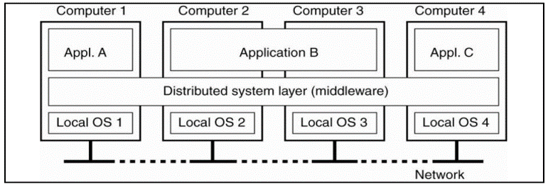
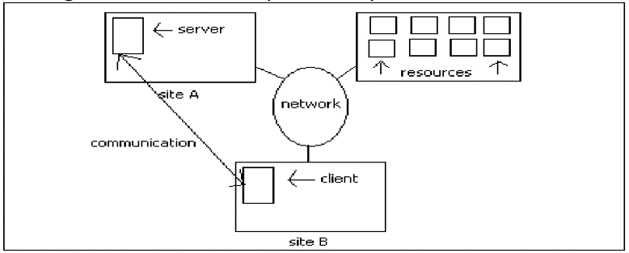
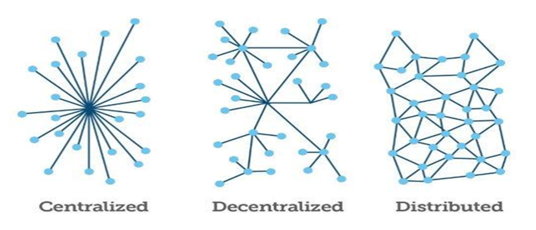

## **Definisi** **Sistem** **Terdistribusi**

“Sistem di mana komponen perangkat keras atau perangkat lunak yang terletak di komputer jaringan berkomunikasi dan mengoordinasikan tindakan mereka hanya dengan penyampaian pesan.” \[Coulouris\]

"Sebuah sistem yang terdiri dari kumpulan dua atau lebih komputer independen yang mengoordinasikan pemrosesannya melalui pertukaran penyampaian pesan sinkron atau asinkron.“

"Sistem terdistribusi adalah kumpulan komputer independen yang ditampilkan kepada pengguna sistem sebagai satu komputer." \[Tanenbaum\]

"Sistem terdistribusi adalah kumpulan komputer otonom yang dihubungkan oleh jaringan dengan perangkat lunak yang dirancang untuk menghasilkan fasilitas komputasi terintegrasi."

**Kumpulan komputer otonom yang dihubungkan oleh jaringan dengan software yang dirancang untuk menghasilkan fasilitas komputasi terintegrasi sehingga tampak oleh user sebagai satu sistem komputer.**

## **Jaringan** **Komputer** **vs** **Sistem** **Terdistribusi**

- **Jaringan** **komputer** **:** komputer otonom yang secara eksplisit terlihat (secara eksplisit teralamati)
- **Sistem** **terdistribusi****:** keberadaan beberapa komputer otonom bersifat transparan
- Secara normal, setiap sistem terdistribusi mengandalkan layanan yang disediakan oleh jaringan komputer
- Beberapa layanan pada jaringan komputer (seperti, name service) juga merupakan sistem terdistribusi
- Sistem terdistribusi lebih banyak masalah yang dihadapi

## **Lapisan Middleware**

 

- Sistem terdistribusi yang diatur sebagai middleware. Lapisan middleware berjalan di semua mesin, dan menawarkan antarmuka yang seragam ke sistem
- Middleware merupakan komponen perantara yang memungkinkan client dan server (lapisan aplikasi dan sistem operasi) saling terhubung dan berkomunikasi satu sama lain. (1)
- Tujuan utama layanan middleware adalah untuk membantu memecahkan interkoneksi beberapa aplikasi dan masalah interoperabilitas. Middleware sangat dibutuhkan untuk bermigrasi dari aplikasi mainframe ke aplikasi client/server dan juga untuk menyediakan komunikasi antar platform yang berbeda.
- Middleware memiliki peran yang cukup penting karena dengan Middleware, maka client dapat mengirimkan pesan atau permintaan ke server, menerjemahkan pesan dari client agar dapat dimengerti oleh server dan demikian pula sebaliknya.
    - Contoh: Java's : Remote Procedure Call, Object Management Group's : Common Object Request Broker Architecture (CORBA), Microsoft's COM/DCOM (Component Object Model/ .NET Remoting), ActiveX controls (in-process COM components

## **Struktur Sistem Tersebar**

## **Kenapa** **perlu** **Sistem** **Terdistribusi** **?**

- **Resource sharing**

Suatu komputer bisa mengakses sumber daya yang ada di komputer lain.

- **Computation Speedup**

Jika suatu proses komputasi bisa dipecah -pecah menjadi sejumlah bagian yang berjalan secara konkuren, dalam sistem terdistribusi bagian-bagian komputasi ini bisa terbagi dalam komputer-komputer yang ada. Inilah yang menimbulkan adanya speedup.

- **Reliability**

Jika satu komputer mengalami kegagalan, maka secara keseluruhan sistem masih tetap dapat berjalan.

- **Communication**

Karena satu komputer terhubung dengan Komputer-komputer laiinya, sangat dimungkinkan terjadi pertukaran informasi. Dengan adanya message passing, fungsi fungsi yang ada di suatu komputer misal file transfer, login, web browsing, bisa diperluas dalam sistem terdistribusi.

## **Manfaat** **Sistem** **Terdistribusi**

—**Data** **sharing**

üMengijinkan pengguna untuk bisa mengakses data yang sama.

—**Device** **sharing**

- Mengijinkan pengguna untuk bisa mengakses perangkat keras yang sama.

—**Flexibility**  

- Membagi beban kerja pada perangkat yang tersedia dengan cara yang efektif.
- Dapat menambah komponen secara individu tanpa harus menduplikasi sistem
- Fasilitas local dapat disesuaikan dengan kebutuhan local
- Memungkinkan pertumbuhan sistem secara terus menerus.
- Susunan sistem bisa disesuaikan dengan pola organisasi perusahaan
- Memungkinkan beberapa bagian/local mengadakan percobaan konsep baru dan fasilitas baru untuk mengurangi resiko kegagalan sistem secara keseluruhan

—**Multiuser** **Computing**  

- Menerapakan banyak user yang dapat login pada saat yang bersamaan untuk mengakses sistem.

## **Kerugian** **Sistem** **Terdistribusi**

- **Complexity** : Secara umum secara rancangan, implementasi dan maintenance (_error handdling_) jadi lebih kompleks daripada arsitektur terpusat.
- **Security** : Asumsi terhadap sistem yang terhubung jaringan artinya telah masuk ke jaringan publik ini artinya setiap orang diperbolehkan untuk bisa mengakses data pada jaringan publik. Asumsi ini bisa menjadi lubang keamanan terhadap pengaksesan data secara tidak sah.
- **Manageability** : Membutuhkan banyak usaha untuk mengorganisasi sistem.
- **Unpredictability** : Sulit diprediksi terhadap ketidakstabilan sistem tergantung dari sistem organisasi dan banyaknya akses terhadap jaringan.

## **Centralized / decentralized / distributed**

## **Karakteristik** **Sistem** **Terpusat**

- Komputer otonom yang secara eksplisit terlihat (diberikan alamat ip)
- Berbagi resource setiap saat untuk seluruh user
- Aplikasi berjalan diatas single proses(sor)
- Sumber daya nampak
- Single Control (SPoC – Single Point of Control)
- Single Errors (SPoF – Single Point of Failure)

## **Karakteristik** **Sistem** **Terdistribusi**

- Gabungan dari komputer bersifat otonom
- Sumber daya tidak dapat di akses secara langsung
- Aplikasi berjalan secara bersamaan pada prosessor yang berbeda
- Concurrency of components
- MPoF – Multiple Points of Failure
- MPoC – Multiple Points of Control

## **Contoh** **Sistem** **Terdistribusi**

- Local Area Network and Intranet
- DBMS (Database Management System)
- ATM (Automatic Teller Machine) Network
- Internet
- Mobile and Ubiquitous Computing

## **Jenis** **Sistem** **Terdistribusi**

Distributed Computing System (Fokus pada konfigurasi Hardware)

- Cluster Computing (Availability and Performance)
- Grid Computing (Heterogenous)

Distributed Information System (Fokus pada ketersediaan informasi – Cloud Computing )

- Menggunakan paralel processing untuk menghindari bottleneck

Distributed Perpasive System (Fokus pada mobilitas– Fog / Dew Computing )

- Small, Battery-power, Mobile, wireless connection

## **Tantangan** **P****erancangan** **Sistem** **Terdistribusi**

**Heterogen terhadap:**

- Infrastruktur jaringan
- Hardware dan software (sistem operasi, perbedaan UNIX socket dan Winsock)
- Bahasa pemrograman
- Beberapa pendekatan :
    - Middleware (contoh : CORBA)
    - Kode program Mobile (contoh : JAVA)

## **Tantangan** **P****erancangan** **Sistem** **Terdistribusi** **(****lanjut****)**

Openness

- Memastikan sistem dapat diperluas dan mudah dalam pemeliharaan
    - Mengikuti standard antarmuka

Security

- Privacy
- Authentication
- Availability

Scalability

- Apakah sistem masih efektif dan handal dalam perkiraan pertumbuhannya?

Penanganan Kegagalan

- Masking
    - Transmisi ulang
    - Redudansi penyimpanan data
- Toleransi
    - Exception handling

- Redudancy
    - Redudan rute jaringan
    - Replikasi data pada beberapa mesin

Concurrency

- Penjadwalan yang konsisten terhadap concurrent thread
- Menghindari masalah deadlock dan lifelock

Transparency

- Menyembunyikan keanekaragaman (heterogeneous) dan tersebarnya sistem sehingga tampak sebagai satu sistem bagi user.
- Kategori Transparency (ISO's Reference Model for ODP)
-  Access
    - menyembunyikan penggunaan komunikasi untuk mengakses remote resource sehingga user beranggapan bahwa semua resource adalah lokal.
    - Contoh : pemetaan drive menggunakan Samba Server, NFS
- Location
    - user tidak perlu mengetahui lokasi dari remote resources

Kategori Transparency (lanjut)

- Concurrency: user tidak peduli keberadaan paralel akses ke remote resource dan inkonsistensi dihindari dengan menggunakan mekanisme concurrency control.
- Replication: menyembunyikan perbedaan-perbedaan antara layanan replicated dan non-replicated.
- Failure: menyembunyikan pengaruh partial fail. Hal ini dicapai dengan cara replikasi resources dan menerapkan mekanisme recovery
- Migration/Mobility: Kemampuan untuk melakukan relocate resource secara dinamik tanpa kekuatiran rekonfigurasi ulang dari user.
- Performance: meminimalkan tambahan performance dalam menggunakan remote resource, sehingga response time dan trhoughput sebanding dengan ketika mengakses resource secara lokal.
- Scaling: Menyembunyikan variasi dalam kelakukan sistem ketika dilakukan perubahan scope atau skala sistem. Scaling seharusnya tidak memerlukan perubahan besar untuk struktur sistem dan operasi untuk mengakomodasi perubahan skala tersebut. Skala diukur dalam hal kecepatan (slow to fast), size (small to large), geograpgical scope (local or remote).

* * *
