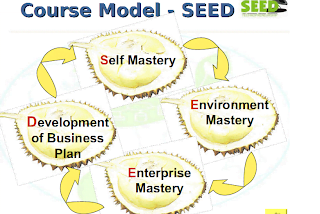
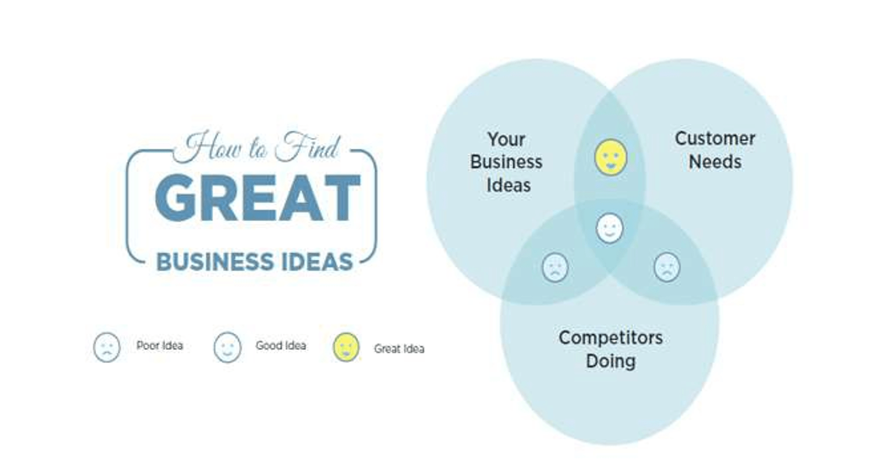
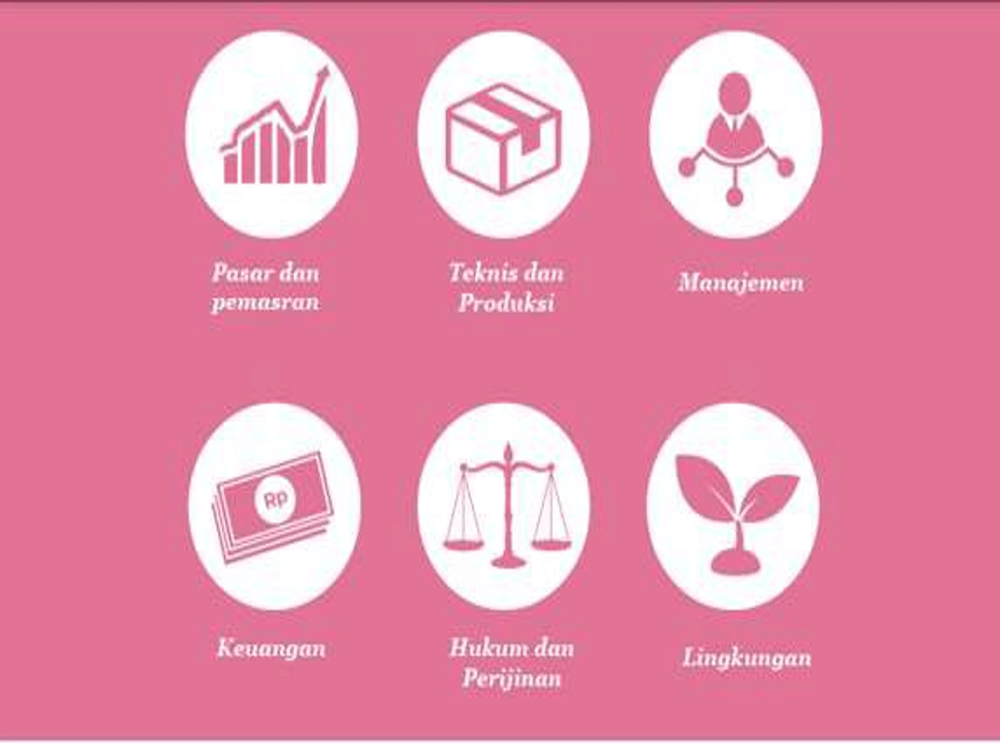
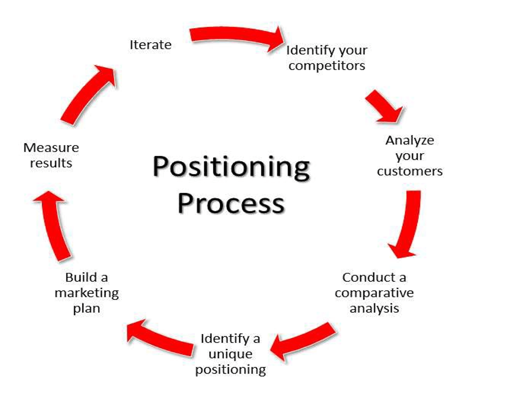
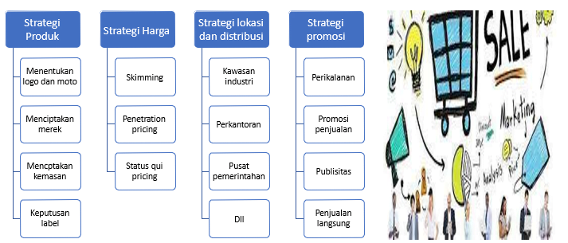
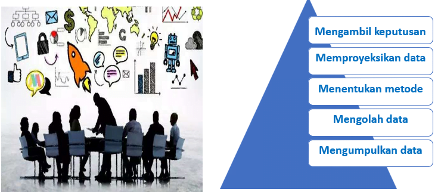

## Deskripsi Mata Kuliah

Mata kuliah ini merupakan mata kuliah kelanjutan dari dasar entrepreneurship yang dapat memberikan mahasiswa pengetahuan dan pengalaman praktis mengenai bagaimanammemulai dan membangun usaha baru, dimana mahasiswa  diharapkan mampu menggali ide bisnis secara kreatif untuk dapat memulai usaha dan menggunakan kemampuan teknologi dalam menjalankannya.

## Tujuan Instruksional

Mahasiswa mampu menjalankan usaha/bisnis secara mandiri dan mampu  mengimplementasikaj strategi komunikasi pemasaran kedalam bisnis secara langsung dan berkelanjutan.

## Manfaat Mata Kuliah

Menjadi seorang wirausaha yang mandiri dan mempunyai strategi komunikasi  praktis sehingga mampu bersaing secara profesional di kancah bisnis nasional    dan internasional, berdisiplin, dan berpartisipasi aktif dalam membangun perekonomian Indonesia berdasarkan sistem nilai Pancasila

## Perbedaan Technopreneruship dan Entrepreneurship

### Technopreneurship

Menjamin bahwa tehnologi berfungsi sesuai kebutuhan target pelanggan dan dapat dijual dengan mendapatkan keuntungan

### Entrepreneurship

Hanya menjual dengan mendapatkan profit

## **TECHNO****PRENEURSHIP**

Aktifitas yang secara konsisten dilakukan guna mengkonversi ide-ide yang bagus menjadi kegiatan usaha yang mengunungkan \[Drucker 1996)

## Hal-hal yang dilakukan oleh seorang entrepreneur

1. Identifikasi dan evaluasi peluang pasar.
2. Menemukan solusi untuk mengisi peluang pasar tersebut.
3. Memperoleh sumber daya yang diperlukan (uang, orang, peralatan) untuk menjalankan bisnis.
4. Mengelola sumber daya dari tahap awal (start-up) ke fase bertahan (survival) dan fase pengembangan (ekspansi).
5. Mengelola resiko-resiko yang berhubungan dengan bisnisnya.

## Teknologi

Tehnologi merupakan cara untuk mengolah sesuatu agar menjadi efisiensi biaya dan waktu sehingga dapat menghasilkan produk yang berkualitas dengan memperhatikan kebutuhan pasar, solusi untuk permasalahan, perkembangan aplikasi, perbaikan efektifitas, dan efisiensi produksi serta mordernisasi.

## Entrepreneurship

Proses dalam mengorganisasikan dan mengelola resiko untuk sebuah bisnis dengan mengidentifikasi dan mengevauasi pasar, menemukan solusi-solusi untuk mengisi peluang pasar, mengelola sumber daya, yang diperlukan dan mengelola resiko yang berhubungan dengan bisnisnya

## Tahap-tahab mengembangkan jiwa Entrepreneurship

1. Internallization
2. Paradigm alteration
3. Spirit Initiation
4. Competition

## Landasan

- Berangkat dari kebutuhan masyarakat
- Perkaya diri dari ide dan inspirasi
- Rencanakan dengan matang dan lakukan dengan cepat
- Tambahkan Value pada produk

## Dampak Technopreneur Bagi masyarakat

### Ekonomi

- Meningkatkan efisiensi dan produktifitas, meningkatkan pendapatan.
- Menciptakan lapangan pekerjaan baru
- Menggerakkan dan menciptakan peluang bisnis pada sektor-sektor ekonomi yang lain.

### Lingkungan

- Memanfaatkan bahan baku dari sumber daya alam indonesia secara produktif.
- Meningkatkan efisiensi penggunaan sumber daya terutama sumber daya energi.

## Kriteria untuk mengembangkan invensi dan inovasi

- Memberikan performansi solusi lebih baik.
- Menjawab permasalahan dan memenuhi karakteristik kebutuhan masyarakat.
- Merupakan ide orisinal
- Dapat diterapkan ke pasar dan memenuhi kriteria kelayakan ekonomi.
- Memiliki skala pasar dan manfaat yang memadai.
- Dapat dipasarkan sebagai produk atau jasa
- Meningkatkan produktifitas, pendapatan dan lapangan kerja bagi masyarakat.

## Ekosistem Technopreneurship

- Human Resource
- Environment
- Laws and policies
- Financial Resource

* * *

## _T__e__ch__no__pre__n__e__u__r__i__a__l_ _P__r__oc__e__s__s_

- _Busi__ne__s__s_ _P__l__an__n__i__ng_
- _Ga__t__h__e__r__i__ng_ _R__e__s__o__u__r__c__es_
- _I__m__p__l__eme__n__t__at__i__on_
- _S__c__a__li__ng_ _and_ _H__a__r__ve__s__ti__n_g
- _Id__e__a G__ener__a__ti__on_
- _Id__e__a S__c__r__ee__n__i__ng_
- _Co__n__ce__p__t_ _T__e__s__ti__ng_
- _Bu__s__i__n__ess_ _Anal__y__s__i__s_
- _P__r__o__t__ot__y__p__i__ng_
- _T__e__s__t_ _M__a__r__k__e__ti__ng_
- _Comm__e__r__c__i__a__l__i__z__a__t__i__on_
- _M__o__n__i__t__o__r__i__ng_ _an__d_ _E__du__c__at__i__on_

## Technopreneursip sebagai Agen pertumbuhan ekonomi

- Meningkatkan taraf hidup dan menciptakan kekayaan
- Pendorong perubahan dengan inovasi
- Meningkatkan pendapatan nasioanl terutama pajak
- Kontribusi terhadap komunitas dan usaha lokal

## 4 Tipe _T__e__ch__no__pre__n__er__s__h__ip_

1. _In__c__re__m__e__n__ta__l_ - sebuah rutinitas
2. _I__m__i__ta__t__i__v__e_ - Meniru (ATM)
3. _R__e__n__k_ _Se__e__k__i__n__g_ \- Mengikuti standar yang ada
4. Innovating - Bisnis/usaha yang berdasarkan inovasi

## Faktor yang dapat membuat technopreneur tetap berkembang

- Cerdas Teknologi
- Tingkat dan kualitaspendidikan
- Berani menghadapi resiko
- Tanggap dengan Inovasi
- Networking
- Modal Ventura

Technopreneurship merupakan upaya persiapan pada diri seseorang untuk menjadi seorang technopreneur. SEED MOdel merupakan salah satu cara untuk mengidentifikasi dan implementasi untuk menjadi seorang technopreneur.

**Adapaun SEED meliputi:**

**S –** Self Mastery

**E –** Environment Mastery

**E –** Enterprise Mastery

**D –** Development of Business Plan

S: Bagaimana seseorang mampu mengetahui bisnis apa yang terbaik sesuai dengan pribadi dan potensi dirinya.E: Bagiaman memperoleh ide bisnis dan mencari peluang dari lingkungannyannya baik secara kebetulan, permasalahan, tren dll.E: Penguasaan usaha dengan pengetahuan menjalankan bisnis dengan berbagai disiplin Ilmu seperti **Creating business**, **Marketing Management, Operations Management, Financial Management, Risk Management.**

D : Development of Business Plan: hal ini mencakup membuat perencanaan bisnis, penulisan business plan, Business model dl;.

Keberhasilan pada setiap bisnis bergantung pada pola pikir dan dedikasi pada pebisnis / pengusaha itu sendiri terhadap pekerjaan-pekerjaan yang dilakukan. dengan bantuan model SEED ini.

* * *

## 4 Point mengembangkan ide

- Produk atau jasa apa yang akan di jual? produk fisik? produk digital? atau jasa?
- Kepada siapa produk atau jasa akan di jual?
- Bagaimana produk atau jasa akan di jual?
- Kebutuhan pelanggan mana yang akan dipenuhi?

## Menciptakan Ide  Bisnis

### 1\. Brainstorming

Teknik menciptakan ide dan solusi untuk suatu masalah secara cepat namun bersifat informal. (biasanya apa yang terpikir langsung di utarakan)

### 2\. Focus Grup

Sekumpulan orang yang mempunyai karakteristik, berhubungan, berkumpul untuk membahas suatu ide baru. contoh: satu jurusan, satu kampus, satu hobi dll akan lebih dekat jika lata belakang sama atau mirip

### 3\. Perpustakaan dan internet

Sumber utama informasi. Ide bisnis akan muncul ketika serius mencari informasi atau santai saat memikirkan informasi

### 4\. Customer advisory Boards

Dewan penasehat customer (konsultan), yang rutin bertemu untuk berdiskusi tentang kebutuhan , keinginan dan kebutuhan dengan komunikasi dua arah (timbal balik), sehingga ide bisnis akan muncul. Karyawan yang sering beriteraksi dengan konsumen akan lebih paham dan mengerti tentang keluhan konsumen. Hal ini juga memungkinkan ide bisnis akan muncul dari konsumen.

## Tips Memilih Ide Bisnis

- Yang membuat Anda bangun pagi karena ingin melakukannya.
- Seolah-olah RUGI jika menambah waktu tidur dan ingin menjalankan ide bisnis.
- Yang membuat Anda lupa bahwa Anda bisa lelah
- Yang membuat Anda lupa bahwa tidur itu perlu
- Yang membuat Anda hanya makan sekali dalam seminggu

## How to Find Great Business Idea

## Memilih Ide Bisnis

Menurut bariger dan ireland (2010)

- Pilih ide yang konkret
- Pilih ide yang mudah dipasarkan
- Pilih ide yang cocok dengan karakter kita
- Pilih ide yang beresiko kecil
- Pilih ide yang dapat bertahan

## Menguji ide Bisnis

### Strength

Hal-hal yang mempunyai pengaruh positif terhadap bisnis

### Weakness

Hal-hal yang tidak terlalu bagus dalam bisnis Anda

### Opportunity

Hal-hal yang ada di masyarakat yang mempunyai pengaruh positif terhadap bisnis

### Threat

Hal-hal yang ada pada masyarakat kita yang mempunyai pengaruh negatif terhadap bisnis anda

## Prinsip Bisnis

Menurut walton huey 1992

1. Selalu berkomitmen dalam bisnis
2. Bagi keuntungan dengan semua rekan bisnis dan memperlakukan mereka sebagai mitra
3. Memotovasi mitra sendiri
4. Selalu berkomunikasi dengan mitra kerja
5. Menghargai semua rekan kerja
6. Rayakan kesuksesan
7. Minta masukan yang baik dan yang buruk dari para karyawan
8. Selalu memuaskan pelanggan
9. Harus bisa mengendalikan biaya pengeluaran dan lebih baik dari kompetitor
10. Coba cari ide yang berlawanan

* * *

## **Studi** **K****el****a****yakan** **Bisnis**

### Bagaimana memulai usaha/Bisnis yang berbasis

### Teknologi?

1. Mengenal Bisnis yang dipilih
2. Menentukan Visi dalam rencana Bisnis
3. Tentukan Target Pasar / Audiens
4. Penulisan Rencana Bisnis

### Mengapa perlu Study Kelayakan Bisnis?

Study kelayakan bisnis adalah langkah atau kegiatan yang dilakukan untuk mengetahui apakah bisnis kita itu layak atau tidak

### Apa yang harus dilakukan?

1. Identifikasi masalah
2. Melihat peluang
3. Menentukan Tujuan (Purpose dan Goal)
4. Memberi gambaran tentang bisnis tersebut
5. Memberi penilaian apa manfaat dari bisnis/produk yang di hasilkan.

### Asset

**1\. Financial Investment**

- Teori Portfolio

**2\. Real Investment**

- Mengaji Aspek:
    - Pasar dan Pemasaran
    - Tehnis dan prouksi
    - Manajemen
    - Keuangan
    - Hukum dan perijinan
    - Lingkungan

### Bidang yang harus di analisa dan di teliti

### Pasar dan Pemasaran

Sumber utama informasi. Ide bisnis akan muncul ketika serius mencari informasi atau santai saat memikirkan informasi

### _P__a__s__a__r_ _d__an_ _P__e__m__a__s__a__r__a__n_

1. Kenali kondisi dan karakteristik pasar
2. Kenali permintaan konsumen
3. Kenali penawaran produk sejenis dan subtitusinya
4. Mengukur daya beli sebagai dasar menentukan harga
5. Menyusun program pemasaran dan strategi pemasaran
6. Membuat prediksi penjualan, market space dan market share

### Kondisi dan Karakteristk Pasar

Persaingan Sempurna

- Adanya penjual dan pembeli tanpa mempengaruhi harga

Persaingan Monopolistik

- Banyak penjual/Perusahaan yang mempunyai ukuran yang sama

Pasar Oligopoli

- Pasar yang mempunyai sedikit penjual

Pasar Monopoli

- Pasar yang hanya mempunyai 1 penjual

### Faktor yang mempengaruhi permintaan konsumen

- Harga barang itu sendiri
- Harga barang lain yang berhubungan (pelengkap)
- Pendapatan
- Selera
- Jumlah penduduk
- Akses

### Segmentasi, Targeting, Positioning

**Segmentasi** : Analisa produk berdasarkan geografi, demografi, psikografi, perilaku

**Targeting**: Menentukan pasar sasaran berdasarkan evaluasi  dan pilihan segmen

**Positioning**: Menentukan posisi pada pasar berdasarkan manfaat dan keunggulan

### Mengukur daya beli

Kemampuan masyaraat dalam membelanjakan uangnya dalam bentuk barang atau jasa yang menggambarkan tingkat kesejahteraan penduduk sebagai dampak semakin baiknya perekonomian.

### Menyusun program dan strategi pemasaran

### Menyusun rencana penjualan, marketspace dan market share

- Mengambil keputusan
- Memproyeksikan data
- Menentukan metode
- Mengolah data
- Mengumpulkan data

* * *

## Aspek Teknis dan Produksi

Seorang entrepreneur harus melakukan penelitian baik primer maupun sekunder

## Testing

### Concept Testing

- Deskripsi barang dan jasa
- Pasar sasaran yang dimaksud
- Benefit barang dan jasa
- Deskripsi produk di posisikan relative berbeda dengan pesaing
- Deskripsi bagaimana barang/jasa di distribusikan

### Usability Testing

- Analisis kelayakan produk untuk mengukur kemudahan pengguna produk dan persepsi mengenai pengalaman menggunakan produk

## Aspek Manajemen

Bisnis memerlukan praktek-praktek manajemen atas penggunaan sumber daya yang dimiliki

## Aspek Keuangan

1. Kebutuhan dan sumber dana investasi
2. Angsuran pinjaman
3. Proyeksi penjualan dan biaya termasuk break event point
4. Analisa capital budgeting sebagai dasar penilaian
5. Penyusunan laporan keuangan beserta analisisnya

## Aspek Hukum dan Perijinan

### Tujuan analisis aspek hukum:

1. Menganalisis legalitas atas usaha yang akan dijalankan
2. Menganalisis ketepatan bentuk badan hukum dengan ide bisnis yang akan di jalankan
3. Menganalisis kemampuan bisnis yang akan diusulkan dalam memenuhi persyaratan perijinan
4. Menganalisis jaminan-jaminan yang bisa disediakan jika bisnis akan dibiayai dengan pinjaman

## Aspek Lingkungan

**Pertanyaan -pertanyaan sehubungan dengan aspek lingkungan:**

- Apakah ingkungan setempat sesuai dengan ide bisnis yang akan dijalankan?
- Apakah manfaat bisnis bagi lingkungan?
- Apakah manfaat lebih besar dari dampak negatifnya?

Aspek lingkungan dalan studi kelayakan bertujuan:

1. Menganalisis kondisi lingkungan operasional
2. Menganalisis kondisi lingkungan industri
3. Menganalisis lingkungan ekonomi
4. Menganalisis dampak positif maupun negatif bisnis terhadap lingkungan
5. Menganalisis usaha-usaha yang dapat dilakukan untuk meminimalkan dampak negatif bisnis terhadap lingkungan

### Lingkungan Bisnis

- Lingkungan Pesaing
- Lingkungan Pelangggan
- Lingkungan Pemasok
- Lingkungan Kreditor
- Lingkungan Pegawai

* * *
